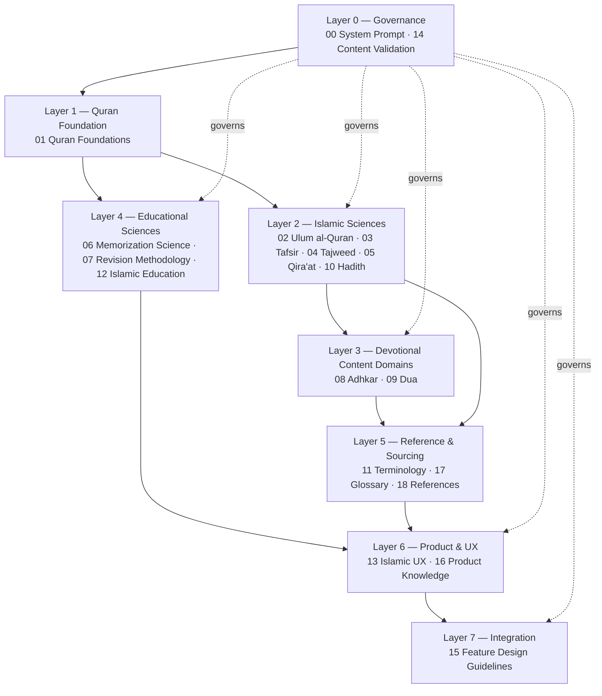
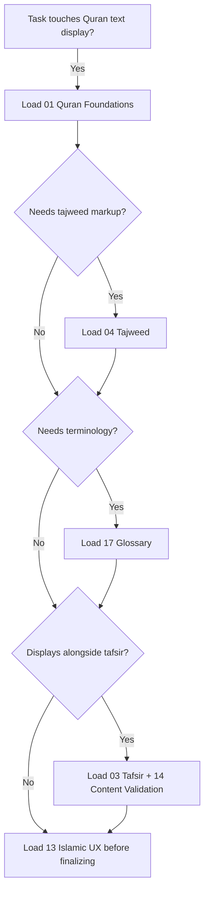
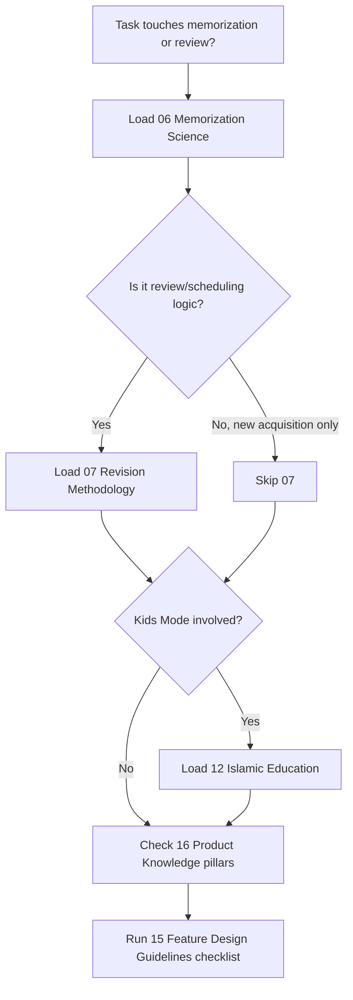
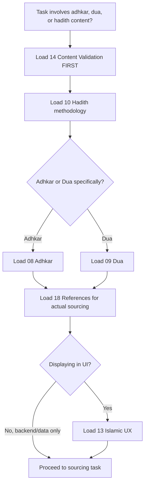
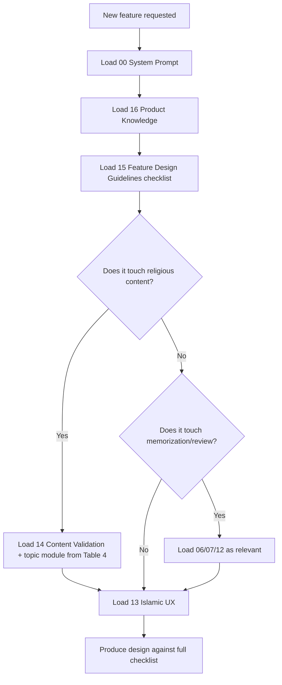
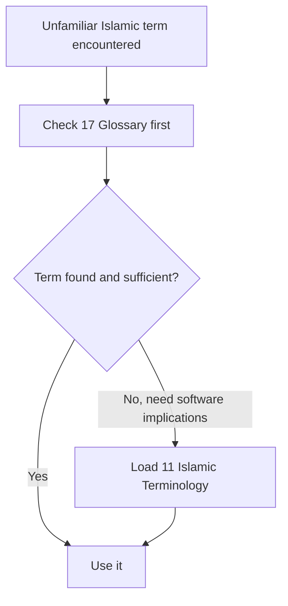

# Talia Islamic Knowledge Base — Master Knowledge Index

**Role of this file:** this is the navigation and retrieval layer, not a content module. It contains no Islamic content of its own — it tells an AI agent *which* of the 19 content modules to load for a given task, in what order, and how they relate. Load this file first, always.

**Naming note (updated):** `validation_rules.md` now exists as its own document — the formal, rule-ID-based governance rulebook, ranked immediately below `00_system_prompt.md` in priority (above every other module, including `14_content_validation.md`). `14_content_validation.md` remains in the standard 19-module template (Purpose/Overview/Core Concepts/…) for consistency with `01`–`18`, and now explicitly defers to `validation_rules.md` for detailed, rule-ID-level specifics. Throughout this index, wherever `14` was previously described as a root/governance module alongside `00`, read that as `00` + `validation_rules.md`, with `14` as their module-shaped companion.

---

## 1. Repository Overview

The repository is a methodology and retrieval layer for Islamic content in Talia — it is deliberately not a religious-text database (see `00_system_prompt.md` and `18_references.md`: verbatim Quran/hadith/adhkar/dua/tafsir text is sourced from vetted external datasets, never generated). Each module answers one of two kinds of question:

- **"How should I reason about X?"** — the Islamic-sciences and methodology modules (`01`–`05`, `10`).
- **"How should Talia *build* around X?"** — the applied modules (`06`, `07`, `08`, `09`, `11`–`13`, `15`, `16`) that translate the sciences into product, UX, and engineering decisions.

Two documents sit outside both categories as **governance**: `00_system_prompt.md` (entry rules) and `validation_rules.md` (the formal rulebook — hallucination prevention, source hierarchy, confidence levels, fatwa boundary, and more). `14_content_validation.md` is `validation_rules.md`'s module-shaped companion inside the standard 19-module set. Every other module operates inside the boundaries these set, and any agent's output that conflicts with them is wrong regardless of which other module it followed (see §10 Conflict Resolution Rules).

Modules interact in three ways:
1. **Foundational dependency** — a module assumes the reader already has another module's concepts (e.g., `04_tajweed.md` assumes `01_quran_foundations.md`'s structural model).
2. **Sourcing dependency** — content-bearing modules (`08`, `09`, `10`, `03`) all defer to `18_references.md` for where actual text comes from, and to `14_content_validation.md` for what they may never do.
3. **Application dependency** — the applied/product modules (`15`, `16`) synthesize the science modules into decisions, and should be loaded *after* the science modules they draw on, not instead of them.

---

## 2. Knowledge Hierarchy

**Why each layer exists:**
- **L0 Governance** exists so no downstream module can be (mis)used to justify inventing content or issuing rulings — it's checked first and last.
- **L1 Quran Foundation** exists because almost everything else — tajweed, qira'at, tafsir, Quranic dua — is defined relative to the Quran's own structure.
- **L2 Islamic Sciences** exists as the scholarly-methodology layer: how to read, recite, interpret, and authenticate.
- **L3 Devotional Content Domains** sits after L2 because adhkar/dua correctness depends on hadith authentication (L2) being understood first.
- **L4 Educational Sciences** is Quran-adjacent but not Quran-*sciences* — it's learning science applied to hifz, so it branches from L1 rather than sitting inside L2.
- **L5 Reference & Sourcing** exists to support every layer above it with terminology and provenance — it's a service layer, not a content layer.
- **L6 Product & UX** synthesizes L4's pedagogy and L2/L3's reverence requirements into concrete product/UX principles.
- **L7 Integration** (`15`) is the top layer because it's the only module meant to be loaded for *every* new feature, pulling from whichever lower layers the feature actually touches.

---

## 3. Module Dependency Graph

| Module | Purpose (one line) | Depends On | Required By | Related Modules | Criticality |
|---|---|---|---|---|---|
| `00_system_prompt` | Entry rules, meta-index | — (root) | All | `validation_rules.md` | **Critical** (root) |
| `validation_rules.md` | Formal governance rulebook (hallucination prevention, source hierarchy, confidence, fatwa boundary, risk classification) | `00` | All content modules, `15` | `14` | **Critical** (root) |
| `01_quran_foundations` | Quran structure (surah/ayah/juz/sajdah) | `00`, `validation_rules.md` | `04`, `05`, `08`, `09`, `13`, `17` | `02` | **Critical** |
| `02_ulum_al_quran` | Asbab al-nuzul, naskh, muhkam/mutashabih | `00`, `01` | `03`, `05` | `10` | High |
| `03_tafsir` | Tafsir schools/methodology | `00`, `01`, `02` | `15` | `10`, `14`, `18` | High |
| `04_tajweed` | Tajweed rule taxonomy | `00`, `01` | `15` | `05`, `17` | High |
| `05_qiraat` | Canonical reading traditions | `00`, `01`, `02` | `15` | `04`, `18` | Medium |
| `06_memorization_science` | Hifz/spaced-repetition science | `00` | `07`, `15`, `16` | `12` | **Critical** |
| `07_revision_methodology` | Muraja'ah scheduling/priority | `00`, `06` | `15`, `16` | `12` | **Critical** |
| `08_adhkar` | Adhkar schema + sourcing | `00`, `10`, `14`, `18` | `15` | `09`, `13` | High (content risk) |
| `09_dua` | Dua schema + sourcing | `00`, `01`, `10`, `14`, `18` | `15` | `08`, `13` | High (content risk) |
| `10_hadith` | Hadith authentication methodology | `00`, `14` | `03`, `08`, `09`, `15` | `02`, `18` | **Critical** (gatekeeper) |
| `11_islamic_terminology` | Full glossary with software implications | `00` | (soft, all content modules) | `17` | Medium |
| `12_islamic_education` | Pedagogy (children/adults) | `00` | `15`, `16` | `06`, `07` | High |
| `13_islamic_ux` | Reverence/UX principles | `00`, `01` | `15`, `16` | `04`, `08`, `09` | **Critical** (cross-cutting) |
| `14_content_validation` | Hard constraints, source-type tagging (module-shaped summary of `validation_rules.md`) | `00`, `validation_rules.md` | All content modules (`03`,`08`,`09`,`10`), `15` | — | **Critical** (root) |
| `15_feature_design_guidelines` | Feature-evaluation checklist | `00`, `14`, `13`, `16`, `12`, `06`, `07` | (used per new feature) | `03`,`04`,`05`,`08`,`09`,`10` | **Critical** (process gate) |
| `16_product_knowledge` | Talia philosophy/pillars | `00`, `06`, `07`, `13` | `15` | `12` | **Critical** |
| `17_glossary` | Compact quick-reference glossary | `11` | (utility, all) | `11` | Medium |
| `18_references` | Sourcing strategy + candidate datasets | `00`, `14` | `03`, `08`, `09`, `10` | — | **Critical** (content risk gate) |

**Optional modules for a given task** are simply any module not listed under that task's Depends-On/Required-By chain in §4 or §7 — see those sections rather than a separate list here, to avoid duplicating the same information twice.

---

## 4. Topic-to-Module Mapping

| User/agent topic | Load (in order) |
|---|---|
| Quran display / reading UI | `01` → `13` → `17` (terms as needed) |
| Tajweed rules or tajweed markup | `04` → `01` → `17` |
| Qira'at / riwayah questions | `05` → `01` → `02` |
| Tafsir / "what does this verse mean" | `03` → `02` → `01` → `14` |
| Ulum al-Quran (asbab al-nuzul, naskh, muhkam/mutashabih) | `02` → `01` → `14` |
| Memorization (hifz) mechanics | `06` → `12` |
| Revision / muraja'ah / Smart Coach scheduling | `07` → `06` → `16` |
| Adhkar content or feature | `08` → `10` → `14` → `18` |
| Dua content or feature | `09` → `10` → `01` → `14` → `18` |
| Hadith question (any) | `10` → `14` → `18` |
| Islamic terminology / unfamiliar term | `17` → `11` (if deeper context needed) |
| Kids Mode / Adult Mode pedagogy | `12` → `06` → `07` → `16` |
| UX/design review of any screen with religious content | `13` → `14` |
| New feature proposal (general) | `15` → `16` → `14` → (topic-specific per this table) |
| Content validation / QA / pre-ship review | `14` → `18` → `10` (if hadith-adjacent) |
| Product philosophy / "does this fit Talia" | `16` → `15` |
| Fiqh / ruling question | **Not covered by any module — escalate, don't answer** (see `14` rule 5, §13 Future Expansion) |
| Sourcing a new dataset | `18` → `14` |
| AI Coach behavior design | `06` → `07` → `12` → `16` |
| Character companion behavior | `16` → `13` |
| Parent Dashboard content | `12` → `16` |

---

## 5. Retrieval Decision Trees

**A. Quran display / reading feature**

**B. Memorization / review feature**

**C. Adhkar / Dua / Hadith content feature**

**D. New feature proposal (general-purpose entry point)**

**E. Terminology / definition question**

---

## 6. AI Retrieval Rules

1. **Never load every module for one task.** Use §4 (Topic-to-Module Mapping) or §7 (Feature-to-Knowledge Mapping) to select the minimum set.
2. **Load foundational modules before applied ones.** `01` before `04`/`05`; `06` before `07`; `10` before `08`/`09`.
3. **`00` and `validation_rules.md` are always in scope**, even when not explicitly listed for a topic — they are governance, not domain content, and apply universally. `14` is their module-shaped companion and is loaded alongside them for topics inside the standard 19-module set.
4. **Never answer a hadith-adjacent question without `10_hadith.md` loaded** — this includes adhkar, dua (prophetic tier), and tafsir bi-l-ma'thur, all of which rest on hadith authentication.
5. **Never answer a tafsir question using `01_quran_foundations.md` alone** — structural knowledge of the Quran is not interpretive knowledge; `03` (and usually `02`) must be loaded.
6. **Always load `17_glossary.md` (or `11` for depth) when unfamiliar terminology appears** in a request or a draft response, rather than guessing at a term's meaning.
7. **Governance documents (`00`, `validation_rules.md`, then `14`) always take priority in a conflict, in that order** — see §10.
8. **Prefer the more specific module over the more general one** when both cover a topic (e.g., `04_tajweed.md` over `01_quran_foundations.md` for a tajweed-rule question).
9. **Sourcing modules (`18`, and the sourcing notices inside `08`/`09`/`10`) are mandatory before generating any verbatim religious text** — no exceptions for "just a placeholder."
10. **`15_feature_design_guidelines.md` is loaded for every new or materially-changed feature**, regardless of topic, as the process gate — it in turn tells the agent which domain modules to pull in.
11. **If a task resolves to a fiqh/ruling question, do not proceed with any module as if one answers it** — no module in this repository is authorized to issue rulings (see `14`, rule 5); flag for human/scholarly escalation instead.

---

## 7. Feature-to-Knowledge Mapping

| Feature | Required modules |
|---|---|
| Quran Reader | `01`, `04`, `13`, `17` |
| Memorization (Hifz) | `06`, `12`, `16`, `15` |
| Daily Plan | `07`, `06`, `16` |
| AI Coach (Smart Coach) | `06`, `07`, `12`, `16` |
| Parent Dashboard | `12`, `16`, `13` |
| Kids Mode | `12`, `06`, `07`, `13`, `16` |
| Achievements | `12`, `16` (motivation principles), `13` (gamification limits) |
| Gamification (general) | `12`, `13`, `16` |
| Search (Quran/content) | `01`, `11`/`17` |
| Bookmarks | `01`, `13` |
| Statistics / Progress | `06`, `07`, `01` (unit definitions: juz/hizb/page) |
| Prayer Reminders | `13` (notification tone/timing) — no dedicated prayer-times module yet; see §13 |
| Adhkar feature | `08`, `10`, `14`, `18`, `13` |
| Dua feature | `09`, `10`, `01`, `14`, `18`, `13` |
| Offline Sync | `16` (offline-first pillar) — technical implementation lives outside this KB, in the `flutter-supabase`/`app-architecture` engineering skills |
| Notifications | `13`, `16` |
| Voice Recitation / STT | `04` (what's being assessed), `06` (Kids Mode STT policy), `12` |
| Tajweed Practice | `04`, `01`, `13`, `15` |
| Review Sessions | `07`, `06`, `12` |
| Companion Character Behavior | `16`, `13`, `12` |
| Content Review / QA Pipeline | `14`, `18`, `10`, `15` |

---

## 8. Cross-Link Matrix

`00`, `validation_rules.md`, and `14` are Strong-related to every module by design (they are the universal governance layer) — omitted from the grid below to keep it readable; treat all three as **Strong** against any module not shown. The grid covers the remaining 17 content/applied modules. Legend: **S**=Strong, **M**=Medium, **W**=Weak.

| | 01 | 02 | 03 | 04 | 05 | 06 | 07 | 08 | 09 | 10 | 11 | 12 | 13 | 15 | 16 | 17 |
|---|---|---|---|---|---|---|---|---|---|---|---|---|---|---|---|---|
| **02** | M | | | | | | | | | | | | | | | |
| **03** | M | S | | | | | | | | | | | | | | |
| **04** | S | W | W | | | | | | | | | | | | | |
| **05** | S | M | W | M | | | | | | | | | | | | |
| **06** | W | W | W | W | W | | | | | | | | | | | |
| **07** | W | W | W | W | W | S | | | | | | | | | | |
| **08** | W | W | W | W | W | W | W | | | | | | | | | |
| **09** | M | W | W | W | W | W | W | M | | | | | | | | |
| **10** | W | M | S | W | W | W | W | S | S | | | | | | | |
| **11** | M | W | W | M | W | M | M | W | W | W | | | | | | |
| **12** | W | W | W | W | W | S | M | W | W | W | W | | | | | |
| **13** | M | W | W | M | W | W | W | M | M | W | W | W | | | | |
| **15** | W | W | M | M | M | S | S | M | M | M | W | S | S | | | |
| **16** | W | W | W | W | W | S | S | W | W | W | W | M | S | S | | |
| **17** | M | W | W | M | W | M | M | W | W | W | S | W | W | W | W | |
| **18** | M | W | S | M | M | W | W | S | S | S | W | W | W | W | W | W |

**Key relationships worth calling out explicitly:**
- `02`↔`03` (Strong): tafsir methodology is built directly on Ulum al-Quran's transmission concepts.
- `06`↔`07` (Strong) and `06`↔`12` (Strong), `07`↔`16`... (see `15`/`16` row): the memorization/education/product cluster is the most internally cohesive part of the KB, reflecting that it's Talia's core product domain.
- `08`↔`10`, `09`↔`10`, `08`↔`09` (Strong/Medium cluster): the devotional-content sourcing cluster, all gated through `14`/`18`.
- `03`↔`18` and `08`/`09`/`10`↔`18` (Strong): every content-bearing module leans on the same sourcing module — `18` is the busiest "Required By" target after `00`/`14`.

---

## 9. Knowledge Coverage Matrix

| Domain | Primary owner | Secondary owner | Validation owner | Reference owner |
|---|---|---|---|---|
| Quran text & structure | `01` | `13` | `14` | `18` |
| Ulum al-Quran | `02` | `03` | `14` | `18` |
| Tafsir | `03` | `02` | `14` | `18` |
| Tajweed | `04` | `01` | `14` | `18` |
| Qira'at | `05` | `01`, `02` | `14` | `18` |
| Hadith | `10` | `02` | `14` | `18` |
| Adhkar | `08` | `10` | `14` | `18` |
| Dua | `09` | `10`, `01` | `14` | `18` |
| Memorization science | `06` | `12` | `15` | — |
| Revision methodology | `07` | `06` | `15` | — |
| Islamic education/pedagogy | `12` | `06`, `07` | `15` | — |
| Islamic UX | `13` | `16` | `15` | — |
| Terminology | `11` | `17` | — | `17` |
| Product philosophy | `16` | `15` | — | — |
| Content governance | `validation_rules.md` | `14` | `00` | `18` |
| Fiqh (rulings) | **Not owned — no module** | — | `14` (blocks it) | — |

---

## 10. Conflict Resolution Rules

When two modules appear to say related-but-different things about the same topic:

1. **`validation_rules.md` always wins.** If any module's guidance, taken literally, would violate one of its rules (§3–§8 of that document, mirrored at summary level in `14`'s seven hard constraints), `validation_rules.md` overrides — no module is authorized to create an exception to it.
2. **`00_system_prompt.md` wins over any domain module on process/meta questions** (e.g., "should I generate this text or source it") — domain modules describe *what* something is; `00` governs *how agents behave*. Between `00` and `validation_rules.md` themselves, `00` is root and `validation_rules.md` operates within it.
3. **The more specific module wins on its own topic.** `04_tajweed.md` is authoritative on tajweed rules even where `01_quran_foundations.md` mentions tajweed in passing; `10_hadith.md` is authoritative on grading even where `08_adhkar.md`/`09_dua.md` reference a grade.
4. **Sourcing modules (`18`, and the source-of-truth datasets they point to) win over any KB module's own text** — this KB never contains verbatim religious text, so a real dataset always outranks a paraphrase found here.
5. **Where mainstream Islamic scholarship itself has genuine disagreement** (e.g., sajdah count in `01`, grading disputes in `10`), no module "wins" — the correct behavior is to present the range or omit, per `14`'s rule 4, not to pick a winner.
6. **Product/UX modules (`13`, `15`, `16`) never override Islamic-sciences modules (`01`–`05`, `10`) on a factual/religious point** — they only govern how such content is *presented*, never what it *is*.
7. **When a fiqh question has no owning module** (per §9), the correct resolution is escalation, not defaulting to the "closest" module (e.g., `02`'s naskh discussion does not license answering a fiqh ruling question).

---

## 11. Knowledge Loading Strategy

| Profile | When to use | Modules to load |
|---|---|---|
| **Fast Retrieval** | Single, narrow factual question, no content generation | `00` + the one topic module from §4 |
| **Balanced Retrieval** | Typical feature-adjacent question or small content task | `00`, `14`, topic module(s) from §4, one related module |
| **Deep Research** | Ambiguous or cross-cutting question, or building a new content type | `00`, `14`, full dependency chain from §3 for the topic, all "Strong" cross-links from §8 |
| **Architecture Review** | Reviewing Talia's technical/product structure for a religious-content feature | `00`, `14`, `15`, `16`, `13`, + relevant domain module(s) |
| **Feature Planning** | Scoping a new feature end-to-end | `00`, `14`, `15`, `16`, + modules from §7's feature row |
| **QA Review** | Pre-ship content review | `14`, `18`, `10` (if hadith-adjacent), + the content module being reviewed |
| **Educational Mode** | Designing pedagogy, coaching copy, Kids/Adult differences | `00`, `06`, `07`, `12`, `11`/`17` |
| **Religious Validation** | Checking a specific religious claim/citation before shipping | `00`, `validation_rules.md`, `14`, `18`, `10`, + `02`/`03` if interpretive |

---

## 12. Maintenance Strategy

- **Adding a module:** assign the next free two-digit prefix in the relevant layer (see §2); add one row to §3's dependency table, one or more rows to §4 and §7, and extend the §8 matrix by one row/column — do all four in the same change, since a module invisible to retrieval is effectively dead weight.
- **Renaming a module:** keep the old filename as a redirect note in the new file's first line ("formerly `NN_old_name.md`") for at least one full review cycle, and update every reference to it across §3, §4, §7, §8, §9 in the same change — a rename that isn't propagated breaks retrieval silently.
- **Splitting a module:** the parent's row in §3 is replaced by rows for each child; children inherit the parent's "Required By" edges unless a specific downstream module only needed the split-off part. Re-check §8 for both children rather than copying the parent's row verbatim, since the two children usually don't share identical cross-links.
- **Merging modules:** union their "Depends On"/"Required By" sets, keep the lower (higher-priority) criticality of the two, and remove the losing filename from every table in this index in the same change.
- **Deprecating a module:** mark it `[DEPRECATED — superseded by NN_new_name.md]` in its own first line, remove it from §4/§7 routing tables (so agents stop being told to load it), but leave its row in §3 with a note, for traceability.
- **Versioning:** this repository currently has no machine-readable frontmatter (version, id, depends_on fields) on the 19 content modules — the tables in this index are the source of truth today. If the KB grows past what a human-maintained index can track reliably, the recommended next step is adding lightweight YAML frontmatter (`id`, `version`, `depends_on`, `criticality`) to each module so this index can eventually be validated/generated against it rather than hand-maintained — flagged here as a concrete follow-up, not yet implemented.
- **General rule:** never let a module change without checking whether it invalidates a row in §3, §4, §7, §8, §9, or §10 — this index is only trustworthy as long as it's updated in lock-step with the modules it describes.

---

## 13. Future Expansion

| New domain | Where it slots in | Notes |
|---|---|---|
| **Fiqh** | New `19_fiqh.md` in Layer 2 (Islamic Sciences), depends on `02`, `10` | Highest-caution addition — must extend, not soften, `14`'s "never issue fatwas" rule; would need explicit multi-madhab handling throughout |
| **Seerah** (Prophetic biography) | New `20_seerah.md`, own layer or folded into Layer 2, depends on `10` | Natural fit for educational/companion content; needs the same source-discipline as `10_hadith.md` |
| **Arabic Language** (grammar/morphology for word-by-word study) | New `21_arabic_language.md`, Layer 2, depends on `01` | Relevant if Talia ever adds word-by-word grammar breakdowns beyond translation |
| **Islamic History** | New `22_islamic_history.md`, own layer, depends on `10`, relates to future Seerah module | Lower near-term priority; mostly educational/companion content |
| **Children's Curriculum** | Extends `12_islamic_education.md` rather than a new top-level module, or splits into `12a_children_curriculum.md` if it grows large | Should stay tightly coupled to existing Kids Mode principles in `12`/`16`, not diverge into a separate philosophy |
| **AI Personalization** | Extends `16_product_knowledge.md` + `15_feature_design_guidelines.md` | Must be checked against `16`'s "companion, not tool" and "teacher-scaffolding, not engagement-optimized" pillars before any new module is written |
| **Audio Learning** (beyond current tajweed/recitation scope) | Extends `04_tajweed.md` (rule content) + a new engineering-facing note, not a new religious-content module | Mostly a technical/UX extension, not new Islamic-sciences content |
| **Scholar Profiles** (attribution metadata for tafsir/fiqh authors) | Extends `18_references.md`'s schema, possibly a dedicated `scholar_registry.md` reference file | Supports `03`/future `19_fiqh.md` attribution requirements rather than standing alone |
| **Regional Qira'at** (e.g., full Warsh support) | Extends `05_qiraat.md` significantly; may warrant `05a_qiraat_warsh.md` if the content volume grows large | Already anticipated in `05`'s Future Extensions and `01`'s riwayah-dependent-counts caveat |
| **Accessibility** | Extends `13_islamic_ux.md` | Screen-reader/contrast/font-scaling requirements for Quran text specifically, building on `13`'s existing accessibility notes |

Each addition should re-run §12's "Adding a module" checklist against this index before being considered complete.
