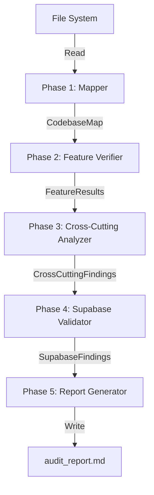

# Design Document

## Overview

The **Talia Codebase Audit** is a static analysis workflow that systematically examines the Talia Quran Flutter application to assess production readiness. The audit operates as a five-phase sequential process that reads and analyzes code without modification, producing a structured, prioritized report of findings.

### Purpose

The audit serves three primary objectives:

1. **Feature Completeness Verification**: Ensure all 14 discovered features are fully implemented and functional
2. **Quality Assurance**: Identify code quality issues, crash risks, and technical debt
3. **Backend Integration Validation**: Verify Supabase integration correctness including RLS policies, migrations, and API usage

### Scope

The audit covers:
- All Dart source files under `lib/`
- Supabase migration files under `supabase/migrations/`
- Test files under `test/` (when present)
- Configuration files (`pubspec.yaml`, `.env.example`)
- Asset references and routing definitions

The audit explicitly does NOT:
- Modify any source files
- Execute the application or run tests
- Rely on documentation (README, comments) as source of truth
- Make assumptions without code evidence

### Key Constraints

1. **Sequential Execution**: Phases must execute in order (1→2→3→4→5)
2. **Evidence-Based**: Every finding must reference specific file and line number
3. **Comprehensive Coverage**: No feature may be skipped
4. **Read-Only**: No modifications to codebase during audit
5. **TODO Treatment**: All `// TODO` comments treated as missing features


## Architecture

### High-Level Design

The audit workflow follows a **pipeline architecture** where each phase produces structured output consumed by subsequent phases:

```
Phase 1: Codebase Mapping
    ↓ (produces: CodebaseMap)
Phase 2: Feature Verification
    ↓ (produces: FeatureVerificationResults)
Phase 3: Cross-Cutting Analysis
    ↓ (produces: CrossCuttingFindings)
Phase 4: Supabase Validation
    ↓ (produces: SupabaseFindings)
Phase 5: Report Generation
    ↓ (produces: audit_report.md)
```

### Execution Model

The audit operates as a **single-pass, stateful analyzer**:

1. **State Accumulation**: Each phase builds upon data structures populated by previous phases
2. **No Backtracking**: Once a phase completes, it does not re-execute
3. **Fail-Fast on Critical Errors**: If a file cannot be read, record the failure and continue
4. **Deterministic Output**: Same codebase state produces identical audit results

### Data Flow




## Components and Interfaces

### Phase 1: Codebase Mapper

**Responsibility**: Discover and catalog all structural elements of the codebase.

**Input**: File system root path

**Output**: `CodebaseMap` data structure

**Algorithm**:
1. Traverse directory tree from project root
2. Identify top-level folders (lib/, assets/, test/, supabase/, etc.)
3. Parse `pubspec.yaml` to extract dependencies
4. Parse `lib/main.dart` to identify startup initialization
5. Parse `lib/core/router/app_router.dart` to extract route definitions
6. For each folder in `lib/features/`:
   - Identify screen files (containing `Scaffold` or `build` method)
   - Identify Cubit/BLoC files (extending `Cubit` or `Bloc`)
   - Identify repository files (classes ending in `Repository`)
   - Identify model/entity files (classes with JSON serialization)
7. Parse `lib/core/` to catalog shared components

**Key Methods**:
- `scanDirectoryTree()`: Recursive directory traversal
- `parseMainDart()`: Extract startup configuration
- `discoverFeatures()`: Identify all features under lib/features/
- `catalogSharedComponents()`: Index lib/core/ contents
- `extractDependencies()`: Parse pubspec.yaml


### Phase 2: Feature Verifier

**Responsibility**: Verify each discovered feature against a comprehensive checklist.

**Input**: `CodebaseMap` from Phase 1

**Output**: `FeatureVerificationResults` containing pass/fail status for each checklist item per feature

**Algorithm**:
For each feature in CodebaseMap.features:
1. **UI Completeness Check**:
   - Parse each screen file's build method
   - Search for state handling patterns (loading/error/empty/success)
   - Search for hardcoded strings or TODO comments
   - Verify TextDirection and alignment for RTL support
2. **State Management Check**:
   - Parse Cubit files for state class definitions
   - Verify exhaustive state handling in UI
   - Check for autoDispose usage
   - Search for setState() calls that should be Cubit-based
3. **Data Layer Check**:
   - Parse repository methods
   - Verify each method calls a data source (Supabase/Isar/SharedPreferences)
   - Check for try/catch blocks at repository boundary
   - Verify model toJson/fromJson implementations
4. **Navigation Check**:
   - Cross-reference feature screens with app_router.dart routes
   - Verify route parameters match screen constructors
   - Check for redirect guards on protected routes
5. **Persistence Check**:
   - Identify data that should persist (user preferences, cached data)
   - Verify both read and write operations exist
6. **Offline/Connectivity Check**:
   - Search for connectivity checks before network calls
   - Verify graceful degradation patterns
7. **Async/Lifecycle Check**:
   - Parse dispose() methods for subscription cancellations
   - Search for unawaited futures
   - Check for setState after dispose patterns
8. **Security/Auth Check**:
   - Verify protected routes have guards in router
   - Check for client-only auth checks without RLS
   - Verify token refresh logic
9. **Localization Check**:
   - Search for hardcoded strings outside .arb files
   - Verify all user-facing text uses localization system

**Key Methods**:
- `verifyFeature(feature: Feature)`: Run all checks for one feature
- `checkUICompleteness(screens: List<Screen>)`: Verify UI state handling
- `checkStateManagement(cubits: List<Cubit>)`: Verify Cubit patterns
- `checkDataLayer(repositories: List<Repository>)`: Verify data flow
- `checkNavigation(feature: Feature, router: Router)`: Verify routing
- `checkPersistence(feature: Feature)`: Verify storage usage
- `checkConnectivity(feature: Feature)`: Verify offline handling
- `checkAsyncLifecycle(feature: Feature)`: Verify async patterns
- `checkSecurity(feature: Feature, router: Router)`: Verify auth guards
- `checkLocalization(feature: Feature)`: Verify i18n usage


### Phase 3: Cross-Cutting Analyzer

**Responsibility**: Identify systemic issues across the entire codebase.

**Input**: `CodebaseMap` and `FeatureVerificationResults`

**Output**: `CrossCuttingFindings` containing dead code, dependency issues, performance problems, and crash risks

**Algorithm**:

1. **Dead Code Detection**:
   - Build import graph of all Dart files
   - Identify files with zero incoming references
   - Search all files for `// TODO`, `throw UnimplementedError()`, empty method bodies
   - Cross-reference Cubits with their usage sites
   - Cross-reference screens with router definitions

2. **Dependency Consistency Check**:
   - Parse all import statements across codebase
   - Compare with pubspec.yaml dependencies
   - Identify unused dependencies
   - Identify missing dependencies
   - Check for version conflicts

3. **Performance Red Flag Detection**:
   - Parse build() methods for heavy computation (loops, complex calculations)
   - Search for ListView without itemExtent/itemBuilder
   - Search for setState() rebuilding large trees
   - Search for Image.network without caching
   - Search for StatelessWidget without const constructors

4. **Crash Risk Detection**:
   - Search for `!` operator without null checks
   - Search for list[index] without bounds checking
   - Search for JSON parsing without try/catch
   - Search for Navigator.pop() without canPop()
   - Search for FutureBuilder/StreamBuilder without error handling

**Key Methods**:
- `detectDeadCode(codebaseMap: CodebaseMap)`: Find unused code
- `buildImportGraph()`: Create dependency graph
- `checkDependencyConsistency()`: Verify pubspec.yaml alignment
- `detectPerformanceIssues()`: Find performance anti-patterns
- `detectCrashRisks()`: Find crash-prone patterns
- `searchPattern(pattern: RegExp, files: List<File>)`: Generic pattern search


### Phase 4: Supabase Validator

**Responsibility**: Verify Supabase integration correctness.

**Input**: `CodebaseMap` and all previous findings

**Output**: `SupabaseFindings` containing backend integration issues

**Algorithm**:

1. **Migration-Model Alignment**:
   - Parse all SQL files in `supabase/migrations/`
   - Extract table definitions (CREATE TABLE statements)
   - For each table, search for corresponding Dart model in lib/features/
   - Verify column names match model fields

2. **RLS Policy Verification**:
   - Parse migration files for RLS policy definitions
   - Identify tables with user data (containing user_id or similar)
   - Verify RLS is enabled on those tables
   - Check for missing policies

3. **Realtime Subscription Cleanup**:
   - Search Dart code for `.subscribe()` calls
   - For each subscription, verify corresponding `.unsubscribe()` or channel close in dispose()

4. **Auth Session Persistence**:
   - Parse lib/main.dart for Supabase initialization
   - Verify session persistence configuration
   - Check AuthRepository for session handling

5. **Storage Consistency**:
   - Parse migration files for storage bucket definitions
   - Search Dart code for storage API calls
   - Verify bucket names and paths match

6. **Edge Function Validation**:
   - Search Dart code for `.functions.invoke()` calls
   - Verify headers are set correctly
   - Verify error handling exists

7. **RPC Call Validation**:
   - Parse migration files for stored procedure definitions
   - Search Dart code for `.rpc()` calls
   - Verify function names and parameter signatures match

**Key Methods**:
- `parseMigrations()`: Extract SQL schema definitions
- `verifyModelAlignment(tables: List<Table>, models: List<Model>)`: Check table-model correspondence
- `verifyRLSPolicies(tables: List<Table>)`: Check RLS configuration
- `verifyRealtimeCleanup()`: Check subscription lifecycle
- `verifyAuthPersistence()`: Check session handling
- `verifyStorageConsistency()`: Check bucket/path alignment
- `verifyEdgeFunctions()`: Check function calls
- `verifyRPCCalls()`: Check stored procedure calls


### Phase 5: Report Generator

**Responsibility**: Synthesize all findings into a structured, prioritized markdown report.

**Input**: All data structures from Phases 1-4

**Output**: `audit_report.md` file in project root

**Algorithm**:

1. **Generate Codebase Overview Section**:
   - Extract summary statistics from CodebaseMap
   - Format architecture, features, libraries, counts

2. **Generate Fully Working Features Section**:
   - Filter FeatureVerificationResults for features with all checks passing
   - For each, include brief code evidence

3. **Generate Partially Implemented Section**:
   - Filter FeatureVerificationResults for features with some checks failing
   - For each, list what works, what's missing, required fix

4. **Generate Broken/Not Implemented Section**:
   - Filter FeatureVerificationResults for features with critical failures
   - For each, list problem, crash risk status, required fix

5. **Generate Code Quality Issues Section**:
   - Aggregate findings from CrossCuttingFindings
   - Sort by severity (high → medium → low)
   - Format with file:line references

6. **Generate Crash Risks Section**:
   - Extract crash risks from CrossCuttingFindings and SupabaseFindings
   - For each, describe trigger scenario

7. **Generate Prioritized Fix List**:
   - Classify all findings into P0/P1/P2/P3
   - P0: Crash risks, broken core features
   - P1: Partially implemented features, security issues
   - P2: Performance issues, code quality
   - P3: Dead code, tech debt

8. **Write Report to File**:
   - Format as markdown with clear section headers
   - Include horizontal rules for visual separation
   - Save as `audit_report.md` in project root

**Key Methods**:
- `generateReport(allFindings: AuditFindings)`: Orchestrate report generation
- `formatCodebaseOverview()`: Create overview section
- `formatFeatureFindings()`: Create feature sections
- `formatCrossCuttingFindings()`: Create quality/crash sections
- `prioritizeFindings()`: Classify findings by priority
- `writeReportToFile(report: String)`: Save to disk


## Data Models

### CodebaseMap

Represents the complete structural map of the codebase.

```dart
class CodebaseMap {
  final List<String> topLevelFolders;
  final ArchitecturePattern architecture;
  final StateManagementInfo stateManagement;
  final NavigationInfo navigation;
  final BackendInfo backend;
  final List<Feature> features;
  final CoreComponents coreComponents;
  final Map<String, String> dependencies; // package name → version
  final StartupConfig startupConfig;
  final RouterConfig routerConfig;
}

class Feature {
  final String name;
  final String path;
  final List<Screen> screens;
  final List<Cubit> cubits;
  final List<Repository> repositories;
  final List<Model> models;
}

class Screen {
  final String name;
  final String filePath;
  final int lineNumber;
  final List<String> stateTypes; // loading, error, success, empty
  final bool hasScaffold;
  final List<String> hardcodedStrings;
  final List<String> todoComments;
}

class Cubit {
  final String name;
  final String filePath;
  final List<String> stateClasses;
  final bool hasAutoDispose;
  final List<String> methods;
}

class Repository {
  final String name;
  final String filePath;
  final List<RepositoryMethod> methods;
}

class RepositoryMethod {
  final String name;
  final bool callsDataSource;
  final bool hasTryCatch;
  final String dataSourceType; // supabase, isar, sharedPreferences
}

class Model {
  final String name;
  final String filePath;
  final bool hasToJson;
  final bool hasFromJson;
  final List<String> fields;
}

class CoreComponents {
  final List<String> reusableWidgets;
  final List<String> globalServices;
  final List<String> constants;
  final List<String> themeFiles;
  final List<String> utilities;
}

class StartupConfig {
  final List<String> initializedServices;
  final String rootWidget;
  final String initialRoute;
  final String authHandling;
}

class RouterConfig {
  final List<Route> routes;
  final List<String> redirectGuards;
}

class Route {
  final String path;
  final String screenName;
  final List<String> parameters;
  final bool isProtected;
}
```


### FeatureVerificationResults

Represents the checklist verification results for all features.

```dart
class FeatureVerificationResults {
  final Map<String, FeatureChecklistResult> resultsByFeature;
}

class FeatureChecklistResult {
  final String featureName;
  final UICompletenessResult uiCompleteness;
  final StateManagementResult stateManagement;
  final DataLayerResult dataLayer;
  final NavigationResult navigation;
  final PersistenceResult persistence;
  final ConnectivityResult connectivity;
  final AsyncLifecycleResult asyncLifecycle;
  final SecurityResult security;
  final LocalizationResult localization;
  
  bool get allPassed => [
    uiCompleteness.passed,
    stateManagement.passed,
    dataLayer.passed,
    navigation.passed,
    persistence.passed,
    connectivity.passed,
    asyncLifecycle.passed,
    security.passed,
    localization.passed,
  ].every((p) => p);
  
  bool get hasCriticalFailure => [
    uiCompleteness,
    stateManagement,
    dataLayer,
  ].any((r) => !r.passed);
}

class CheckResult {
  final bool passed;
  final List<Finding> findings;
}

class UICompletenessResult extends CheckResult {
  final List<String> screensWithMissingStates;
  final List<String> screensWithHardcodedData;
  final List<String> screensWithTodos;
  final List<String> screensWithoutRTLSupport;
}

class StateManagementResult extends CheckResult {
  final List<String> cubitsWithIncompleteStateHandling;
  final List<String> cubitsWithoutAutoDispose;
  final List<String> widgetsWithSetState;
  final List<String> sharedMutableState;
}

class DataLayerResult extends CheckResult {
  final List<String> methodsNotCallingDataSource;
  final List<String> methodsWithoutErrorHandling;
  final List<String> modelsWithIncompleteMapping;
}

class NavigationResult extends CheckResult {
  final List<String> screensNotInRouter;
  final List<String> routesWithMissingParams;
  final List<String> unguardedProtectedRoutes;
}

class PersistenceResult extends CheckResult {
  final List<String> dataNotPersisted;
  final List<String> dataNotRead;
}

class ConnectivityResult extends CheckResult {
  final List<String> networkCallsWithoutConnectivityCheck;
  final List<String> featuresWithoutOfflineGracefulDegradation;
}

class AsyncLifecycleResult extends CheckResult {
  final List<String> subscriptionsNotCancelled;
  final List<String> unawaitedFutures;
  final List<String> setStateAfterDispose;
}

class SecurityResult extends CheckResult {
  final List<String> unguardedProtectedRoutes;
  final List<String> clientOnlyAuthChecks;
  final List<String> missingTokenRefresh;
}

class LocalizationResult extends CheckResult {
  final List<String> hardcodedStrings;
}
```


### CrossCuttingFindings

Represents systemic issues found across the codebase.

```dart
class CrossCuttingFindings {
  final DeadCodeFindings deadCode;
  final DependencyFindings dependencies;
  final PerformanceFindings performance;
  final CrashRiskFindings crashRisks;
}

class DeadCodeFindings {
  final List<Finding> unusedFiles;
  final List<Finding> todoComments;
  final List<Finding> unimplementedMethods;
  final List<Finding> unusedCubits;
  final List<Finding> orphanedScreens;
}

class DependencyFindings {
  final List<Finding> missingDependencies;
  final List<Finding> unusedDependencies;
  final List<Finding> versionConflicts;
}

class PerformanceFindings {
  final List<Finding> heavyBuildMethods;
  final List<Finding> inefficientListViews;
  final List<Finding> unnecessaryRebuilds;
  final List<Finding> uncachedImages;
  final List<Finding> missingConstConstructors;
}

class CrashRiskFindings {
  final List<Finding> nullAssertionRisks;
  final List<Finding> unboundedListAccess;
  final List<Finding> unhandledJsonParsing;
  final List<Finding> unsafeNavigatorPop;
  final List<Finding> unhandledAsyncErrors;
}

class Finding {
  final String description;
  final String filePath;
  final int lineNumber;
  final Severity severity;
  final String codeSnippet;
  final String suggestedFix;
}

enum Severity {
  low,
  medium,
  high,
  critical,
}
```


### SupabaseFindings

Represents Supabase-specific integration issues.

```dart
class SupabaseFindings {
  final List<Finding> migrationModelMismatches;
  final List<Finding> missingRLSPolicies;
  final List<Finding> realtimeSubscriptionLeaks;
  final List<Finding> authSessionIssues;
  final List<Finding> storageInconsistencies;
  final List<Finding> edgeFunctionIssues;
  final List<Finding> rpcSignatureMismatches;
}

class MigrationModelMismatch extends Finding {
  final String tableName;
  final List<String> missingFields;
  final List<String> extraFields;
}

class RLSPolicyIssue extends Finding {
  final String tableName;
  final bool rlsEnabled;
  final List<String> missingPolicies;
}

class RealtimeSubscriptionLeak extends Finding {
  final String channelName;
  final String subscriptionLocation;
  final bool hasUnsubscribe;
}

class StorageInconsistency extends Finding {
  final String bucketName;
  final String expectedPath;
  final String actualPath;
}

class RPCSignatureMismatch extends Finding {
  final String functionName;
  final List<String> expectedParams;
  final List<String> actualParams;
}
```


### AuditReport

Represents the final structured report.

```dart
class AuditReport {
  final CodebaseOverview overview;
  final List<FeatureSummary> fullyWorkingFeatures;
  final List<FeatureSummary> partiallyImplementedFeatures;
  final List<FeatureSummary> brokenFeatures;
  final List<Finding> codeQualityIssues;
  final List<Finding> crashRisks;
  final PrioritizedFixList prioritizedFixes;
  
  String toMarkdown() {
    // Generate formatted markdown report
  }
}

class CodebaseOverview {
  final String architecture;
  final List<String> features;
  final String stateManagement;
  final String navigation;
  final String backend;
  final int totalScreens;
  final int totalCubits;
}

class FeatureSummary {
  final String featureName;
  final String status; // fully_working, partially_implemented, broken
  final List<String> whatWorks;
  final List<String> whatsMissing;
  final List<String> requiredFixes;
  final bool isCrashRisk;
  final List<String> codeEvidence; // file:line references
}

class PrioritizedFixList {
  final List<Finding> p0Blockers;
  final List<Finding> p1BeforeShip;
  final List<Finding> p2QualityImprovements;
  final List<Finding> p3TechDebt;
}
```


## Error Handling

### File System Errors

**Strategy**: Fail gracefully and continue

When a file cannot be read due to permissions, encoding issues, or other I/O errors:
1. Log the error with file path and error type
2. Add entry to `unreadableFiles` list in audit report
3. Continue processing remaining files
4. Do NOT halt the entire audit

**Implementation**:
```dart
try {
  final content = await File(filePath).readAsString();
  return parseFile(content);
} catch (e) {
  recordUnreadableFile(filePath, e.toString());
  return null; // Skip this file
}
```

### Parsing Errors

**Strategy**: Record as finding and continue

When Dart code cannot be parsed (malformed syntax, incomplete files):
1. Record as a code quality finding with severity HIGH
2. Note the specific parsing error
3. Continue with remaining files
4. Include in "Code Quality Issues" section of report

**Implementation**:
```dart
try {
  final ast = parseString(content: fileContent);
  return analyzeAST(ast);
} catch (e) {
  addFinding(Finding(
    description: "File contains syntax errors",
    filePath: filePath,
    severity: Severity.high,
    codeSnippet: e.toString(),
  ));
  return null;
}
```


### Missing Dependencies

**Strategy**: Record as finding and attempt to continue

When a required file or directory is missing:
1. Check if it's expected (e.g., `supabase/` directory may not exist)
2. If expected, record as finding
3. If optional, note in report and continue
4. Adjust subsequent phases to skip checks that depend on missing components

**Example**: If `supabase/migrations/` doesn't exist:
- Note in report: "No Supabase migrations directory found"
- Skip Phase 4 migration-model alignment checks
- Continue with other Supabase checks based on Dart code only

### Pattern Matching Failures

**Strategy**: Use conservative matching

When searching for code patterns (e.g., "does this method call a data source?"):
1. Use multiple pattern matching strategies (AST analysis, regex, string search)
2. If uncertain, err on the side of flagging as potential issue
3. Mark findings with confidence level when appropriate
4. Prefer false positives over false negatives for safety-critical checks

### Ambiguous Code Structures

**Strategy**: Document assumptions

When code structure is ambiguous (e.g., dynamic routing, reflection-based patterns):
1. Document the assumption made in the finding
2. Mark with "VERIFY MANUALLY" tag
3. Include in report with explanation of why manual verification is needed


## Correctness Properties

**Property-based testing is NOT applicable to this feature.**

This audit workflow is a static analysis tool that:
- Performs file I/O operations (reading source files, writing reports)
- Builds complex stateful data structures across multiple phases
- Produces formatted output (markdown report)
- Has no pure functions with universal properties suitable for PBT

The feature is better validated through:
- **Example-based unit tests** for individual components
- **Integration tests** for end-to-end workflow validation
- **Snapshot tests** for report format consistency
- **Edge case tests** for error handling

See Testing Strategy section below for detailed approach.

## Testing Strategy

### Testing Approach

This feature is a **static analysis tool** that reads code and produces a report. Property-based testing is **NOT appropriate** because:

1. **No pure functions with universal properties**: The audit is a complex, stateful workflow that reads files, builds data structures, and generates formatted output
2. **Side-effect heavy**: Primary operations are file I/O (reading source files, writing report)
3. **Deterministic but not property-testable**: Same codebase produces same report, but this is better verified with snapshot testing
4. **Configuration and validation**: The audit validates code structure, which is better tested with example-based tests

### Recommended Testing Strategy

#### 1. Example-Based Unit Tests

Test individual components with concrete examples:

**Phase 1 Tests** (Codebase Mapper):
- Test `scanDirectoryTree()` with a mock file system containing known structure
- Test `parseMainDart()` with sample main.dart files
- Test `discoverFeatures()` with mock lib/features/ directory
- Test `extractDependencies()` with sample pubspec.yaml files

**Phase 2 Tests** (Feature Verifier):
- Test `checkUICompleteness()` with sample screen files (with/without state handling)
- Test `checkStateManagement()` with sample Cubit files (with/without autoDispose)
- Test `checkDataLayer()` with sample repository files (with/without error handling)
- Test each checklist method with positive and negative examples

**Phase 3 Tests** (Cross-Cutting Analyzer):
- Test `detectDeadCode()` with sample codebase containing unused files
- Test `detectCrashRisks()` with sample files containing null assertions, unsafe list access
- Test `buildImportGraph()` with sample import statements

**Phase 4 Tests** (Supabase Validator):
- Test `parseMigrations()` with sample SQL migration files
- Test `verifyModelAlignment()` with matching and mismatched table/model pairs
- Test `verifyRLSPolicies()` with sample migration files with/without RLS

**Phase 5 Tests** (Report Generator):
- Test `generateReport()` with sample findings data structures
- Verify markdown formatting is correct
- Verify all sections are present


#### 2. Integration Tests

Test the full audit workflow end-to-end:

**Test Setup**:
- Create a minimal Flutter project with known issues
- Include sample features with various completeness levels
- Include sample Supabase migrations

**Test Scenarios**:
1. **Complete Audit Run**: Execute all 5 phases and verify report is generated
2. **Feature with All Checks Passing**: Verify feature appears in "Fully Working" section
3. **Feature with Missing State Handling**: Verify appears in "Partially Implemented" with correct finding
4. **Feature with Crash Risk**: Verify appears in "Broken" section and "Crash Risks" section
5. **Dead Code Detection**: Verify unused files are identified
6. **Supabase Migration Mismatch**: Verify table-model mismatches are detected

**Assertions**:
- Report file is created at expected path
- Report contains all required sections
- Findings reference correct file paths and line numbers
- Priority classification is correct (P0/P1/P2/P3)

#### 3. Snapshot Tests

Verify report format consistency:

**Approach**:
- Run audit on a fixed sample codebase
- Capture the generated `audit_report.md`
- Store as golden snapshot
- On subsequent runs, compare output to snapshot
- Flag any formatting changes for review

**Benefits**:
- Ensures report format remains consistent
- Catches unintended changes to report structure
- Validates markdown formatting


#### 4. Edge Case Tests

Test boundary conditions and error scenarios:

**File System Errors**:
- Test with unreadable file (permissions denied)
- Test with binary file in source directory
- Test with empty files
- Test with very large files

**Malformed Code**:
- Test with files containing syntax errors
- Test with incomplete Dart files
- Test with files containing only comments

**Missing Components**:
- Test with project missing `supabase/` directory
- Test with project missing `test/` directory
- Test with empty `lib/features/` directory

**Dependency Issues**:
- Test with missing pubspec.yaml
- Test with malformed pubspec.yaml
- Test with circular import dependencies

**Expected Behavior**:
- Audit completes without crashing
- Unreadable files are listed in report
- Malformed code is flagged as finding
- Missing optional components are noted but don't block audit

#### 5. Performance Tests

Verify audit completes in reasonable time:

**Test Scenarios**:
- Small project (5 features, 20 files): < 10 seconds
- Medium project (14 features, 100 files): < 30 seconds
- Large project (50 features, 500 files): < 2 minutes

**Metrics to Track**:
- Total execution time
- Time per phase
- Memory usage
- Number of files processed per second


#### 6. Test Coverage Goals

**Target Coverage**:
- Unit tests: 80%+ coverage of individual methods
- Integration tests: 100% coverage of phase execution paths
- Edge case tests: All error handling paths covered

**Critical Paths to Test**:
- All Phase 1 discovery methods (must correctly identify features)
- All Phase 2 checklist verifications (must correctly classify feature status)
- All Phase 3 pattern detection methods (must correctly identify risks)
- All Phase 4 Supabase validation methods (must correctly match schema)
- Phase 5 report generation (must produce valid markdown)

**Test Data Management**:
- Create reusable test fixtures (sample Flutter projects)
- Use builder pattern for test data construction
- Maintain separate fixtures for each test scenario
- Version control test fixtures alongside tests

### Manual Testing

**Pre-Release Validation**:
1. Run audit on Talia Quran codebase itself
2. Manually verify a sample of findings (10-20 items)
3. Confirm file:line references are accurate
4. Verify priority classifications are reasonable
5. Check report formatting in markdown viewer

**Acceptance Criteria for Manual Testing**:
- All findings reference valid file paths
- Line numbers are accurate (±2 lines acceptable for context)
- No false positives in "Crash Risks" section
- Priority classifications align with severity
- Report is readable and well-formatted


## Implementation Details

### Technology Stack

**Language**: Dart (to analyze Dart code with native AST parsing)

**Key Dependencies**:
- `analyzer` package: Dart AST parsing and analysis
- `path` package: File path manipulation
- `glob` package: File pattern matching
- `yaml` package: Parse pubspec.yaml
- `postgres` package (optional): Parse SQL migration files

**Alternative**: Could be implemented as a Kiro agent workflow using file reading tools and pattern matching, without requiring Dart-specific tooling.

### AST Parsing Strategy

**Approach**: Use Dart's `analyzer` package for accurate code analysis

**Benefits**:
- Accurate parsing of Dart syntax
- Access to semantic information (types, references)
- Can distinguish between different code constructs reliably

**Example Usage**:
```dart
import 'package:analyzer/dart/analysis/utilities.dart';
import 'package:analyzer/dart/ast/ast.dart';

Future<CompilationUnit> parseFile(String filePath) async {
  final content = await File(filePath).readAsString();
  final result = parseString(content: content);
  if (result.errors.isNotEmpty) {
    throw ParseException(result.errors);
  }
  return result.unit;
}

// Visit all class declarations
class ClassVisitor extends RecursiveAstVisitor<void> {
  final List<ClassDeclaration> classes = [];
  
  @override
  void visitClassDeclaration(ClassDeclaration node) {
    classes.add(node);
    super.visitClassDeclaration(node);
  }
}
```


### Pattern Detection Algorithms

#### Detecting State Handling Completeness

**Goal**: Verify screens handle loading/error/empty/success states

**Algorithm**:
1. Parse screen file to AST
2. Find the `build` method
3. Search for conditional expressions or switch statements on state
4. Identify state types being handled (look for patterns like `isLoading`, `hasError`, `isEmpty`, `data != null`)
5. Flag if fewer than 3 state types are handled

**Heuristics**:
- Look for `if (state is LoadingState)` patterns (BLoC)
- Look for `state.when()` or `state.maybeWhen()` (freezed unions)
- Look for `isLoading`, `hasError`, `data` checks
- Look for `AsyncValue` handling (Riverpod)

#### Detecting Crash Risks

**Null Assertion Operator (`!`)**:
```dart
// Pattern: identifier followed by !
RegExp pattern = RegExp(r'\w+!(?!\s*=)');

// For each match, check if there's a null check before it
bool hasNullCheck = checkForNullCheckInScope(match);
if (!hasNullCheck) {
  addFinding(CrashRisk.nullAssertion);
}
```

**Unbounded List Access**:
```dart
// Pattern: list[index] without bounds check
// AST approach: find IndexExpression nodes
class IndexAccessVisitor extends RecursiveAstVisitor<void> {
  @override
  void visitIndexExpression(IndexExpression node) {
    // Check if there's a length check in surrounding scope
    if (!hasLengthCheckInScope(node)) {
      addFinding(CrashRisk.unboundedListAccess);
    }
    super.visitIndexExpression(node);
  }
}
```

**Unhandled JSON Parsing**:
```dart
// Pattern: json.decode or fromJson without try-catch
// AST approach: find method invocations
class JsonParsingVisitor extends RecursiveAstVisitor<void> {
  @override
  void visitMethodInvocation(MethodInvocation node) {
    if (node.methodName.name == 'decode' || 
        node.methodName.name.contains('fromJson')) {
      if (!isInTryCatch(node)) {
        addFinding(CrashRisk.unhandledJsonParsing);
      }
    }
    super.visitMethodInvocation(node);
  }
}
```


#### Detecting Dead Code

**Import Graph Construction**:
```dart
class ImportGraph {
  final Map<String, Set<String>> imports = {}; // file -> imported files
  final Map<String, Set<String>> importedBy = {}; // file -> files that import it
  
  void addImport(String fromFile, String toFile) {
    imports.putIfAbsent(fromFile, () => {}).add(toFile);
    importedBy.putIfAbsent(toFile, () => {}).add(fromFile);
  }
  
  List<String> findUnusedFiles() {
    // Files with no incoming imports (except main.dart)
    return importedBy.keys
      .where((file) => importedBy[file]!.isEmpty && !file.endsWith('main.dart'))
      .toList();
  }
}
```

**Building the Graph**:
```dart
Future<ImportGraph> buildImportGraph(List<String> dartFiles) async {
  final graph = ImportGraph();
  
  for (final file in dartFiles) {
    final unit = await parseFile(file);
    final imports = unit.directives
      .whereType<ImportDirective>()
      .map((d) => d.uri.stringValue)
      .where((uri) => uri != null && !uri.startsWith('package:'))
      .map((uri) => resolveImportPath(file, uri!))
      .toList();
    
    for (final importedFile in imports) {
      graph.addImport(file, importedFile);
    }
  }
  
  return graph;
}
```

#### Detecting TODO Comments

**Simple Pattern Matching**:
```dart
Future<List<Finding>> findTodoComments(String filePath) async {
  final content = await File(filePath).readAsString();
  final lines = content.split('\n');
  final findings = <Finding>[];
  
  for (var i = 0; i < lines.length; i++) {
    if (lines[i].contains('// TODO') || 
        lines[i].contains('// FIXME') ||
        lines[i].contains('// HACK')) {
      findings.add(Finding(
        description: 'TODO comment found',
        filePath: filePath,
        lineNumber: i + 1,
        severity: Severity.medium,
        codeSnippet: lines[i].trim(),
      ));
    }
  }
  
  return findings;
}
```


### SQL Migration Parsing

**Goal**: Extract table definitions and RLS policies from Supabase migration files

**Algorithm**:
```dart
class MigrationParser {
  Future<List<TableDefinition>> parseMigrations(String migrationsDir) async {
    final sqlFiles = Directory(migrationsDir)
      .listSync()
      .whereType<File>()
      .where((f) => f.path.endsWith('.sql'))
      .toList();
    
    final tables = <TableDefinition>[];
    
    for (final file in sqlFiles) {
      final content = await file.readAsString();
      tables.addAll(extractTables(content));
    }
    
    return tables;
  }
  
  List<TableDefinition> extractTables(String sql) {
    final tables = <TableDefinition>[];
    
    // Pattern: CREATE TABLE table_name ( ... );
    final createTablePattern = RegExp(
      r'CREATE\s+TABLE\s+(\w+)\s*\((.*?)\);',
      caseSensitive: false,
      dotAll: true,
    );
    
    for (final match in createTablePattern.allMatches(sql)) {
      final tableName = match.group(1)!;
      final columnsBlock = match.group(2)!;
      final columns = parseColumns(columnsBlock);
      
      tables.add(TableDefinition(
        name: tableName,
        columns: columns,
        hasRLS: checkRLSEnabled(sql, tableName),
      ));
    }
    
    return tables;
  }
  
  List<ColumnDefinition> parseColumns(String columnsBlock) {
    final columns = <ColumnDefinition>[];
    final lines = columnsBlock.split(',');
    
    for (final line in lines) {
      final trimmed = line.trim();
      if (trimmed.isEmpty || trimmed.startsWith('CONSTRAINT')) continue;
      
      final parts = trimmed.split(RegExp(r'\s+'));
      if (parts.length >= 2) {
        columns.add(ColumnDefinition(
          name: parts[0],
          type: parts[1],
        ));
      }
    }
    
    return columns;
  }
  
  bool checkRLSEnabled(String sql, String tableName) {
    final rlsPattern = RegExp(
      r'ALTER\s+TABLE\s+$tableName\s+ENABLE\s+ROW\s+LEVEL\s+SECURITY',
      caseSensitive: false,
    );
    return rlsPattern.hasMatch(sql);
  }
}
```


### Report Formatting

**Markdown Generation**:
```dart
class ReportFormatter {
  String formatReport(AuditReport report) {
    final buffer = StringBuffer();
    
    // Header
    buffer.writeln('━' * 60);
    buffer.writeln('TALIA QURAN — AUDIT REPORT');
    buffer.writeln('━' * 60);
    buffer.writeln();
    
    // Codebase Overview
    buffer.writeln('## 🗺 CODEBASE OVERVIEW');
    buffer.writeln('- Architecture: ${report.overview.architecture}');
    buffer.writeln('- Features discovered: ${report.overview.features.join(", ")}');
    buffer.writeln('- State management: ${report.overview.stateManagement}');
    buffer.writeln('- Navigation: ${report.overview.navigation}');
    buffer.writeln('- Backend: ${report.overview.backend}');
    buffer.writeln('- Total screens: ${report.overview.totalScreens}');
    buffer.writeln('- Total cubits: ${report.overview.totalCubits}');
    buffer.writeln();
    buffer.writeln('━' * 60);
    buffer.writeln();
    
    // Fully Working Features
    buffer.writeln('## ✅ FULLY WORKING FEATURES');
    for (final feature in report.fullyWorkingFeatures) {
      buffer.writeln('**${feature.featureName}** — ${feature.codeEvidence.first}');
    }
    buffer.writeln();
    buffer.writeln('━' * 60);
    buffer.writeln();
    
    // Partially Implemented
    buffer.writeln('## ⚠️ PARTIALLY IMPLEMENTED');
    for (final feature in report.partiallyImplementedFeatures) {
      buffer.writeln('**${feature.featureName}**');
      buffer.writeln('  - What works: ${feature.whatWorks.join(", ")}');
      buffer.writeln('  - What\'s missing: ${feature.whatsMissing.join(", ")}');
      buffer.writeln('  - Fix required: ${feature.requiredFixes.join(", ")}');
      buffer.writeln();
    }
    buffer.writeln('━' * 60);
    buffer.writeln();
    
    // Broken Features
    buffer.writeln('## 🔴 BROKEN / NOT IMPLEMENTED');
    for (final feature in report.brokenFeatures) {
      buffer.writeln('**${feature.featureName}**');
      buffer.writeln('  - Problem: ${feature.whatsMissing.first}');
      buffer.writeln('  - Crash risk: ${feature.isCrashRisk ? "yes" : "no"}');
      buffer.writeln('  - Fix: ${feature.requiredFixes.first}');
      buffer.writeln();
    }
    buffer.writeln('━' * 60);
    buffer.writeln();
    
    // Code Quality Issues
    buffer.writeln('## 🧹 CODE QUALITY ISSUES');
    for (final finding in report.codeQualityIssues) {
      buffer.writeln('${finding.description} — ${finding.filePath}:${finding.lineNumber} — severity: ${finding.severity.name}');
    }
    buffer.writeln();
    buffer.writeln('━' * 60);
    buffer.writeln();
    
    // Crash Risks
    buffer.writeln('## 🚨 CRASH RISKS (fix before release)');
    for (final finding in report.crashRisks) {
      buffer.writeln('${finding.description} — ${finding.filePath}:${finding.lineNumber} — ${finding.suggestedFix}');
    }
    buffer.writeln();
    buffer.writeln('━' * 60);
    buffer.writeln();
    
    // Prioritized Fix List
    buffer.writeln('## 📋 PRIORITIZED FIX LIST');
    buffer.writeln('**P0 (blocker):**');
    for (final fix in report.prioritizedFixes.p0Blockers) {
      buffer.writeln('  - ${fix.description} (${fix.filePath}:${fix.lineNumber})');
    }
    buffer.writeln();
    buffer.writeln('**P1 (before ship):**');
    for (final fix in report.prioritizedFixes.p1BeforeShip) {
      buffer.writeln('  - ${fix.description} (${fix.filePath}:${fix.lineNumber})');
    }
    buffer.writeln();
    buffer.writeln('**P2 (nice to fix):**');
    for (final fix in report.prioritizedFixes.p2QualityImprovements) {
      buffer.writeln('  - ${fix.description} (${fix.filePath}:${fix.lineNumber})');
    }
    buffer.writeln();
    buffer.writeln('**P3 (tech debt):**');
    for (final fix in report.prioritizedFixes.p3TechDebt) {
      buffer.writeln('  - ${fix.description} (${fix.filePath}:${fix.lineNumber})');
    }
    
    return buffer.toString();
  }
}
```


### Priority Classification Algorithm

**Goal**: Classify findings into P0/P1/P2/P3 based on severity and impact

**Algorithm**:
```dart
class PriorityClassifier {
  PrioritizedFixList classifyFindings(
    List<Finding> allFindings,
    List<FeatureSummary> brokenFeatures,
    List<FeatureSummary> partialFeatures,
  ) {
    final p0 = <Finding>[];
    final p1 = <Finding>[];
    final p2 = <Finding>[];
    final p3 = <Finding>[];
    
    // P0: Crash risks and broken core features
    for (final finding in allFindings) {
      if (finding.severity == Severity.critical) {
        p0.add(finding);
      }
    }
    for (final feature in brokenFeatures) {
      if (feature.isCrashRisk || isCoreFeature(feature.featureName)) {
        p0.addAll(findingsForFeature(feature, allFindings));
      }
    }
    
    // P1: Partially implemented features, security issues
    for (final feature in partialFeatures) {
      p1.addAll(findingsForFeature(feature, allFindings));
    }
    for (final finding in allFindings) {
      if (finding.description.toLowerCase().contains('security') ||
          finding.description.toLowerCase().contains('auth') ||
          finding.description.toLowerCase().contains('rls')) {
        if (!p0.contains(finding)) {
          p1.add(finding);
        }
      }
    }
    
    // P2: Performance issues, code quality (high severity)
    for (final finding in allFindings) {
      if (finding.severity == Severity.high && 
          !p0.contains(finding) && 
          !p1.contains(finding)) {
        p2.add(finding);
      }
    }
    
    // P3: Dead code, tech debt, low severity issues
    for (final finding in allFindings) {
      if (!p0.contains(finding) && 
          !p1.contains(finding) && 
          !p2.contains(finding)) {
        p3.add(finding);
      }
    }
    
    return PrioritizedFixList(
      p0Blockers: p0,
      p1BeforeShip: p1,
      p2QualityImprovements: p2,
      p3TechDebt: p3,
    );
  }
  
  bool isCoreFeature(String featureName) {
    const coreFeatures = ['auth', 'quran', 'home', 'settings'];
    return coreFeatures.contains(featureName);
  }
  
  List<Finding> findingsForFeature(
    FeatureSummary feature, 
    List<Finding> allFindings,
  ) {
    return allFindings.where((f) => 
      f.filePath.contains('features/${feature.featureName}/')
    ).toList();
  }
}
```


## Performance Considerations

### File System Optimization

**Challenge**: Reading hundreds of Dart files can be slow

**Solutions**:
1. **Parallel File Reading**: Use `Future.wait()` to read multiple files concurrently
2. **Lazy Parsing**: Only parse files when needed (e.g., skip test files if not analyzing tests)
3. **Caching**: Cache parsed ASTs to avoid re-parsing same file multiple times
4. **Incremental Processing**: Process files in batches to avoid memory spikes

**Example**:
```dart
Future<List<ParsedFile>> parseFilesInParallel(List<String> filePaths) async {
  const batchSize = 10;
  final results = <ParsedFile>[];
  
  for (var i = 0; i < filePaths.length; i += batchSize) {
    final batch = filePaths.skip(i).take(batchSize);
    final batchResults = await Future.wait(
      batch.map((path) => parseFile(path))
    );
    results.addAll(batchResults);
  }
  
  return results;
}
```

### Memory Management

**Challenge**: Large codebases can consume significant memory

**Solutions**:
1. **Stream Processing**: Process files as stream rather than loading all into memory
2. **Dispose ASTs**: Clear parsed ASTs after extracting needed information
3. **Limit Concurrent Operations**: Cap parallel file operations to prevent memory exhaustion

### Pattern Matching Optimization

**Challenge**: Searching for patterns across many files is expensive

**Solutions**:
1. **Early Exit**: Stop searching once pattern is found (for existence checks)
2. **Targeted Search**: Only search relevant files (e.g., only search .dart files for Dart patterns)
3. **Compiled Regex**: Pre-compile regex patterns outside loops
4. **AST-First**: Use AST analysis instead of regex when possible (more accurate, often faster)


## Security Considerations

### Safe File Reading

**Concern**: Reading arbitrary files could expose sensitive data

**Mitigations**:
1. **Whitelist File Types**: Only read `.dart`, `.yaml`, `.sql`, `.arb` files
2. **Skip Sensitive Files**: Automatically skip `.env`, `.env.local`, credential files
3. **Path Validation**: Ensure file paths are within project directory (prevent directory traversal)
4. **Size Limits**: Refuse to read files larger than reasonable threshold (e.g., 10MB)

**Example**:
```dart
Future<String?> safeReadFile(String filePath) async {
  // Validate file type
  final allowedExtensions = ['.dart', '.yaml', '.sql', '.arb'];
  if (!allowedExtensions.any((ext) => filePath.endsWith(ext))) {
    return null;
  }
  
  // Skip sensitive files
  final sensitivePatterns = ['.env', 'credentials', 'secrets', '.key'];
  if (sensitivePatterns.any((pattern) => filePath.contains(pattern))) {
    return null;
  }
  
  // Validate path is within project
  final canonicalPath = File(filePath).absolute.path;
  if (!canonicalPath.startsWith(projectRoot)) {
    throw SecurityException('Path outside project directory');
  }
  
  // Check file size
  final file = File(filePath);
  final size = await file.length();
  if (size > 10 * 1024 * 1024) { // 10MB
    return null;
  }
  
  return await file.readAsString();
}
```

### Report Content Safety

**Concern**: Report might inadvertently include sensitive data from code snippets

**Mitigations**:
1. **Snippet Length Limits**: Limit code snippets to 1-2 lines
2. **Redact Patterns**: Automatically redact API keys, tokens, passwords in snippets
3. **Context-Only Snippets**: Include only the problematic line, not surrounding context


## Extensibility

### Adding New Checklist Items

**Design**: Checklist items are modular and can be added without modifying core workflow

**Process**:
1. Create new checker class implementing `FeatureChecker` interface
2. Add checker to Phase 2 verification pipeline
3. Update `FeatureChecklistResult` to include new result type
4. Update report formatter to display new findings

**Example**:
```dart
abstract class FeatureChecker {
  Future<CheckResult> check(Feature feature, CodebaseMap context);
}

class AccessibilityChecker implements FeatureChecker {
  @override
  Future<CheckResult> check(Feature feature, CodebaseMap context) async {
    final findings = <Finding>[];
    
    for (final screen in feature.screens) {
      // Check for Semantics widgets
      final hasSemantics = await checkForSemantics(screen);
      if (!hasSemantics) {
        findings.add(Finding(
          description: 'Screen missing accessibility semantics',
          filePath: screen.filePath,
          lineNumber: screen.lineNumber,
          severity: Severity.medium,
        ));
      }
    }
    
    return CheckResult(
      passed: findings.isEmpty,
      findings: findings,
    );
  }
}
```

### Adding New Pattern Detectors

**Design**: Pattern detectors are pluggable

**Process**:
1. Create new detector class implementing `PatternDetector` interface
2. Add detector to Phase 3 analysis pipeline
3. Update `CrossCuttingFindings` to include new finding type

**Example**:
```dart
abstract class PatternDetector {
  Future<List<Finding>> detect(CodebaseMap codebase);
}

class MemoryLeakDetector implements PatternDetector {
  @override
  Future<List<Finding>> detect(CodebaseMap codebase) async {
    final findings = <Finding>[];
    
    // Detect StreamControllers not closed
    // Detect AnimationControllers not disposed
    // etc.
    
    return findings;
  }
}
```


### Supporting Other Backends

**Design**: Backend-specific checks are isolated in Phase 4

**Process to Add New Backend** (e.g., Firebase):
1. Create new validator class implementing `BackendValidator` interface
2. Implement backend-specific checks (Firestore rules, Cloud Functions, etc.)
3. Add validator to Phase 4 pipeline based on detected backend
4. Update report formatter to include backend-specific section

**Example**:
```dart
abstract class BackendValidator {
  Future<BackendFindings> validate(CodebaseMap codebase);
}

class FirebaseValidator implements BackendValidator {
  @override
  Future<BackendFindings> validate(CodebaseMap codebase) async {
    final findings = <Finding>[];
    
    // Check Firestore rules
    // Check Cloud Functions
    // Check Authentication configuration
    
    return FirebaseFindings(findings: findings);
  }
}

// In Phase 4:
BackendValidator getValidator(BackendInfo backend) {
  switch (backend.type) {
    case BackendType.supabase:
      return SupabaseValidator();
    case BackendType.firebase:
      return FirebaseValidator();
    default:
      return NoOpValidator();
  }
}
```

### Configuration Options

**Design**: Audit behavior can be customized via configuration file

**Configuration File** (`audit_config.yaml`):
```yaml
audit:
  # Phases to run (can disable phases)
  phases:
    - codebase_mapping
    - feature_verification
    - cross_cutting_analysis
    - supabase_validation
    - report_generation
  
  # Checklist items to verify
  checklist:
    ui_completeness: true
    state_management: true
    data_layer: true
    navigation: true
    persistence: true
    connectivity: true
    async_lifecycle: true
    security: true
    localization: true
  
  # Pattern detectors to run
  detectors:
    dead_code: true
    crash_risks: true
    performance_issues: true
    dependency_consistency: true
  
  # Severity thresholds
  severity:
    fail_on_critical: true
    fail_on_high: false
  
  # Output options
  output:
    format: markdown
    include_code_snippets: true
    max_snippet_lines: 2
    group_by: priority  # or: feature, severity
```


## Alternative Implementation: Kiro Agent Workflow

### Overview

Instead of building a standalone Dart tool, the audit can be implemented as a **Kiro agent workflow** that uses existing file reading and pattern matching tools.

### Advantages

1. **No Additional Tooling**: Uses Kiro's built-in file reading and search capabilities
2. **Immediate Availability**: Can be executed directly without compilation
3. **Flexible**: Easy to modify and extend the workflow
4. **Context-Aware**: Agent can ask clarifying questions during audit

### Disadvantages

1. **Less Precise**: Cannot use Dart AST parsing for semantic analysis
2. **Pattern Matching Limitations**: Relies on regex and string matching
3. **Performance**: May be slower for large codebases
4. **False Positives**: More likely without semantic understanding

### Implementation Approach

**Phase 1: Codebase Mapping**
- Use `list_directory` to traverse project structure
- Use `read_file` to read `pubspec.yaml`, `main.dart`, `app_router.dart`
- Use `file_search` to find all screen/cubit/repository files
- Use `grep_search` to find class definitions and imports

**Phase 2: Feature Verification**
- Use `read_file` to read each feature's files
- Use `grep_search` with patterns to detect:
  - State handling: search for `isLoading`, `hasError`, `AsyncValue`, etc.
  - Error handling: search for `try`, `catch`
  - Null assertions: search for `!` operator
  - TODO comments: search for `// TODO`

**Phase 3: Cross-Cutting Analysis**
- Use `grep_search` to find all import statements
- Build import graph in memory
- Use `grep_search` with crash risk patterns
- Use `grep_search` for performance anti-patterns

**Phase 4: Supabase Validation**
- Use `read_file` to read SQL migration files
- Use regex to extract table definitions
- Use `grep_search` to find Supabase API calls in Dart code
- Cross-reference manually

**Phase 5: Report Generation**
- Use `fs_write` to create `audit_report.md`
- Format findings as markdown

### Hybrid Approach

**Best of Both Worlds**: Combine Kiro agent workflow with targeted AST analysis

1. Use Kiro agent for file discovery and high-level analysis
2. For critical checks requiring semantic understanding, invoke a small Dart script
3. Agent orchestrates the workflow and generates the report


## Deployment and Usage

### Standalone Tool Deployment

**Build**:
```bash
# Compile to native executable
dart compile exe bin/audit.dart -o talia_audit

# Or run directly
dart run bin/audit.dart
```

**Usage**:
```bash
# Run audit on current directory
./talia_audit

# Run audit on specific project
./talia_audit --project /path/to/talia_quran

# Run specific phases only
./talia_audit --phases 1,2,3

# Output to custom location
./talia_audit --output /path/to/report.md

# Verbose mode
./talia_audit --verbose
```

### Kiro Agent Workflow Deployment

**Setup**:
1. Create spec in `.kiro/specs/talia-codebase-audit/`
2. Create tasks.md with audit workflow steps
3. Invoke agent with: "Run the talia-codebase-audit workflow"

**Usage**:
```
User: "Run a production readiness audit on this codebase"
Agent: Executes 5-phase workflow using file reading tools
Agent: Generates audit_report.md in project root
```

### CI/CD Integration

**GitHub Actions Example**:
```yaml
name: Production Readiness Audit

on:
  pull_request:
    branches: [main]
  schedule:
    - cron: '0 0 * * 0'  # Weekly on Sunday

jobs:
  audit:
    runs-on: ubuntu-latest
    steps:
      - uses: actions/checkout@v3
      
      - uses: dart-lang/setup-dart@v1
        with:
          sdk: stable
      
      - name: Run Audit
        run: dart run bin/audit.dart
      
      - name: Upload Report
        uses: actions/upload-artifact@v3
        with:
          name: audit-report
          path: audit_report.md
      
      - name: Check for P0 Issues
        run: |
          if grep -q "P0 (blocker):" audit_report.md; then
            echo "P0 issues found!"
            exit 1
          fi
```

### Pre-Release Checklist

Before deploying to production, run audit and verify:
- [ ] No P0 blockers
- [ ] All P1 issues resolved or documented
- [ ] Crash risks section is empty
- [ ] All core features (auth, quran, home) are fully working
- [ ] No unhandled security issues


## Requirements Traceability

### Requirement 1: Codebase Mapping (Phase 1)

**Design Coverage**:
- **Components**: Phase 1: Codebase Mapper component
- **Data Models**: `CodebaseMap`, `Feature`, `Screen`, `Cubit`, `Repository`, `Model`, `CoreComponents`, `StartupConfig`, `RouterConfig`
- **Algorithms**: `scanDirectoryTree()`, `parseMainDart()`, `discoverFeatures()`, `catalogSharedComponents()`, `extractDependencies()`
- **Implementation**: AST parsing strategy, file system traversal

**Acceptance Criteria Mapping**:
- AC 1.1-1.5: Covered by `scanDirectoryTree()` and dependency extraction
- AC 1.6: Covered by `parseMainDart()` and `StartupConfig` model
- AC 1.7: Covered by `discoverFeatures()` and `Feature` model
- AC 1.8: Covered by `catalogSharedComponents()` and `CoreComponents` model
- AC 1.9: Covered by Report Generator's `formatCodebaseOverview()`

### Requirement 2: Feature Verification Checklist (Phase 2)

**Design Coverage**:
- **Components**: Phase 2: Feature Verifier component
- **Data Models**: `FeatureVerificationResults`, `FeatureChecklistResult`, all `*Result` classes
- **Algorithms**: All `check*()` methods (UI, state management, data layer, navigation, etc.)
- **Implementation**: Pattern detection algorithms, AST visitors

**Acceptance Criteria Mapping**:
- AC 2.1-2.10: Each covered by corresponding checker method
- AC 2.11: Covered by Report Generator's fully working features section
- AC 2.12: Covered by Report Generator's partially implemented/broken sections

### Requirement 3: Cross-Cutting Concerns (Phase 3)

**Design Coverage**:
- **Components**: Phase 3: Cross-Cutting Analyzer component
- **Data Models**: `CrossCuttingFindings`, `DeadCodeFindings`, `DependencyFindings`, `PerformanceFindings`, `CrashRiskFindings`
- **Algorithms**: `detectDeadCode()`, `buildImportGraph()`, `detectPerformanceIssues()`, `detectCrashRisks()`
- **Implementation**: Import graph construction, pattern detection algorithms

**Acceptance Criteria Mapping**:
- AC 3.1: Covered by `detectDeadCode()` and import graph
- AC 3.2: Covered by dependency consistency checker
- AC 3.3: Covered by `detectPerformanceIssues()`
- AC 3.4: Covered by `detectCrashRisks()`
- AC 3.5: Covered by Report Generator's code quality and crash risk sections


### Requirement 4: Supabase-Specific Checks (Phase 4)

**Design Coverage**:
- **Components**: Phase 4: Supabase Validator component
- **Data Models**: `SupabaseFindings`, `MigrationModelMismatch`, `RLSPolicyIssue`, `RealtimeSubscriptionLeak`, `StorageInconsistency`, `RPCSignatureMismatch`
- **Algorithms**: `parseMigrations()`, `verifyModelAlignment()`, `verifyRLSPolicies()`, `verifyRealtimeCleanup()`, `verifyAuthPersistence()`, `verifyStorageConsistency()`, `verifyEdgeFunctions()`, `verifyRPCCalls()`
- **Implementation**: SQL migration parsing, table/model cross-referencing

**Acceptance Criteria Mapping**:
- AC 4.1: Covered by `verifyModelAlignment()`
- AC 4.2: Covered by `verifyRLSPolicies()`
- AC 4.3: Covered by `verifyRealtimeCleanup()`
- AC 4.4: Covered by `verifyAuthPersistence()`
- AC 4.5: Covered by `verifyStorageConsistency()`
- AC 4.6: Covered by `verifyEdgeFunctions()`
- AC 4.7: Covered by `verifyRPCCalls()`
- AC 4.8: Covered by error handling for missing supabase/ directory

### Requirement 5: Structured Report Output (Phase 5)

**Design Coverage**:
- **Components**: Phase 5: Report Generator component
- **Data Models**: `AuditReport`, `CodebaseOverview`, `FeatureSummary`, `PrioritizedFixList`
- **Algorithms**: `generateReport()`, `formatCodebaseOverview()`, `formatFeatureFindings()`, `formatCrossCuttingFindings()`, `prioritizeFindings()`
- **Implementation**: Markdown generation, priority classification algorithm

**Acceptance Criteria Mapping**:
- AC 5.1: Covered by `formatCodebaseOverview()`
- AC 5.2: Covered by fully working features section formatting
- AC 5.3: Covered by partially implemented section formatting
- AC 5.4: Covered by broken features section formatting
- AC 5.5: Covered by code quality issues section formatting
- AC 5.6: Covered by crash risks section formatting
- AC 5.7: Covered by `prioritizeFindings()` and prioritized fix list formatting
- AC 5.8: Enforced by `Finding` model requiring file path and line number
- AC 5.9: Enforced by evidence-based design principle
- AC 5.10: Enforced by read-only constraint
- AC 5.11: Covered by `writeReportToFile()`

### Requirement 6: Audit Execution Constraints

**Design Coverage**:
- **Architecture**: Sequential pipeline architecture enforces phase ordering
- **Error Handling**: Fail-gracefully strategy for unreadable files
- **Implementation**: TODO detection, test file reading, unreadable file tracking

**Acceptance Criteria Mapping**:
- AC 6.1: Enforced by pipeline architecture
- AC 6.2: Enforced by Phase 2 algorithm (iterates all features)
- AC 6.3: Covered by TODO detection in Phase 3
- AC 6.4: Covered by test file reading capability
- AC 6.5: Covered by error handling for unreadable files
- AC 6.6: Covered by report formatting (start/end messages)
- AC 6.7: Enforced by sequential execution model


## Summary

This design document specifies a comprehensive production-readiness audit workflow for the Talia Quran Flutter application. The audit operates as a five-phase sequential pipeline that reads and analyzes code without modification, producing a structured, prioritized report.

### Key Design Decisions

1. **Pipeline Architecture**: Sequential phases with clear data flow ensures systematic coverage and maintainable implementation

2. **AST-Based Analysis**: Using Dart's `analyzer` package provides accurate semantic understanding of code, reducing false positives compared to pure pattern matching

3. **Evidence-Based Findings**: Every finding must reference specific file and line number, ensuring actionable and verifiable results

4. **Fail-Gracefully Error Handling**: Unreadable files and parsing errors don't halt the audit, maximizing coverage even with imperfect codebases

5. **Priority Classification**: Automated P0/P1/P2/P3 classification helps teams focus on critical issues first

6. **Extensible Design**: Modular checkers and detectors allow easy addition of new verification rules

7. **Dual Implementation Options**: Can be built as standalone Dart tool (more accurate) or Kiro agent workflow (more flexible)

### Implementation Recommendation

For the Talia Quran project specifically, recommend **Kiro agent workflow implementation** because:
- Immediate availability without building additional tooling
- Flexibility to adjust checks based on findings
- Can ask clarifying questions during audit
- Easier to maintain and extend

For production use across multiple projects, recommend **standalone Dart tool** because:
- More accurate with AST-based analysis
- Better performance on large codebases
- Can be integrated into CI/CD pipelines
- Deterministic and reproducible results

### Next Steps

1. **Phase 1 Implementation**: Build codebase mapper to discover all features
2. **Phase 2 Implementation**: Implement feature verification checklist
3. **Phase 3 Implementation**: Build cross-cutting analyzers
4. **Phase 4 Implementation**: Implement Supabase validator
5. **Phase 5 Implementation**: Build report generator
6. **Testing**: Create test fixtures and validate against Talia Quran codebase
7. **Documentation**: Write user guide and examples

