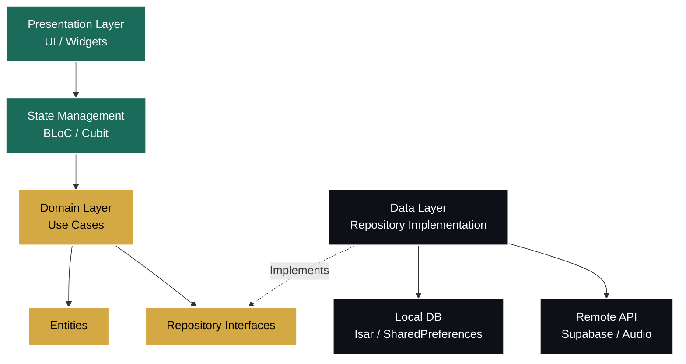

<div align="center">
  

  # 🕌 تالية — Talia Quran

  **A Premium, Intelligent, Offline-First Quran Memorization & Recitation Application**

  [](https://flutter.dev)
  [](https://dart.dev)
  [](#-technical-architecture)
  [](#-tech-stack)
  [](#-tech-stack)

  [English](#english) • [العربية](#العربية)
</div>

<br>

> **Talia (تالية)** bridges traditional Islamic learning with cutting-edge technology. It combines an immersive Quranic reading experience with advanced **Spaced Repetition System (SRS)** algorithms, **AI-powered speech recognition**, and gamified habit-building for all ages.

---

<h2 id="english">🇬🇧 English Overview & Features</h2>

### 🌟 Why Talia?
Talia is not just another Quran app; it is a **comprehensive Hifz (Memorization) ecosystem**. Designed with an uncompromising focus on visual excellence, cognitive science, and robust software architecture (Clean Architecture & Domain-Driven Design), Talia transforms how Muslims engage with the Quran.

### ✨ Core Features

#### 📖 1. The Premium Mushaf Experience
- **Complete 114 Surahs:** Verified Ottoman script with precise Ayah counts, Hizb divisions, and Makki/Madani classifications.
- **QCF Visual Rendering (`qcf_quran_plus`):** Flawless, crystal-clear Mushaf page rendering preserving the authentic script while using efficient JSON/Isar databases as the underlying source of truth.
- **Immersive Audio:** High-quality Ayah-by-Ayah audio playback via `just_audio` with seamless offline caching (`flutter_cache_manager`).
- **Focus & Customization:** Adjustable typography (`Amiri` font, 16–36px), a distraction-free Focus Mode, and persistent bookmarks.

#### 🧠 2. Intelligent Memorization (Hifz) & AI Testing
- **Spaced Repetition System (SRS):** Scientifically optimized intervals (`1, 3, 7, 14, 30, 90` days) shift memorized Ayahs into permanent memory.
- **AI Voice Verification:** Integrates `speech_to_text` and `string_similarity` to actively listen, analyze, and automatically verify your recitation against the text.
- **Interactive Checkpoints:** Guided sessions that enforce mastery before allowing progress to new sections.

#### 🌱 3. Dual Identity Tracks (Kids & Adults)
- **Kids Journey Mode:** A highly engaging, gamified step-by-step memorization map designed to keep children motivated.
- **Adult Smart Daily Plan:** Automated, adaptive memorization targets customized to an adult's learning pace.
- **Parental Dashboard (Guardian Linking):** Secure QR-code / Supabase pairing that allows parents to remotely track their child's progress, streaks, and quiz results in real time.

#### 📊 4. Gamification, Habits & Azkar
- **Streaks & XP Points:** Earn XP (`XpService`) and build daily streaks (`StreakService`) for completing Hifz sessions and Dhikr.
- **Badges & Certificates:** Unlock milestone badges and generate personalized, printable **Certificates of Completion**.
- **Haptic Azkar Counters:** Interactive Supplications with haptic feedback (`HapticFeedback`) and animated progress rings.

---

## 🏗️ Technical Architecture

Talia strictly adheres to **Clean Architecture** principles. The application is decoupled into distinct layers, ensuring high testability, easy maintenance, and scalability.



### 📂 Directory Structure Highlights
```text
lib/
├── core/                        # Shared Utilities, DI (GetIt), Routing (GoRouter), Theme
└── features/                    # Independent Feature Modules
    ├── auth/                    # Supabase Session Management
    ├── hifz/                    # Memorization & Speech Testing
    ├── memorization_plus/       # Kids/Adults Tracks, Guardian Linking
    ├── progress/                # Heatmaps, Streaks, XP & Certificates
    └── quran/                   # Mushaf Reader & Audio Player
```

### 🛠️ Tech Stack
- **Framework:** Flutter (`>=3.22`), Dart (`>=3.4`)
- **State Management:** `flutter_bloc`
- **Database:** `isar` (NoSQL), `shared_preferences`
- **Backend / Sync:** `supabase_flutter`
- **Audio & Speech:** `just_audio`, `speech_to_text`
- **UI & Animations:** `qcf_quran_plus`, `flutter_animate`, `percent_indicator`

---

## 🚀 Getting Started

1. **Clone the repository:**
   ```bash
   git clone https://github.com/yourusername/talia_quran.git
   cd talia_quran
   ```
2. **Install dependencies:**
   ```bash
   flutter pub get
   ```
3. **Generate code (Isar schemas & GetIt locators):**
   ```bash
   flutter pub run build_runner build --delete-conflicting-outputs
   ```
4. **Run the App:**
   ```bash
   flutter run
   ```

---

<h2 id="العربية" align="right">🇸🇦 الواجهة العربية (Arabic Overview)</h2>

<div align="right" dir="rtl">

### 🌟 لماذا تالية؟
**تالية (Talia)** ليس مجرد تطبيق قرآني تقليدي، بل هو **منظومة متكاملة لحفظ ومراجعة القرآن الكريم**. تم تصميمه بأعلى معايير الجودة والجماليات البرمجية (Clean Architecture)، ليجمع بين أصالة التلاوة وذكاء التقنية، محولاً عملية الحفظ إلى تجربة ممتعة، تفاعلية، ومستدامة لجميع الأعمار.

### ✨ أبرز المميزات

#### 📖 1. المصحف الشريف المطور
- **مصحف متكامل:** 114 سورة بالرسم العثماني مدققة بالكامل مع تقسيمات الأجزاء والأرباع.
- **طبقة العرض QCF:** عرض فائق الدقة والموثوقية لصفحات المصحف باستخدام `qcf_quran_plus` للحفاظ على جماليات الرسم العثماني.
- **تلاوات صوتية وتخزين ذكي:** استماع آية بآية عبر `just_audio` مع التخزين المؤقت للاستماع لاحقاً بدون إنترنت.
- **تجربة بصرية مريحة:** خط `Amiri` الأصيل، إمكانية تعديل حجم الخط، ووضع "التركيز" لقراءة بلا مشتتات.

#### 🧠 2. التحفيظ الذكي والتكرار المتباعد
- **خوارزميات التكرار المتباعد (SRS):** جدولة ذكية للمراجعات (1، 3، 7، 14، 30، 90 يوماً) لنقل الحفظ إلى الذاكرة طويلة المدى.
- **اختبار التلاوة بالذكاء الاصطناعي:** تقنية الاستماع للتلاوة آلياً ومطابقتها مع النص القرآني لتحديد الأخطاء بدقة.
- **جلسات ونقاط فحص (Checkpoints):** نظام يمنع الانتقال للورد التالي قبل إتقان الورد الحالي بالكامل.

#### 🌱 3. مسارات مخصصة (للأطفال والكبار)
- **رحلة الأطفال التفاعلية:** خريطة حفظ ممتعة مصممة بأسلوب الألعاب (Gamification) لجذب الأطفال.
- **الخطة اليومية الذكية:** أهداف حفظ تُبنى وتتأقلم تلقائياً مع قدرات المستخدم البالغ.
- **لوحة تحكم الوالدين:** ربط آمن عبر الـ QR Code و Supabase، يتيح للآباء متابعة تقدم أبنائهم ونتائج اختباراتهم عن بُعد وبشكل فوري.

#### 📊 4. التحفيز، الإحصائيات والأذكار
- **النقاط (XP) والسلاسل اليومية:** اكسب نقاط الخبرة وحافظ على سلسلة أيامك (Streaks) لتشجيع الاستمرارية.
- **الأوسمة والشهادات التقديرية:** احصل على شارات الإنجاز، وأصدر شهادات تقديرية مخصصة ومطبوعة عند إتمام حفظ الأجزاء.
- **أذكار المسلم التفاعلية:** عدادات ذكية تدعم الاهتزاز (Haptic) مع حفظ تلقائي لتقدمك اليومي.

---

### 🏗️ المعمارية والتقنيات (Architecture)

تم بناء التطبيق باستخدام معمارية **البنية النظيفة (Clean Architecture)**، مما يضمن كوداً نظيفاً، قابلاً للاختبار، وسهل التوسع.
* ينقسم المشروع إلى ميزات مستقلة (Feature Modules) وكل ميزة تتكون من 3 طبقات:
  1. **الواجهة (Presentation):** إدارة الحالة باستخدام `flutter_bloc` وواجهات المستخدم.
  2. **النواة (Domain):** قواعد العمل (Use Cases) والكيانات.
  3. **البيانات (Data):** التعامل مع قاعدة البيانات المحلية السريعة `Isar` والخادم السحابي `Supabase`.

### 🚀 خطوات التشغيل السريعة

1. استنساخ المشروع: `git clone https://github.com/yourusername/talia_quran.git`
2. تحميل الحزم: `flutter pub get`
3. توليد الأكواد المطلوبة: `flutter pub run build_runner build --delete-conflicting-outputs`
4. تشغيل التطبيق: `flutter run`

---
<br>

<div align="center">
  <i>تم التطوير بكل ❤️ باستخدام Flutter لخدمة كتاب الله الكريم</i>
</div>

</div>
