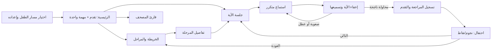

# Talia Kids Path — Current State Understanding

**الخلاصة:** مسار الأطفال في تالية يملك أساسًا حقيقيًا لرحلة حفظ: مدخل مستقل، مهمة مقترحة، خريطة مراحل، جلسة استماع وتسميع، مراجعات، تقدم محفوظ، ومكافأة بعد الإكمال. لكنه لا يمنح الطفل بعدُ تجربة متصلة بالقدر الذي توحي به الخريطة. أقوى ما فيه هو جلسة الآية الهادئة؛ وأكبر فجوة فيه هي أن «ما تعلّمته، وما يحتاج دعمًا، وما سأفعله غدًا» لا تتفق دائمًا عبر أنظمة الجلسة والمراجعة والمهمة التالية.

هذه **مراجعة للكود الحالي واختباراته، وليست تجربة تشغيل على هاتف طفل**. لم أعدّل كود التطبيق. شغّلت ثلاثة اختبارات موجهة للمحلّل والجلسة وعرض 320px العربي؛ نجحت **48/48**، مع ظهور رسالة أثناء البناء تفيد بأن ملفًا تغيّر بالتزامن. لذا أعتمد نتائجها بحدودها، ولا أعدّ الصوت أو الميكروفون أو الأداء أو TalkBack متحققًا على جهاز.

## Current User Journey

في أول استخدام، يختار المستخدم مسار الطفل ويضبط الاسم، العمر **5–12**، سورة البداية ضمن جزء عمّ، الهدف الأسبوعي، وقت التذكير ورمز ولي الأمر. يوجد أيضًا اختيار مسار الطفل في تهيئة التطبيق العامة. بعد ذلك يوجّه الملف الطفل إلى بيته الخاص؛ وقد تمر حالة الحساب المسجّل بربط ولي الأمر. [اختيار المسار](../../lib/features/memorization_plus/presentation/pages/path_selection_page.dart)، [حفظ الإعداد](../../lib/features/memorization_plus/presentation/cubits/memorization_identity_cubit.dart)، [توجيه الدخول](../../lib/core/router/app_router.dart).

عند العودة، لا يختار التطبيق دائمًا سورة الإعداد الأصلية: يبحث أولًا عن مراجعة ضعيفة أو مستحقة، ثم آخر سورة في سجل الطفل، ثم الخطة أو سورة البداية. تحمل الرئيسية بطاقة المهمة التالية وأزرار المصحف والخريطة والمهمات. الخريطة تعرض «منازل» بحالات مقفلة، جارية، مكتملة، وتحتاج مراجعة؛ وتقرّب العرض من المرحلة النشطة. [اختيار السورة](../../lib/features/memorization_plus/domain/navigation/memorization_navigation_resolver.dart)، [الرئيسية](../../lib/features/memorization_plus/presentation/pages/kids_gamified_home_page.dart)، [الخريطة](../../lib/features/memorization_plus/presentation/pages/kids_gamified_journey_page.dart).

تبدأ المهمة بآية واحدة. يرى الطفل نصها، يضغط للاستماع، وينتظر اكتمال **3 استماعات لعمر 5–7** أو **استماعين لعمر 8–12** قبل إتاحة التسجيل. عند التسميع يُخفى النص. يستخدم التطبيق تعرف الكلام العربي ومقارنة كلمات مرتبة؛ إذا لم يُلتقط كلام يطلب إعادة المحاولة، وإذا اقترب الطفل يظهر له عدد الكلمات المطابقة، وبعد تكرر التعثر أو عطل تقني يمكن لولي الأمر تأكيد الإكمال برمز PIN. النجاح يسجل نتيجة مراجعة وسجل جلسة، ثم تظهر صفحة الاحتفال مع خيار التالي أو الرجوع للخريطة. [سياسة العمر](../../lib/features/memorization_plus/domain/entities/kids_session_policy.dart)، [الجلسة](../../lib/features/memorization_plus/presentation/cubits/kids_mode_cubit.dart)، [تغذية الطفل الراجعة](../../lib/features/memorization_plus/presentation/pages/kids_gamified_listen_page.dart)، [الإكمال](../../lib/features/memorization_plus/presentation/pages/kids_gamified_completion_page.dart).

## Current Architecture & Product Structure

| الطبقة | دورها الحالي |
|---|---|
| التنقل | مسارات وحراسة منفصلة للرئيسية، الخريطة، المرحلة، الجلسة، الإكمال، ومصحف الطفل. [المسارات](../../lib/core/router/app_router.dart) |
| حالة الرحلة | `KidsJourneyCubit` يجمع مراحل السورة، التقدم، سجلات المراجعة، الجلسة القابلة للاستئناف، ثم يحل مهمة واحدة. [الكيوبت](../../lib/features/memorization_plus/presentation/cubits/kids_journey_cubit.dart) |
| حالة الجلسة | `KidsModeCubit` يدير التلاوة، التسجيل، التقييم، حفظ جلسة V2، الإكمال والمكافآت. [الكيوبت](../../lib/features/memorization_plus/presentation/cubits/kids_mode_cubit.dart) |
| التقدم الدائم | سجل جلسات الطفل وإسقاط النقاط/النجوم محفوظان محليًا بمفاتيح تخص مالك البيانات؛ سجلات المراجعة وجلسة V2 غير المكتملة في تخزين منفصل. [التخزين](../../lib/features/memorization_plus/data/datasources/memorization_kids_storage.dart)، [استعادة الجلسة](../../lib/features/memorization_plus/presentation/cubits/kids_mode_cubit.dart) |
| الأنظمة المجاورة | تذكير يتوقف إذا أُنجزت مهمة اليوم، لوحة ولي أمر تعرض النشاط والمراجعات والحاجة للدعم، وشهادات وسلسلة أيام. [الإشعار](../../lib/core/services/notification_scheduler.dart)، [تفاصيل الطفل](../../lib/features/memorization_plus/presentation/pages/child_detail_page.dart) |

## What Already Exists

**الاستماع → الممارسة → الحفظ → المراجعة:** التلاوة تستخدم خدمة صوت مشتركة تخزّن الملف بعد طلبه، لذلك يمكن إعادة تشغيل ما صار في الذاكرة المؤقتة، لكن الاستماع إلى آية لم تُحمّل سابقًا غير مضمون دون اتصال. بعد الاستماع توجد محاولة استرجاع مع النص مخفيًا. تُنشئ نتيجة النجاح سجل مراجعة له موعد لاحق، وتُقدّم المراجعات المستحقة على الحفظ الجديد في المهمة المقترحة. [الصوت](../../lib/core/services/audio_cache_service.dart)، [محدد المهمة](../../lib/features/memorization_plus/domain/navigation/kids_next_mission_resolver.dart).

**التقدم والتحفيز:** يوجد مستوى، شريط تقدم، نجوم، نقاط، سلسلة أيام، منازل مضاءة أو تحتاج مراجعة، شهادات، ومكافآت أسبوعية يديرها ولي الأمر. المراجعة تعطي نقاطًا أقل ولا تعطي نجمة جديدة. يُعرض التقدم العددي للمرحلة من سجل الإكمال. [التقدم](../../lib/features/memorization_plus/domain/entities/kids_progress.dart)، [المكافآت](../../lib/features/memorization_plus/data/repositories/collaborators/memorization_kids_local_service.dart)، [واجهة التقدم](../../lib/features/memorization_plus/presentation/widgets/kids_progress_header.dart).

**القراءة:** زر المصحف يفتح قارئ صفحات يستخدم عرض المصحف المشترك وخطوط QCF في سطح هادئ بلون الورق. هو باب حرّ للقراءة، لكنه غير موصول حاليًا بخطوة ممارسة محددة داخل المهمة. [قارئ الطفل](../../lib/features/quran/presentation/pages/kids_quran_reader_page.dart).

## What Works Well

1. **جلسة تركيز واضحة.** آية واحدة، استماع مطلوب، ثم إخفاء للنص عند التسميع؛ هذا أساس مناسب يحافظ على هدوء التعامل مع القرآن. [واجهة الجلسة](../../lib/features/memorization_plus/presentation/pages/kids_gamified_listen_page.dart).
2. **الرحلة أكثر من عدّاد نقاط.** المرحلة لها مكان وحالة وشكل، والمهمة التالية واحدة بدل قائمة واجبات مزدحمة. [حالات المرحلة](../../lib/features/memorization_plus/domain/entities/kids_journey_stage.dart)، [بطاقة المهمة](../../lib/features/memorization_plus/presentation/widgets/kids_mission_card.dart).
3. **عناية موجودة عند التعثر.** الرسالة الإيجابية للمحاولة القريبة، وعدم احتساب التسجيل الفارغ خطأ، وطريق ولي الأمر عند تعطل التقنية قرارات جيدة يجب الحفاظ عليها. [التقييم](../../lib/features/memorization_plus/presentation/cubits/kids_mode_cubit.dart)، [البديل](../../lib/features/memorization_plus/presentation/cubits/kids_mode_cubit.dart).
4. **الاستمرارية التقنية لها أساس.** حفظ الجلسة غير المكتملة، حراسة مسارات الطفل، فصل بيانات المراجعة بحسب الجمهور، وتسجيل المكافأة قبل إعادة بناء مجموعها تقلل ضياع الرحلة أو خلطها بمسار الكبار. [الاستئناف](../../lib/features/memorization_plus/presentation/cubits/kids_mode_cubit.dart)، [سجل المكافأة](../../lib/features/memorization_plus/data/repositories/collaborators/memorization_kids_local_service.dart).

## Problems Discovered

الجدول يميّز **السلوك المثبت من قراءة الكود** عن **الأثر المتوقع الذي يحتاج اختبارًا على جهاز**. أستخدم درجات المشروع: P1 حرج، P2 كبير، P3 صغير.

| الخطورة | What exists now → Why it is a problem → أثره على الطفل → What could improve it |
|---|---|
| **P1 حرج — منطق مثبت، الأثر يحتاج تجربة** | يحدد `KidsModeCubit` ضعف الإتقان من عدد الإخفاقات والتلميحات، لكن `recordPass` يبني موعد المراجعة من **التلميح وحده**. طفل أخطأ مرتين ثم نجح بلا تلميح قد يوثّق سجله التحفيزي «ضعيفًا»، بينما تُجدول مراجعته «ممتازًا». قد تختفي حاجته لدعم قريب رغم أن المحاولة كشفت صعوبة. يجب توحيد دليل الإتقان المرسل إلى الجدولة والمكافأة؛ ثم اختبار سيناريو «إخفاقان ثم نجاح». [حساب الإتقان](../../lib/features/memorization_plus/presentation/cubits/kids_mode_cubit.dart)، [جدولة المراجعة](../../lib/core/memorization/v2/session_adapters.dart). |
| **P2 كبير — منطق مثبت** | كل نوع مهمة يبدأ بـ`startLearning` ويعرض النص ويفرض الاستماع قبل التسجيل، حتى `dueReview`. بهذا تصبح «المراجعة» في كثير من الحالات نجاحًا بعد تذكير فوري، لا قياسًا لما بقي من الأمس. الأفضل بدء المراجعة باسترجاع لطيف، ثم فتح الاستماع والنص كدعم عند الحاجة؛ يوجد أصلًا `startReview` في المحرك يمكن تقييم ملاءمته. [بدء جلسة الطفل](../../lib/features/memorization_plus/presentation/cubits/kids_mode_cubit.dart)، [طور المراجعة الموجود](../../lib/core/memorization/v2/session_engine.dart). |
| **P2 كبير — مسار إعادة محتمل بقوة** | النجاح بمساعدة ولي الأمر يسجل تلميحًا كاملًا وتقييمًا ضعيفًا؛ محدد المهمة يعدّ أي تقييم ضعيف مستحقًا فورًا. شاشة الإكمال لا تستثني سجل الآية التي انتهت للتو، فيمكن أن يعيد «التالي» الطفل إلى الآية نفسها مباشرة. ذلك يحوّل لحظة الدعم والاحتفال إلى حلقة مُحبطة. يجب فصل «تحتاج دعمًا لاحقًا» عن «أعدها الآن»، وتطبيق سياسة اليوم في شاشة الإكمال أيضًا. **التحقق المقترح:** ثلاث محاولات غير متطابقة ← PIN ولي الأمر ← الإكمال ← «التالي». [البديل](../../lib/features/memorization_plus/presentation/cubits/kids_mode_cubit.dart)، [أولوية الضعيف](../../lib/features/memorization_plus/domain/navigation/kids_next_mission_resolver.dart)، [التالي](../../lib/features/memorization_plus/domain/navigation/memorization_navigation_resolver.dart). |
| **P2 كبير — تعارض ثابت** | حد الآيات الجديدة اليومي يُفحص **عند فتح الجلسة**؛ زر «التالي» يُحسب دون هذا الحد. يمكن أن يعد الإكمال الطفل بمهمة جديدة ثم تعرض له الصفحة التالية خطأ الحد اليومي. ينبغي أن تكون المهمة المعروضة قابلة للبدء فعلًا، وأن تكون «انتهت حصتك اليوم» نهاية مشجعة واضحة. [بوابة اليوم](../../lib/features/memorization_plus/presentation/cubits/kids_mode_cubit.dart)، [حل التالي](../../lib/features/memorization_plus/domain/navigation/memorization_navigation_resolver.dart). |
| **P2 كبير — خطر جودة القياس** | تقييم الكلام يقبل في الآيات الأطول تشابه كلمات مرتبة بنسبة **0.80** للأطفال، بينما الآيات حتى ثلاث كلمات تتطلب تطابقًا بعد التطبيع. هذه آلية معقولة لتحمّل أخطاء التعرف على صوت الطفل، لكنها ليست شهادة بصحة التلاوة أو التجويد، وقد تعطي تقدمًا مع كلام التقطته التقنية جزئيًا. يلزم التفريق في المنتج والبيانات بين «محاولة آلية ناجحة» و«إتقان مثبت»، مع مراجعة بشرية أو إعادة استرجاع عند الشك. لم أتحقق من دقة التعرف على أجهزة أطفال فعلية. [مقيّم التلاوة](../../lib/core/memorization/v2/recitation_evaluator.dart). |
| **P2 كبير — فجوة إعداد** | يُخزن هدف مدة الجلسة وصوت الإرشاد؛ لا يظهر لهما مستهلك في جلسة Kids الحالية. كما أن `linkedReviewAyahs` معرّف في السياسة بينما رابط المهمة يمرر آية بدء واحدة. يشعر ولي الأمر بأنه ضبط إيقاعًا أو إرشادًا لا يراه الطفل. يجب إما تحقيق معنى الإعدادات في التجربة أو تبسيطها، وتحديد ما تعنيه «مراجعة مرحلة» فعليًا. [الإعداد](../../lib/features/memorization_plus/presentation/cubits/memorization_identity_cubit.dart)، [السياسة](../../lib/features/memorization_plus/domain/entities/kids_session_policy.dart)، [رابط الجلسة](../../lib/core/router/app_router.dart). |

لا أملك دليلًا على خطأ في **النص القرآني المعروض أو ترتيب الآيات** من هذه القراءة، ولم أجرِ مطابقة حتمية لمصدر المصحف والتلاوة مع مرجع معتمد. لذلك لا أسجل عيب سلامة نص مؤكّدًا، ولا أعدّ سلامة المحتوى محققة نهائيًا.

## UX & Learning Friction

- **بطاقة «مهمتي» قد تصف المرحلة غير التي ستفتحها.** `currentStage` مأخوذة من مراحل السورة المعروضة، بينما المراجعة ذات الأولوية قد تكون في سورة أخرى؛ عنوان البطاقة ونطاقها قد لا يشرحان المهمة الفعلية. الحل هو بناء محتوى البطاقة من المهمة المحلولة نفسها. [حالة الرحلة](../../lib/features/memorization_plus/presentation/cubits/kids_journey_state.dart)، [بطاقة المهمة](../../lib/features/memorization_plus/presentation/widgets/kids_mission_card.dart).
- **الممارسة بين السماع والاختبار ضيقة.** الخطوة المعروضة «استمع، كرر، اختبر»، لكن التفاعل المنفذ هو تشغيل التلاوة ثم التسجيل؛ لا توجد في جلسة الطفل درجة دعم متدرّجة واضحة مثل «جرّب معي»، «أكمل بعد البداية»، ثم «من الذاكرة». أوصي بتنظيم الدعم من الموجود قبل إضافة أنشطة. [تفاصيل المرحلة](../../lib/features/memorization_plus/presentation/widgets/kids_stage_details.dart)، [أزرار الجلسة](../../lib/features/memorization_plus/presentation/pages/kids_gamified_listen_page.dart).
- **العمر يؤثر في الأرقام أكثر من طريقة الحديث.** مجموعتا 5–7 و8–12 تغيّران حجم المرحلة وعدد الاستماعات والحدود، لكن الصفحات الأساسية نفسها. الطفل الأصغر قد يحتاج تعليمات مسموعة وقصيرة ومساعدة ولي الأمر؛ الأكبر قد يريد استقلالية واسترجاعًا أولًا. لا حاجة لمسارين منفصلين، بل عرض وتوجيه متكيّفين فوق محرك واحد. [السياسة](../../lib/features/memorization_plus/domain/entities/kids_session_policy.dart).
- **المكافأة بعد مراجعة بلا نجوم تعرض حبة «0 نجوم».** الرسالة قد تبدو كأن المراجعة جهد أقل قيمة، رغم أن الاستمرار والمراجعة هما جوهر التعلم. اجعل الاحتفال يذكر نوع الجهد المنجز، مع ترك النجوم للإنجاز الذي تستحقه قواعدها الحالية. [مكافأة المراجعة](../../lib/features/memorization_plus/data/repositories/collaborators/memorization_kids_local_service.dart)، [عرض النجمة](../../lib/features/memorization_plus/presentation/widgets/kids_reward_dialog.dart).

## Engagement & Motivation Analysis

**لماذا يعود غدًا؟** يوجد تذكير، سلسلة أيام، ومراجعة ذات أولوية. لكن البيت لا يصوغ بعد وعدًا شخصيًا من نوع «سنثبت ما تعلمته أمس»، ولا يقدّم رجوعًا رحيمًا بعد الانقطاع؛ والسلسلة النارية قد تصبح سبب ضغط لدى بعض الأطفال. **لماذا يبقى أسبوعًا؟** المنازل والمستويات والهدف الأسبوعي ومكافأة ولي الأمر تعطي بداية جيدة. **لماذا يبقى شهرًا؟** هنا الإجابة أضعف: ينتقل بين منازل متشابهة، بينما أثر جهده في المكان والشخصية وقصة تقدمه قليل. هذا **استنتاج منتجي من الواجهات والمنطق**، لا قياس احتفاظ بمستخدمين. [التذكير](../../lib/core/services/notification_scheduler.dart)، [السلسلة](../../lib/features/memorization_plus/presentation/widgets/kids_progress_header.dart)، [مكافأة الأسبوع](../../lib/features/memorization_plus/data/repositories/collaborators/memorization_kids_local_service.dart).

نموذج الاستمرار المقترح: **موعد مفيد وقصير مع القرآن، يوضح أثر ما سبق ويجعل التوقف الطبيعي نجاحًا**. لا خسارة نقاط عند الغياب، ولا مكافأة لمجرد فتح التطبيق، ولا تسلسل مهام بلا نهاية.

## Current Animation / Motion Experience

الموجود **رسوم ثنائية الأبعاد بطابع 2.5D**: منازل PNG، سماء ومسار مرسومان، تدرجات وظلال، صورة طفل تتحرك بلطف، انتقالات بين حالة الاستماع والتسجيل، موجة تسجيل، وتمرير إلى المرحلة، ثم اهتزاز وكونفيتي عند الإكمال. لا أرى تجربة 3D آنية أو مؤثرات صوتية خاصة بالمهمة؛ الصوت الأساسي هو التلاوة. بعض الحركات تراعي إعداد تقليل الحركة، لكن تكبير نجمة المكافأة يعمل دون فحصه. [الأصول والهوية](../../lib/features/memorization_plus/presentation/theme/kids_theme.dart)، [موجة التسجيل](../../lib/features/memorization_plus/presentation/pages/kids_gamified_listen_page.dart)، [الاحتفال](../../lib/features/memorization_plus/presentation/widgets/kids_reward_dialog.dart)، [تكبير النجمة](../../lib/features/memorization_plus/presentation/widgets/kids_reward_dialog.dart).

## Opportunities for Animation & 3D

قراري المنتجّي والتقني: **طوّر الحركة داخل Flutter فوق لغة 2.5D الموجودة أولًا**. اجعل إضاءة منزل مكتمل، تقدّم علامة على الطريق، واعتراف الرفيق بعودة الطفل أحداثًا مرتبطة ببيانات حقيقية. داخل تلاوة الآية يبقى كل شيء ساكنًا تقريبًا؛ بين المهمات تتحرك البيئة بقدر يوضح التقدم؛ وبعد الإكمال تأتي لحظة احتفال قصيرة. يمكن تجربة **Rive** لاحقًا لرفيق تفاعلي محدود إذا أثبتت اختبارات الأطفال أنه يساعدهم على الفهم والعودة. لا توجد مشكلة حالية تستدعي محرك 3D آنيًا أو حزمة جديدة الآن.

القرار مشروط بقياس على أجهزة Android ضعيفة ومتوسطة وباختبار تعطيل الحركة؛ تنصح وثائق Flutter بفحص زمن الإطار في وضع القياس وتقليل عمليات الرسم المكلفة، وRive يوفر آلات حالة للرسوم التفاعلية لكنه يضيف مسار إنتاج وصيانة خاصًا به. [إرشادات أداء Flutter](https://docs.flutter.dev/perf/best-practices)، [توثيق Rive](https://rive.app/docs/auth).

## Missing Experience Layers

1. **ترجمة حالة التعلم إلى قصة مفهومة:** الطفل يرى نجومًا ومنزلًا، لكنه لا يرى بوضوح الفرق بين «استمعت»، «تدرّبت»، «أتذكر من الأمس»، و«أحتاج مساعدة». سجلات المحاولات والمراجعة الموجودة تصلح مادة لهذا العرض. [سجل الجلسة](../../lib/features/memorization_plus/data/repositories/collaborators/memorization_kids_local_service.dart).
2. **تعافٍ رحيم بعد التعثر والانقطاع:** توجد إعادة ومحاولة ولي الأمر، لكن لا توجد رحلة عودة خاصة بعد عدة أيام أو آية صعبة. ينبغي أن تقترح العودة خطوة قابلة للنجاح، بلا لغة فقدان سلسلة.
3. **صلة بين المصحف والمهمة:** القارئ جيد كمساحة قراءة حرة، لكن لا يوجد انتقال واضح من «آية مهمتي» إلى موضعها في المصحف ثم عودة سلسة للجلسة. [قارئ الطفل](../../lib/features/quran/presentation/pages/kids_quran_reader_page.dart).
4. **حلقة إشراف بنّاء لولي الأمر:** اللوحة تملك مؤشرات «تحتاج دعمًا» ومتوسط مدة الجلسة؛ يمكن تحويلها إلى إرشاد عملي قصير يساعد الطفل، مع إبقاء الأحكام الآلية متواضعة. [مؤشرات ولي الأمر](../../lib/features/memorization_plus/presentation/pages/child_detail_page.dart).

فائدة الاسترجاع المتكرر والمتباعد للأطفال مدعومة بأبحاث أولية على تعلم مواد أخرى؛ أستخدمها **مبررًا لتجربة تصميم تعليمية قابلة للقياس**، وليس دليلًا مباشرًا على أفضل طريقة لتحفيظ القرآن أو صحة جدول تالية الحالي. [دراسة على أطفال المرحلة الابتدائية](https://pmc.ncbi.nlm.nih.gov/articles/PMC3827082/)، [دراسة أخرى للاسترجاع](https://pubmed.ncbi.nlm.nih.gov/27014156/).

## Features That Need Improvement

**محدد المهمة، تقييم الإتقان، وجدولة المراجعة** تحتاج عقدًا واحدًا متفقًا عليه: ما نوع المهمة؟ هل هذه محاولة استرجاع أم تعلّم؟ ما دليل نجاحها؟ متى تكون المراجعة التالية؟ ماذا يقال للطفل؟ اليوم هذه الإجابات موزعة على الكيوبت والمحلّل وسجل المكافآت، وتنتج التعارضات أعلاه. الأولوية هنا أعلى من أي إعادة رسم للخريطة. [محدد المهمة](../../lib/features/memorization_plus/domain/navigation/kids_next_mission_resolver.dart)، [إكمال الجلسة](../../lib/features/memorization_plus/presentation/cubits/kids_mode_cubit.dart).

**الواجهة العربية والإتاحة** تحتاج تحققًا بصريًا وتشغيليًا: زر العودة والخريطة يستخدمان مواضع يمين/يسار ثابتة في أجزاء من الواجهة؛ أزرار الاحتفال متجاورة في صف لا يعيد ترتيبها عند تكبير النص؛ والنجمة المتحركة لا تحترم دائمًا تقليل الحركة. اختبار 320px الحالي ناجح، لكنه لا يثبت النص المكبر أو TalkBack أو الأجهزة اللوحية. [رأس الصفحة](../../lib/features/memorization_plus/presentation/widgets/kids_ui.dart)، [أزرار الاحتفال](../../lib/features/memorization_plus/presentation/widgets/kids_reward_dialog.dart)، [اختبار العرض الضيق](../../test/features/memorization_plus/presentation/pages/kids_gamified_rtl_narrow_test.dart).

## Features That Should Be Simplified

- **مفردات المكافآت:** الطفل يواجه نجومًا ونقاطًا ومستوى وسلسلة أيام ومنازل وشهادات. احتفظ بقياس داخلي دقيق، لكن اعرض له في اللحظة الواحدة معنى واحدًا: «أنجزت خطوة»، «ثبتّ ما تعلمته»، أو «عدت اليوم». [رأس التقدم](../../lib/features/memorization_plus/presentation/widgets/kids_progress_header.dart).
- **تفاصيل المرحلة قبل المهمة:** تعرض الخطوات الثلاث ثم زر البدء، بينما الرئيسية تعرض «استمر الآن». اجعل التفاصيل نافذة اختيارية لمن يريد استكشاف الخريطة؛ الطريق الافتراضي للطفل الصغير يجب أن يكون قصيرًا. [صفحة المرحلة](../../lib/features/memorization_plus/presentation/pages/kids_gamified_stage_page.dart).
- **إعدادات ولي الأمر غير المطبقة:** أزل الوعد المرئي بما لا يتغير في الجلسة، أو نفّذ أثره بعد تصميم واضح. لا تفترض أن تغيير مدة معروضة يضبط قدرة طفل فعليًا. [الإعدادات](../../lib/features/memorization_plus/presentation/pages/family_dashboard_page.dart).

## Features Worth Adding

أرى قيمة في **ثلاث طبقات فقط بعد إصلاح الأساس**:

- **دعم متدرج للآية الصعبة:** استمع ثانية، تلاوة مع القارئ، بداية مساعدة، ثم محاولة مستقلة؛ التقدم يُنسب للجهد، ودرجة الإتقان تعكس مقدار المساعدة.
- **عودة سياقية:** رسالة قصيرة تشير لما تعلمه الطفل فعلًا وتعرض مهمة مراجعة مناسبة، مع خيار «جلسة خفيفة اليوم».
- **تغير بصري ناتج عن التعلم:** البيت أو الطريق يتغير بعد إنجاز حقيقي، والرفيق يوضح المهمة أو يطمئن الطفل عند الصعوبة. الشخصية تخدم الفهم والعاطفة، ولا تقف فوق النص القرآني.

## Current vs Target Experience

| البعد | الآن | الهدف |
|---|---|---|
| وحدة الرحلة | آية ومراحل ومهمة مقترحة | حلقة يومية مترابطة ذات بداية وغاية ونهاية طبيعية |
| المراجعة | قد تبدأ باستماع وإظهار النص كالتعلّم الجديد | محاولة استرجاع أولًا، ثم دعم رحيم بحسب الحاجة |
| التقدم | أرقام ونجوم وحالة منزل | دليل مفهوم على ما ثبت وما يحتاج ممارسة |
| التعثر | إعادة وتلميح كلمات وبديل ولي الأمر | سلم مساعدة واضح يمنع الإحساس بالفشل |
| العودة | تذكير وسلسلة ومهمة محسوبة | تذكير بما سبق وخطوة مناسبة بعد يوم أو انقطاع |
| العالم البصري | منازل جميلة غالبها ثابت | عالم يتغير استجابةً لتقدم الطفل، بعيدًا عن جلسة التركيز |

## Proposed Evolution of Kids Path

**نحافظ** على قارئ المصحف الهادئ، جلسة الآية الواحدة، تخزين التقدم القائم، خريطة المراحل، وتحكم ولي الأمر. **نصلح** أولًا اتساق تقييم المحاولة والمراجعة والتالي. **نبسّط** اللغة المرئية للمكافآت والإعدادات. **نعيد تصميم** بداية جلسة المراجعة ونهاية اليوم، ثم **نوسّع** دعم الآية الصعبة والعودة بعد الانقطاع. بعد إثبات هذه الحلقة مع أطفال وأولياء أمور، نجعل الخريطة والرفيق أكثر حياة. لا أرى مبررًا لإعادة بناء المسار من الصفر.

## Priority Roadmap

| المرحلة | الوضع الحالي والمشكلة/الفرصة | الاتجاه المقترح ولماذا؛ الأثر المتوقع | التعقيد والتبعية التقنية |
|---|---|---|---|
| **Fix First** | تقييم الإتقان في المكافأة يختلف عن جدولة المراجعة. | اعتماد دليل نجاح واحد للمحاولة؛ مواعيد أدق للطفل الذي يتعثر. | **متوسط**؛ مراجعة عقد الكيوبت/المجدول وسجلات قديمة دون إعادة تفسير صامت. |
| **Fix First** | «التالي» قد يكرر آية ضعيفة فورًا أو يصطدم بحد اليوم. | حل المهمة من سياق واحد يشمل آخر إنجاز وحدود اليوم؛ نهاية يوم مشجعة. | **متوسط**؛ يعتمد على توحيد حل المهمة، مع اختبارات انتقال كاملة. |
| **Fix First** | مراجعة مستحقة تستخدم تدفق التعلّم. | فصل بدء الاسترجاع عن بدء آية جديدة مع دعم متدرج. | **متوسط إلى عالٍ**؛ بعد ضبط معنى التقييم، وفحص أثره على SRS. |
| **Fix First** | تعرف الكلام مؤشر تقني محدود. | تعريف مستويات ثقة الإتقان ومتى يلزم تكرار أو إشراف؛ حماية تقدم الحفظ من ثقة زائدة. | **عالٍ**؛ تجارب أصوات أطفال وأجهزة مختلفة ومراجعة تربوية/شرعية للمحتوى المصاحب. |
| **Improve** | بطاقة المهمة قد لا تطابق سورة المراجعة؛ الإعدادات الزمنية/الصوتية لا تؤثر بوضوح. | بطاقة مشتقة من المهمة الفعلية، وإعدادات صادقة وبسيطة؛ وضوح أعلى للطفل ووليه. | **منخفض إلى متوسط**؛ بعد توحيد عقد المهمة. |
| **Improve** | RTL، النص الكبير، تقليل الحركة، وTalkBack غير مثبتة تشغيليًا. | تصحيح الاتجاه وإعادة ترتيب الأزرار واختبار أجهزة فعلية؛ وصول آمن لأطفال أكثر. | **متوسط**؛ مستقل نسبيًا. |
| **Expand** | المساعدة في الصعوبة غالبها إعادة استماع أو ولي أمر. | سلم ممارسة قصيرة حسب العمر والصعوبة، دون ضجيج بصري أثناء التلاوة. | **متوسط**؛ بعد إصلاح التقييم والمراجعة. |
| **Expand** | العودة تعتمد على التذكير والسلسلة. | رسالة رجوع رحيمة، مهمة قصيرة، وملخص جهد أسبوعي؛ علاقة صحية طويلة. | **متوسط**؛ يعتمد على بيانات مهمة موثوقة. |
| **Transform** | الخريطة والمرافق بصريان أكثر من كونهما مستجيبين. | تغيرات 2.5D هادئة مرتبطة بإنجاز حقيقي وتوجيه سياقي؛ شعور رحلة مع تكلفة Android معقولة. | **متوسط إلى عالٍ**؛ بعد اختبار الحلقة التعليمية على مستخدمين. |
| **Future** | لا يوجد احتياج مثبت لعالم 3D. | نموذج أولي محدود لرفيق تفاعلي أو مشهد مستكشف، ثم قرار بالأدلة. | **عالٍ**؛ مشروط بقياس الفائدة والأداء والصيانة. |

## Ideal Kids Experience

النسخة المستهدفة تشعر الطفل أن لديه **مكانًا يعرفه ومهمة يستطيع فهمها**. عندما يدخل يعرف لماذا هذه الآية اليوم، وهل هو في تعلّم جديد أم تثبيت لما حفظه. أثناء القرآن تختفي الزينة المتحركة ويأخذ السماع والتركيز المساحة. إذا صعبت عليه المحاولة، يساعده التطبيق في خطوة أصغر ولا يسحب منه شعور الإنجاز. بعد الجلسة يرى أثر جهده على الطريق، ثم يحصل على إذن واضح بالتوقف. عند العودة لا يُحاسب على الغياب؛ يُستقبل من الموضع الذي يستطيع النجاح منه.

## Example End-to-End Child Journey

يفتح طفل عمره ست سنوات تالية. يرى بيته مضاءً برفق ورفيقًا ثابتًا يشير إلى بطاقة واحدة: «اليوم نثبت الآية التي سمعتها أمس». لا يظهر عدّاد غياب. يضغط **ابدأ**؛ ينتقل إلى سطح هادئ بنص الآية والتلاوة. يسمع القارئ، ويكرر معه. عندما حان وقت الاسترجاع، تختفي الآية بهدوء ويظهر زر تسجيل كبير وتعليمات قصيرة مسموعة إن كانت المساعدة مفعّلة.

يتردد في كلمة. لا تهتز الشاشة بعلامة فشل؛ يقول له التطبيق إنه تذكر جزءًا جيدًا، ويعرض «اسمع الجزء مرة أخرى» أو «اطلب البداية». بعد المساعدة يحاول ثانية. يُسجّل النجاح مع مقدار الدعم المستخدم، فتُحدد مراجعة ملائمة لاحقًا بدل منحه حكم إتقان مبالغًا فيه. يعود إلى الخريطة: نافذة المنزل تضيء لحظة قصيرة، ويقول الرفيق «ثبّتَّ ما تعلمته». في شاشة النهاية يرى خيارين متساويي الاحترام: **اكتفيت اليوم** و**أكمل إذا أحببت**. يختار الاكتفاء.

غدًا يجد ذكرى بسيطة لما أنجزه ومهمة قصيرة مناسبة. وإن عاد بعد أسبوع، يبدأ باستماع واسترجاع ميسرين، بلا رسالة خسارة أو عقوبة. **هذا سيناريو مقترح، وليس وصفًا لما يعمل اليوم.**

## What Talia Kids Path Actually Needs Next

**العمل التالي الحقيقي هو جعل الحلقة التعليمية موثوقة ومفهومة وعطوفة قبل زيادة الألعاب والحركة.** أوصي بأن تبدأ المرحلة القادمة بتحديد عقد منتجي واحد لـ«المهمة والمحاولة والإتقان والمراجعة والنهاية اليومية»، ثم معالجة التعارضات الأربع الأولى في الجدول واختبارها على أطفال وأولياء أمور بأجهزة Android فعلية. بعدها صمّم مسار دعم الصعوبة والعودة، واستخدم الخريطة والرسوم الحالية لإظهار أثر هذا التقدم.

عندئذ يصبح لدى تالية سبب صادق لعودة الطفل: **يتذكر ما فعله، يعرف ما يستطيع فعله اليوم، ويشعر أن الجهد مع القرآن يتراكم دون ضغط أو إخفاق مهين**. الحركة والرفيق يمكنهما جعل هذه الحقيقة محسوسة؛ لن يصنعاها وحدهما.
