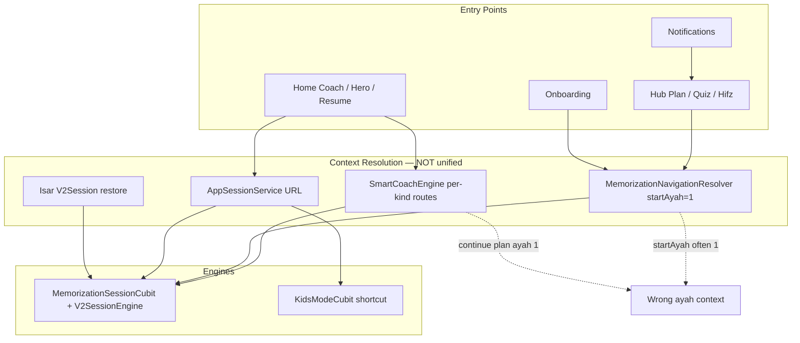
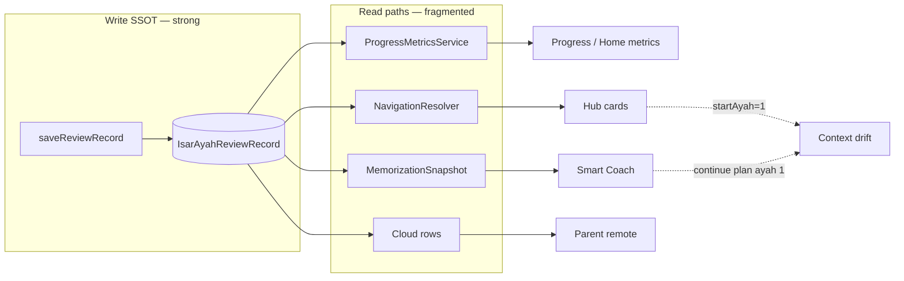

# Talia Quran — Product Behavior Audit

> **Type:** Product Behavior Audit — runtime paths, engine convergence, edge cases, SSOT  
> **Method:** Call-chain tracing from code only; unreachable = NOT IMPLEMENTED  
> **Related:** [memorization-product-validation-audit.md](./memorization-product-validation-audit.md) · [memorization-production-audit.md](./memorization-production-audit.md)

---

## Audit Questions (Summary Answers)

| # | Question | Verdict |
|---|----------|---------|
| Q1 | All entry paths → same engine + same context? | **NO** — two engines (V2 vs Kids); context diverges (`startAyah`, block, resume) |
| Q2 | All memorization phases work as designed? | **PARTIAL** — adult V2 phases yes; review buckets reuse V2 shell; kids bypass |
| Q3 | Edge cases do not break the system? | **NO** — plan change, account switch, reinstall, ghost resume fail product-safe |
| Q4 | Every PRD feature has a reachable screen? | **NO** — daily plan page, FSRS, quiz, smart reminders missing |
| Q5 | Screens with stale or alternate data sources? | **YES** — hero metrics, post-login UI, parent remote |
| Q6 | Background services with no user effect? | **YES** — FSRS, retention summary, smart reminder schedule |
| Q7 | Legacy still affects runtime? | **YES** — migration, `/hifz`, metrics, routes |
| Q8 | Single SSOT per concept? | **PARTIAL** — metrics yes; plan/coach/hero diverge |

---

# Q1 — Do all memorization entry paths converge on the same Engine and context?

## Verdict: **NO**

There are **two runtime engines**, not one:

| Engine | Used by | Domain |
|--------|---------|--------|
| **V2SessionEngine** + `MemorizationSessionCubit` | Adult V2 route | Full 8-phase FSM |
| **KidsModeCubit** (implicit FSM) | `/memorization-plus/kids` | Listen loops + optional STT; `_completeV2Session()` shortcut |

Both write SRS via **`V2SessionReviewAdapter.recordPass`** → `saveReviewRecord`, but **UX and phase behavior differ**.

---

## Entry path matrix

| Entry channel | Route / action | Engine | `surahId` | `startAyah` | `blockSize` | Resume context |
|---------------|----------------|--------|-----------|-------------|-------------|----------------|
| **Home — Smart Coach card** | `context.push(coach.route)` | V2 | From recommendation | **Varies by kind** | Default 5 | Coach-built URL |
| **Home — Unified Journey hero** | `context.push(journey.route)` | V2 or Hub | P1 metadata | Often **1** or URL param | Default 5 | AppSession P1 wins over Coach |
| **Home — Resume banner** | `context.push(resumeLocation)` | V2 / Kids | URL | Normalized; fallback **1** | V2: 5 | AppSession URL; Isar on `startSession` |
| **Hub — Continue Today's Plan** | `adultTargets.todayPlanLocation` | V2 | Plan/custom surah | **`startAyah=1` default** | 5 | No pending-ayah SSOT |
| **Hub — Review Quiz** | `adultTargets.reviewQuizLocation` | V2 | Last reviewed / plan | **`startAyah=1` default** | 5 | **Not a quiz** — same V2 |
| **Hub — Practice by Surah** | `/hifz` → tile tap | V2 | Selected surah | **`startAyah=1` hardcoded** | 5 | — |
| **Hifz page — surah tile** | `push(...&startAyah=1)` | V2 | Tile | **1** | 5 | — |
| **Notifications — generic** | `payload: '/memorization'` | Hub | — | — | — | User picks again |
| **Notifications — kids reminder** | `.../kids-journey?surahId=1` | Kids journey | **Hardcoded 1** | — | — | — |
| **Notifications — smart reminder** | `scheduleSmartReminder` | **NOT IMPLEMENTED** | — | — | — | Never scheduled from app |
| **Onboarding → custom plan** | Custom plan → hub/V2 | V2 | Plan range | Resolver default | 5 | — |
| **Login redirect (child)** | Kids home | Kids | Active surah | Per ayah | 1 ayah | — |
| **Coach — weak/near/far/retention** | `_v2SessionRoute(surah, ayah)` | V2 | Record surah | **Correct ayah** | 5 | Good path |
| **Coach — continue daily plan** | `_v2SessionRoute(plan.surahId, 1)` | V2 | Plan surah | **WRONG: always 1** | 5 | **FAILED context** |
| **Coach — memorize new in plan** | `_v2SessionRoute(..., pendingNew.first)` | V2 | Plan surah | **Correct** | 5 | Good path |
| **Coach — continue V2 session** | Restored URL | V2 | URL | URL | Isar block | Isar overrides on load |

**Evidence:**

- Default route builder: `MemorizationNavigationResolver._v2SessionLocation(..., startAyah: 1)` — `memorization_navigation_resolver.dart:161`
- Hifz tile: `hifz_page.dart:245` — `startAyah=1`
- Coach continue plan: `smart_coach_engine.dart:130` — `_v2SessionRoute(plan.surahId, 1)`
- Kids separate: `kids_gamified_listen_page.dart` — `KidsModeCubit.load()`, not `V2SessionPage`

---

## Context convergence diagram

**Product conclusion:** Only **Coach kinds 1–4 and memorizeNewAyahs** reliably pass the **correct ayah**. Hub, Hifz, continue-plan, and default resolver **do not** share the same context contract.

---

# Q2 — Do all memorization phases work as designed (PRD)?

## Verdict: **PARTIAL**

Reference: [memorization_v2_product_rules.md](./memorization_v2_product_rules.md)

### Adult — intended vs runtime

| Phase (Arabic / PRD) | PRD phase | Runtime | Reachable | Persists | Verdict |
|----------------------|-----------|---------|-----------|----------|---------|
| تعلم (Learning) | Phase 1 | `V2SessionPhase.learning` | YES | Session Isar | **OK** |
| تثبيت (Memorizing) | Phase 2 | `memorizing` + hints | YES | Session Isar | **OK** |
| تسميع (Recitation) | Phase 3 | `reciting` + STT | YES | On pass → SRS | **OK** |
| Remediation | Phase 4 | `remediation` loop | YES | Session Isar | **OK** |
| Block review | Phase 5 | `blockReviewPending` → `blockReview` | YES (profile) | On complete | **OK** |
| Completion | Phase 6 | `MSCompleted` | YES | SRS + streak/XP | **OK** |
| **مراجعة قريبة** (near) | Review bucket | Coach → **same V2 shell** | YES | SM-2 update on pass | **PARTIAL** — not distinct “review mode” |
| **مراجعة بعيدة** (far) | Review bucket | Same | YES | Same | **PARTIAL** |
| **استرجاع الضعيف** (weak) | Priority 1 | In-session remediation + Coach weak-due | YES | `recordWeakAyahs` | **PARTIAL** |
| **Retention (memorized-due)** | Priority 4 | Coach → V2 route | YES | SM-2 | **PARTIAL** — cognitive “review” looks like new memorize session |

**What works as designed:** In-session cycle Learn → Memorize → Recite → Remediate → Block Review (Product Rules §11).

**What does NOT:** **Between-session review** (near/far/retention) has **no dedicated review UX** — user enters full V2 session (learning phase again for that ayah in block). PRD separates “Memorization ≠ Review”; runtime **collapses** them at navigation layer.

### Kids — intended vs runtime

| Expected (same engine) | Actual | Verdict |
|------------------------|--------|---------|
| 5-ayah blocks | Single ayah per session | **FAILED** |
| Full phase UI | Listen loops + mark complete | **FAILED** |
| STT recitation gate | Optional; manual stop accepts | **PARTIAL** |
| Block review | `blockReviewRequired: false` hardcoded | **BY DESIGN but not same engine** |

---

# Q3 — Edge cases: do they break the system?

## Verdict: **NO** (several product-breaking paths)

| Edge case | Expected product behavior | Actual runtime | Breaks? |
|-----------|---------------------------|----------------|---------|
| **Exit mid-session (back)** | Save + resume later | Isar saved; no abandon dialog | **Partial** — works but ghost risk later |
| **Complete session then background app** | Done; no resume offer | URL still restorable → **new session** | **YES** |
| **Change custom plan** | New plan drives navigation | `clearDailyPlanCache()`; regen on read | **Partial** — OK |
| **Daily plan item completed** | Plan advances | **Never wired** | **YES** |
| **Switch guest → account** | Merge/upload progress | Push all local SRS on login | **Partial** — push only |
| **Switch account on same device** | Isolated data | Same Isar; push to new account | **RISK** |
| **Logout / login** | Fresh cloud truth | Pull streak/XP; parallel push SRS | **Partial** — UI stale |
| **Reinstall** | Restore memorization | **No SRS pull** | **YES** |
| **Offline session** | Full memorize | Works | **NO break** |
| **Online sync after offline** | Merge | LWW push may clobber cloud | **YES** multi-device |
| **Kids then adult same ayah** | Isolated | **Same Isar key** | **YES** |
| **Crash mid `_onBlockCompleted`** | Awards + clear | Partial side effects | **Partial** |
| **Notification tap** | Deep link to mission | Generic `/memorization` hub | **Weak** |
| **Child profile on V2 route** | Redirect kids | Guard → kids home | **NO break** |

---

# Q4 — Does every PRD feature have a user-reachable screen?

## Verdict: **NO**

| PRD / product feature | Screen / access | Status |
|----------------------|-----------------|--------|
| Path selection | `PathSelectionPage` | **Implemented** |
| Custom plan setup | `CustomPlanSetupPage` | **Implemented** |
| Daily plan (view items) | **No dedicated page** | **Missing** — Coach/hub text only |
| Daily plan completion UI | — | **Missing** |
| V2 learn/memorize/recite | V2 phase pages | **Implemented** |
| Block review | V2 block pages | **Implemented** |
| Review quiz | Hub card | **Broken** — routes to V2, quiz deleted |
| Smart Coach | Home card (+ hero overlap) | **Partial** |
| Progress / stats | `ProgressPage` | **Implemented** |
| Certificates list | Progress certificates widget | **Implemented** |
| Certificate celebration | Dialog exists | **Hidden** — zero callers |
| FSRS adaptive scheduling | — | **Missing UI** |
| Retention insights | — | **Missing UI** |
| Near/far review (distinct) | — | **Missing** — embedded in V2 |
| Parent dashboard | `ParentDashboardPage` + PIN | **Implemented** |
| Guardian linking | `GuardianLinkingPage` | **Implemented** |
| Kids journey map | `KidsGamifiedJourneyPage` | **Implemented** |
| Kids listen session | `KidsGamifiedListenPage` | **Implemented** |
| `needsReview` house state | Widget supports | **Missing** — never assigned |
| Legacy Hifz browse | `HifzPage` | **Implemented** (deprecated path) |
| Smart push reminders | — | **Missing** — API never called |
| Unified journey hero | Home | **Implemented** |
| Cloud sync status | — | **Missing** — silent background |

---

# Q5 — Screens with stale data or alternate sources?

## Verdict: **YES — multiple**

| Surface | Reads from | SSOT? | Stale when |
|---------|------------|-------|------------|
| **Progress tab** | `ProgressMetricsService` via repository | YES | After login pull (no bus) |
| **Home progress strip** | Same as Progress | YES | Same |
| **Home Smart Coach card** | `MemorizationSnapshot` + engine | Separate read path | Plan counts wrong (never complete) |
| **Home Unified Journey hero** | `UnifiedJourneyEngine` + insights | **Third path** | P1 URL; unfiltered due counts |
| **Home heatmap / streak** | `StreakService` / heatmap repo | Own SSOT | After pull without reload |
| **Home XP** | `XpService` direct | Own SSOT | XP-only bus OK |
| **Memorization hub cards** | `MemorizationNavigationResolver` | Resolver ≠ Coach ayah | Static plan completion |
| **Parent dashboard (local)** | Local kids datasource | Local SSOT | No `ProgressEventsBus` sub |
| **Parent dashboard (remote)** | Supabase cloud rows | **Different from child local** | hifz excluded; adult audience |
| **V2 completion** | Cubit state | Awards dropped in UI | Certs not shown |
| **Achievement badge** | Prefs flag | OK | Dialog never shown |

**Strongest guarantee in codebase:** After `ProgressEventsBus` → reload, **Home `OverallProgress` ≡ Progress tab** (integration test).

**Weakest:** Hero journey + Coach + Hub resolver **can disagree** on next action and ayah.

---

# Q6 — Background UseCases / Services / Cubits with no user-visible effect?

## Verdict: **YES — substantial**

| Component | Registered / exists | Affects UI? | Classification |
|-----------|---------------------|-------------|----------------|
| `ScheduleNextReviewUsecase` | YES | YES (via save) | **Active** |
| `ApplyFsrsPredictionUseCase` (and FSRS stack) | Files exist | NO writes | **Dead / future** |
| `GetRetentionReviewSummaryUseCase` | Not in DI | NO | **Dead code** |
| `MemorizationInsightsAggregator` | Inline in HomeCubit | YES — journey alerts only | **Partial** |
| `AdaptiveRecommendationsUsecase` | Exists | Feeds journey P2 | **Partial** |
| `scheduleSmartReminder` | NotificationService | **Never called** | **Dead integration** |
| `GetRetentionReviewSummaryUseCase` | — | — | **Dead** |
| `HifzRepository` write APIs | Exist | **Zero callers** | **Dead** |
| `DailyPlan.withCompleted()` | Entity method | **Zero callers** | **Broken integration** |
| `showCertificateCelebrationDialog` | Widget | **Zero callers** | **Hidden feature** |
| `QuizCubit` / quiz pages | **Deleted** | l10n remains | **Dead surface** |
| `JourneyDiagnostics` | Exists | Unused | **Dead** |
| Most `XpService` event keys | Defined | Never fired | **Dead** |
| `v2_block_completed` XP key | Referenced | No-op | **Broken** |
| `ParentDashboardCubit` | Factory | YES when opened | **No live sync** |
| `MemorizationIdentityCubit` | Factory | Onboarding only | **OK** |
| FSRS shadow fields on entity | Stored | Never updated on write | **Shadow dead** |

---

# Q7 — Does legacy Hifz still affect actual behavior?

## Verdict: **YES**

| Legacy artifact | Still affects runtime? | How |
|-----------------|------------------------|-----|
| `HifzMigrationService` on every cold start | **YES** | Writes `AyahReviewRecord` tagged `hifz` |
| `IsarAyahProgress` | Read-only | Migration source; not deleted |
| `/hifz` route + `HifzPage` | **YES** | Reachable; launches V2 at ayah 1 |
| `HifzCubit` | **YES** | Reads **MemorizationPlus** records for display |
| `kHifzPathMode` pref | **YES** | `hifzRedirect` guard bypass |
| Hifz in `ProgressMetrics` adult | **YES** | Counts in memorized/started |
| Hifz in certificates audience | **YES** | Can unlock juz/surah certs |
| Hifz in cloud push | **NO** | Filtered out |
| Hifz in Smart Coach | **NO** | `isAdultCompatible` excludes? hifz included in v2Session filter - actually ReviewRecordFilters.isAdultCompatible includes hifz |
| Segment/unlock domain | **NO** | Orphaned code |

**Product impact:** User with legacy import sees **full local progress** but **parent cloud** and **“production sync”** **omit** that history.

---

# Q8 — Single Source of Truth (SSOT) per concept?

## Verdict: **PARTIAL**

| Concept | Intended SSOT | Actual SSOT | Consistent everywhere? |
|---------|---------------|-------------|------------------------|
| **SRS review record (write)** | `MemorizationPlusRepository.saveReviewRecord` | YES | YES for writes |
| **Memorized / started / due counts** | `ProgressMetricsService` | YES for Progress/Home after bus | **NO** — hero, parent remote |
| **Next ayah to work on** | Should be one resolver | **Three:** Coach, NavigationResolver, URL/Isar | **NO** |
| **Daily plan content** | `getCachedDailyPlan` / generate | YES for storage | **NO** — completion not updated |
| **Daily plan progress** | Should be plan entity | **Frozen** after generation | **FAILED SSOT** |
| **Smart Coach recommendation** | `SmartCoachEngine` | YES at engine | **NO** — hero overrides |
| **Active session resume** | Should be one | **Two:** Isar V2 + AppSession URL | **NO** |
| **Streak** | `StreakService` / StreakIsar | YES | Mostly; cloud pull lag |
| **XP** | `XpService` | YES | Partial keys dead |
| **Certificates earned** | `AchievementService` prefs | YES | Cloud push separate |
| **Kids progress (gamification)** | Kids prefs + points use case | YES local | Streak overlay from StreakService |
| **Kids SRS** | Same Isar as adult | **Shared key** | **FAILED isolation** |
| **Parent child summary (remote)** | Cloud reconstruction | `_buildProductionSummary` | **Different rules** than child local |

### SSOT diagram (actual)

---

# Product Behavior Scorecard

| Behavior area | Score /100 | Notes |
|---------------|------------|-------|
| Entry path convergence | **35** | Two engines; ayah context splits |
| Phase fidelity (adult in-session) | **85** | V2 FSM matches PRD |
| Phase fidelity (between-session review) | **45** | Same V2 shell |
| Phase fidelity (kids) | **40** | Not same engine |
| Edge case safety | **50** | Reinstall, ghost resume, collision |
| PRD screen coverage | **55** | Plan/quiz/certs gaps |
| Data freshness | **60** | Bus strong; pull/hero weak |
| SSOT integrity | **55** | Write strong; read fragmented |
| Legacy containment | **45** | Still shapes metrics |
| **Overall product behavior** | **52** | Aligns with validation audit |

---

# Critical Behavior Fixes (ordered)

1. **Unified `PendingAyahResolver`** — single SSOT for `surahId + startAyah + blockSize + mode` used by Hub, Coach, Hero, Notifications  
2. **Wire daily plan completion** on every `recordPass`  
3. **Clear AppSession URL** on session complete/abandon  
4. **Audience-scoped Isar reads** for kids vs adult  
5. **Pull + merge SRS** or stop marketing account backup  
6. **Rename/remove Review Quiz** hub card  
7. **Wire certificate dialog** or remove cert SSOT flag  
8. **Call or delete** `scheduleSmartReminder`  
9. **Dedicated review mode** OR honest UX copy that review = V2 session  

---

# Related Documents

- [memorization-product-validation-audit.md](./memorization-product-validation-audit.md)  
- [memorization-production-audit.md](./memorization-production-audit.md)  
- [memorization-remediation-plan.md](./memorization-remediation-plan.md)  
- [memorization_v2_product_rules.md](./memorization_v2_product_rules.md)

---

*Product Behavior Audit — trust runtime call chains, not feature names.*
