# Talia Quran — Memorization System Production Audit (Complete)

> **Project:** Talia Quran (`talia_quran`)  
> **Scope:** Full memorization ecosystem — read-only code audit  
> **Method:** 15 sequential phases with file-level evidence, call chains, and severity-rated findings  
> **Date:** July 2026  
> **Verdict:** **NO-GO** for full production certification (~58/100 readiness)  
> **Remediation plan:** [memorization-remediation-plan.md](./memorization-remediation-plan.md)

---

## Document Purpose

This file consolidates **all 15 audit phases** into a single reference. Each phase was performed against the actual codebase only — no assumptions, no code changes during audit.

**Related documents:**

| Document | Purpose |
|----------|---------|
| [memorization-product-validation-audit.md](./memorization-product-validation-audit.md) | Final product validation (user journey, UX, effectiveness) |
| [memorization-product-behavior-audit.md](./memorization-product-behavior-audit.md) | Product behavior (entry paths, SSOT, edge cases) |
| [memorization-remediation-plan.md](./memorization-remediation-plan.md) | Implementation plan to close blockers |
| [memorization_v2_product_rules.md](./memorization_v2_product_rules.md) | V2 session product rules (§11 state machine) |
| [backend/supabase_runtime_readiness_checklist.md](./backend/supabase_runtime_readiness_checklist.md) | Supabase staging checklist |

---

## Table of Contents

1. [Master Executive Summary](#master-executive-summary)
2. [Consolidated Blocker Register](#consolidated-blocker-register)
3. [Cross-Cutting Themes](#cross-cutting-themes)
4. [Phase Index](#phase-index)
5. [Full Phase Reports](#full-phase-reports) (Phases 1–15 below)

### Phase Reports (detailed)

| Phase | Title | Jump |
|-------|-------|------|
| 1 | Real Architecture | [Phase 1](#production-audit--phase-1-real-architecture) |
| 2 | Runtime Entry Points | [Phase 2](#production-audit--phase-2-runtime-entry-points) |
| 3 | Adult Memorization Flow | [Phase 3](#production-audit--phase-3-adult-memorization-flow) |
| 4 | Kids Mode | [Phase 4](#phase-4--kids-mode-production-audit) |
| 5 | Legacy Hifz | [Phase 5](#phase-5--legacy-hifz-runtime-audit) |
| 6 | Review Scheduler | [Phase 6](#phase-6--review-scheduler-audit-sm-2-production-vs-fsrs-shadow) |
| 7 | Smart Coach | [Phase 7](#phase-7--smart-coach-deep-audit) |
| 8 | Daily Plan | [Phase 8](#phase-8--daily-plan-audit) |
| 9 | Progress Propagation | [Phase 9](#phase-9--progress-propagation-audit) |
| 10 | UI Coverage | [Phase 10](#phase-10--ui-coverage-audit) |
| 11 | Hidden Features & Dead Code | [Phase 11](#phase-11--hidden-features--dead-code-audit) |
| 12 | Runtime Consistency | [Phase 12](#phase-12--runtime-consistency-audit) |
| 13 | State Machines | [Phase 13](#phase-13--state-machine-audit) |
| 14 | Cloud Sync | [Phase 14](#phase-14--cloud-sync-audit) |
| 15 | Production Readiness & Certification | [Phase 15](#phase-15--production-readiness--final-certification) |

---

## Master Executive Summary

The memorization ecosystem is **offline-first** and architecturally sound at its core: Clean Architecture, `MemorizationPlusRepository` as the SRS write path, `V2SessionEngine` as a tested pure state machine, and `ProgressMetricsService` as the metrics SSOT (guarded by tests).

**Strengths:**

- Adult V2 session loop (learning → memorizing → reciting → remediation → block review → completed) is well-tested at engine level.
- Home ≡ Progress tab consistency after `ProgressEventsBus` reload (strongest runtime guarantee).
- Local-first writes never block on cloud failure.
- Kids gamification cloud uses GREATEST merge; guardian linking and parent PIN gate are explicit.

**Critical gaps preventing GO:**

- Daily plan generation works but **completion is never persisted** (B1).
- Kids and adult share Isar review key — **cross-mode overwrite risk** (B4).
- Cloud sync is **push-only for SRS** with last-write-wins — not a true account backup (B6, B9).
- Hifz-migrated progress counts locally but is **excluded from cloud/parent mirror** (B3).
- Navigation often starts V2 at **ayah 1** instead of pending ayah (B5).
- Post-completion **resume URL desync** can restart wrong session (B8).

**Conditional GO:** Offline-first adult V2 on a **single device** without relying on parent cloud monitoring or daily plan completion tracking.

---

## Consolidated Blocker Register

| ID | Blocker | Phases | Severity |
|----|---------|--------|----------|
| **B1** | Daily plan completion never persisted | 3, 7, 8, 10, 11, 12 | Critical |
| **B2** | FSRS shadow computed but never written | 6, 11, 13 | Medium |
| **B3** | Hifz/migration excluded from cloud; parent mirror incomplete | 5, 9, 12, 14 | Critical |
| **B4** | Shared Isar review key — kids overwrites adult | 4, 12 | Critical |
| **B5** | Navigation uses `startAyah=1` not pending ayah | 3, 7, 8, 12 | Critical |
| **B6** | No review-record pull from cloud | 14 | Critical |
| **B7** | Cloud pull silent — UI stale after login | 9, 12, 14 | High |
| **B8** | Post-completion restorable URL starts fresh session | 13 | Critical |
| **B9** | Stale device resync clobbers cloud (LWW) | 14 | Critical |
| **P14-7** | Certificates not bulk-resynced on login | 14 | High |

---

## Cross-Cutting Themes

| ID | Theme | Description | Phases |
|----|-------|-------------|--------|
| C1 | Daily plan lifecycle | Generate/cache yes; complete/advance no | 3, 7, 8, 10, 11, 12 |
| C2 | FSRS shadow | Entity fields + usecases exist; writes unwired | 6, 11, 13, 14 |
| C3 | Hifz cloud exclusion | Local metrics include hifz; cloud/parent exclude | 5, 9, 14 |
| C4 | Shared Isar key | Same `(surahId, ayahNumber)` for kids/adult | 4, 12 |
| C5 | Wrong start ayah | Hub/coach/journey pass `startAyah=1` | 3, 7, 8, 12, 13 |
| C6 | Wrong parent audience | Remote summary uses `ProgressAudience.adult` for child | 9, 14 |
| C7 | Silent cloud pull | Auth pull updates Isar without `ProgressEventsBus` | 9, 12, 14 |
| C8 | `ProgressAudience.kids` unused | Enum defined; never used in production reads | 9 |
| C9 | No daily plan UI | Backend exists; no dedicated screen | 10 |
| C10 | Certificate celebration unwired | Awards computed; dialog not shown | 10, 11, 12 |
| C11 | Dead FSRS/retention/quiz stack | Code remains; product surfaces removed | 11 |
| C12 | Dual resume channels | Isar V2 session vs AppSessionService URL | 13, 14 |

---

## Phase Index

| # | Focus | Key outcome |
|---|-------|-------------|
| 1 | Architecture | SSOT map: repos, datasources, DI, storage |
| 2 | Entry points | 7 channels; route guards; 40+ navigation sites |
| 3 | Adult flow | V2 pipeline traced; plan link broken |
| 4 | Kids mode | Functional UX; isolation leak; engine bypass |
| 5 | Legacy Hifz | Migration-only; still affects local metrics/certs |
| 6 | Scheduler | SM-2 live; FSRS shadow dead |
| 7 | Smart Coach | Engine works; journey hero conflicts |
| 8 | Daily Plan | Generation OK; completion unwired |
| 9 | Progress | Bus + SSOT; audience/cloud gaps |
| 10 | UI | V2/kids complete; plan/FSRS/certs gaps |
| 11 | Dead code | Quiz removed; FSRS/Hifz orphans |
| 12 | Consistency | Home≡Progress; boundary breaks documented |
| 13 | State machines | V2 FSM strong; resume/kids gaps |
| 14 | Cloud | Push-only SRS; merge/pull gaps |
| 15 | Certification | NO-GO; 15 questions answered; diagrams |

---

## Production Readiness Score

| Dimension | Score |
|-----------|-------|
| Adult V2 session core | 85% |
| Review / SRS (SM-2) | 70% |
| Smart Coach | 65% |
| Daily Plan | 25% |
| Progress (single device) | 80% |
| Kids mode | 60% |
| Parent mode (remote) | 55% |
| Cloud sync | 40% |
| UI completeness | 65% |
| Test coverage | 60% |
| **Overall** | **~58%** |

---

## 15 Certification Questions — Summary Answers

| # | Question | Answer |
|---|----------|--------|
| 1 | Does memorization work correctly? | **Partial** — V2 yes; plan integration no |
| 2 | Does review work correctly? | **Partial** — SM-2 yes; FSRS/cloud no |
| 3 | Does Smart Coach behave as intended? | **Partial** — logic yes; routing/UI no |
| 4 | Does Daily Plan behave correctly? | **No** |
| 5 | Is Progress fully accurate? | **Partial** — single device yes; boundaries no |
| 6 | Does Parent Mode reflect reality? | **Partial** — local yes; remote no |
| 7 | Does Kids Mode integrate correctly? | **Partial** — UX yes; isolation no |
| 8 | Is Legacy isolated? | **Partial** — cloud/coach yes; metrics no |
| 9 | Any feature implemented but unreachable? | **Yes** — FSRS, plan completion, needsReview, etc. |
| 10 | Any UI disconnected from logic? | **Yes** — plan, certs, quiz card, hero metrics |
| 11 | Is any code dead? | **Yes** — substantial (Phase 11) |
| 12 | Is any calculation duplicated? | **Yes** — at hero/parent/cloud boundaries |
| 13 | Any inconsistent business rules? | **Yes** — hifz/cloud, kids/adult key, sync model |
| 14 | Any partially implemented features? | **Yes** — plan, FSRS, cloud, kids journey |
| 15 | Any production blockers? | **Yes** — 9 blockers (see register) |

---

# Full Phase Reports

*The sections below contain the complete per-phase audit reports (Phases 1–15), preserved verbatim from the audit transcript except for removal of internal tool-use placeholders.*

---
# Production Audit — Phase 1: Real Architecture

**Scope:** Discover and document the actual runtime architecture of the Talia Quran memorization ecosystem from code only.  
**Status:** Phase 1 complete with file-level evidence. Phase 2 not started.

---

## 1. Executive Summary

The memorization system is **offline-first**, centered on **`MemorizationPlusRepository`** as the single write path for SRS review records, daily plans, kids progress, parent settings, identity, and cloud sync. Runtime architecture follows Clean Architecture with **Cubit → UseCase/Repository → Datasource → Isar/SharedPreferences/Supabase**.

| Layer | Primary components |
|-------|-------------------|
| **Presentation** | 12 memorization-related Cubits |
| **Domain** | `MemorizationPlusRepository` contract + 30+ UseCases (many not DI-registered) |
| **Data** | `MemorizationPlusRepositoryImpl`, `MemorizationPlusLocalDatasourceImpl`, `V2SessionLocalDatasource` |
| **Core engine** | `V2SessionEngine` (pure), `ScheduleNextReviewUsecase` (SM-2), `SmartCoachEngine`, `ProgressMetricsService` |
| **Cross-cutting** | `ProgressEventsBus`, `MemorizationPathResolver`, `UnifiedJourneyEngine`, `HifzMigrationService` |
| **Legacy** | `HifzRepository` + `IsarAyahProgress` — migration-only at runtime; `HifzCubit` reads **MemorizationPlus**, not Hifz |

**DI hub:** `lib/core/di/injection.dart` — all registrations verified there.

**App boot chain** (`lib/main.dart`):

```119:135:lib/main.dart
  await configureDependencies();
  // ...
    getIt<HifzMigrationService>().runIfNeeded(),
```

---

## 2. Storage Topology (Evidence)

### 2.1 Isar collections (opened at startup)

```94:101:lib/core/di/injection.dart
  final isar = await Isar.open([
    IsarAyahProgressSchema,
    IsarAyahReviewRecordSchema,
    IsarV2SessionSchema,
    StreakIsarSchema,
    XpIsarSchema,
    DailyActivityIsarSchema,
  ], directory: dir.path);
```

| Schema | File | Memorization role |
|--------|------|-------------------|
| `IsarAyahReviewRecord` | `features/memorization_plus/data/models/isar_ayah_review_record.dart` | **Primary SRS store** — strength, interval, ease, FSRS shadow fields, `createdByModeIndex` |
| `IsarV2Session` | `features/memorization_plus/data/models/isar_v2_session.dart` | V2 session resume (one per surah) |
| `IsarAyahProgress` | `features/hifz/data/models/isar_ayah_progress.dart` | **Legacy Hifz only** — read by migration |
| `StreakIsar` | `features/streak/data/models/streak_isar.dart` | Streak counter |
| `XpIsar` | `features/xp/data/models/xp_isar.dart` | XP/level |
| `DailyActivityIsar` | `features/streak/data/models/daily_activity_isar.dart` | Home heatmap |

### 2.2 SharedPreferences (MemorizationPlus)

From `MemorizationPlusLocalDatasourceImpl` (`memorization_plus_local_datasource.dart` L8–60):

| Key pattern | Data |
|-------------|------|
| `mem_plus_profile` | Identity / path / guardian status |
| `mem_plus_pairing_session` | Guardian pairing |
| `mem_plus_daily_plan` | Cached daily plan |
| `mem_plus_kids_progress` | Kids stars/gems/points |
| `mem_plus_kids_session_logs` | Kids session history |
| `mem_plus_parent_settings` / `mem_plus_parent_rewards` | Parent PIN, rewards |
| `mem_plus_custom_plan` | Custom memorization plan |
| `mem_plus_smart_settings` | Smart memorization settings |
| `mem_plus_review_{surah}_{ayah}` | Legacy (migrated → Isar) |

### 2.3 Supabase (optional, best-effort)

Used only in `memorization_plus_repository_impl.dart` for:
- Guardian linking RPCs
- `kids_progress_cloud`, `kids_session_logs`, `parent_rewards`
- `ayah_review_records_cloud`, `daily_plans_cloud`, `certificate_awards_cloud`
- Parent dashboard remote reads

Auth sync (`auth_repository_impl.dart`) handles streak/XP/daily_activities separately; coordinated in `AuthCubit`.

---

## 3. Repository Layer

### 3.1 `MemorizationPlusRepository` / `MemorizationPlusRepositoryImpl`

**Contract:** `lib/features/memorization_plus/domain/repositories/memorization_plus_repository.dart` (117 methods across identity, daily plan, review records, kids, parent, custom plan, cloud sync)

**Implementation dependencies:**

```28:48:lib/features/memorization_plus/data/repositories/memorization_plus_repository_impl.dart
class MemorizationPlusRepositoryImpl implements MemorizationPlusRepository {
  MemorizationPlusRepositoryImpl(
    this._datasource,
    this._quranRepository,
    this._streakReader,
    this._progressEvents, [
    this._metrics = const ProgressMetricsService(),
  ])
  // ...
  final ProgressEventsBus _progressEvents;
```

**Write → event propagation:**
- `saveReviewRecord` → `_progressEvents.notify(ProgressChangedReason.reviewRecord)` (L776)
- `saveKidsSessionLog` → `_progressEvents.notify(ProgressChangedReason.kidsProgress)` (L912)
- `saveKidsProgress` → **does NOT notify bus** (Phase 12 will verify impact)

### 3.2 `ProgressRepositoryImpl`

**Dependencies:** `ProgressLocalDatasource`, `MemorizationPlusLocalDatasource`, `QuranLocalDatasource`, `StreakReader`, `ProgressEventsBus`, `ProgressMetricsService`

**Role:** Read-side aggregator for Progress tab. All memorization metrics computed via `ProgressMetricsService.calculate()` — enforced SSOT.

### 3.3 `HifzRepositoryImpl` (Legacy)

**Dependencies:** `HifzLocalDatasource`, `QuranRepository`  
**Runtime consumers:** Only `HifzMigrationService` (DI L219–225). **`HifzCubit` uses `MemorizationPlusRepository`:**

```14:22:lib/features/hifz/presentation/cubits/hifz_cubit.dart
class HifzCubit extends Cubit<HifzState> {
  HifzCubit(
    this._getSurahs,
    this._memorizationRepository,
    this._pathResolver,
  )
  final MemorizationPlusRepository _memorizationRepository;
```

### 3.4 `HeatmapRepositoryImpl`

**Dependency:** `Isar` → `DailyActivityIsar`. Populated by `StreakService.recordActivity()`.

### 3.5 `AuthRepositoryImpl` (memorization-adjacent)

Syncs streak/XP/heatmap to Supabase. Does **not** sync SRS records — that is `MemorizationPlusRepository.resyncProductionDataToCloud()`.

---

## 4. Datasource Layer

```
MemorizationPlusLocalDatasourceImpl
  ├── SharedPreferences (profile, plans, kids, parent, settings)
  └── Isar IsarAyahReviewRecord (SRS records, post-migration)

V2SessionLocalDatasource
  └── Isar IsarV2Session (session resume)

IsarHifzLocalDatasourceImpl
  ├── Isar IsarAyahProgress (legacy)
  └── SharedPreferences (checkpoints, path mode, migration flags)

ProgressLocalDatasourceImpl
  └── SharedPreferences read_pages
```

**Migration at boot** (`injection.dart` L107–116):
1. Hifz SharedPreferences → Isar (`hifzDatasource.migrateFromSharedPreferencesIfNeeded()`)
2. Review records SharedPreferences → Isar (`memorizationPlusDatasource.migrateReviewRecordsToIsarIfNeeded()`)

---

## 5. UseCase Inventory

### 5.1 DI-registered (memorization-related)

| UseCase | DI line | Dependency |
|---------|---------|------------|
| `GetMemorizationSnapshotUsecase` | L246 | `MemorizationProgressReader` |
| `GetSmartCoachRecommendationUsecase` | L274 | Snapshot + `SmartCoachEngine` |
| `ScheduleNextReviewUsecase` | L254 | const (SM-2) |
| `GetKidsProgressUsecase` | L306 | Repository |
| `AwardKidsPointsUsecase` | L309 | Repository |
| `GetKidsJourneyUsecase` | L318 | Repository |
| `SaveKidsSessionLogUsecase` | L321 | Repository |
| `GetParentDashboardUsecase` | L324 | Repository |
| `ParentAccessUsecase` | L327 | Repository |
| `ParentRemoteLinkUsecase` | L330 | Repository |
| `GetCustomPlanUsecase` | L315 | Repository |
| `GetProgressUsecase` | L285 | `ProgressRepository` |
| `GetActivityHeatmapUsecase` | L300 | `HeatmapRepository` |

### 5.2 Defined but NOT DI-registered

**Identity usecases** (in `memorization_plus_usecases.dart` L18–134):  
`GetMemorizationProfileUsecase`, `SelectMemorizationPathUsecase`, `ContinueWithoutGuardianUsecase`, etc. — consumed via **direct repository calls** in Cubits (`MemorizationIdentityCubit`, `OnboardingCubit`, `GuardianLinkingCubit`).

**FSRS shadow usecases** (L215–325):  
`FsrsStateTrackerUsecase`, `FsrsPredictionUsecase`, `FsrsComparisonUsecase` — **not wired to runtime write path** (shadow/analytics only).

**Insights usecases** — composed inline in `MemorizationInsightsAggregator`:

```9:17:lib/features/memorization_plus/domain/services/memorization_insights_aggregator.dart
class MemorizationInsightsAggregator {
  const MemorizationInsightsAggregator({
    this.retentionUsecase = const RetentionInsightsUsecase(),
    this.leechUsecase = const LeechAnalysisUsecase(),
    this.workloadUsecase = const ReviewWorkloadInsightsUsecase(),
    // ...
  });
```

**Core usecase not in DI:** `GetRetentionReviewSummaryUseCase` — test-only reference.

---

## 6. Cubit Layer (Memorization Ecosystem)

| Cubit | File | Key dependencies |
|-------|------|------------------|
| `MemorizationSessionCubit` | `memorization_session_cubit.dart` | `V2SessionEngine`, 3 V2 adapters, `MemorizationPlusRepository`, `QuranRepository` |
| `KidsModeCubit` | `kids_mode_cubit.dart` | Kids usecases, `V2SessionEngine`, `V2SessionReviewAdapter`, `StreakService`, `XpService`, `AchievementService` |
| `HifzCubit` | `hifz_cubit.dart` | **`MemorizationPlusRepository`** (not Hifz) |
| `HomeCubit` | `home_cubit.dart` | Coach, journey, progress, heatmap, XP, events bus |
| `ProgressCubit` | `progress_cubit.dart` | `GetProgressUsecase`, `ProgressEventsBus` |
| `CustomPlanCubit` | `custom_plan_cubit.dart` | Repository direct |
| `KidsJourneyCubit` | `kids_journey_cubit.dart` | Journey/progress usecases |
| `ParentDashboardCubit` | `parent_dashboard_cubit.dart` | Dashboard/access/remote usecases |
| `MemorizationIdentityCubit` | `memorization_identity_cubit.dart` | Repository + path resolver |
| `GuardianLinkingCubit` | `guardian_linking_cubit.dart` | Repository |
| `OnboardingCubit` | `onboarding_cubit.dart` | Repository + path resolver |
| `SettingsCubit` | `settings_cubit.dart` | Repository, path resolver |
| `StreakCubit` | `streak_cubit.dart` | `StreakService`, events bus |
| `AuthCubit` | `auth_cubit.dart` | Auth + `MemorizationPlusRepository` (cloud resync) |

---

## 7. Core Services & Engines

### 7.1 V2 Session Stack

```
V2SessionEngine (pure state machine)
  ↑ used by MemorizationSessionCubit, KidsModeCubit

V2SessionReviewAdapter
  → MemorizationPlusRepository.saveReviewRecord
  → ScheduleNextReviewUsecase.schedule (SM-2)
  → createdByMode: v2Session | kidsMode

V2SessionProgressAdapter
  → V2SessionLocalDatasource → IsarV2Session

V2SessionGamificationAdapter
  → StreakService, XpService, AchievementService
  → ProgressEventsBus (via those services)
```

Evidence — review adapter SM-2 path:

```50:92:lib/core/memorization/v2/session_adapters.dart
  Future<void> recordPass({...}) async {
    final rating = switch (hintLevel) { ... };
    // ...
    final scheduled = _scheduler.schedule(baseRecord, rating)
        .copyWith(createdByMode: createdByMode);
    await _repository.saveReviewRecord(scheduled);
  }
```

### 7.2 Smart Coach Stack

```
GetSmartCoachRecommendationUsecase
  → GetMemorizationSnapshotUsecase
      → MemorizationProgressReader.readSnapshot()
          → MemorizationPlusRepository (read-only)
  → SmartCoachEngine.recommend(snapshot)
```

`SmartCoachEngine` is pure — filters via `ReviewRecordFilters.isAdultCompatible`:

```13:30:lib/core/memorization/smart_coach_engine.dart
  SmartCoachRecommendation? recommend(MemorizationSnapshot snapshot) {
    if (snapshot.profile.isChild) return _kidsRecommendation(snapshot);
    if (snapshot.profile.isAdult) { ... }
  }
  // Priority 1: weak due — ReviewRecordFilters.isAdultCompatible
```

### 7.3 Progress Metrics SSOT

`ReviewRecordFilters` defines shared vocabulary (`isMemorized`, `isStarted`, `isLearning`, source policies):

```132:152:lib/core/memorization/review_record_filters.dart
  static bool isMemorized(AyahReviewRecord record) => record.strengthLevel >= 6;
  static bool isStarted(AyahReviewRecord record) => record.totalReviews > 0;
  static bool isLearning(AyahReviewRecord record) =>
      isStarted(record) && !isMemorized(record);
  static bool isCertificateEligibleSource(AyahReviewRecord record) =>
      isAdultProductionCount(record) || isKidsSource(record);
```

### 7.4 Unified Journey Engine

Pure priority router used by `HomeCubit`:

```7:72:lib/core/journey/unified_journey_engine.dart
  UnifiedJourneyAction evaluate(UnifiedJourneyInput input) {
    // P1: resume session (AppSessionService)
    // P2: critical learning alerts
    // P3: review backlog
    // P4: smart plan (coach/custom)
    // P5: daily wird (reading)
    // P6: free exploration
  }
```

### 7.5 Gamification Services

| Service | Storage | Events |
|---------|---------|--------|
| `StreakService` | Isar Streak + DailyActivity | `ProgressChangedReason.streak` |
| `XpService` | Isar Xp | `ProgressChangedReason.xp` |
| `AchievementService` | SharedPreferences certificates | `ProgressChangedReason.certificate`; reads Isar reviews via datasource |

### 7.6 Notifications

`NotificationScheduler` → `TaliaNotificationService` — schedules daily review, streak, azkar, kids reminders from SharedPreferences prefs. **Does not read SRS state directly** (L28: "default is 0" for pending review count).

### 7.7 Legacy Migration

`HifzMigrationService` — one-time Hifz → MemPlus, tags `createdByMode: hifz`:

```1:21:lib/core/services/hifz_migration_service.dart
// One-time migration from legacy Hifz AyahProgress records → AyahReviewRecord.
// Source (IsarAyahProgress) is never deleted or modified.
```

### 7.8 Progress Events Bus

```1:20:lib/core/progress/progress_events_bus.dart
enum ProgressChangedReason { reviewRecord, readPage, streak, xp, certificate, kidsProgress }
```

Listeners: `ProgressCubit`, `HomeCubit`, `StreakCubit` (Phase 12 will trace full propagation).

---

## 8. Complete Dependency Graph

### 8.1 High-level architecture

```mermaid
flowchart TB
  subgraph UI["Presentation Layer"]
    HomeCubit
    ProgressCubit
    HifzCubit
    MemSessionCubit["MemorizationSessionCubit"]
    KidsModeCubit
    KidsJourneyCubit
    ParentDashCubit["ParentDashboardCubit"]
    CustomPlanCubit
    MemIdentityCubit["MemorizationIdentityCubit"]
    OnboardingCubit
    AuthCubit
    StreakCubit
  end

  subgraph Domain["Domain / Core Engines"]
    SmartCoachEngine
    V2SessionEngine
    ScheduleNextReview["ScheduleNextReviewUsecase"]
    ProgressMetrics["ProgressMetricsService"]
    UnifiedJourney["UnifiedJourneyEngine"]
    MemProgressReader["MemorizationProgressReader"]
    PathResolver["MemorizationPathResolver"]
  end

  subgraph Repos["Repository Layer"]
    MemPlusRepo["MemorizationPlusRepositoryImpl"]
    ProgressRepo["ProgressRepositoryImpl"]
    HifzRepo["HifzRepositoryImpl"]
    HeatmapRepo["HeatmapRepositoryImpl"]
    AuthRepo["AuthRepositoryImpl"]
    QuranRepo["QuranRepositoryImpl"]
  end

  subgraph Data["Data / Storage"]
    MemPlusDS["MemorizationPlusLocalDatasource"]
    V2SessionDS["V2SessionLocalDatasource"]
    HifzDS["HifzLocalDatasource"]
    ProgressDS["ProgressLocalDatasource"]
    Isar[(Isar DB)]
    Prefs[(SharedPreferences)]
    Supabase[(Supabase Cloud)]
  end

  subgraph Services["Cross-cutting Services"]
    StreakSvc["StreakService"]
    XpSvc["XpService"]
    AchieveSvc["AchievementService"]
    EventsBus["ProgressEventsBus"]
    HifzMigration["HifzMigrationService"]
    NotifSched["NotificationScheduler"]
  end

  subgraph Adapters["V2 Adapters"]
    ReviewAdapter["V2SessionReviewAdapter"]
    ProgressAdapter["V2SessionProgressAdapter"]
    GamifyAdapter["V2SessionGamificationAdapter"]
  end

  MemSessionCubit --> V2SessionEngine
  MemSessionCubit --> ReviewAdapter
  MemSessionCubit --> ProgressAdapter
  MemSessionCubit --> GamifyAdapter
  KidsModeCubit --> V2SessionEngine
  KidsModeCubit --> ReviewAdapter

  ReviewAdapter --> MemPlusRepo
  ReviewAdapter --> ScheduleNextReview
  ProgressAdapter --> V2SessionDS
  GamifyAdapter --> StreakSvc
  GamifyAdapter --> XpSvc
  GamifyAdapter --> AchieveSvc

  HomeCubit --> ProgressRepo
  HomeCubit --> MemPlusRepo
  HomeCubit --> SmartCoachEngine
  HomeCubit --> UnifiedJourney
  HomeCubit --> EventsBus

  ProgressCubit --> ProgressRepo
  ProgressCubit --> EventsBus
  HifzCubit --> MemPlusRepo
  HifzCubit --> PathResolver

  MemPlusRepo --> MemPlusDS
  MemPlusRepo --> QuranRepo
  MemPlusRepo --> StreakSvc
  MemPlusRepo --> EventsBus
  MemPlusRepo --> Supabase

  ProgressRepo --> MemPlusDS
  ProgressRepo --> ProgressDS
  ProgressRepo --> ProgressMetrics

  MemPlusDS --> Isar
  MemPlusDS --> Prefs
  V2SessionDS --> Isar
  HifzDS --> Isar
  HifzDS --> Prefs

  HifzMigration --> HifzRepo
  HifzMigration --> MemPlusRepo
  AuthCubit --> AuthRepo
  AuthCubit --> MemPlusRepo

  MemProgressReader --> MemPlusRepo
  SmartCoachEngine --> MemProgressReader
```

### 8.2 Adult V2 session write chain

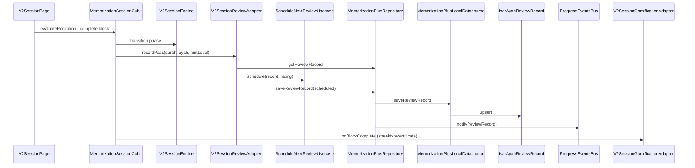

### 8.3 Read chain (Smart Coach / Home)

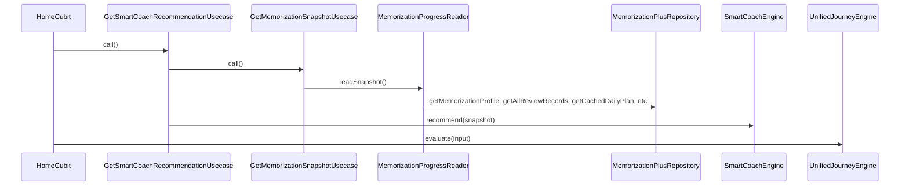

---

## 9. Route Map (Architecture Boundary)

Memorization routes registered in `app_router.dart`:

| Route constant | Path | Page | Guard |
|----------------|------|------|-------|
| `memorizationHub` | `/memorization` | `MemorizationHubPage` | Shell tab |
| `hifz` | `/hifz` | `HifzPage` | `hifzRedirect()` |
| `memorizationPlus` | `/memorization-plus` | `PathSelectionPage` | `entryRedirect()` |
| `memorizationV2Session` | `/memorization-v2/session` | `V2SessionPage` | `v2SessionRedirect()` adult-only |
| `memorizationPlusCustomPlan` | `/memorization-plus/custom-plan` | `CustomPlanSetupPage` | adult-only |
| `memorizationPlusKidsHome` | `/memorization-plus/kids-home` | `KidsGamifiedHomePage` | kids-only |
| `memorizationPlusKids` | `/memorization-plus/kids` | `KidsGamifiedListenPage` | kids-only |
| `memorizationPlusKidsStage` | `/memorization-plus/kids-stage` | `KidsGamifiedStagePage` | kids-only |
| `memorizationPlusKidsCompletion` | `/memorization-plus/kids-completion` | `KidsGamifiedCompletionPage` | kids-only |
| `memorizationPlusKidsJourney` | `/memorization-plus/kids-journey` | `KidsGamifiedJourneyPage` | kids-only |
| `parentDashboard` | `/memorization-plus/parent-dashboard` | `ParentDashboardPage` | auth + not child |
| `memorizationPlusGuardianLinking` | `/memorization-plus/guardian-linking` | `GuardianLinkingPage` | child onboarding |
| `certificate` | `/certificate` | `CertificatePage` | extra: `CertificateAward` |

**Deleted v2 kids pages** (git status): `kids_v2_session_page.dart`, `kids_listen_page.dart`, etc. — replaced by gamified pages.

---

## 10. Source-Tag Policy (Isolation Foundation)

Central policy in `ReviewRecordFilters`:

| `createdByMode` | Adult SRS | Certificates | Kids isolation |
|-----------------|-----------|--------------|----------------|
| `v2Session` | ✅ | ✅ | N/A |
| `hifz` | ✅ (repaired legacy) | ✅ | N/A |
| `kidsMode` | ❌ excluded | ✅ | Kids-only |
| `adultMemPlus` | ❌ (legacy tag) | — | — |
| `migration` / `unknown` | ❌ excluded | ❌ | — |

This is the architectural basis for Kids/Legacy isolation — Phase 4/5/7 will verify runtime enforcement.

---

## 11. Phase 1 Preliminary Observations (Architecture-Level Only)

These are **structural facts** discovered during mapping; severity assessment deferred to later phases.

| # | Observation | Evidence |
|---|-------------|----------|
| 1 | **Dual SRS stores coexist** — `IsarAyahProgress` (legacy) + `IsarAyahReviewRecord` (production) | `injection.dart` L94–96; `HifzMigrationService` |
| 2 | **`HifzCubit` naming mismatch** — uses MemPlus, not HifzRepository | `hifz_cubit.dart` L21 |
| 3 | **Many usecases bypass DI** — identity, FSRS shadow, insights constructed inline | `memorization_plus_usecases.dart`, `MemorizationInsightsAggregator` |
| 4 | **FSRS usecases exist but are not on write path** — SM-2 is production scheduler | `ScheduleNextReviewUsecase` vs `FsrsStateTrackerUsecase` |
| 5 | **`saveKidsProgress` may not emit ProgressEventsBus** — only `saveKidsSessionLog` does | `memorization_plus_repository_impl.dart` L776 vs L912 |
| 6 | **Cloud sync split across Auth + MemPlus** — no single sync orchestrator beyond `AuthCubit` | DI + repository boundaries |
| 7 | **Notifications decoupled from SRS** — no due-count in scheduler | `notification_scheduler.dart` L28–29 |
| 8 | **Deleted v2 kids pages in git** — gamified path is current UI surface | git status |

---

## 12. Phase 1 Completion Checklist

| Requirement | Status | Evidence |
|-------------|--------|----------|
| Repositories mapped | ✅ | §3 |
| UseCases mapped (DI + non-DI) | ✅ | §5 |
| Cubits mapped | ✅ | §6 |
| Services mapped | ✅ | §7 |
| Datasources + Isar + Prefs | ✅ | §2, §4 |
| Supabase touchpoints | ✅ | §2.3 |
| Notification + Scheduler | ✅ | §7.6 |
| Smart Coach chain | ✅ | §7.2 |
| Progress chain | ✅ | §7.3 |
| Certificates | ✅ | `AchievementService`, `/certificate` route |
| Parent + Kids boundaries | ✅ | §10, route guards |
| Legacy Hifz position | ✅ | §3.3, §7.7 |
| Complete dependency graph | ✅ | §8 mermaid diagrams |
| Runtime boot order | ✅ | `main.dart` + `injection.dart` |

---

**Phase 1 is complete.** All findings are traced to actual files and call chains. No code was modified.

Reply when you want **Phase 2 — Runtime Entry Points** (every route, button, notification, deep link, lifecycle hook, and reachability audit).

---

# Production Audit — Phase 2: Runtime Entry Points

**Scope:** Trace every runtime entry into the memorization ecosystem — routes, UI actions, notifications, lifecycle hooks, and scheduled tasks.  
**Method:** Code-only tracing. No modifications.  
**Status:** Phase 2 complete with evidence. Phase 3 not started.

---

## 1. Entry Point Taxonomy

Memorization is entered through **7 channels**:

| Channel | Mechanism | Handler |
|---------|-----------|---------|
| **Cold start** | `main()` → `configureDependencies()` → `HifzMigrationService.runIfNeeded()` | `lib/main.dart` L119–136 |
| **Splash / onboarding** | First-launch routing | `splash_page.dart`, `onboarding_cubit.dart`, `child_onboarding_page.dart` |
| **Bottom navigation** | Tab index 2 → `/memorization` hub | `app_shell.dart` L21–24 |
| **In-app navigation** | `context.go` / `context.push` | 40+ call sites (see §4) |
| **Route guards / redirects** | Profile-aware auto-routing | `MemorizationRouteGuard` in `app_router.dart` |
| **Notifications** | Payload → `AppRouter.router.go(payload)` | `app.dart` L72–74, `notification_service.dart` |
| **Lifecycle resume** | Cloud resync (not navigation) | `app.dart` L54–63, `auth_cubit.dart` L98–100 |

---

## 2. Complete Route Catalog

All memorization-related routes registered in `app_router.dart`:

| Route | Path | Page | Guard | Shell? |
|-------|------|------|-------|--------|
| `memorizationHub` | `/memorization` | `MemorizationHubPage` | None | ✅ Tab branch |
| `hifz` | `/hifz` | `HifzPage` | `hifzRedirect()` | ✅ Same branch as hub |
| `memorizationPlus` | `/memorization-plus` | `PathSelectionPage` | `entryRedirect()` | Full-screen |
| `memorizationV2Session` | `/memorization-v2/session` | `V2SessionPage` | `v2SessionRedirect()` adult-only | Full-screen |
| `memorizationPlusCustomPlan` | `/memorization-plus/custom-plan` | `CustomPlanSetupPage` | `adultOnlyRedirect()` | Full-screen |
| `memorizationPlusGuardianLinking` | `/memorization-plus/guardian-linking` | `GuardianLinkingPage` | Child onboarding only | Full-screen |
| `memorizationPlusKidsHome` | `/memorization-plus/kids-home` | `KidsGamifiedHomePage` | `kidsOnlyRedirect()` | Full-screen |
| `memorizationPlusKidsJourney` | `/memorization-plus/kids-journey` | `KidsGamifiedJourneyPage` | `kidsOnlyRedirect()` | Full-screen |
| `memorizationPlusKidsStage` | `/memorization-plus/kids-stage` | `KidsGamifiedStagePage` | `kidsOnlyRedirect()` | Full-screen |
| `memorizationPlusKids` | `/memorization-plus/kids` | `KidsGamifiedListenPage` | `kidsOnlyRedirect()` | Full-screen |
| `memorizationPlusKidsCompletion` | `/memorization-plus/kids-completion` | `KidsGamifiedCompletionPage` | `kidsOnlyRedirect()` | Full-screen |
| `memorizationPlusKidsQuran` | `/memorization-plus/kids-quran` | `KidsQuranReaderPage` | `kidsOnlyRedirect()` | Full-screen |
| `parentDashboard` | `/memorization-plus/parent-dashboard` | `ParentDashboardPage` | Auth + not child | Full-screen |
| `certificate` | `/certificate` | `CertificatePage` | Requires `extra: award` | Full-screen |
| `qcfRenderingPoc` | `/debug/qcf-rendering-poc` | `QcfRenderingPocPage` | **`kDebugMode` only** | Full-screen |

**Deleted routes (git status):** `kids_v2_session_page`, `kids_listen_page`, `kids_try_remember_page`, `kids_completion_page`, `surah_detail_page` — **no longer registered** in `app_router.dart`.

### Route guard behavior (evidence)

```139:209:lib/core/router/app_router.dart
  static Future<String?> entryRedirect() async {
    // child → kids-home; adult → MemorizationNavigationResolver.adultEntryLocation()
  }
  static Future<String?> v2SessionRedirect() async {
    // child → kids-home; else proceed
  }
  static Future<String?> hifzRedirect() async {
    // child → kids-home; no path → memorization-plus; else allow /hifz
  }
```

**Navigation resolver** centralizes target URLs:

```161:166:lib/features/memorization_plus/presentation/navigation/memorization_navigation_resolver.dart
  static String _v2SessionLocation(int? surahId, {int startAyah = 1}) {
    if (!_isValidSurahId(surahId)) return AppRoutes.memorizationPlusCustomPlan;
    return Uri(path: AppRoutes.memorizationV2Session, queryParameters: {...}).toString();
  }
```

---

## 3. Runtime Flow Diagrams

### 3.1 Adult memorization — primary path

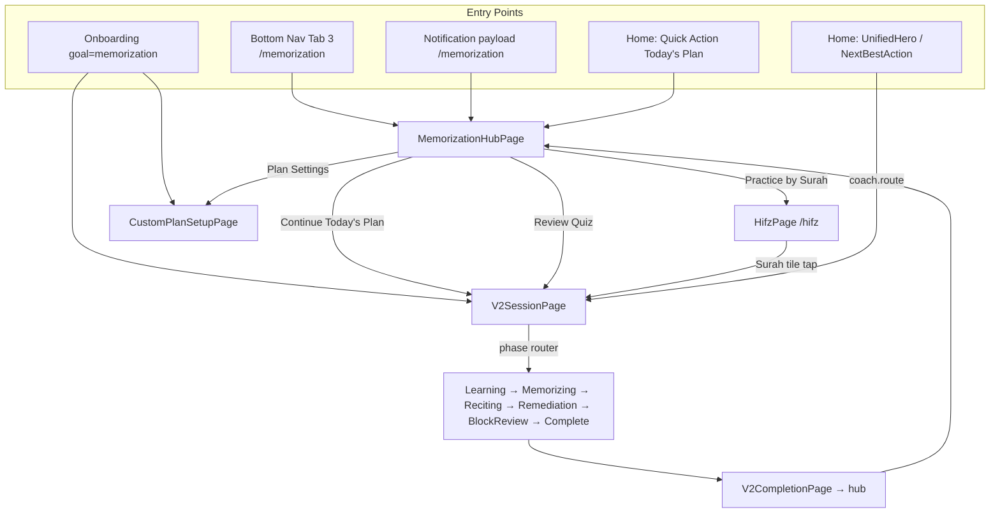

### 3.2 Kids memorization path

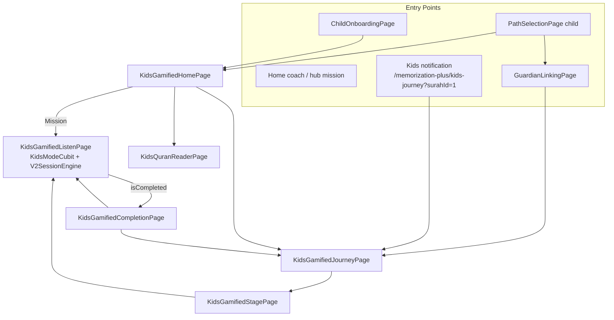

### 3.3 Parent mode path

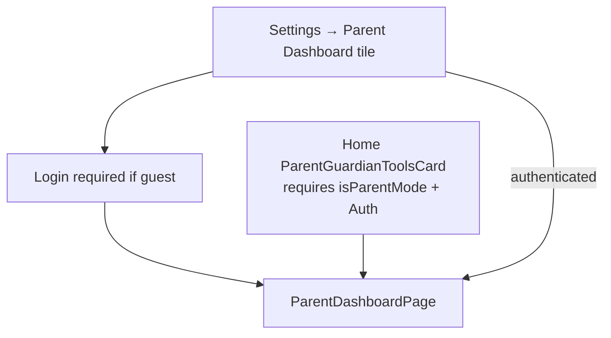

---

## 4. UI Button / Navigation Trace (Every Memorization Tap)

### 4.1 Bottom navigation

| UI | Action | Destination | File |
|----|--------|-------------|------|
| Tab "Memorization" (index 2) | `goBranch(2)` | `/memorization` hub | `app_shell.dart` L21–24, L29–35 |

**Note:** `/hifz` is **not** a bottom-nav target. It lives in the same shell branch but is only reached via `context.push`/`go`.

### 4.2 Home page

| Widget | Trigger | Destination | File |
|--------|---------|-------------|------|
| `UnifiedHeroActionCard` | `onTap` | `action.route` (coach/resume/backlog) | `home_page.dart` L190 |
| `_ResumeSessionCard` | Resume button | Normalized location (hifz→v2 for adults) | `home_page_widgets.dart` L1091 |
| `_NextBestActionCard` | Tap | Coach route OR `/memorization` hub | `home_page_widgets.dart` L1313 |
| `_QuickActionsGrid` "Today's Plan" | Tap | `/memorization` hub | L595 |
| `_ParentGuardianToolsCard` | Button | `parentDashboardLocation()` | L704–708 |
| Certificate chip | Tap | `/certificate` or `/progress` | L245–255 |
| `_DailyWirdCard` | Tap | `/quran/page/{n}` (reading, not memorization) | — |

**Home priority when unified journey enabled** (`JourneyFeatureFlags.unifiedJourneyEnabled = true`):

```173:230:lib/features/home/presentation/pages/home_page.dart
if (unifiedJourneyEnabled && heroAction != null) → UnifiedHeroActionCard
else if (lastRestorableLocation != null) → Resume card
else → NextBestActionCard (Smart Coach fallback)
```

### 4.3 Memorization Hub (`MemorizationHubPage`)

**Adult profile:**

| Card | Route | Resolver |
|------|-------|----------|
| Continue Today's Plan | `todayPlanLocation` → V2 session | `_v2SessionLocation(cachedPlanSurahId)` |
| Practice by Surah | `AppRoutes.hifz` | Static |
| Review Quiz | `reviewQuizLocation` → V2 session | `_v2SessionLocation(quizSurahId)` via `GetLastReviewedSurahIdUseCase` |
| Plan Settings | `memorizationPlusCustomPlan` | Static |

**Child profile:**

| Card | Route |
|------|-------|
| Current Mission | `memorizationPlusKidsHome` (no surahId → defaults to 1) |
| Journey | `kidsJourneyLocation` |
| Rewards / Progress | `AppRoutes.progress` |

**No path selected:** Both cards → `/memorization-plus` path selection.

All hub cards use `context.push(route)` — `memorization_hub_page.dart` L391.

### 4.4 Hifz page (`HifzPage`)

| UI | Action | Destination |
|----|--------|-------------|
| Surah tile (unlocked) | Tap | `/memorization-v2/session?surahId={id}&startAyah=1` | L245 |
| `_MemPlusBanner` | Tap | `context.go(memorizationHub)` | L372 |
| Path settings icon | Sheet | Reset path → `memorizationPlus` | `memorization_path_settings_sheet.dart` |

**Router guard:** Child profiles redirected to kids-home before page renders (`hifzRedirect`).

### 4.5 V2 Session (`V2SessionPage`)

No external routes — **internal phase router only**:

```97:111:lib/features/memorization_plus/presentation/pages/v2_session_page.dart
switch (state.sessionState.phase) {
  created/learning → V2LearningPage
  memorizing → V2MemorizingPage
  reciting → V2RecitationPage
  remediation → V2RemediationPage
  blockReviewPending → V2BlockReviewPendingPage
  blockReview → V2BlockReviewPage
  completed → V2CompletionPage
}
```

Exit: `V2CompletionPage` → `context.go(memorizationHub)` (`v2_completion_page.dart` L66).

### 4.6 Kids session chain

| Step | Page | Navigation |
|------|------|------------|
| Home | `KidsGamifiedHomePage` | Mission → `/memorization-plus/kids?surahId&ayahNumber` L106–108 |
| Listen | `KidsGamifiedListenPage` | Completion on `isCompleted` → kids-completion L107–112 |
| Completion | `KidsGamifiedCompletionPage` | Next ayah → kids listen; Done → journey L91–98 |

**Shared engine:** `KidsModeCubit` uses `V2SessionEngine` + `V2SessionReviewAdapter` with `createdByMode: kidsMode`.

### 4.7 Onboarding / identity

| Flow | Trigger | Destination |
|------|---------|-------------|
| Splash | First launch done | `/onboarding` or `/` | `splash_page.dart` L43 |
| Onboarding adult + memorization | `complete()` | `adultEntryLocation()` → V2 or custom plan | `onboarding_cubit.dart` L143–153 |
| Onboarding adult + smartReview | `complete()` | `memorizationPlusCustomPlan` | L156–158 |
| Onboarding child | `complete()` | `childOnboarding` or login | L125–129 |
| Path selection adult | Identity success | `adultEntryLocation()` | `path_selection_page.dart` L47–48 |
| Path selection child (auth) | Identity success | Guardian linking | L52–54 |
| Path selection child (guest) | Identity success | Kids home | L54 |
| Child onboarding | Start button | `childOnboardingLocation()` | `child_onboarding_page.dart` L47–53 |
| Settings no path | Tile tap | `/memorization-plus` | `settings_page_tiles.dart` L212 |
| Login post-auth child | Redirect | Guardian linking | `login_page.dart` L88–91 |

### 4.8 Settings / certificates

| UI | Destination |
|----|-------------|
| Parent Dashboard tile | Login if guest, else `parentDashboardLocation()` | `settings_page_tiles.dart` L292–300 |
| Progress certificate card | `/certificate` with award extra | `progress_certificates.dart` L162–172 |

---

## 5. Notification Entry Points

**Tap handler chain:**

```
TaliaNotificationService._onNotificationTapped
  → onPayloadReceived(payload)
  → app.dart _openNotification → AppRouter.router.go(payload)
```

Also on cold start: `takePendingLaunchPayload()` in post-frame callback (`app.dart` L37–41).

### Memorization-related notification payloads

| Notification | Payload | Scheduled by | Issue |
|--------------|---------|--------------|-------|
| Daily review reminder | `/memorization` | `NotificationScheduler.refreshNotifications` | Generic hub only |
| Streak protection | `/memorization` | Same (when review disabled) | L209 |
| Streak alert (smart) | `/memorization` | `scheduleStreakAlert` | L476 |
| Smart reminder | `/memorization` | `scheduleSmartReminder` | **Never called** |
| Kids review reminder | `/memorization-plus/kids-journey?surahId=1` | `refreshNotifications` if enabled | **Hardcoded surahId=1** L360 |
| Daily ayah | `/quran` | Scheduler | Not memorization |
| Morning/evening azkar | `/azkar/morning`, `/azkar/evening` | Scheduler | Not memorization |

**Scheduler lifecycle:**
- First launch: `main.dart` L145–174 schedules all notifications once
- Every app resume: `app.dart` L59 → `NotificationScheduler.refreshNotifications`

---

## 6. Lifecycle Hooks (Non-Navigation)

| Hook | Location | Memorization effect |
|------|----------|---------------------|
| App start | `main.dart` L135 | `HifzMigrationService.runIfNeeded()` |
| App start | `injection.dart` L107–116 | Prefs→Isar migrations |
| Route change | `app.dart` L36–37, L77–80 | `AppSessionService.saveLocation()` for resume |
| App resume | `app.dart` L55–63 | Notification refresh + `AuthCubit.resyncOnResume()` |
| Auth login | `auth_cubit.dart` L26–27, L43–44 | Cloud pull + `resyncProductionDataToCloud()` |
| Home tab focus | `home_page.dart` L69–71, L97–100 | `HomeCubit.load()` refresh |
| Home progress bus | `home_cubit.dart` | Debounced reload on `ProgressEventsBus` |

**Restorable locations** (`app_session_service.dart` L33–48):
- `/memorization-v2/session?surahId=…`
- `/memorization-plus/kids?surahId&ayahNumber`
- `/memorization-plus/kids-journey?surahId=…`
- `/memorization-plus/parent-dashboard?surahId=…`

Used by Smart Coach P7 (`continueV2Session`) and Home resume card.

---

## 7. Scheduled Tasks

| Task | Trigger | Navigation? | Reachable? |
|------|---------|-------------|------------|
| Daily review notification | Cron via `flutter_local_notifications` | → `/memorization` | ✅ |
| Streak protection notification | Cron | → `/memorization` | ✅ |
| Kids review notification | Cron (opt-in, default off) | → kids-journey surah 1 | ⚠️ Partial |
| Smart reminder | `scheduleSmartReminder()` | → `/memorization` | ❌ **Never scheduled** |
| Hifz migration | Every app start (no-op after done) | None | ✅ Background |
| Cloud resync | Login + resume | None | ✅ Background |

**Evidence — `scheduleSmartReminder` has zero callers outside its definition:**

```
grep scheduleSmartReminder → notification_scheduler.dart, notification_service.dart only
```

---

## 8. Reachability Matrix

| Feature / Flow | Reachable? | Entry evidence |
|----------------|------------|----------------|
| Memorization Hub | ✅ | Bottom nav tab 2 |
| Adult V2 session (all phases) | ✅ | Hub, Hifz, Home coach, onboarding |
| Daily plan via V2 | ✅ | Hub "Today's Plan", coach `continueDailyPlan` |
| Hifz surah picker | ✅ | Hub → `/hifz` (not bottom nav direct) |
| "Review Quiz" | ✅* | Hub → V2 session (*not a separate quiz UI) |
| Custom plan setup | ✅ | Hub settings, onboarding smartReview, resolver fallback |
| Path selection | ✅ | Hub no-path, settings, `/memorization-plus` redirect |
| Kids home → listen → complete | ✅ | Full chain traced |
| Kids journey / stages | ✅ | Hub, home, notifications |
| Kids Quran reader | ✅ | Kids home mushaf button |
| Guardian linking | ✅ | Path selection (auth child), login redirect |
| Parent dashboard | ✅ | Settings + Home parent card (auth required) |
| Certificates view | ✅ | Progress cards, Home chip → `/certificate` |
| Smart Coach recommendations | ✅ | Home NextBestAction / UnifiedHero |
| Unified Journey hero | ✅ | `JourneyFeatureFlags.unifiedJourneyEnabled = true` |
| Session resume | ✅ | Home resume card + coach continueV2Session |
| Legacy Hifz migration | ✅ | Background at startup |
| Cloud sync | ✅ | Auth lifecycle (no UI) |

---

## 9. Unreachable / Disconnected Features (Phase 2 Findings)

### 🟠 High — Implemented but unreachable or mislabeled

#### F2-01: `QuizCubit` / dedicated Review Quiz UI does not exist

| Field | Value |
|-------|-------|
| **Severity** | 🟠 High |
| **Impact** | Hub labels "Review Quiz" but opens V2 memorization session — no quiz-specific UI or logic |
| **Evidence** | `grep QuizCubit` → only comment in `review_record_filters.dart` L37; hub card routes to `reviewQuizLocation` = `_v2SessionLocation` (`memorization_navigation_resolver.dart` L124–128, L161–166) |
| **Call chain** | Hub card → `context.push(reviewQuizLocation)` → `V2SessionPage` |
| **Root cause** | Quiz feature removed or never built; label retained |
| **Recommended fix** | Rename UI copy OR implement quiz flow (Phase 3 will verify V2 covers review intent) |
| **Priority** | P1 before release messaging audit |

#### F2-02: `showCertificateCelebrationDialog` never invoked

| Field | Value |
|-------|-------|
| **Severity** | 🟠 High |
| **Impact** | Certificate celebration dialog fully implemented but never shown on earn |
| **Evidence** | `grep showCertificateCelebrationDialog` → definition only in `certificate_celebration_dialog.dart`; `AchievementService` sets `has_new_certificate` flag but no UI reads it for dialog |
| **Call chain** | `V2SessionGamificationAdapter` → `AchievementService` → (no dialog trigger) |
| **Root cause** | Missing wiring from certificate earn to presentation |
| **Recommended fix** | Invoke dialog from session completion or listen to `ProgressChangedReason.certificate` |
| **Priority** | P1 UX gap |

#### F2-03: `SmartCoachRecommendationKind.hifzReviewDue` — dead enum branch

| Field | Value |
|-------|-------|
| **Severity** | 🟡 Medium |
| **Impact** | UI switch handles a coach kind the engine never emits |
| **Evidence** | Enum: `smart_coach_recommendation.dart` L13; UI: `home_page_widgets.dart` L1262–1268; Engine: `smart_coach_engine.dart` — **no `hifzReviewDue` emission** |
| **Call chain** | `SmartCoachEngine.recommend()` → never returns this kind |
| **Root cause** | Legacy Hifz coach path removed from engine, UI not cleaned |
| **Priority** | P2 |

### 🟡 Medium — Partial reachability / weak deep links

#### F2-04: `scheduleSmartReminder()` never scheduled

| Field | Value |
|-------|-------|
| **Severity** | 🟡 Medium |
| **Impact** | Smart reminder notification code exists but is dead at runtime |
| **Evidence** | Defined `notification_scheduler.dart` L108; zero call sites in `main.dart`, `app.dart`, settings |
| **Priority** | P2 |

#### F2-05: Kids notification hardcodes `surahId=1`

| Field | Value |
|-------|-------|
| **Severity** | 🟡 Medium |
| **Impact** | Child memorizing another surah lands on wrong journey |
| **Evidence** | `notification_service.dart` L360: `payload: '/memorization-plus/kids-journey?surahId=1'` |
| **Priority** | P2 |

#### F2-06: Unified Journey P2 critical alerts — `learningAlertRoute` never set

| Field | Value |
|-------|-------|
| **Severity** | 🟡 Medium |
| **Impact** | Critical overload/leech alerts route to generic `/memorization` fallback |
| **Evidence** | `UnifiedJourneyEngine` L22–24 uses `input.learningAlertRoute ?? '/memorization'`; `HomeCubit._evaluateUnifiedAction` builds `UnifiedJourneyInput` **without** `learningAlertRoute` or `hasHighPriorityLearningAlert` (`home_cubit.dart` L216–235) |
| **Priority** | P2 |

#### F2-07: `/hifz` not directly on bottom nav

| Field | Value |
|-------|-------|
| **Severity** | 🟢 Low |
| **Impact** | Surah picker requires hub intermediate step (by design, not bug) |
| **Evidence** | `app_shell.dart` routes to `memorizationHub`; `/hifz` sibling in branch |
| **Priority** | P3 — document UX |

### 🟢 Low — Debug / deleted

#### F2-08: Deleted V2 kids pages — correctly unreachable

| Field | Value |
|-------|-------|
| **Severity** | 🟢 Low (expected) |
| **Evidence** | Git deletes `kids_v2_session_page.dart` etc.; replaced by gamified pages; no router entries |
| **Priority** | None |

#### F2-09: `QcfRenderingPocPage` — debug-only

| Field | Value |
|-------|-------|
| **Severity** | 🟢 Low |
| **Evidence** | `app_router.dart` L283–288: `if (kDebugMode)` only |
| **Priority** | None |

#### F2-10: Memorization Insights report — no dedicated UI page

| Field | Value |
|-------|-------|
| **Severity** | 🟡 Medium |
| **Impact** | FSRS analytics, leech analysis, workload insights computed but only feed Unified Journey inputs — no insights screen |
| **Evidence** | `MemorizationInsightsAggregator` used in `home_cubit.dart` L203–207; Home quick action "Progress" goes to progress tab, not insights |
| **Priority** | P2 (Phase 11 will confirm if fully hidden) |

---

## 10. Phase 2 Answers

### Can every memorization flow actually be reached?

**Yes, for all primary production flows:**

- Adult memorization (V2 session all phases) ✅
- Daily plan continuation ✅
- Surah selection (via Hifz page) ✅
- Kids full journey ✅
- Parent dashboard ✅ (with auth)
- Custom plan setup ✅
- Path selection / onboarding ✅
- Smart Coach driven entry ✅
- Session resume ✅
- Certificates view ✅

**With caveats:**
- "Review Quiz" is reachable but **is V2 session, not a quiz**
- Certificate **celebration dialog** is not reachable
- Smart reminder notification is not scheduled
- Kids notification may open wrong surah

### Is any feature implemented but unreachable?

**Yes — confirmed:**

| Feature | Status |
|---------|--------|
| `CertificateCelebrationDialog` | Implemented, never shown |
| `scheduleSmartReminder` notification | Implemented, never scheduled |
| `SmartCoachRecommendationKind.hifzReviewDue` | UI ready, engine never emits |
| Dedicated `QuizCubit` / quiz page | Referenced in comments only; does not exist |
| Deleted V2 kids pages | Correctly removed from routes |
| FSRS shadow usecases | Not on navigation path (analytics-only, Phase 6) |

---

## 11. Phase 2 Completion Checklist

| Requirement | Status |
|-------------|--------|
| All routes traced | ✅ §2 |
| All buttons traced | ✅ §4 |
| All navigation traced | ✅ §3–4 |
| Notifications traced | ✅ §5 |
| Deep links traced | ✅ §5 (payload-based) |
| Callbacks traced | ✅ §4, §6 |
| Lifecycle hooks traced | ✅ §6 |
| Scheduled tasks traced | ✅ §7 |
| Reachability answered | ✅ §8–10 |
| Evidence with files/lines | ✅ |

---

**Phase 2 is complete.** No code was modified.

Reply when you want **Phase 3 — Adult Memorization Flow Audit** (full trace from surah selection through SRS, progress, certificates, cloud sync, and parent dashboard).

---

# Production Audit — Phase 3: Adult Memorization Flow

**Scope:** End-to-end trace of the adult memorization pipeline from surah selection through cloud sync.  
**Method:** Code-only. No modifications.  
**Status:** Phase 3 complete with evidence.

---

## 1. Flow Overview

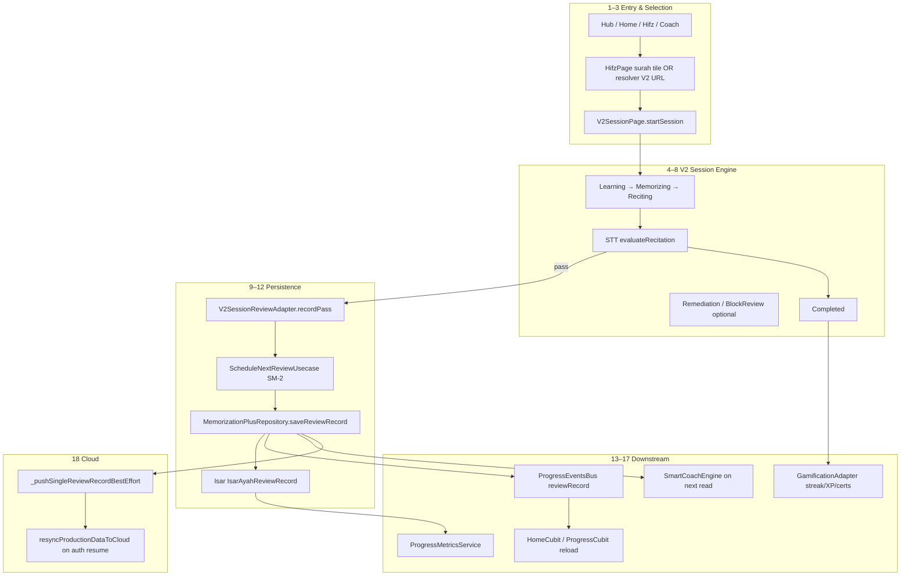

---

## 2. Step-by-Step Trace

### Step 1 — Select Surah

| Layer | Detail |
|-------|--------|
| **UI** | `HifzPage` → `_HifzSurahTile.onTap` |
| **Caller** | `context.push('/memorization-v2/session?surahId={id}&startAyah=1')` |
| **Alt entry** | Hub “Today's Plan” / “Review Quiz” → `MemorizationNavigationResolver._v2SessionLocation(surahId)` |
| **Repository** | `HifzCubit` → `GetSurahsUsecase`, `MemorizationPlusRepository.getMemorizationProfile()` |
| **Storage** | Profile in SharedPreferences (`mem_plus_profile`) |
| **Evidence** | `hifz_page.dart` L245; `hifz_cubit.dart` L24–44 |

**Unlock rules:** `hifz_unlock_rules.dart` defines `buildUnlockedSurahIds`, but `HifzLoaded.isSurahUnlocked` **always returns `true`**:

```26:26:lib/features/hifz/presentation/cubits/hifz_state.dart
  bool isSurahUnlocked(int surahId) => true;
```

Surah progression lock UI exists (`hifz_page.dart` L237–243) but is **never enforced** in state.

---

### Step 2 — Choose Ayahs (Block)

| Layer | Detail |
|-------|--------|
| **UI** | No ayah picker — block defined by URL params |
| **Caller** | `V2SessionPage(surahId, startAyah, blockSize=5)` |
| **Logic** | `MemorizationSessionCubit.startSession` slices `allAyahs.sublist(startIndex, endIndex)` |
| **Defaults** | `blockSize=5`, `startAyah=1` unless query param set |
| **Resume** | `V2SessionProgressAdapter.loadIfExists` → restore from `IsarV2Session` |
| **Storage** | Session resume: Isar `IsarV2Session` (one per surah) |
| **Evidence** | `memorization_session_cubit.dart` L219–309; `app_router.dart` L549–568 |

**Gap:** Hub “Today's Plan” routes to V2 with **`startAyah=1` always** (`memorization_navigation_resolver.dart` L161–166), not the first pending daily-plan ayah. Smart Coach `memorizeNewAyahs` **does** use `pendingNew.first.ayahNumber` (`smart_coach_engine.dart` L138–146).

---

### Step 3 — Start Session

| Layer | Detail |
|-------|--------|
| **UI** | `V2SessionPage` creates `MemorizationSessionCubit` |
| **Caller** | `..startSession(surahId, startAyah, blockSize)` |
| **Engine** | `V2SessionEngine.startLearning` → phase `learning` |
| **Profile read** | `blockReviewRequired` from `MemorizationProfile.isBlockReviewRequired` |
| **Quran data** | `QuranRepository.getSurahDetail(surahId)` |
| **Evidence** | `v2_session_page.dart` L50–57; `memorization_session_cubit.dart` L226–292 |

**Phase UI chain:**

| Phase | Widget | User action → Cubit method |
|-------|--------|---------------------------|
| `learning` | `V2LearningPage` | `advanceToMemorizing()` |
| `memorizing` | `V2MemorizingPage` | `advanceToReciting()`, `useHint()` |
| `reciting` | `V2RecitationPage` | `startRecording()` / `stopRecording()` |
| `remediation` | `V2RemediationPage` | `completeRemediation()` |
| `blockReviewPending` | `V2BlockReviewPendingPage` | `startBlockReview()` |
| `blockReview` | `V2BlockReviewPage` | STT evaluate |
| `completed` | `V2CompletionPage` | Exit to hub |

---

### Step 4 — Complete Ayah (Recitation Pass)

| Layer | Detail |
|-------|--------|
| **UI** | `V2RecitationPage` → stop recording |
| **Caller** | `MemorizationSessionCubit.stopRecording` → `_evaluateCurrentRecitation` |
| **Engine** | `V2SessionEngine.evaluateRecitation` → `V2RecitationEvaluator` |
| **On pass** | Advance to next ayah (`learning`) or `blockReviewPending` / `completed` |
| **On fail** | `remediation` phase, `V2AyahFailureTracker.recordFailure` |
| **Evidence** | `session_engine.dart` L76–96, L158–179; `memorization_session_cubit.dart` L414–510 |

**No-attempt:** Empty STT text returns unchanged state — no penalty (`session_engine.dart` L84–87).

---

### Step 5 — Record Review

| Layer | Detail |
|-------|--------|
| **Trigger** | Individual recitation pass only (`previousState.phase == reciting`) |
| **Caller** | `MemorizationSessionCubit._handlePostEvaluation` L519–531 |
| **Adapter** | `V2SessionReviewAdapter.recordPass(surahId, ayahNumber, hintLevel)` |
| **Rating map** | `none→excellent`, `firstWord→average`, `fullAyah→weak` |
| **Source tag** | `createdByMode: v2Session` (default) |
| **Evidence** | `session_adapters.dart` L50–92 |

**Not recorded on:**
- Block review pass (only weak ayahs re-recorded via `recordWeakAyahs`)
- Failed recitations
- Learning/memorizing phases

**Block complete side effect:**

```546:551:lib/features/memorization_plus/presentation/cubits/memorization_session_cubit.dart
  await _reviewAdapter.recordWeakAyahs(finalState.failureTracker);
  final awards = await _gamificationAdapter.onBlockCompleted(finalState);
```

---

### Step 6 — Strength Update

| Layer | Detail |
|-------|--------|
| **Logic** | `ScheduleNextReviewUsecase.schedule()` SM-2 |
| **Excellent** | `strengthLevel + 1` (clamp 0–10) |
| **Average** | unchanged |
| **Weak** | `strengthLevel - 1`, `lapses + 1` |
| **Memorized threshold** | `strengthLevel >= 6` (`ReviewRecordFilters.isMemorized`) |
| **Evidence** | `memorization_plus_usecases.dart` L173–200; `review_record_filters.dart` L135 |

**First excellent pass:** strength 0→1, `totalReviews` 1 — **not yet “memorized”** for progress/certificates until strength ≥ 6 across reviews.

---

### Step 7 — Interval Update

| Layer | Detail |
|-------|--------|
| **Logic** | SM-2 with overdue compensation + fuzz |
| **Fields updated** | `intervalDays`, `easeFactor`, `nextReviewDate`, `lastReviewedAt`, `totalReviews`, `lastRating` |
| **UTC** | All scheduling dates UTC (`memorization_plus_usecases.dart` L154–155) |
| **Evidence** | `ScheduleNextReviewUsecase.schedule` L161–210 |

**FSRS shadow fields** (`difficulty`, `stability`, `reviewState`, predictions): defined in `FsrsStateTrackerUsecase` / `FsrsPredictionUsecase` but **never called on write path** — dead on runtime persistence.

---

### Step 8 — Next Review / Classification

| Layer | Detail |
|-------|--------|
| **Storage** | `nextReviewDate` on `IsarAyahReviewRecord` |
| **Classification** | `ReviewClassifier.classify()` via `AyahReviewRecord.reviewClassification` |
| **Due policy** | `ReviewDuePolicy.onOrAfterScheduledTime` |
| **Near/far** | ≤5 days since last review = near; >5 = far (non-memorized) |
| **Memorized due** | `isDue && strengthLevel >= 6` |
| **Evidence** | `review_classification.dart` L35–67; `review_due_evaluator.dart` L14–26 |

---

### Step 9 — Smart Coach (Read Path)

| Layer | Detail |
|-------|--------|
| **Trigger** | Next `HomeCubit.load()` or coach usecase invocation |
| **Chain** | `GetSmartCoachRecommendationUsecase` → `MemorizationProgressReader.readSnapshot()` → `SmartCoachEngine.recommend()` |
| **Data** | All `AyahReviewRecord` + cached daily plan + custom plan |
| **Filter** | `ReviewRecordFilters.isAdultCompatible` (v2Session + hifz only) |
| **Priorities** | weak due → near due → far due → memorized due → daily plan → continue V2 session |
| **Route** | `_v2SessionRoute(surahId, startAyah)` |
| **Evidence** | `smart_coach_engine.dart` L13–150; `memorization_progress_reader.dart` L28–72 |

**Coach reacts to writes via:** `ProgressEventsBus.reviewRecord` → `HomeCubit` debounced reload (not synchronous in-session).

---

### Step 10 — Progress

| Layer | Detail |
|-------|--------|
| **Write notify** | `saveReviewRecord` → `_progressEvents.notify(ProgressChangedReason.reviewRecord)` |
| **Progress tab** | `ProgressCubit` listens → `GetProgressUsecase` → `ProgressRepositoryImpl` |
| **Calculator** | `ProgressMetricsService.calculate(audience: adult)` |
| **Metrics** | started, learning, memorized, due, overdue, surah/juz counts |
| **Storage read** | `MemorizationPlusLocalDatasource.getAllReviewRecords()` → Isar |
| **Evidence** | `memorization_plus_repository_impl.dart` L776; `progress_repository_impl.dart`; `progress_metrics_service.dart` |

**Home tab:** Same bus + `GetProgressUsecase` in `HomeCubit.load()`.

---

### Step 11 — Certificates

| Layer | Detail |
|-------|--------|
| **Trigger** | `V2SessionGamificationAdapter.onBlockCompleted` → `AchievementService.checkAndUnlockCertificates()` |
| **Eligibility** | `ProgressAudience.certificates` — `strengthLevel >= 6`, sources `v2Session` \| `hifz` \| `kidsMode` |
| **Storage** | SharedPreferences `earned_certificates_v2` |
| **Notify** | `ProgressChangedReason.certificate` |
| **Cloud** | `pushCertificatesToCloud` best-effort |
| **Evidence** | `session_adapters.dart` L271–284; `achievement_service.dart` L74–227 |

**UI gap:** `MSCompleted` carries `awards` but `V2SessionPage` renders `V2CompletionPage` **without showing awards**:

```92:94:lib/features/memorization_plus/presentation/pages/v2_session_page.dart
          if (state is MSCompleted) {
            return V2CompletionPage(finalState: state.finalState);
          }
```

`awards` from cubit L556 are **discarded in UI**. `showCertificateCelebrationDialog` is never called (Phase 2 F2-02).

---

### Step 12 — Cloud Sync

| Layer | Detail |
|-------|--------|
| **Per-write** | `saveReviewRecord` → `_pushSingleReviewRecordBestEffort` if `createdByMode` is `v2Session` or `kidsMode` |
| **Bulk resync** | `AuthCubit._pushProductionDataToCloud` → `resyncProductionDataToCloud()` on login/resume |
| **Syncs** | Review records (v2/kids), daily plan, certificates |
| **Does NOT sync** | `hifz`-tagged migrated records (`_isProductionReviewRecord` excludes hifz) |
| **Supabase** | RPC `upsert_ayah_review_records`, tables `ayah_review_records_cloud`, `daily_plans_cloud`, `certificate_awards_cloud` |
| **Evidence** | `memorization_plus_repository_impl.dart` L763–776, L1644–1659, L1744–1756 |

---

### Step 13 — Parent Dashboard (Adult Context)

| Layer | Detail |
|-------|--------|
| **Scope** | Parent dashboard is **kids-only** — not adult self-progress |
| **Data** | `getParentDashboard` reads `KidsProgress`, `KidsSessionLogs`, `KidsJourney` |
| **Adult writes** | Do **not** appear on parent dashboard |
| **Evidence** | `memorization_plus_repository_impl.dart` L920–946 |

Adult “Parent Mode” on Home shows guardian tools linking to kids dashboard — correct for child monitoring, not adult SRS mirror.

---

## 3. Daily Plan Sub-Flow (Adult)

| Step | Component | Evidence |
|------|-----------|----------|
| Plan creation | `MemorizationPlusRepository.generateDailyPlan()` | `memorization_plus_repository_impl.dart` L504–673 |
| Auto-regen | `getCachedDailyPlan()` when UTC day changes **and** active adult custom plan exists | L676–703 |
| Plan storage | SharedPreferences `mem_plus_daily_plan` | `memorization_plus_local_datasource.dart` L283–291 |
| Plan buckets | new + near + far + retention (optional) | L558–631 |
| Coach consumption | Smart Coach P5/P6 reads `snapshot.cachedDailyPlan` | `smart_coach_engine.dart` L108–147 |
| Completion tracking | `DailyPlan.withCompleted(int ayahNumber)` | `memorization_entities.dart` L337–347 |

**Critical:** `withCompleted` is **never called anywhere in `lib/`** (grep confirms definition only). Plans always generate with `completedAyahNums: const []` (L640, L662). Smart Coach `continueDailyPlan` / `requiredCompletedCount` **never advance** after session work.

**Daily plan requires active adult custom plan** — without it, `getCachedDailyPlan()` returns `null` (L689–690). Users practicing via Hifz-only path get **no daily plan object**.

---

## 4. Custom Plan Sub-Flow

| Step | Component |
|------|-----------|
| UI | `CustomPlanSetupPage` → `CustomPlanCubit.savePlan` |
| Write | `MemorizationPlusRepository.saveCustomPlan` |
| Side effect | Clears daily plan cache on save (`clearDailyPlanCache`) L1582–1589 |
| Navigation after save | `context.go(memorizationHub)` L366 |

Custom plan drives `generateDailyPlan` surah range, direction, new/revision limits.

---

## 5. Gamification Sub-Flow (Block Complete)

| Service | Call | Storage | Works? |
|---------|------|---------|--------|
| `StreakService.recordActivity(activityDelta: blockSize)` | `_gamificationAdapter` L276 | Isar Streak + DailyActivity | ✅ |
| `XpService.addXp('v2_block_completed')` | L279 | Isar Xp | ❌ **0 XP** — key missing from `XpConstants.rewards` |
| `AchievementService.checkAndUnlockCertificates()` | L284 | SharedPreferences | ✅ logic; UI not shown |

```18:28:lib/core/constants/xp_constants.dart
  static const Map<String, int> rewards = {
    'ayah_memorized': 10,
    'page_completed': 50,
    // ... no 'v2_block_completed'
  };
```

```15:16:lib/core/services/xp_service.dart
    final points = XpConstants.rewards[eventKey] ?? 0;
    if (points == 0) return const XpGainResult.zero();
```

---

## 6. State Machine (V2 Session)

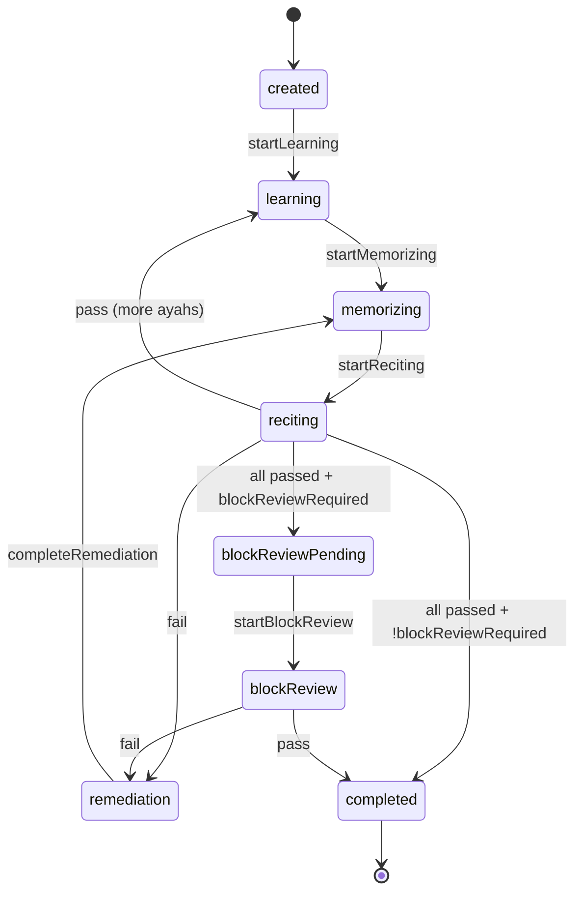

**Verified transitions** match `V2SessionEngine` — no impossible engine transitions found.

**Resume guard:** `completed` and `created` phases not restored (`memorization_session_cubit.dart` L254–257) — prevents double gamification.

---

## 7. Phase 3 Findings

### 🔴 Critical

#### F3-01 — Daily plan completion never persisted

| Field | Value |
|-------|-------|
| **Severity** | 🔴 Critical |
| **Impact** | “Continue today's plan”, plan progress %, and `requiredCompletedCount` are permanently stale; coach daily-plan priorities mislead users |
| **Evidence** | `DailyPlan.withCompleted()` only defined in `memorization_entities.dart` L337; zero call sites; `generateDailyPlan` always sets `completedAyahNums: []` |
| **Call chain** | Session pass → `saveReviewRecord` only; **no** `saveDailyPlan(withCompleted(...))` |
| **Root cause** | Missing link between V2 session ayah pass and daily plan cache update |
| **Recommended fix** | On `recordPass`, mark matching plan ayah complete and `saveDailyPlan` |
| **Priority** | P0 production blocker for Daily Plan feature |

---

### 🟠 High

#### F3-02 — V2 block completion awards 0 XP

| Field | Value |
|-------|-------|
| **Severity** | 🟠 High |
| **Impact** | Adult sessions never grant XP despite gamification adapter call |
| **Evidence** | `session_adapters.dart` L279 `'v2_block_completed'`; absent from `XpConstants.rewards` |
| **Call chain** | `_onBlockCompleted` → `V2SessionGamificationAdapter.onBlockCompleted` → `XpService.addXp` → early return 0 |
| **Root cause** | Event key not registered |
| **Priority** | P1 |

#### F3-03 — Certificate awards discarded at session end

| Field | Value |
|-------|-------|
| **Severity** | 🟠 High |
| **Impact** | User completes block, certificates may unlock, but UI shows generic completion only |
| **Evidence** | `MSCompleted.awards` populated L556; `V2SessionPage` L92–94 ignores `awards` |
| **Priority** | P1 |

#### F3-04 — Surah unlock rules not enforced

| Field | Value |
|-------|-------|
| **Severity** | 🟠 High |
| **Impact** | Sequential surah progression (`buildUnlockedSurahIds`) is dead; all surahs always unlocked |
| **Evidence** | `hifz_state.dart` L26 `isSurahUnlocked => true`; `buildUnlockedSurahIds` never called from cubit |
| **Priority** | P1 for product intent |

#### F3-05 — Daily plan requires custom plan; Hifz-only path has no plan

| Field | Value |
|-------|-------|
| **Severity** | 🟠 High |
| **Impact** | Users who memorize via surah picker without custom plan get `null` daily plan; coach P5/P6 inactive |
| **Evidence** | `getCachedDailyPlan` L689–690 returns null without active adult custom plan |
| **Priority** | P1 — clarify product requirement |

#### F3-06 — Hub “Today's Plan” ignores pending ayah numbers

| Field | Value |
|-------|-------|
| **Severity** | 🟠 High |
| **Impact** | Hub opens V2 at `startAyah=1` while coach opens at correct pending ayah |
| **Evidence** | `_v2SessionLocation(surahId)` default `startAyah=1` L161–166 vs coach L142 `pendingNew.first.ayahNumber` |
| **Priority** | P1 |

---

### 🟡 Medium

#### F3-07 — “Review Quiz” is V2 session, not quiz

| Field | Value |
|-------|-------|
| **Severity** | 🟡 Medium |
| **Impact** | Mislabeled feature; no separate quiz engine (Phase 2 F2-01 confirmed) |
| **Evidence** | Hub `reviewQuizLocation` → `_v2SessionLocation` |
| **Priority** | P2 |

#### F3-08 — Migrated `hifz` records excluded from cloud sync

| Field | Value |
|-------|-------|
| **Severity** | 🟡 Medium |
| **Impact** | Legacy migrated data counts locally but won't push to Supabase |
| **Evidence** | `_isProductionReviewRecord` L1644–1646 — only `v2Session` \| `kidsMode` |
| **Priority** | P2 |

#### F3-09 — FSRS shadow fields never written at runtime

| Field | Value |
|-------|-------|
| **Severity** | 🟡 Medium |
| **Impact** | Isar FSRS columns exist; analytics-only via insights aggregator |
| **Evidence** | `FsrsStateTrackerUsecase` not in write chain |
| **Priority** | P3 (if FSRS migration planned)

#### F3-10 — `MSCompleted` vs inline `completed` phase double completion UI

| Field | Value |
|-------|-------|
| **Severity** | 🟡 Medium |
| **Impact** | Engine can emit `phase==completed` inside `MSActive` showing `V2CompletionPage` before gamification runs; block-review path emits `MSCompleted` after gamification |
| **Evidence** | `v2_session_page.dart` L107–110 vs L92–94 |
| **Priority** | P2 — verify gamification always runs |

---

### 🟢 Low

#### F3-11 — Parent dashboard correctly kids-only

Not a bug — adult SRS does not feed parent dashboard by design.

#### F3-12 — Duplicate progress calculators eliminated

`ProgressMetricsService` is SSOT — no duplicate adult counting found in write path.

---

## 8. Write → Propagation Matrix (Adult Session)

| After `saveReviewRecord` | Auto-updates? | Mechanism |
|--------------------------|---------------|-----------|
| Home Smart Coach | ✅ (debounced) | `ProgressEventsBus` → `HomeCubit.load()` |
| Progress tab | ✅ (debounced) | `ProgressCubit.load()` |
| Daily plan completion | ❌ | No link |
| Certificates | ✅ on block complete only | `AchievementService` |
| XP | ❌ | Missing event key |
| Streak / heatmap | ✅ on block complete | `StreakService.recordActivity` |
| Cloud | ✅ best-effort | `_pushSingleReviewRecordBestEffort` |
| Parent dashboard | N/A (kids) | — |

---

## 9. Phase 3 Answers

| Question | Answer | Confidence |
|----------|--------|------------|
| Does adult memorization work end-to-end? | **Yes** for V2 session → SRS record → progress/coach read path | High |
| Does review scheduling work? | **Yes** — SM-2 via `ScheduleNextReviewUsecase` on each ayah pass | High |
| Does daily plan work? | **Partially** — generation yes; **completion tracking broken** | High |
| Does progress reflect session work? | **Yes** for review records; strength needs multiple reviews for “memorized” | High |
| Do certificates work? | **Backend yes** (strength ≥ 6); **celebration UI no** | High |
| Does cloud sync work for V2? | **Yes** best-effort for `v2Session` tags | High |
| Is parent dashboard part of adult flow? | **No** — monitors kids only | High |

---

## 10. Phase 3 Completion Checklist

| Step | Traced | Status |
|------|--------|--------|
| Select Surah | ✅ | With unlock dead code noted |
| Choose Ayahs | ✅ | URL params + block slice |
| Start Session | ✅ | Resume via Isar |
| Complete Ayah | ✅ | STT + engine |
| Record Review | ✅ | Per-ayah on reciting pass |
| Strength Update | ✅ | SM-2 |
| Interval Update | ✅ | SM-2 + UTC |
| Next Review | ✅ | Classification |
| Smart Coach | ✅ | Read path |
| Progress | ✅ | Events bus |
| Certificates | ✅ | Logic yes, UI gap |
| Cloud Sync | ✅ | v2Session only |
| Parent Dashboard | ✅ | Kids-only confirmed |

---

**Phase 3 is complete.** No code was modified.

Reply when you want **Phase 4 — Kids Mode Audit**.

---

# Phase 4 — Kids Mode Production Audit

Read-only audit of the kids memorization stack: routing, session engine boundary, completion writes, rewards, progress isolation, parent/remote surfaces, and leakage risks.

---

## 4.1 Architecture & Shared-Engine Boundary

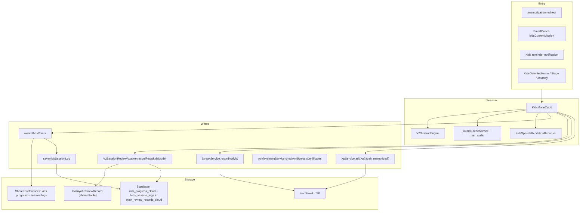

| Concern | Kids | Adult V2 |
|--------|------|----------|
| Session engine | `V2SessionEngine` (learning → memorizing → reciting) | Same |
| SRS writer | `V2SessionReviewAdapter.recordPass(..., kidsMode)` | `... v2Session` |
| Session persistence | **None** — no `V2SessionProgressAdapter` / `IsarV2Session` | Full app-kill resume |
| Recitation gate | STT presence check only; engine pass uses full ayah text | Real STT + hint scoring |
| Gamification store | `KidsProgress` prefs (points/stars/level) | XP/streak only |
| Journey SSOT | `KidsSessionLog` (prefs) | Daily plan + review records |

**DI registration:** `KidsModeCubit` in `injection.dart` gets `V2SessionEngine`, `V2SessionReviewAdapter`, `StreakService`, `XpService`, `AchievementService` — same services as adult path.

---

## 4.2 Entry Points & Route Guards

| Route | Guard | Purpose |
|-------|-------|---------|
| `/memorization` | `entryRedirect()` | Child → kids home |
| `/memorization-v2/session` | `v2SessionRedirect()` | Child blocked |
| `/hifz` | `hifzRedirect()` | Child blocked |
| `/memorization-plus/kids-*` | `kidsOnlyRedirect()` | Adult blocked |
| `/memorization-plus/parent-dashboard` | `parentDashboardRedirect()` | Child blocked; login required |

```157:178:lib/core/router/app_router.dart
  static Future<String?> adultOnlyRedirect() async {
    final profile = await _readProfile();
    return profile?.isChild == true ? AppRoutes.memorizationPlusKidsHome : null;
  }
  // ...
  static Future<String?> kidsOnlyRedirect() async {
    final profile = await _readProfile();
    if (profile == null || profile.isChild) return null;
    return AppRoutes.memorizationPlus;
  }
```

**Navigation flow:**
1. `KidsGamifiedHomePage` → mission card → `/memorization-plus/kids?surahId=&ayahNumber=`
2. `KidsGamifiedStagePage` → `_startMission` → same listen route
3. `KidsGamifiedListenPage` → on complete → `KidsGamifiedCompletionPage` (stars via query param)
4. Smart Coach (child profile): `_kidsRecommendation` → `/memorization-plus/kids-home?surahId=`

**Coach logic** uses `KidsSessionLog` + optional child custom plan — not SRS due items:

```173:195:lib/core/memorization/smart_coach_engine.dart
  SmartCoachRecommendation? _kidsRecommendation(MemorizationSnapshot snapshot) {
    int? surahId;
    if (snapshot.kidsSessionLogs.isNotEmpty) {
      // ... last log surahId
    } else if (snapshot.customPlan != null &&
        snapshot.customPlan!.targetUser == PlanTargetUser.child &&
        snapshot.customPlan!.isActive) {
      surahId = snapshot.customPlan!.startSurahId;
    }
    // ...
    return SmartCoachRecommendation(
      kind: SmartCoachRecommendationKind.kidsCurrentMission,
      // ...
    );
  }
```

---

## 4.3 Session Flow (Listen → Record → Complete)

**Load** (`KidsModeCubit.load`):
- Resolves ayah text via `QuranRepository` if placeholder
- Starts `V2SessionEngine.startLearning` with single-ayah block, `blockReviewRequired: false`
- Loads `KidsProgress` from prefs (streak hydrated at repo read time)

**Listen loop:** 3× audio via `AudioCacheService` (same cache as adult)

**Recording gate:**
- Requires `_loopCount >= _maxLoops` (3)
- STT must detect speech **or** user taps stop → `capturedByUser` (always treated as success)

**Completion chain** (`markCompleted`):

```324:383:lib/features/memorization_plus/presentation/cubits/kids_mode_cubit.dart
      final result = await _awardPoints(...);
      // ...
      final completedSession = _completeV2Session(st.sessionState);
      await _reviewAdapter.recordPass(
        surahId: st.surahId,
        ayahNumber: st.ayahNumber,
        hintLevel: V2HintLevel.none,
        createdByMode: ReviewRecordCreatedByMode.kidsMode,
      );
      await _streakService.recordActivity(activityDelta: 1);
      await _xpService.addXp('ayah_memorized');
      await _saveKidsSessionLog(...);
      final newAwards = await _achievementService.checkAndUnlockCertificates();
      emit(... newAwards: newAwards, sessionStarsEarned: completion.starsEarned);
```

**Engine bypass:** `_completeV2Session` calls `evaluateRecitation(current, current.currentAyah.text)` — passes full reference text, not STT output:

```389:404:lib/features/memorization_plus/presentation/cubits/kids_mode_cubit.dart
  V2SessionState _completeV2Session(V2SessionState session) {
    // ... phase transitions ...
    if (current.phase == V2SessionPhase.reciting) {
      return _sessionEngine.evaluateRecitation(
        current,
        current.currentAyah.text,
      );
    }
```

---

## 4.4 Progress, Rewards & Journey

### Kids progress (prefs)
- Key: `mem_plus_kids_progress`
- Fields: `totalPoints`, `currentLevel`, `starsEarned`, `ayahsCompleted`, `lastSessionAt`
- Streak: **not stored in prefs** — overlaid from `StreakReader` on read (`_hydrateKidsStreak`)

### Points formula (`awardKidsPoints`)
- `10 + ((repeatsCompleted - 1) * 2).clamp(0, 20)` → max 30 per ayah
- Per-ayah lock via `_withKidsAwardLock`
- Idempotent if log already exists for surah+ayah

### Journey stages (`getKidsJourney`)
- Derived from `KidsSessionLog` only (not SRS)
- Stages of 5 ayahs; first incomplete = `current`; later = `locked`

### Parent dashboard (local device)
- `getParentDashboard`: kids progress + logs + journey + parent rewards
- Weekly reward unlock: `_unlockWeeklyRewardIfNeeded` when session count ≥ `weeklyGoalSessions`
- PIN-gated via `ParentDashboardCubit`

### Remote parent (`getRemoteChildren`)
- Reads `parent_child_links`, `kids_progress_cloud`, `kids_session_logs`, `parent_rewards`
- **Also** builds `RemoteChildProductionSummary` from cloud SRS/streak/certs (`_buildProductionSummary`)

---

## 4.5 Source Isolation Policy

Central policy in `ReviewRecordFilters`:

| Predicate | Includes | Used by |
|-----------|----------|---------|
| `isAdultProductionCount` | `v2Session`, `hifz` | Smart Coach, adult progress metrics |
| `isKidsSource` | `kidsMode` | `ProgressAudience.kids` |
| `isCertificateEligibleSource` | adult + `kidsMode` | `AchievementService` |

Kids SRS records **are excluded** from adult coach/progress. Certificates **include** kids records.

---

## 4.6 Isolation / Leakage Matrix

| Vector | Intended | Actual | Severity |
|--------|----------|--------|----------|
| Adult Smart Coach | Exclude kids | ✅ `isAdultCompatible` filters kids | OK |
| Adult progress metrics | Exclude kids | ✅ `ProgressAudience.adult` | OK |
| Shared Isar review key `(surahId, ayahNumber)` | Separate per mode | ❌ Single row; kids `recordPass` **overwrites** existing adult record and retags `kidsMode` | 🔴 Critical |
| Shared streak/XP (same device) | Unclear | ❌ Kids completion writes same Isar streak/XP as adult | 🟠 High |
| Child Progress tab memorization stats | Kids-specific | ❌ Repo always uses `ProgressAudience.adult`; child UI shows points/stars only | 🟠 High |
| Remote parent production summary | Child SRS visible | ❌ `_buildProductionSummary` uses `ProgressAudience.adult` on child's cloud records (all `kidsMode`) → **memorized counts = 0** | 🔴 Critical |
| Path switch (adult ↔ child, same device) | Isolated | ❌ Shared Isar + overwrite risk | 🔴 Critical |
| Route guards | Block cross-UI | ✅ Child blocked from V2/hifz; adult blocked from kids routes | OK |
| Cloud review sync | Kids tagged | ✅ `_isProductionReviewRecord` includes `kidsMode` | OK |
| Completion ordering | Atomic | ⚠️ Points committed before SRS; SRS failure leaves orphaned points | 🟡 Medium |
| Certificate UI | Show on unlock | ❌ `newAwards` emitted but never rendered | 🟡 Medium |
| Kids notification | Current surah | ❌ Hardcoded `surahId=1` | 🟡 Medium |

---

## 4.7 Findings (Detailed)

### F4-01 🔴 Critical — Shared review record overwrite (cross-mode data corruption)

**Impact:** Child completing an ayah the adult already memorized removes that ayah from adult progress/coach counts by retagging the row `kidsMode`.

**Evidence:** `V2SessionReviewAdapter.recordPass` loads existing record by `(surahId, ayahNumber)` and `.copyWith(createdByMode: createdByMode)` — no mode-specific key.

**Call chain:** `KidsModeCubit.markCompleted` → `recordPass(kidsMode)` → `saveReviewRecord`

**Root cause:** Isar schema is one record per ayah, not per `(ayah, mode)`.

**Recommended fix:** Reject overwrite when existing `createdByMode` is adult-compatible; or composite key / separate kids table.

**Risk:** Silent adult progress regression on shared-family devices.

**Priority:** P0

---

### F4-02 🔴 Critical — Remote parent production summary ignores kids SRS

**Impact:** Linked child's cloud dashboard shows 0 memorized ayahs, wrong coach, wrong completion % despite synced `kidsMode` review records.

**Evidence:**

```1889:1897:lib/features/memorization_plus/data/repositories/memorization_plus_repository_impl.dart
    final metrics = _metrics.calculate(
      records: records,
      now: now,
      audience: ProgressAudience.adult,  // ← excludes all kidsMode cloud rows
      // ...
    );
```

**Root cause:** Wrong audience for child-linked remote reads.

**Recommended fix:** Use `ProgressAudience.kids` (or branch on child profile) in `_buildProductionSummary`.

**Priority:** P0

---

### F4-03 🟠 High — Child Progress tab never counts kids memorization

**Impact:** Child profile on Progress page sees gamification points/stars but not ayah/SRS progress tied to their work.

**Evidence:** `ProgressRepositoryImpl.getOverallProgress` always passes `audience: ProgressAudience.adult` (line 62). UI switches to `_KidsMemorizationProgressCard` but card only shows `kidsPoints` / `kidsStars`.

**Priority:** P1

---

### F4-04 🟠 High — Shared streak & XP between kids and adult

**Impact:** Child sessions inflate adult streak/XP surfaces (Home, Progress, certificates thresholds) on the same device/account.

**Evidence:** `KidsModeCubit` lines 357–360 — explicit "RISK-5 FIX" sharing `StreakService` + `XpService.addXp('ayah_memorized')` (10 XP, valid key).

**Priority:** P1 (product decision: if intentional, document; if not, namespace by profile)

---

### F4-05 🟡 Medium — Non-transactional completion (points before SRS)

**Impact:** `awardKidsPoints` + internal `saveKidsSessionLog` succeed; if `recordPass` fails, journey shows complete but no SRS row.

**Evidence:** Order in `markCompleted`; no rollback on SRS failure.

**Priority:** P2

---

### F4-06 🟡 Medium — Duplicate session log write

**Impact:** None functionally — `awardKidsPoints` already calls `saveKidsSessionLog`; cubit calls again. Idempotent at L891–897.

**Priority:** P3 (cleanup)

---

### F4-07 🟡 Medium — Recitation validation is cosmetic

**Impact:** STT only gates "some speech detected"; engine always passes with canonical ayah text. Manual stop bypasses speech requirement.

**Evidence:** `_completeV2Session`, `KidsRecitationCaptureResult.capturedByUser`.

**Priority:** P2 (UX/trust)

---

### F4-08 🟡 Medium — Certificate celebrations never shown in kids UI

**Impact:** Same as adult F3-03 — `newAwards` in `KidsModeLoaded` but `KidsGamifiedListenPage` navigates to completion page without reading awards.

**Priority:** P2

---

### F4-09 🟡 Medium — Kids notification hardcoded to Surah 1

**Impact:** Reminder always opens Al-Fatiha journey regardless of child's current surah.

**Evidence:** `notification_service.dart` L360: `payload: '/memorization-plus/kids-journey?surahId=1'`

**Priority:** P2

---

### F4-10 🟢 Low — No session resume for kids

**Impact:** App kill during listen loses loop progress; must restart 3× listen.

**Evidence:** `KidsModeCubit` has no `V2SessionProgressAdapter`.

**Priority:** P3

---

### F4-11 ✅ Working — Route isolation

Child cannot reach adult V2/hifz; adult cannot reach kids gamified routes. Parent dashboard requires non-child profile + PIN.

---

### F4-12 ✅ Working — Journey idempotency & cloud sync

- Per-ayah award lock prevents double points
- `syncKidsProgressToCloud` on new log (RPC `upsert_kids_progress_cloud`, `insert_kids_session_log`)
- `ProgressEventsBus.kidsProgress` notifies Progress tab refresh

---

## 4.8 Kids Completion Write Chain (Evidence Summary)

```
KidsGamifiedListenPage (STT OK)
  └─ KidsModeCubit.markCompleted
       ├─ AwardKidsPointsUsecase → awardKidsPoints
       │    ├─ saveKidsProgress (prefs)
       │    └─ saveKidsSessionLog → syncKidsProgressToCloud → ProgressEventsBus.kidsProgress
       ├─ V2SessionReviewAdapter.recordPass (kidsMode, excellent)
       │    └─ ScheduleNextReviewUsecase → saveReviewRecord → Isar + cloud push
       ├─ StreakService.recordActivity(1)
       ├─ XpService.addXp('ayah_memorized')  // +10 XP
       ├─ saveKidsSessionLog (duplicate, no-op if exists)
       ├─ AchievementService.checkAndUnlockCertificates (ProgressAudience.certificates)
       └─ emit KidsModeLoaded(isCompleted, newAwards, sessionStarsEarned)
            └─ navigate → KidsGamifiedCompletionPage → KidsRewardDialog
```

---

## Phase 4 Verdict

Kids mode is **functionally complete** for the gamified listen → record → reward loop, with **correct route guards** and **read-time filtering** that keeps kids SRS out of adult coach/progress. However, **write-time isolation is broken** at the shared Isar review-record key, and **parent/child progress surfaces miscompute** (remote production summary + local Progress tab). Shared streak/XP on one device is an architectural coupling that needs an explicit product decision.

---

**Next:** Phase 5 — Legacy Hifz runtime audit (migration path, `HifzCubit` → MemPlus bridge, dead `HifzRepository` usage).

Should I continue with Phase 5 now?

---

# Phase 5 — Legacy Hifz Runtime Audit

Read-only audit of what remains of the original Hifz stack, how it connects to Memorization V2, migration behavior, and dead code.

---

## 5.1 Current Role of “Hifz” in Production

Legacy Hifz is **no longer a memorization engine**. It survives as:

1. **Navigation shell** — `/hifz` surah picker → launches V2 sessions  
2. **Frozen datastore** — `IsarAyahProgress` (read-only after migration)  
3. **One-time ETL** — `HifzMigrationService` copies legacy rows → `AyahReviewRecord` tagged `hifz`  
4. **Shared UI widget** — `QcfHifzVerseView` (QCF rendering in V2 + kids)

The deleted per-surah session flow (`surah_detail_page.dart`, `HifzSessionCubit`, `GetHifzProgressUsecase`, `SaveAyahProgressUsecase`) is **gone from runtime**.

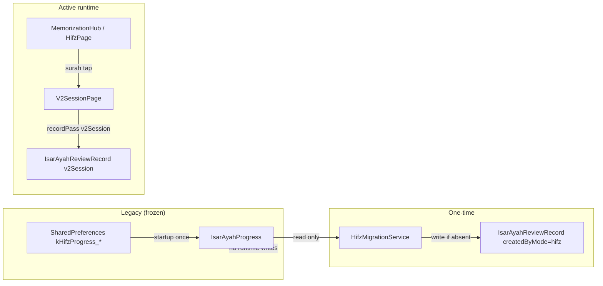

---

## 5.2 Entry Points & Routing

| Entry | Route | Behavior |
|-------|-------|----------|
| Bottom nav tab 3 | `/memorization` (hub) | Primary adult memorization landing |
| Hub card “Practice by Surah” | `AppRoutes.hifz` (`/hifz`) | Opens legacy surah picker |
| Hifz banner (on Hifz page) | `/memorization` hub | Adult MemPlus upsell |
| Surah tile tap | `/memorization-v2/session?surahId=N&startAyah=1` | Always ayah 1 |
| Home resume | `/hifz` normalized → V2 if `surahId` present | `_ResumeSessionCard` |

**Shell structure:** `/hifz` and `/memorization` share bottom-nav branch 3; default tab is **hub**, not Hifz.

**Route guard** (`hifzRedirect`):

```194:208:lib/core/router/app_router.dart
  static Future<String?> hifzRedirect() async {
    try {
      final profile = await _readProfile();
      if (profile?.isChild == true) {
        return AppRoutes.memorizationPlusKidsHome;
      }
      if (profile?.hasSelectedPath == true) return null;

      final prefs = getIt<SharedPreferences>();
      final legacyPath = prefs.getString(AppConstants.kHifzPathMode);
      if (legacyPath != null && legacyPath.isNotEmpty) return null;
      return AppRoutes.memorizationPlus;
    } catch (_) {
      return null;
    }
  }
```

Children are redirected to kids home. Adults without MemPlus path but with legacy `kHifzPathMode` can still reach `/hifz`.

---

## 5.3 HifzCubit — Bridge to MemPlus (Not HifzRepository)

```13:45:lib/features/hifz/presentation/cubits/hifz_cubit.dart
class HifzCubit extends Cubit<HifzState> {
  HifzCubit(
    this._getSurahs,
    this._memorizationRepository,
    this._pathResolver,
  ) : super(const HifzInitial());

  final GetSurahsUsecase _getSurahs;
  final MemorizationPlusRepository _memorizationRepository;
  // ...

  Future<void> load() async {
    // ...
    final profile = profileResult.fold((_) => null, (profile) => profile);
    final effectivePath = profile?.hifzPathValue;
    final sortedSurahs = sortSurahsForHifzPath(
      surahs: surahs,
      path: effectivePath,
    );
    emit(HifzLoaded(surahs: sortedSurahs, selectedPath: effectivePath));
  }
}
```

| Dependency | Used for | Legacy Hifz data? |
|------------|----------|-------------------|
| `GetSurahsUsecase` | Surah list | No |
| `MemorizationPlusRepository` | Profile path (`hifzPathValue`) | No progress reads |
| `HifzRepository` | **Not injected** | Never |

**Path display:** `MemorizationProfile.hifzPathValue` maps adult → `'forward'`, child → `'backward'` — not read from `kHifzPathMode` at runtime.

**Dead method:** `HifzCubit.selectPath(String path)` has **zero UI callers**; path changes go through `MemorizationPathSettingsSheet` / `MemorizationIdentityCubit`.

---

## 5.4 HifzPage Runtime Behavior

**What it does:**
- Shows surah list (sorted forward/backward from profile)
- Locked-tile UI exists but **`isSurahUnlocked` always returns `true`**
- Tap → V2 session at **`startAyah=1` always**
- MemPlus banner for non-`backward` paths

```26:26:lib/features/hifz/presentation/cubits/hifz_state.dart
  bool isSurahUnlocked(int surahId) => true;
```

```237:246:lib/features/hifz/presentation/pages/hifz_page.dart
    return GestureDetector(
      onTap: () {
        if (isLocked) {
          // snackbar — never reached while isSurahUnlocked == true
          return;
        }
        context.push('/memorization-v2/session?surahId=${surah.id}&startAyah=1');
      },
```

**What it does not do:**
- Read per-surah progress from `HifzRepository`
- Show memorized/review/learning counts
- Use `buildUnlockedSurahIds` (defined but unused)
- Run segment checkpoints (`generateHifzSegments`, `canUnlockNextAyah`, etc.)

---

## 5.5 HifzRepository — Migration-Only at Runtime

**DI:** `HifzRepository` → `HifzRepositoryImpl` → `IsarHifzLocalDatasourceImpl`

**Runtime callers of `HifzRepository`:**

| Method | Caller |
|--------|--------|
| `getAllSurahProgress` | `HifzMigrationService._run` only |
| `getProgressForSurah` | `HifzMigrationService._run` only |
| `saveAyahProgress` | **None** |
| `getDueReviews` | **None** |
| `markCheckpointPassed` | **None** |
| `saveHifzPath` / `getHifzPath` | **None** (path is MemPlus profile) |

**Isar bootstrap:** On DI init, `migrateFromSharedPreferencesIfNeeded()` moves old `kHifzProgress_*` prefs → `IsarAyahProgress`, then deletes prefs keys.

**No post-migration writes:** V2 sessions write `AyahReviewRecord` via `V2SessionReviewAdapter`, not `IsarAyahProgress`. Legacy Isar table is a **historical archive**.

---

## 5.6 Migration Pipeline

**Trigger:** `main.dart` — background, non-blocking:

```132:136:lib/main.dart
  unawaited(
    getIt<HifzMigrationService>().runIfNeeded(),
  );
```

**Steps:**
1. If `hifz_v2_migration_done_v1` unset → read all `IsarAyahProgress` via `HifzRepository`
2. JSON backup to app documents
3. For each ayah: if **no** existing `AyahReviewRecord` → write new record with `createdByMode: hifz`
4. Set migration flag + store migrated keys list
5. Repair pass (`hifz_migration_repair_v1`): retag mis-labeled `v2Session` imports → `hifz`, lift `strengthLevel` 5→6 when appropriate

**Field mapping** (legacy → SRS):

| AyahProgress | AyahReviewRecord |
|--------------|------------------|
| `repetitions` | `totalReviews` |
| `status` | `strengthLevel` (0/1/3/6) |
| `nextReviewDate` | `nextReviewDate` |
| `lastReviewDate` | `lastReviewedAt` |
| — | `createdByMode = hifz`, `lastRating = null` |

**Migrated `hifz` records participate in adult production surfaces** via `ReviewRecordFilters.isAdultProductionCount` (same as `v2Session`).

---

## 5.7 Legacy Identity Bridge

`_loadProfile()` in `MemorizationPlusRepositoryImpl` migrates old identity:

```417:451:lib/features/memorization_plus/data/repositories/memorization_plus_repository_impl.dart
    final legacyHifzPath = prefs.getString(AppConstants.kHifzPathMode);
    // ...
    if (migratedPath == null && legacyHifzPath != null) {
      migratedPath = legacyHifzPath == 'backward'
          ? MemorizationPath.child
          : MemorizationPath.adult;
    }
```

`resetMemorizationIdentity()` removes `kHifzPathMode` but **does not clear** `IsarAyahProgress` or migrated review records.

**Settings** still exposes `selectedHifzPath` from `kHifzPathMode` — display-only legacy field; authoritative path is MemPlus profile.

---

## 5.8 Downstream Consumption of `hifz`-Tagged Records

| Consumer | Includes `hifz`? | Evidence |
|----------|------------------|----------|
| Progress metrics (adult) | ✅ | `isAdultProductionCount` |
| Smart Coach | ✅ | `isAdultCompatible` |
| Achievement / certificates | ✅ | `isCertificateEligibleSource` |
| Retention summary | ✅ | `isAdultRetentionCompatible` |
| Cloud sync / parent resync | ❌ | `_isProductionReviewRecord` = `v2Session \| kidsMode` only |
| Remote parent production summary | ❌ (if only hifz on device) | Same adult filter + no cloud push |

---

## 5.9 Dead / Orphaned Legacy Code

| Artifact | Status |
|----------|--------|
| `surah_detail_page.dart` | **Deleted** (git) |
| `HifzSessionCubit` | **Removed** (stale ref in `settings_repository_impl.dart` comment) |
| `GetHifzProgressUsecase` / `SaveAyahProgressUsecase` | **Deleted** |
| `buildUnlockedSurahIds`, segment/checkpoint helpers | **Defined, never called** |
| `HifzCubit.selectPath` | **Dead** |
| `HifzRepository` write APIs | **Dead at presentation layer** |
| `incompleteHifzSession` l10n key | **Orphan string** (no runtime usage found) |
| Lock UI on `_HifzSurahTile` | **Cosmetic dead code** (`isSurahUnlocked` always true) |

**Still reused (not dead):**
- `QcfHifzVerseView` — V2 session widgets + kids ayah card
- `sortSurahsForHifzPath` — surah ordering on Hifz page
- `ReviewDueEvaluator` — used by legacy `AyahProgress.isDue` (only relevant inside unused `getDueReviews`)

---

## 5.10 Findings

### F5-01 🔴 Critical — Migrated `hifz` records excluded from cloud sync

**Impact:** Users upgraded from legacy Hifz lose cross-device / parent visibility for pre-V2 memorization data; `resyncProductionDataToCloud` never pushes `hifz` rows.

**Evidence:**

```1644:1646:lib/features/memorization_plus/data/repositories/memorization_plus_repository_impl.dart
  bool _isProductionReviewRecord(AyahReviewRecord record) =>
      record.createdByMode == ReviewRecordCreatedByMode.v2Session ||
      record.createdByMode == ReviewRecordCreatedByMode.kidsMode;
```

**Root cause:** Cloud mirror policy written for V2/kids only; migration tag not added.

**Priority:** P0 for multi-device / parent accounts with legacy installs.

---

### F5-02 🟠 High — Migration skips when any review record exists (silent data loss)

**Impact:** If user memorized ayah N in V2 before migration runs, legacy Hifz progress for ayah N is **never imported** (skipped, not merged).

**Evidence:** `HifzMigrationService._run` L151–154 — skip when `getReviewRecord` returns non-null, regardless of `createdByMode` or field quality.

**Priority:** P1 for long-term legacy upgraders.

---

### F5-03 🟠 High — Hifz page shows fake unlock/progress semantics

**Impact:**  
- All surahs appear unlocked (`isSurahUnlocked => true`) while UI still renders lock affordances  
- No per-surah progress from legacy or SRS  
- `buildUnlockedSurahIds` never wired

**Evidence:** `hifz_state.dart` L26; `hifz_page.dart` L97.

**Priority:** P1 UX/trust.

---

### F5-04 🟠 High — Hifz surah entry always starts at ayah 1

**Impact:** “Practice by Surah” ignores last position, coach pending ayah, and legacy progress — diverges from hub “Today’s Plan” and Smart Coach deep links.

**Evidence:** `hifz_page.dart` L245 hardcoded `startAyah=1`.

**Priority:** P1 (same class as F3-06 hub vs coach mismatch).

---

### F5-05 🟡 Medium — Dual datastore without reconciliation

**Impact:** `IsarAyahProgress` frozen copy can disagree with live `AyahReviewRecord`; no sync job reconciles them after migration.

**Evidence:** Migration never updates/deletes source; no runtime reads of Isar Hifz for UI.

**Priority:** P2 (technical debt / storage).

---

### F5-06 🟡 Medium — Legacy path prefs vs MemPlus profile drift

**Impact:** `SettingsCubit.selectedHifzPath` reads `kHifzPathMode`; Hifz page uses `profile.hifzPathValue`. After identity reset removes prefs key, settings may show stale/null while Hifz sort order follows profile.

**Priority:** P2.

---

### F5-07 🟡 Medium — `/hifz` not restorable; resume normalization is partial

**Impact:** `AppSessionService` whitelist excludes `/hifz`. Home resume card can rewrite `/hifz?surahId=N` → V2, but only if query params exist (Hifz page navigation doesn’t set them).

**Evidence:** `app_session_service.dart` L33–49; `home_page_widgets.dart` L1020–1031.

**Priority:** P2.

---

### F5-08 🟢 Low — Substantial dead code in `hifz_unlock_rules.dart`

**Impact:** Maintenance burden; misleading impression that segment/checkpoint logic is active.

**Priority:** P3 cleanup.

---

### F5-09 ✅ Working — Migration safety basics

- Source Isar never deleted  
- JSON backup before write  
- Per-ayah try/catch  
- Repair pass for mis-tagged imports  
- One-time prefs guards  

---

### F5-10 ✅ Working — Runtime write path fully on V2

Adult memorization sessions no longer touch `HifzRepository`. Legacy stack is effectively **read-only archive + surah launcher**.

---

## 5.11 Phase 5 Verdict

| Layer | Production status |
|-------|-------------------|
| Hifz session engine | **Retired** — replaced by V2 |
| Hifz progress writes | **Retired** — only migration reads |
| Hifz UI (`/hifz`) | **Active but thin** — surah picker → V2 |
| `hifz` review records | **Active in local adult metrics** — excluded from cloud |
| Migration | **Runs once** — correct for greenfield; risky for overlap with early V2 |

**Architectural summary:** Legacy Hifz is a **compatibility layer**, not a parallel memorization system. Production truth for scheduling/progress is `AyahReviewRecord` (tags `hifz` or `v2Session`). The main gaps are **cloud exclusion of migrated data**, **migration skip logic**, and **Hifz page UX that no longer reflects real progress or gating**.

---

**Next:** Phase 6 — Review scheduler audit (SM-2 vs FSRS shadow, `ScheduleNextReviewUsecase`, due classification, write paths).

Should I continue with Phase 6?

---

# Phase 6 — Review Scheduler Audit (SM-2 Production vs FSRS Shadow)

Read-only audit of how review dates are computed, how “due” is classified, and whether FSRS shadow mode affects runtime behavior.

---

## 6.1 Production Scheduler Architecture

```mermaid
flowchart TB
  subgraph Writes["Production write paths"]
    V2A["V2SessionReviewAdapter.recordPass"]
    V2W["V2SessionReviewAdapter.recordWeakAyahs"]
    Mig["HifzMigrationService → saveReviewRecord"]
  end

  subgraph Scheduler["Production scheduler — ONLY this affects nextReviewDate"]
    SM2["ScheduleNextReviewUsecase.schedule()"]
  end

  subgraph Storage
    Isar["IsarAyahReviewRecord"]
    Cloud["ayah_review_records_cloud RPC"]
  end

  subgraph DueLogic["Due / bucket classification — read-only"]
    RC["ReviewClassifier + ReviewDueEvaluator"]
    SC["SmartCoachEngine priorities 1–4"]
    DP["generateDailyPlan buckets"]
    PM["ProgressMetricsService._isDue"]
  end

  subgraph Shadow["FSRS shadow stack — NOT wired to writes"]
    FST["FsrsStateTrackerUsecase"]
    FPR["FsrsPredictionUsecase"]
    FCM["FsrsComparisonUsecase"]
    FAG["FsrsAgreementUsecase + FsrsAnalyticsService"]
  end

  V2A --> SM2
  V2W --> SM2
  Mig -->|pre-built dates, no schedule()| Isar
  SM2 --> Isar
  Isar --> Cloud
  Isar --> RC
  RC --> SC
  RC --> DP
  RC --> PM
  FST -.->|never called| X[❌]
  FPR -.->|never called| X
  FCM -.->|never called| X
  Isar -.->|shadow fields always null| FAG
```

**Verdict:** Production scheduling is **100% `ScheduleNextReviewUsecase` (Talia SM-2 derivative)**. FSRS exists as **schema + analytics code only** — it does not run on save.

---

## 6.2 Production Scheduler — `ScheduleNextReviewUsecase`

**Location:** `lib/features/memorization_plus/domain/usecases/memorization_plus_usecases.dart`  
**DI:** Registered singleton; injected into `V2SessionReviewAdapter` (`injection.dart` L251–260)

**Production callers:**

| Caller | When |
|--------|------|
| `V2SessionReviewAdapter.recordPass` | Adult V2 recite pass, kids completion, block-review weak ayahs |
| `AyahProgressModel.advanceWithSpacedRepetition` | **Dead** — no runtime callers |

### Rating → interval algorithm (V3.2)

Inputs: existing `AyahReviewRecord`, `PerformanceRating`, optional `nowOverride` (UTC).

| Rating | Strength | Ease factor | Interval |
|--------|----------|-------------|----------|
| `excellent` | +1 (cap 10) | +0.15 (1.3–3.3) | 1 day if new; else `effectiveBase × easeFactor` + fuzz, cap 180 |
| `average` | unchanged | −0.10 | Similar, cap 90 |
| `weak` | −1 (floor 0) | −0.20; `lapses++` | Soft lapse: 50% interval if ≤7d else 30%, min 1 or 3 |

**Overdue compensation:** For intervals &lt; 14 days, elapsed days capped at `2× interval`; for longer intervals, uses max(interval, elapsed).

**Fuzz:** Deterministic ±5% via `Random(ayahNumber + interval)`.

**Outputs updated:** `strengthLevel`, `intervalDays`, `lastReviewedAt`, `nextReviewDate`, `totalReviews`, `lastRating`, `easeFactor`, `lapses`.

**Not SM-2 purist:** Custom ease-factor curve, fuzz, overdue compensation, strength 0–10 (memorized threshold = 6 via classification, not scheduler).

---

## 6.3 Rating Mapping at Write Time

```57:62:lib/core/memorization/v2/session_adapters.dart
    final rating = switch (hintLevel) {
      V2HintLevel.none => PerformanceRating.excellent,
      V2HintLevel.firstWord => PerformanceRating.average,
      V2HintLevel.fullAyah => PerformanceRating.weak,
    };
```

| Flow | Hint → rating | `createdByMode` |
|------|---------------|-----------------|
| Adult V2 recite pass | From `V2HintTracker` | `v2Session` (default) |
| Block review failure | `fullAyah` → **weak** | `v2Session` |
| Kids completion | `none` → **excellent** | `kidsMode` |
| Hifz migration | N/A (no `schedule()`) | `hifz` |

**Adult session write chain:**

```519:531:lib/features/memorization_plus/presentation/cubits/memorization_session_cubit.dart
    if (previousState.phase == V2SessionPhase.reciting &&
        lastResult != null &&
        lastResult.passed) {
      await _reviewAdapter.recordPass(
        surahId: previousState.surahId,
        ayahNumber: passedAyah.numberInSurah,
        hintLevel: previousState.hintTracker.levelFor(...),
      );
    }
```

On block complete, **only weak ayahs** from `failureTracker` are re-scheduled — successful ayahs are not double-scheduled.

---

## 6.4 Due Classification — `ReviewClassifier`

**Location:** `lib/core/memorization/review_classification.dart`

| Flag | Rule |
|------|------|
| `isNew` | `totalReviews == 0` |
| `isMemorized` | `strengthLevel >= 6` |
| `isDue` | `ReviewDueEvaluator` with `onOrAfterScheduledTime` (`now >= nextReviewDate` UTC) |
| `isNearRevision` | Reviewed, **not** memorized, ≤5 days since `lastReviewedAt` |
| `isFarRevision` | Reviewed, **not** memorized, &gt;5 days since `lastReviewedAt` |
| `isMemorizedDue` | `isDue && isMemorized && !isNew` |

**Legacy Hifz due policy (still in codebase, unused for MemPlus records):**

```4:5:lib/core/memorization/review_due_evaluator.dart
/// - Memorization Plus is due at the scheduled instant or later.
/// - Legacy Hifz is due only after the scheduled instant.
```

Migrated and V2 records use MemPlus classification via `AyahReviewRecord.reviewClassification`.

---

## 6.5 Who Consumes Scheduled Dates

### Smart Coach (`SmartCoachEngine`) — adult priorities

| Priority | Bucket | Filter |
|----------|--------|--------|
| 1 | Weak due | `isDue && lastRating==weak && !isMemorized` |
| 2 | Near due | `isDue && isNearRevision` |
| 3 | Far due | `isDue && isFarRevision` |
| 4 | Memorized-due retention | `isMemorizedDue && isAdultCompatible` |
| 5–6 | Daily plan pending items | From `cachedDailyPlan` (not live SRS scan) |

Records filtered: `ReviewRecordFilters.isAdultCompatible` (`v2Session`, `hifz`).

### Daily plan generation (`generateDailyPlan`)

```509:511:lib/features/memorization_plus/data/repositories/memorization_plus_repository_impl.dart
      final allRecords = (await _datasource.getAllReviewRecords())
          .where(ReviewRecordFilters.isAdultCompatible)
          .toList();
```

Per ayah:
- **New:** no record or `isNew` → `newAyahs` (limit from custom plan)
- **Due + near/far:** `classification.isDue` + near/far buckets (memorized excluded from near/far)
- **Retention:** `isDailyPlanRetentionEligible` (adult + `isMemorizedDue`), max 3 per surah pass

### Progress metrics

`ProgressMetricsService._isDue` uses `ReviewClassifier` — consistent with coach.

### Home insights (shadow analytics path)

`ReviewWorkloadInsightsUsecase` uses **raw date comparison** on **unfiltered** records (includes kids/unknown):

```28:32:lib/features/memorization_plus/domain/usecases/review_workload_insights_usecase.dart
    for (final record in records) {
      if (record.strengthLevel == 0) continue;
      if (record.nextReviewDate.isBefore(now) || record.nextReviewDate.isAtSameMomentAs(now)) {
        dueNow++;
```

Used only in `HomeCubit._evaluateUnifiedAction` → `UnifiedJourneyEngine` (backlog alerts), **not** Smart Coach.

---

## 6.6 FSRS Shadow Stack — Designed but Disconnected

### Components (all in `memorization_plus_usecases.dart`)

| Use case | Purpose | Runtime invoked? |
|----------|---------|------------------|
| `FsrsStateTrackerUsecase` | Update `difficulty`, `stability`, `reviewState` | ❌ Never |
| `FsrsPredictionUsecase` | Shadow `predictedFsrsIntervalDays`, retrievability | ❌ Never |
| `FsrsComparisonUsecase` | `schedulerVsFsrsGapDays`, ratio, earlier flag | ❌ Never |
| `FsrsAgreementUsecase` | Agreement score from gap buckets | ✅ Analytics only |
| `FsrsAnalyticsService` | Aggregate gap distribution | ✅ Analytics only |

**Not DI-registered** — FSRS use cases are instantiated inline in tests and `MemorizationInsightsAggregator` defaults only.

### Schema vs reality

`IsarAyahReviewRecord` stores FSRS fields; `toModel()` defaults `difficulty: 5.0`, `stability: 0.0`, `reviewState: newCard` when never written.

Shadow prediction fields (`predictedFsrsIntervalDays`, etc.) remain **null** in production because `FsrsPredictionUsecase` / `FsrsComparisonUsecase` are never chained before `saveReviewRecord`.

### Analytics pipeline (Home only)

```200:207:lib/features/home/presentation/cubits/home_cubit.dart
      final records = recordsResult.getOrElse(() => []);
      const aggregator = MemorizationInsightsAggregator();
      final insights = aggregator.generate(records, DateTime.now());
      const adaptiveUsecase = AdaptiveRecommendationsUsecase();
      final adaptiveReport = adaptiveUsecase.generate(insights);
```

`FsrsAnalyticsService.analyze` skips records where `schedulerVsFsrsGapDays == null` → **always 0 valid FSRS records** in production.

`MigrationReadinessUsecase` therefore always returns `insufficientData` (&lt;100 agreement records) → `AdaptiveRecommendationsUsecase` always emits `fsrsNotReady`.

### Cloud sync

`_pushReviewRecordsBatch` syncs SM-2 fields + `review_state` but **not** FSRS shadow/analytics fields:

```1781:1794:lib/features/memorization_plus/data/repositories/memorization_plus_repository_impl.dart
            (r) => {
              'strength_level': r.strengthLevel,
              'interval_days': r.intervalDays,
              // ...
              'ease_factor': r.easeFactor,
              'lapses': r.lapses,
              'review_state': r.reviewState.name,
              'created_by_mode': r.createdByMode.name,
            },
```

---

## 6.7 Migration Scheduling (Non-SM-2)

`HifzMigrationService._toReviewRecord` copies legacy dates directly — **does not call** `ScheduleNextReviewUsecase`:

- `intervalDays` from repetitions index `[1,3,7,14,30,60,120]`
- `strengthLevel` from `AyahStatus` (memorized → 6)
- `lastRating: null`

Migrated rows participate in due logic via stored `nextReviewDate`, not re-scheduled on import.

---

## 6.8 Isolation & Source Tags in Scheduling

| Source | Written by | In adult daily plan / coach? | Scheduler on write? |
|--------|------------|-------------------------------|---------------------|
| `v2Session` | V2 adapter | ✅ | ✅ SM-2 |
| `hifz` | Migration | ✅ | ❌ (imported dates) |
| `kidsMode` | Kids adapter | ❌ (filtered) | ✅ SM-2 (always excellent) |
| `unknown` / `migration` | Legacy | ❌ | — |

Kids SRS is scheduled aggressively (excellent every completion) but excluded from adult due surfaces at read time.

---

## 6.9 Findings

### F6-01 🔴 Critical — FSRS shadow never runs on save; analytics permanently empty

**Impact:** All FSRS readiness, agreement scores, and migration-readiness signals are **non-functional** in production. `fsrsNotReady` / `fsrsReady` recommendations are meaningless.

**Evidence:** No production caller of `FsrsStateTrackerUsecase`, `FsrsPredictionUsecase`, or `FsrsComparisonUsecase`. `FsrsAgreementUsecase` requires `predictedFsrsIntervalDays != null` — always false.

**Recommended fix:** Chain shadow use cases inside `V2SessionReviewAdapter` after SM-2 (write-only shadow fields), or remove readiness UI until wired.

**Priority:** P0 for any FSRS migration decision; P3 if FSRS is explicitly deferred.

---

### F6-02 🟠 High — Due-count semantics diverge across consumers

**Impact:** Home unified journey `overdueAyahs` / backlog alerts can disagree with Smart Coach and Progress tab.

**Evidence:**
- Coach / Progress: `ReviewClassifier` + adult filters
- Home insights: `ReviewWorkloadInsightsUsecase` raw dates, all sources, `strengthLevel==0` skip only

**Priority:** P1

---

### F6-03 🟠 High — `GetRetentionReviewSummaryUseCase` is dead code

**Impact:** Retention diagnostics use case documented for Phase 4 filtering never called from app.

**Evidence:** Only definition in `get_retention_review_summary_usecase.dart`; no references elsewhere in `lib/`.

**Priority:** P2 (cleanup or wire to debug/parent dashboard)

---

### F6-04 🟡 Medium — FSRS schema defaults mask “never tracked” state

**Impact:** `MemorizationInsightsAggregator` averages `difficulty`/`stability` for all `totalReviews > 0` records using defaults (5.0 / 0.0) — looks like real FSRS state when tracker never ran.

**Evidence:** `isar_ayah_review_record.dart` L87–88 defaults; aggregator L52–57 counts any reviewed ayah.

**Priority:** P2

---

### F6-05 🟡 Medium — Memorized-due excluded from daily plan near/far loops

**Impact:** By design — memorized-due only enters via `retentionReview` bucket (max 3). Users with many overdue memorized ayahs rely on Smart Coach P4, not daily plan near/far.

**Evidence:** `isNearRevision` / `isFarRevision` require `!isMemorized`; retention via `isDailyPlanRetentionEligible`.

**Priority:** P3 (product clarity)

---

### F6-06 🟡 Medium — Kids always scheduled as `excellent`

**Impact:** Kids ayahs reach `strengthLevel >= 6` quickly with minimal recitation validation (Phase 4) — SRS dates exist but are excluded from adult coach/plan.

**Evidence:** Kids `recordPass(..., hintLevel: none)`.

**Priority:** P2 (kids-specific retention product decision)

---

### F6-07 🟡 Medium — `hifzReviewDue` coach kind unused

**Impact:** UI/handlers reference `SmartCoachRecommendationKind.hifzReviewDue`; engine never emits it. Legacy Hifz due reviews are indistinguishable from V2 in SRS — all go through same coach priorities.

**Evidence:** `smart_coach_recommendation.dart` enum; no emission in `smart_coach_engine.dart`.

**Priority:** P3

---

### F6-08 ✅ Working — Single production write scheduler

Only `V2SessionReviewAdapter` → `ScheduleNextReviewUsecase` affects live intervals. No competing FSRS scheduler at runtime.

---

### F6-09 ✅ Working — No double-schedule on block complete

Per-ayah `recordPass` on recite pass; block complete only `recordWeakAyahs` for failures.

---

### F6-10 ✅ Working — UTC date policy on schedule

`ScheduleNextReviewUsecase` and classification use UTC consistently.

---

## 6.10 Production Scheduling Write Chain (Summary)

```
MemorizationSessionCubit._handlePostEvaluation
  └─ V2SessionReviewAdapter.recordPass
       ├─ getReviewRecord(surahId, ayahNumber)
       ├─ ScheduleNextReviewUsecase.schedule(record, rating)
       └─ MemorizationPlusRepository.saveReviewRecord
            ├─ IsarAyahReviewRecord (composite key replace)
            ├─ ProgressEventsBus.reviewRecord
            └─ Cloud upsert (v2Session | kidsMode only)

KidsModeCubit.markCompleted
  └─ same adapter chain (kidsMode, excellent)

HifzMigrationService
  └─ saveReviewRecord(pre-built hifz row) — no schedule()
```

**FSRS chain (intended, not production):**

```
schedule() → FsrsStateTrackerUsecase.update → FsrsPredictionUsecase.predict
  → FsrsComparisonUsecase.compare → saveReviewRecord  ❌ NOT IMPLEMENTED
```

---

## Phase 6 Verdict

| System | Status |
|--------|--------|
| **Production scheduler** | Talia SM-2 derivative (`ScheduleNextReviewUsecase`) — active, tested, DI-wired |
| **Due classification** | Centralized `ReviewClassifier` — drives coach, daily plan, progress |
| **FSRS shadow** | Code + schema complete; **zero runtime effect** on scheduling or stored predictions |
| **FSRS analytics / readiness** | Runs on Home but always reports insufficient data |
| **Legacy Hifz scheduling** | Frozen imported dates; not SM-2 re-computed |

The app operates as an **SM-2-only production scheduler** with an **unwired FSRS observation layer**. The highest-risk gap is treating FSRS readiness analytics as meaningful when shadow fields are never populated.

---

**Next:** Phase 7 — Smart Coach deep audit (snapshot inputs, priority tie-breakers, route payloads, dead kinds).

Should I continue with Phase 7?

---

# Phase 7 — Smart Coach Deep Audit

Read-only audit of recommendation logic, snapshot inputs, Home UI wiring, route payloads, and dead paths.

---

## 7.1 Architecture

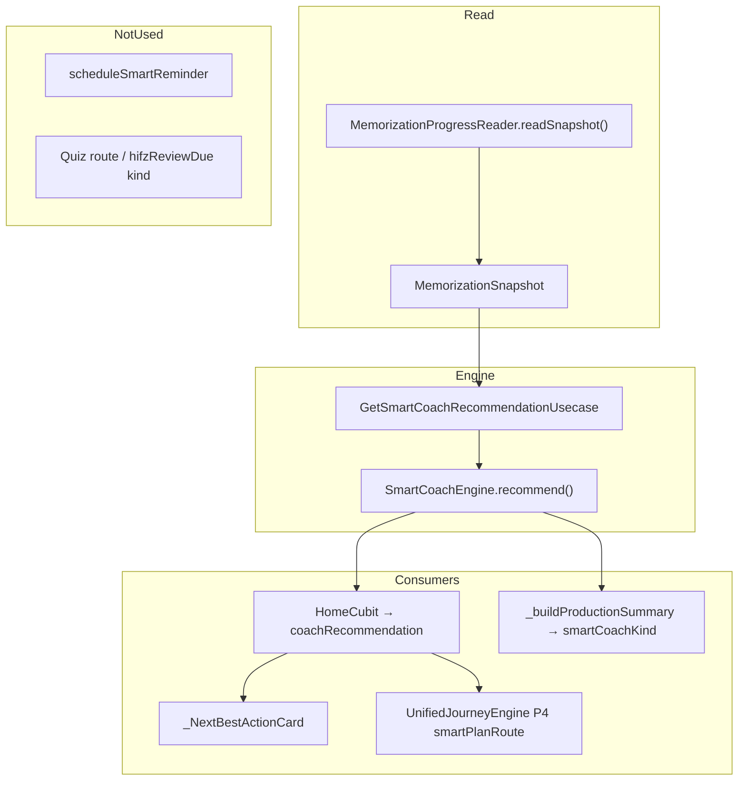

| Component | Role | Mutates data? |
|-----------|------|---------------|
| `MemorizationProgressReader` | Builds snapshot from repos + session service | No |
| `SmartCoachEngine` | Pure priority logic | No |
| `GetSmartCoachRecommendationUsecase` | Snapshot → recommendation | No |
| `HomeCubit` | Loads coach on every home reload | No |

**DI:** `SmartCoachEngine` + `GetSmartCoachRecommendationUsecase` registered in `injection.dart`. Only **HomeCubit** consumes the use case in presentation.

---

## 7.2 Snapshot Inputs

```28:71:lib/core/memorization/memorization_progress_reader.dart
  Future<Either<Failure, MemorizationSnapshot>> readSnapshot() async {
    // profile, reviewRecords, cachedDailyPlan, customPlan,
    // kidsProgress, kidsSessionLogs, lastRestorableLocation
```

| Field | Source | Coach usage |
|-------|--------|-------------|
| `profile` | MemPlus prefs | Branch adult vs child |
| `reviewRecords` | Isar (all modes) | Adult P1–4 after `isAdultCompatible` filter |
| `cachedDailyPlan` | `getCachedDailyPlan()` | Adult P5–6 |
| `customPlan` | MemPlus prefs | Kids surah fallback |
| `kidsSessionLogs` | Prefs | Kids last surah |
| `lastRestorableLocation` | `AppSessionService` | Adult P7 (`continueV2Session`) |
| `kidsProgress` | Prefs | **Not read by engine** |

**Daily plan in snapshot:** `getCachedDailyPlan()` returns `null` without an **active adult custom plan** (Phase 3/8). Coach P5/P6 never run for hub-only / Hifz-only users.

**Review records:** Unfiltered in snapshot; engine applies `ReviewRecordFilters.isAdultCompatible` (`v2Session`, `hifz` only).

---

## 7.3 Adult Priority Stack (Engine)

Order in `_adultMemPlusRecommendation` → `_continueV2SessionRecommendation`:

| Priority | Kind | Condition | Route |
|----------|------|-----------|-------|
| 1 | `reviewWeakAyah` | Due + `lastRating==weak` + not memorized | V2 session @ exact ayah |
| 2 | `reviewDueNear` | Due + `isNearRevision` (≤5d since last review, not memorized) | V2 session @ exact ayah |
| 3 | `reviewDueFar` | Due + `isFarRevision` | V2 session @ exact ayah |
| 4 | `memorizedReviewDue` | `isMemorizedDue` + adult-compatible | V2 session @ exact ayah |
| 5 | `continueDailyPlan` | Plan has required items + `requiredCompletedCount>0` + pending required | V2 session **`startAyah=1`** |
| 6 | `memorizeNewAyahs` | Pending new ayahs in plan | V2 session @ first pending ayah |
| 7 | `continueV2Session` | `lastRestorableLocation` starts with `/memorization-v2/session` | Resume URL as-is |

**Not implemented:** `hifzReviewDue` — enum + UI exist; engine **never emits**.

**Tie-breakers:** Documented in engine (strength, `nextReviewDate`, `totalReviews`; memorized-due adds `intervalDays`).

**Stale comment:** `_ayahRecommendation` doc mentions `_dailyPlanRoute` / `_quizRouteWithAyah`; all paths use `_v2SessionRoute`.

---

## 7.4 Kids Priority

Single path: **`kidsCurrentMission`** always returned for `profile.isChild`.

- Surah from latest `kidsSessionLogs` or active child `customPlan.startSurahId`
- Route: `/memorization-plus/kids-home?surahId=N` or bare kids home
- **No SRS due scan** for children

---

## 7.5 Home UI — Where Coach Actually Appears

### Loading

```114:127:lib/features/home/presentation/cubits/home_cubit.dart
    final coachFuture = _getCoachRecommendation();
    // ...
    coachResult.fold((_) => null, (r) => coachRecommendation = r);
```

Reload triggers: path change, most `ProgressEventsBus` reasons (not XP-only).

### Display precedence (`home_page.dart`)

When `JourneyFeatureFlags.unifiedJourneyEnabled` (default **true**) and prefs `unified_journey_enabled` (default **true**):

1. **`UnifiedHeroActionCard`** if `heroAction != null` — **replaces** coach card  
2. Else **`_ResumeSessionCard`** if `lastRestorableLocation != null` — **replaces** coach card  
3. Else **`_NextBestActionCard`** — uses `coachRecommendation` when non-null  

```173:229:lib/features/home/presentation/pages/home_page.dart
        if (JourneyFeatureFlags.unifiedJourneyEnabled && state.heroAction != null)
          // UnifiedHeroActionCard
        else if (state.lastRestorableLocation != null)
          // _ResumeSessionCard
        else
          // _NextBestActionCard (Smart Coach)
```

**Unified Journey P1** always prefers `lastRestorableLocation` over coach-specific ayah routes:

```8:17:lib/core/journey/unified_journey_engine.dart
    if (input.lastRestorableLocation != null) {
      return UnifiedJourneyAction(
        route: input.lastRestorableLocation!,
        priority: UnifiedJourneyPriority.p1ActiveSession,
```

Coach is computed every load but often **not shown** when resume/unified hero is active.

### Coach card behavior

- `_NextBestActionCard` prefers coach over custom plan / wird fallbacks
- Tap: `context.push(coach.route)` — deep links to V2 or kids home
- Copy: mix of l10n keys and **hardcoded AR/EN** strings (not all localized)

---

## 7.6 Unified Journey vs Smart Coach

`HomeCubit._evaluateUnifiedAction` feeds coach into **P4 Smart Plan** only when P1–P3 don't fire:

```216:230:lib/features/home/presentation/cubits/home_cubit.dart
      final input = UnifiedJourneyInput(
        lastRestorableLocation: lastLocation,
        hasSmartPlan: coachRecommendation != null || customPlan != null,
        isSmartPlanReview: coachRecommendation != null && (review kinds...),
        smartPlanRoute: coachRecommendation?.route ?? ...,
```

| Unified priority | Source | Typical route |
|------------------|--------|---------------|
| P1 | Resume session | Saved V2 URL (may lack ayah precision in display) |
| P2 | Adaptive alerts | `learningAlertRoute ?? '/memorization'` |
| P3 | Review backlog | `/memorization` (generic hub) |
| P4 | Smart Coach / custom plan | `coach.route` |

**Gap:** `learningAlertRoute` is **never set** in `UnifiedJourneyInput` construction → P2 always falls back to `/memorization`.

**Gap:** P3 backlog uses `ReviewWorkloadInsightsUsecase` (Phase 6) — unfiltered due count, not coach priorities.

---

## 7.7 Other Surfaces

| Surface | Smart Coach? | Evidence |
|---------|--------------|----------|
| Home `_NextBestActionCard` | Yes (conditional) | Above |
| Unified Hero | Indirect (P4 route) | `smartPlanRoute` |
| Memorization Hub | No | Uses `MemorizationNavigationResolver`, not engine |
| Progress tab | No | No coach references |
| Notifications | No personalized coach | Generic `/memorization` payloads |
| Parent dashboard (local) | No | PIN dashboard uses kids logs |
| Parent dashboard (remote) | Computed only | `smartCoachKind` in `RemoteChildProductionSummary` — **not rendered** in `parent_dashboard_page.dart` |

Remote child coach uses **forced child profile** in snapshot → always `kidsCurrentMission`, not adult SRS priorities.

---

## 7.8 Notifications

`scheduleSmartReminder()` exists but **`refreshNotifications()` never calls it**. No other production caller.

Smart reminder would payload `/memorization` (generic hub) — not coach ayah routes. Open-hour tracking inside `scheduleSmartReminder` never runs.

---

## 7.9 Findings

### F7-01 🔴 Critical — `continueDailyPlan` routes to `startAyah=1`, ignores pending work

**Impact:** Coach tells user to continue today's plan but opens V2 at ayah 1, not next pending near/far/new item.

**Evidence:**

```127:134:lib/core/memorization/smart_coach_engine.dart
        return SmartCoachRecommendation(
          kind: SmartCoachRecommendationKind.continueDailyPlan,
          route: _v2SessionRoute(plan.surahId, 1),
```

**Priority:** P0

---

### F7-02 🔴 Critical — Daily plan completion never persisted (`withCompleted` dead)

**Impact:** `requiredCompletedCount` stays 0 → P5 `continueDailyPlan` condition (`requiredCompletedCount > 0`) **never true** in production. Coach skips “continue plan” even after partial work (F3-01).

**Evidence:** `withCompleted` only defined; zero callers in `lib/`.

**Priority:** P0 (linked to Phase 8)

---

### F7-03 🟠 High — Coach card hidden behind Unified Journey / Resume

**Impact:** Precise coach recommendations (weak/near/far/memorized due) often invisible; user sees generic resume or hub hero instead.

**Evidence:** `home_page.dart` branching; `UnifiedJourneyEngine` P1 resume.

**Priority:** P1 UX

---

### F7-04 🟠 High — Coach P5/P6 require cached daily plan from active adult custom plan

**Impact:** Users on Hifz-only / hub path get SRS priorities (P1–4) only; no “memorize new ayahs” / “continue plan” without custom plan.

**Evidence:** `getCachedDailyPlan()` L689–690 returns null without active adult plan.

**Priority:** P1 product gap

---

### F7-05 🟠 High — `hifzReviewDue` dead kind with live UI handler

**Impact:** Dead code path; tests reference “Hifz fallback” that engine doesn't implement. Migrated `hifz` due items use P2–P4 like `v2Session`.

**Evidence:** Enum L13; UI switch L1262–1268; no engine emission.

**Priority:** P2 cleanup

---

### F7-06 🟡 Medium — Weak-due requires `lastRating==weak`

**Impact:** Migrated `hifz` records (`lastRating: null`) never match P1; fall through to near/far only.

**Evidence:** Engine L40.

**Priority:** P2

---

### F7-07 🟡 Medium — `scheduleSmartReminder` never scheduled

**Impact:** “Smart reminder” feature inert; no coach-aware notifications.

**Evidence:** Only definitions in `notification_scheduler.dart` / `notification_service.dart`; no callers.

**Priority:** P2

---

### F7-08 🟡 Medium — Unified Journey P2/P3 bypass coach precision

**Impact:** Critical/backlog alerts route to `/memorization` hub, not `coach.route`.

**Evidence:** `unified_journey_engine.dart` L23, L38; `learningAlertRoute` never set.

**Priority:** P2

---

### F7-09 🟡 Medium — Kids coach always fires (no “all caught up”)

**Impact:** Child profile always gets `kidsCurrentMission` even with no logs/plan — generic kids home.

**Evidence:** `_kidsRecommendation` unconditional return.

**Priority:** P3

---

### F7-10 🟡 Medium — Hardcoded coach strings on Home

**Impact:** Violates localization rules for several kinds; AR/EN inline in `_coachAction`.

**Evidence:** `home_page_widgets.dart` L1196–1268 (partial l10n for memorized-due only).

**Priority:** P2

---

### F7-11 🟡 Medium — Remote `smartCoachKind` computed but not shown

**Impact:** Parent cloud summary includes coach kind; dashboard UI ignores it.

**Evidence:** `RemoteChildProductionSummary.smartCoachKind`; parent page shows production metrics only.

**Priority:** P3

---

### F7-12 ✅ Working — Source isolation for adult coach

Kids `kidsMode` excluded via `isAdultCompatible`. Memorized-due P4 double-checks filter. Matches Phase 4/6 policy.

---

### F7-13 ✅ Working — Review priorities vs daily plan (when plan exists)

Tests confirm: near/far &gt; memorized-due &gt; continue plan &gt; new ayahs. Engine matches tests for P1–4 and P6.

---

### F7-14 ✅ Working — Exact ayah routing for SRS priorities

P1–4 and P6 embed `startAyah` in `/memorization-v2/session?surahId=&startAyah=` (quiz route retired).

---

## 7.10 Coach Recommendation → Runtime Chain

```
App resume / Home load / ProgressEventsBus
  └─ HomeCubit.load()
       ├─ GetSmartCoachRecommendationUsecase()
       │    ├─ GetMemorizationSnapshotUsecase()
       │    │    └─ MemorizationProgressReader.readSnapshot()
       │    └─ SmartCoachEngine.recommend(snapshot)
       ├─ coachRecommendation → HomeLoaded state
       ├─ UnifiedJourneyEngine.evaluate(input with smartPlanRoute)
       └─ Home UI:
            UnifiedHeroActionCard (often wins)
            OR _ResumeSessionCard
            OR _NextBestActionCard → context.push(coach.route)
                 └─ V2SessionPage / KidsGamifiedHomePage
```

---

## Phase 7 Verdict

| Area | Status |
|------|--------|
| Engine logic (P1–4, kids) | **Sound** — pure, tested, source-filtered |
| Daily plan coach (P5–6) | **Broken in production** — no plan cache without custom plan; completion never saved; continue routes to ayah 1 |
| Home visibility | **Often bypassed** by Unified Journey + resume |
| Dead features | `hifzReviewDue`, smart notifications, quiz routing docs |
| Parent remote | Coach kind computed, not displayed |

Smart Coach is a **correct SRS prioritization engine** that is **undermined at the edges**: daily-plan integration is non-functional, Home UI frequently shows something else, and several enum/notification paths are orphaned.

---

**Next:** Phase 8 — Daily Plan audit (generation, cache, completion propagation, cloud sync).

Should I continue with Phase 8?

---

# Phase 8 — Daily Plan Audit

Read-only audit of daily plan generation, caching, completion propagation, navigation, coach integration, and cloud sync.

---

## 8.1 Role in the Product

The daily plan is **not a standalone screen**. It is:

1. A **cached snapshot** (`mem_plus_daily_plan` in SharedPreferences) of today’s workload buckets  
2. Input to **Smart Coach** priorities 5–6  
3. Input to **MemorizationNavigationResolver** for hub “Today’s Plan” surah  
4. A **cloud mirror** row in `daily_plans_cloud` for parent/remote visibility  

There is **no dedicated “Daily Plan” page** showing bucket lists or checkmarks.

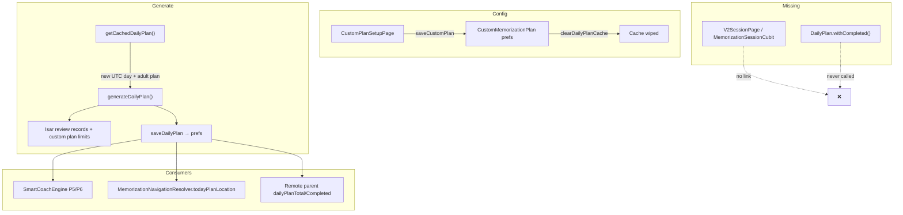

---

## 8.2 Data Model

**Entity:** `DailyPlan` in `memorization_entities.dart`

| Bucket | Meaning | Counts toward required workload? |
|--------|---------|----------------------------------|
| `newAyahs` | No SRS record or `isNew` | Yes |
| `nearRevision` | Due + near window + not memorized | Yes |
| `farRevision` | Due + far window + not memorized | Yes |
| `retentionReview` | Memorized-due (max 3/surah pass) | **No** (optional) |
| `completedAyahNums` | Completed ayah numbers | Required subset via `_requiredAyahKeys` |

**Progress helpers (P0 hotfix — entity is correct):**

```302:314:lib/features/memorization_plus/domain/entities/memorization_entities.dart
  int get requiredCompletedCount => completedAyahNums
      .where((n) => _requiredAyahKeys.contains('$surahId:$n'))
      .length;
  // ...
  bool get isRequiredPlanCompleted =>
      totalItems > 0 && requiredCompletedCount >= totalItems;
```

**Completion API exists but is unused in app code:**

```337:347:lib/features/memorization_plus/domain/entities/memorization_entities.dart
  DailyPlan withCompleted(int ayahNumber) {
    if (completedAyahNums.contains(ayahNumber)) return this;
    return DailyPlan(
      // ...
      completedAyahNums: [...completedAyahNums, ayahNumber],
```

**Storage key:** `mem_plus_daily_plan` (`MemorizationPlusLocalDatasourceImpl`)

---

## 8.3 Generation — `generateDailyPlan`

**Caller:** Only `getCachedDailyPlan()` inside the repository (no presentation-layer calls).

**Inputs:**
- All review records filtered by `ReviewRecordFilters.isAdultCompatible` (`v2Session`, `hifz`)
- Active `CustomMemorizationPlan` (limits, surah range, direction, `startAyah`)

**Algorithm (per surah in plan range):**
1. Scan ayahs from `firstAyah` … `totalAyahs`
2. **New:** no record / `isNew` → up to `newAyahsPerDay`
3. **Due reviews:** skip if not due; bucket into near/far with limits (`nearRevisionCount`, `farRevisionCount`)
4. **Retention:** up to 3 memorized-due via `isDailyPlanRetentionEligible`
5. Stop at first surah where `totalItems > 0 || hasRetentionReview`
6. Persist with **`completedAyahNums: const []` always**

```633:641:lib/features/memorization_plus/data/repositories/memorization_plus_repository_impl.dart
        bestPlan = DailyPlan(
          generatedAt: DateTime.now().toUtc(),
          surahId: currentSurahId,
          newAyahs: newAyahs,
          nearRevision: nearRevision,
          farRevision: farRevision,
          completedAyahNums: const [],
          retentionReview: retentionReview,
        );
```

**Custom plan fields NOT used in generation:**

| Field | Used? |
|-------|-------|
| `newAyahsPerDay`, `nearRevisionCount`, `farRevisionCount` | Yes |
| `enableNearRevision`, `enableFarRevision` | Yes |
| `startSurahId`, `endSurahId`, `startAyah` | Yes |
| `difficulty`, `sessionMinutes`, `availableDaysPerWeek`, `name` | **No** |

**Not in daily plan buckets:** weak-due (coach P1 only), memorized-due in near/far loops (retention bucket only).

---

## 8.4 Cache & Refresh — `getCachedDailyPlan`

```676:703:lib/features/memorization_plus/data/repositories/memorization_plus_repository_impl.dart
  Future<Either<Failure, DailyPlan?>> getCachedDailyPlan() async {
    final cached = await _datasource.getCachedDailyPlan();
    final now = DateTime.now().toUtc();
    if (cached != null && _isSameUtcDay(cached.generatedAt, now)) {
      return Right(cached);  // ← same-day: no regeneration
    }
    // ...
    if (!hasActiveAdultPlan) {
      return const Right(null);  // ← no custom adult plan → no daily plan
    }
    final generated = await generateDailyPlan(...);
```

| Condition | Result |
|-----------|--------|
| Same UTC day + cache exists | Return cache as-is |
| New UTC day + active adult custom plan | Regenerate (completion reset) |
| No active adult custom plan | `null` |
| Child custom plan only | `null` (adult gate) |

**Callers of `getCachedDailyPlan()`:**

| Consumer | Purpose |
|----------|---------|
| `MemorizationProgressReader` | Smart Coach snapshot |
| `MemorizationNavigationResolver._cachedPlan()` | Hub `todayPlanLocation` surah |
| `generateDailyPlan` (indirect) | First access of day |

**`generateDailyPlan()` is never invoked directly from `lib/` outside the repository.**

---

## 8.5 Completion Propagation — **Broken**

| Expected write path | Status |
|---------------------|--------|
| V2 session completes plan ayah → `withCompleted` → `saveDailyPlan` | **Missing** |
| Any caller of `MemorizationPlusRepository.saveDailyPlan` | **Zero callers in `lib/`** |
| `MemorizationSessionCubit` references `DailyPlan` | **None** |

**Grep evidence:** `withCompleted` appears only in entity + tests. `saveDailyPlan` on repository is only called from `generateDailyPlan` (fresh empty completion list).

**Impact chain:**
- `requiredCompletedCount` always **0** after generation  
- Smart Coach P5 (`continueDailyPlan`) requires `requiredCompletedCount > 0` → **never fires in production**  
- Cloud `completed_count` always **0**  
- Parent remote `dailyPlanCompleted` always **0**  

---

## 8.6 Navigation & UI

### Memorization Hub

```101:108:lib/features/memorization_plus/presentation/pages/memorization_hub_page.dart
        _HubActionCard.primary(
          title: ... "Continue Today's Plan",
          route: adultTargets.todayPlanLocation,
```

`todayPlanLocation` = `_v2SessionLocation(adultPlanSurahId)` → **`startAyah=1` default**, not first pending plan ayah.

Resolver uses cached plan **surah only**, not pending ayah numbers:

```38:38:lib/features/memorization_plus/presentation/navigation/memorization_navigation_resolver.dart
      todayPlanLocation: _v2SessionLocation(adultPlanSurahId),
```

Without cached plan + without custom plan → routes to **Custom Plan Setup** (`memorizationPlusCustomPlan`).

### Smart Coach (Phase 7)

- P6 `memorizeNewAyahs`: correct first pending new ayah  
- P5 `continueDailyPlan`: broken (no completions + `startAyah=1`)

### Home

- Shows `customPlan` in state but **no daily plan progress widget**  
- Coach / Unified Journey only indirect surfaces  

### Custom Plan Setup

- Configures `CustomMemorizationPlan`  
- `saveCustomPlan` → **clears daily plan cache** (good — avoids stale surah)  
- `deleteCustomPlan` → **does not** clear daily plan cache  

---

## 8.7 Cloud Sync

**Push triggers:**
- `generateDailyPlan` → internal save → no automatic cloud push on generate alone  
- `saveDailyPlan` public → `_pushDailyPlanBestEffort`  
- `resyncProductionDataToCloud` → reads **raw** `_datasource.getCachedDailyPlan()` (not `getCachedDailyPlan()`), pushes if non-null  

**Cloud row** (`daily_plans_cloud`):

```1809:1818:lib/features/memorization_plus/data/repositories/memorization_plus_repository_impl.dart
        .upsert({
          'user_id': userId,
          'surah_id': plan.surahId,
          'total_items': plan.totalItems,
          'completed_count': plan.requiredCompletedCount,
          'payload': DailyPlanModel.fromEntity(plan).toJson(),
```

- Full plan JSON in `payload` (includes buckets + `completedAyahNums`)  
- **No pull/sync from cloud to device** — local is authoritative  
- Parent reads cloud for linked children in `_buildProductionSummary`  

**RLS:** Owner read/write; parent read via `parent_child_links`.

---

## 8.8 Findings

### F8-01 🔴 Critical — No completion write path (`withCompleted` dead)

**Impact:** Daily plan progress is permanently stuck at 0/N; coach “continue plan”, parent metrics, and cloud `completed_count` are non-functional.

**Evidence:** Zero callers of `withCompleted` or `saveDailyPlan` in `lib/`. V2 session has no daily plan imports.

**Root cause:** Session completion never wired to plan cache.

**Priority:** P0

---

### F8-02 🔴 Critical — Generation always resets `completedAyahNums`

**Impact:** Even if completion were wired, any UTC-day regeneration wipes progress.

**Evidence:** `generateDailyPlan` L640: `completedAyahNums: const []`.

**Priority:** P0 (preserve completions on regen when implementing F8-01)

---

### F8-03 🟠 High — Daily plan requires active **adult** custom plan

**Impact:** Hub-only / Hifz-only users get `getCachedDailyPlan() → null`; no generated workload, coach P5/P6 inactive.

**Evidence:** `getCachedDailyPlan` L686–690.

**Priority:** P1 product decision

---

### F8-04 🟠 High — Hub “Today’s Plan” opens V2 at ayah 1

**Impact:** Ignores pending new/near/far items in cached plan.

**Evidence:** `_v2SessionLocation(adultPlanSurahId)` default `startAyah=1`.

**Priority:** P1 (same class as F7-01)

---

### F8-05 🟠 High — Same-day cache never refreshes after SRS changes

**Impact:** Ayahs reviewed/completed in V2 remain in plan buckets until next UTC day; due lists can be stale mid-day.

**Evidence:** `getCachedDailyPlan` L680–681 early return.

**Priority:** P1

---

### F8-06 🟡 Medium — No daily plan UI

**Impact:** Users cannot see bucket breakdown (new / near / far / retention) or progress; only indirect hub/coach entry.

**Evidence:** No `DailyPlanPage`; only `CustomPlanSetupPage` + hub cards.

**Priority:** P2 UX

---

### F8-07 🟡 Medium — Custom plan metadata unused in generation

**Impact:** `difficulty`, `sessionMinutes`, `availableDaysPerWeek` stored but do not affect plan contents or scheduling.

**Evidence:** No references in `generateDailyPlan`.

**Priority:** P2

---

### F8-08 🟡 Medium — Child custom plans excluded from daily plan

**Impact:** Child path uses kids journey/logs; `CustomMemorizationPlan` with `targetUser.child` does not produce `DailyPlan`.

**Evidence:** Adult-only gate in `getCachedDailyPlan`.

**Priority:** P3 (by design if kids use journey)

---

### F8-09 🟡 Medium — `deleteCustomPlan` leaves stale daily cache

**Impact:** Orphan cached plan may still drive resolver surah until UTC rollover.

**Evidence:** `deleteCustomPlan` does not call `clearDailyPlanCache` (unlike `saveCustomPlan`).

**Priority:** P2

---

### F8-10 🟡 Medium — Cloud resync uses raw cache, may skip generation

**Impact:** `resyncProductionDataToCloud` reads datasource directly; if cache empty but custom plan exists, cloud may not get today’s plan until something calls `getCachedDailyPlan()`.

**Evidence:** L1664 vs L676.

**Priority:** P2

---

### F8-11 🟡 Medium — Weak-due not represented in plan buckets

**Impact:** Weak due ayahs appear in Smart Coach P1 but not in daily plan near/far lists (unless they also match near/far classification).

**Evidence:** Generation loop has no weak-due bucket.

**Priority:** P3

---

### F8-12 ✅ Working — Retention vs required separation (entity)

**Impact:** Tests confirm retention completions do not inflate required progress — entity logic is correct once writes exist.

**Evidence:** `daily_plan_retention_entity_test.dart`, `requiredCompletedCount` keying.

---

### F8-13 ✅ Working — UTC day boundary for cache invalidation

**Impact:** Plan rolls forward on UTC midnight, not local midnight (consistent with SRS dates).

---

### F8-14 ✅ Working — Cache clear on custom plan save

**Impact:** New plan config does not inherit wrong surah from previous cache.

**Evidence:** `saveCustomPlan` → `clearDailyPlanCache`.

---

## 8.9 Intended vs Actual Write Chain

**Designed (inferred):**

```
V2 session completes ayah in plan
  → DailyPlan.withCompleted(ayahNumber)
  → MemorizationPlusRepository.saveDailyPlan
  → prefs cache + cloud push
  → Smart Coach P5 / parent metrics update
```

**Actual:**

```
First getCachedDailyPlan() of UTC day (adult custom plan only)
  → generateDailyPlan()
  → saveDailyPlan(completedAyahNums: [])
  → consumers read static buckets
V2 session
  → recordPass (SRS only)
  → no daily plan interaction
```

---

## Phase 8 Verdict

| Layer | Status |
|-------|--------|
| **Generation algorithm** | Implemented — buckets, limits, retention, direction-aware surah scan |
| **Entity / progress math** | Correct — required vs retention separation tested |
| **Cache lifecycle** | Partial — UTC rollover OK; same-day stale; clear on plan save |
| **Completion propagation** | **Not implemented** — critical gap |
| **UI** | **Minimal** — config + indirect navigation only |
| **Cloud** | Push-only mirror; counts wrong in practice |

The daily plan is a **read-only daily snapshot** that is **generated once per UTC day** for users with an **adult custom plan**, but it is **not connected to session completion**. Until `withCompleted` + `saveDailyPlan` are wired from V2 (and navigation uses pending ayahs), the daily plan feature is **architecturally present but operationally inert**.

---

**Next:** Phase 9 — Progress propagation (write → Home, Progress, achievements, heatmap, parent surfaces).

Should I continue with Phase 9?

---

# Phase 9 — Progress Propagation Audit

Read-only audit of how memorization-related writes reach Home, Progress, achievements, heatmap, parent surfaces, and cloud. Evidence is from the current codebase.

---

## 9.1 Architecture Summary

| Layer | Role |
|-------|------|
| **SSOT calculator** | `ProgressMetricsService` — pure metrics from review records + reading + streak |
| **Write fan-out** | `ProgressEventsBus` — 6 reasons, broadcast to cubits/widgets |
| **Adult progress read** | `ProgressRepositoryImpl.getOverallProgress()` → `GetProgressUsecase` → `HomeCubit` / `ProgressCubit` |
| **Certificates** | `AchievementService` (SharedPreferences) + `ProgressAudience.certificates` |
| **Heatmap** | `StreakService` → `DailyActivityIsar` → `HeatmapRepositoryImpl` → `HomeCubit.load()` |
| **Smart Coach snapshot** | `MemorizationProgressReader` — raw records, **not** `ProgressMetricsService` |

Intended invariant (enforced by test):

```8:11:test/core/architecture/presentation_progress_calculation_guard_test.dart
/// Widget → Cubit → Repository → ProgressMetricsService → ReviewRecordFilters
```

---

## 9.2 Write Paths → Bus → Surfaces

### Event bus contract

```2:20:lib/core/progress/progress_changed_reason.dart
enum ProgressChangedReason {
  reviewRecord,
  readPage,
  streak,
  xp,
  certificate,
  kidsProgress,
}
```

| Writer | Method | Reason | Home | Progress tab | StreakCubit | Certs widget |
|--------|--------|--------|------|--------------|-------------|--------------|
| `MemorizationPlusRepositoryImpl.saveReviewRecord` | SRS save | `reviewRecord` | Full reload* | Reload* | — | — |
| `ProgressRepositoryImpl.saveReadPage` | Page read | `readPage` | Full reload | Reload | — | — |
| `StreakService.recordActivity` | Streak + heatmap | `streak` | Full reload | Reload | Reload | — |
| `XpService.addXp` | XP | `xp` | XP only** | Skip | — | — |
| `AchievementService._saveEarned` | Certificate | `certificate` | Full reload | Reload | — | Reload |
| `MemorizationPlusRepositoryImpl` kids log | Kids SP | `kidsProgress` | Full reload | Reload | — | — |

\* 300 ms debounce in `HomeCubit` / `ProgressCubit`  
\** `HomeCubit._refreshXpOnly()` — no coach/heatmap/progress numbers refresh

### Primary memorization write chain (Adult V2)

```
MemorizationSessionCubit._handlePostEvaluation
  → V2SessionReviewAdapter.recordPass → saveReviewRecord → notify(reviewRecord)
  → [on completed] recordWeakAyahs → more recordPass → more reviewRecord
  → V2SessionGamificationAdapter.onBlockCompleted
       → StreakService.recordActivity(activityDelta: block size) → notify(streak)
       → XpService.addXp('v2_block_completed') → 0 XP (key missing) → no notify
       → AchievementService.checkAndUnlockCertificates → notify(certificate) if new
```

```520:551:lib/features/memorization_plus/presentation/cubits/memorization_session_cubit.dart
    if (previousState.phase == V2SessionPhase.reciting &&
        lastResult != null &&
        lastResult.passed) {
      await _reviewAdapter.recordPass(...);
    }
    if (newState.phase == V2SessionPhase.completed) {
      await _onBlockCompleted(newState);
    }
// ...
    await _reviewAdapter.recordWeakAyahs(finalState.failureTracker);
    final awards = await _gamificationAdapter.onBlockCompleted(finalState);
```

### Kids write chain

```
KidsModeCubit → saveReviewRecord (kidsMode) → reviewRecord
              → awardKidsSession → kidsProgress
              → StreakService.recordActivity → streak
              → AchievementService.checkAndUnlockCertificates → certificate
```

### Legacy Hifz migration

`HifzMigrationService` → `saveReviewRecord` (tag `hifz`) → **`reviewRecord` notify** (via repository). Local adult metrics include `hifz`; cloud push excludes it (`_isProductionReviewRecord`).

### Reading

`QuranPageCubit.confirmRead` → `saveReadPage` (`readPage`) then `recordActivity` (`streak`) — two bus events, coalesced by debounce.

---

## 9.3 Read Surfaces & Data Sources

| Surface | Source | Audience / filter |
|---------|--------|-------------------|
| **Home progress ring** | `OverallProgress` via `HomeCubit` | Adult metrics always; kids UI uses `kidsStars/5` |
| **Home due today** | `progress.reviewAyahs` | `ProgressAudience.adult` |
| **Home streak tile** | `StreakCubit` primary, fallback `progress.streakDays` | Shared device streak |
| **Home heatmap** | `GetActivityHeatmapUsecase` on full reload | `DailyActivityIsar` |
| **Progress tab (adult)** | `OverallProgress` | `ProgressAudience.adult` |
| **Progress tab (child)** | Same entity; memorization UI = points/stars only | **No `ProgressAudience.kids`** |
| **Achievements grid** | `_buildAchievements()` in repo | Derived from adult metrics |
| **Certificates** | `AchievementService` prefs | `ProgressAudience.certificates` |
| **Parent local** | `KidsProgress` + logs | Not SRS metrics |
| **Parent remote** | `_buildProductionSummary` | **`ProgressAudience.adult`** on child cloud rows |

```59:63:lib/features/progress/data/repositories/progress_repository_impl.dart
      final metrics = _metrics.calculate(
        records: memPlusRecords,
        now: DateTime.now().toUtc(),
        audience: ProgressAudience.adult,
```

```1889:1897:lib/features/memorization_plus/data/repositories/memorization_plus_repository_impl.dart
    final metrics = _metrics.calculate(
      records: records,
      now: now,
      audience: ProgressAudience.adult,
```

`ProgressAudience.kids` is defined but **has no production caller** outside `ProgressMetricsService` itself.

---

## 9.4 Findings

### P9-CRIT-01 — Child profile never shows kids SRS metrics

| Field | Value |
|-------|-------|
| **Severity** | Critical |
| **Impact** | Child Progress tab and Home due/review tiles reflect **adult-filtered** SRS (or zero), not kids memorization |
| **Evidence** | `ProgressRepositoryImpl` hardcodes `ProgressAudience.adult`; `_KidsMemorizationProgressCard` only shows `kidsPoints` / `kidsStars` |
| **Files** | `progress_repository_impl.dart`, `progress_page.dart`, `home_page_widgets.dart` |
| **Call chain** | Kids session → `saveReviewRecord(kidsMode)` → bus → `ProgressCubit.load()` → adult metrics |
| **Root cause** | `ProgressAudience.kids` never wired to repository |
| **Recommended fix** | Pass audience from `MemorizationPathResolver` into `getOverallProgress()` |
| **Risk** | Wrong coaching/parent perception of child progress |
| **Priority** | P0 |

---

### P9-CRIT-02 — Remote parent summary uses adult audience on kids cloud data

| Field | Value |
|-------|-------|
| **Severity** | Critical (extends C6) |
| **Impact** | Linked child may show 0 memorized ayahs remotely while local kids SRS exists |
| **Evidence** | `_buildProductionSummary` uses `ProgressAudience.adult` |
| **Files** | `memorization_plus_repository_impl.dart:1877–1897` |
| **Root cause** | Same as Phase 4; not fixed in progress layer |
| **Recommended fix** | Use `ProgressAudience.kids` when reconstructing child-linked rows |
| **Priority** | P0 |

---

### P9-CRIT-03 — V2 block completion awards no XP

| Field | Value |
|-------|-------|
| **Severity** | Critical (extends Phase 3) |
| **Impact** | Home XP level never increases from V2 sessions |
| **Evidence** | `V2SessionGamificationAdapter` calls `addXp('v2_block_completed')`; key absent from `XpConstants.rewards` |
| **Files** | `session_adapters.dart:279`, `xp_constants.dart:18–29` |
| **Call chain** | `addXp` → `points == 0` → early return, **no** `notify(xp)` |
| **Recommended fix** | Add `'v2_block_completed': N` to rewards map |
| **Priority** | P1 |

---

### P9-HIGH-01 — Cloud pull does not notify `ProgressEventsBus`

| Field | Value |
|-------|-------|
| **Severity** | High |
| **Impact** | After login/resume pull, Home/Progress show stale streak/heatmap/XP until manual navigation or another write |
| **Evidence** | `AuthCubit._pullFromCloud()` → `pullProgressFromCloud()` — no bus notify |
| **Files** | `auth_cubit.dart:50–63`, `auth_repository_impl.dart:389–477` |
| **Root cause** | Pull is silent background sync |
| **Recommended fix** | After successful pull, `notify(streak)` and/or `notify(xp)` (or a new `cloudSync` reason) |
| **Priority** | P1 |

---

### P9-HIGH-02 — Streak/heatmap cloud push is login/resume only, not per activity

| Field | Value |
|-------|-------|
| **Severity** | High |
| **Impact** | Parent remote heatmap/streak lag until next auth lifecycle event |
| **Evidence** | `StreakService.recordActivity` has no cloud call; push via `AuthCubit._pushProductionDataToCloud` / `resyncOnResume` |
| **Files** | `streak_service.dart`, `auth_cubit.dart`, `app.dart:63` |
| **Root cause** | No incremental cloud sync on write |
| **Recommended fix** | Best-effort `_syncStreakToCloud` + `_syncDailyActivitiesToCloud` after `recordActivity` when signed in |
| **Priority** | P2 |

---

### P9-HIGH-03 — Parent dashboard does not subscribe to progress bus

| Field | Value |
|-------|-------|
| **Severity** | High |
| **Impact** | Local parent view stale while child session runs on same device |
| **Evidence** | `ParentDashboardCubit` has no `ProgressEventsBus` listener; load is PIN-gated manual |
| **Files** | `parent_dashboard_cubit.dart` |
| **Recommended fix** | Subscribe to `kidsProgress` / `reviewRecord` when dashboard unlocked |
| **Priority** | P2 |

---

### P9-HIGH-04 — `hifz` records in local progress but excluded from cloud resync

| Field | Value |
|-------|-------|
| **Severity** | High (extends C3) |
| **Impact** | Local Progress/Home counts migrated Hifz; remote parent sees lower totals |
| **Evidence** | `ReviewRecordFilters.isAdultProductionCount` includes `hifz`; `_isProductionReviewRecord` excludes it |
| **Files** | `review_record_filters.dart:96–98`, `memorization_plus_repository_impl.dart:1645–1646` |
| **Priority** | P1 |

---

### P9-MED-01 — Dual streak source on Home

| Field | Value |
|-------|-------|
| **Severity** | Medium |
| **Impact** | Brief mismatch if `StreakCubit` not loaded vs `OverallProgress.streakDays` |
| **Evidence** | `home_page_widgets.dart:1436–1440` prefers `StreakCubit`, falls back to `progress.streakDays` |
| **Root cause** | Streak shown from two reads of same Isar row, refreshed on different schedules |
| **Recommended fix** | Single source (always `StreakCubit` or always progress entity) |
| **Priority** | P3 |

---

### P9-MED-02 — Two achievement systems, only certificates cloud-sync

| Field | Value |
|-------|-------|
| **Severity** | Medium |
| **Impact** | Progress tab achievement badges are ephemeral (recomputed); not in cloud; hardcoded Arabic strings |
| **Evidence** | `_buildAchievements()` in `progress_repository_impl.dart`; certs via `AchievementService` + `pushCertificatesToCloud` |
| **Root cause** | Milestone badges ≠ certificate awards |
| **Priority** | P3 |

---

### P9-MED-03 — Legacy `adultMemPlus` records invisible to metrics

| Field | Value |
|-------|-------|
| **Severity** | Medium |
| **Impact** | Pre-V2 adult records (if any in Isar) excluded from all progress surfaces |
| **Evidence** | `isAdultProductionCount` = `v2Session \| hifz` only; no writers for `adultMemPlus` in `lib/` |
| **Files** | `review_record_filters.dart:96–98`, `retention_review_summary.dart:71` |
| **Priority** | P3 (upgrade path: retag or include in filter) |

---

### P9-MED-04 — Per-ayah V2 saves spam bus during session

| Field | Value |
|-------|-------|
| **Severity** | Medium (performance) |
| **Impact** | Each passed ayah triggers debounced Home/Progress reload mid-session |
| **Evidence** | `recordPass` → `saveReviewRecord` → `notify(reviewRecord)` per ayah |
| **Recommended fix** | Batch notify on block complete, or session-scoped suppress |
| **Priority** | P3 |

---

### P9-LOW-01 — Weekly activity count uses local timezone; streak uses UTC

| Field | Value |
|-------|-------|
| **Severity** | Low |
| **Impact** | Edge mismatch near midnight for weekly tile vs heatmap keys |
| **Evidence** | `_weeklyActivityCount()` uses `DateTime.now()`; streak uses UTC in `StreakService` |
| **Files** | `home_page_widgets.dart:1375–1383`, `streak_service.dart:34–35` |
| **Priority** | P4 |

---

## 9.5 Propagation Matrix (Runtime)

| Write event | Home metrics | Progress tab | Heatmap | XP tile | Certs | Parent local | Parent remote |
|-------------|-------------|--------------|---------|---------|-------|--------------|---------------|
| V2 ayah pass | ✅ debounced | ✅ | — | — | — | — | ✅ on resync |
| V2 block complete | ✅ | ✅ | ✅ streak | ❌ no XP | ✅ if earned | — | lag |
| Kids session | ✅ | ✅ points | ✅ | — | ✅ | ✅ on reload | ✅ kids rows, ❌ adult metrics |
| Read page | ✅ | ✅ | ✅ | — | — | — | on auth sync |
| Hifz migration | ✅ | ✅ | — | — | ✅ eligible | — | ❌ not pushed |
| Cloud pull | ❌ until reload | ❌ | ❌ | ❌ | — | — | N/A |

---

## 9.6 Test Coverage (Expected vs Actual)

| Test | Validates |
|------|-----------|
| `progress_snapshot_consistency_test.dart` | Home/Progress/Parent local agree on **adult** metrics |
| `progress_events_bus_test.dart` | Bus filtering (`xp` vs full reload) |
| `presentation_progress_calculation_guard_test.dart` | No metric math in UI/cubits |
| `progress_cubit_refresh_test.dart` | Cubit reacts to bus |

Gap: no integration test for **kids audience**, **cloud pull → UI refresh**, or **parent remote summary audience**.

---

## 9.7 Phase 9 Verdict

**Progress propagation is architecturally sound** (central calculator + event bus + repository reads), but **runtime consistency breaks** on:

1. **Audience mismatch** — kids SRS never reaches Progress/Home; remote parent uses adult filter (C6).
2. **Cloud asymmetry** — local writes notify UI; cloud pull/push do not round-trip cleanly (`hifz`, streak lag).
3. **Gamification gap** — V2 XP key missing; certificates only fire at block end while SRS updates per ayah.

Cross-cutting themes updated:

| ID | Theme | Phases |
|----|-------|--------|
| C6 | Wrong `ProgressAudience` for kids surfaces | 4, **9** |
| C3 | `hifz` excluded from cloud | 5, **9** |
| C7 | Cloud pull silent (no bus) | **9** |
| C8 | `ProgressAudience.kids` unused | **9** |

---

Phase 9 complete. Say **start phase 10** for UI coverage audit, or name a phase to jump to.

---

# Phase 10 — UI Coverage Audit

Read-only audit mapping memorization backend capabilities to screens, routes, widgets, and user-visible flows.

---

## 10.1 Navigation & Shell Map

### Bottom navigation (5 tabs)

| Tab | Route | Page |
|-----|-------|------|
| Home | `/` | `HomePage` |
| Quran | `/quran` | `QuranPage` |
| Memorization | `/memorization` | `MemorizationHubPage` |
| Azkar | `/azkar` | `AzkarPage` |
| Progress | `/progress` | `ProgressPage` |

Evidence: `lib/core/widgets/app_shell.dart:18–27`

### Memorization routes (outside / inside shell)

| Route | Page | Guard |
|-------|------|-------|
| `/memorization` | Hub | — |
| `/hifz` | `HifzPage` | Child → kids home; no path → `/memorization-plus` |
| `/memorization-v2/session` | `V2SessionPage` | Adult only |
| `/memorization-plus` | `PathSelectionPage` | Profile redirect |
| `/memorization-plus/custom-plan` | `CustomPlanSetupPage` | Adult only |
| `/memorization-plus/kids-home` | `KidsGamifiedHomePage` | Kids only |
| `/memorization-plus/kids` | `KidsGamifiedListenPage` | Kids only |
| `/memorization-plus/kids-journey` | `KidsGamifiedJourneyPage` | Kids only |
| `/memorization-plus/kids-stage` | `KidsGamifiedStagePage` | Kids only |
| `/memorization-plus/kids-completion` | `KidsGamifiedCompletionPage` | Kids only |
| `/memorization-plus/parent-dashboard` | `ParentDashboardPage` | Auth + not child |
| `/memorization-plus/guardian-linking` | `GuardianLinkingPage` | — |
| `/certificate` | `CertificatePage` | Extra payload |

**Note:** `/hifz` is registered in the shell branch with the hub but is **not** a bottom-nav destination. Reachable via hub → “Practice by Surah” or direct push.

---

## 10.2 Feature → UI Coverage Matrix

| Backend capability | UI exists? | Where | Gap |
|-------------------|------------|-------|-----|
| **V2 session (8 phases)** | ✅ Full | `v2/*.dart` via `V2SessionPage` | Completion ignores certificates |
| **Daily plan generation** | ❌ No page | Hub label only; coach subtitle | No list, rating, or completion UI |
| **Review quiz (SM-2 quiz flow)** | ❌ Removed | Hub card routes to V2 | 40+ `quiz*` / `dailyPlan*` l10n keys orphaned |
| **Smart Coach recommendations** | ⚠️ Partial | Unified hero + dead fallback card | Detailed coach card rarely shown |
| **Custom memorization plan** | ✅ | `CustomPlanSetupPage` | No in-session daily-plan linkage |
| **Legacy Hifz surah picker** | ✅ | `HifzPage` | Lock UI cosmetic (`isSurahUnlocked` always true) |
| **Kids listen/recite flow** | ✅ | `KidsGamifiedListenPage` + `KidsModeCubit` | — |
| **Kids journey map** | ✅ | Journey / stage / completion pages | — |
| **Parent dashboard (local)** | ✅ | `ParentDashboardPage` | No live bus refresh |
| **Parent dashboard (remote)** | ✅ | Remote child panel | Wrong metrics audience (Phase 9) |
| **Certificates earn/view** | ⚠️ Partial | Progress tab + `/certificate` | Celebration dialog never called |
| **Achievements (milestone badges)** | ✅ | Progress tab + Home hero badges | Hardcoded Arabic in repo entities |
| **Streak / XP / heatmap** | ✅ | Home engagement + Progress | — |
| **FSRS shadow fields** | ❌ None | — | Isar fields exist, zero presentation |
| **Adaptive learning alerts** | ⚠️ Partial | Unified hero P2 titles | No dedicated insights screen |
| **Guardian QR linking** | ✅ | `GuardianLinkingPage` | — |
| **Path selection / identity** | ✅ | `PathSelectionPage`, Settings tiles | — |
| **Hifz per-ayah detail page** | ❌ Deleted | — | `surah_detail_page.dart` removed |

---

## 10.3 Adult V2 Session UI (Complete)

Phase router in `V2SessionPage` covers all engine phases:

```97:110:lib/features/memorization_plus/presentation/pages/v2_session_page.dart
          return switch (state.sessionState.phase) {
            V2SessionPhase.created ||
            V2SessionPhase.learning =>
              V2LearningPage(state: state),
            V2SessionPhase.memorizing => V2MemorizingPage(state: state),
            V2SessionPhase.reciting => V2RecitationPage(state: state),
            V2SessionPhase.remediation => V2RemediationPage(state: state),
            V2SessionPhase.blockReviewPending => V2BlockReviewPendingPage(
              state: state,
            ),
            V2SessionPhase.blockReview => V2BlockReviewPage(state: state),
            V2SessionPhase.completed => V2CompletionPage(
              finalState: state.sessionState,
            ),
          };
```

| Phase | Widget | User actions |
|-------|--------|--------------|
| learning | `V2LearningPage` | Listen, advance to memorizing |
| memorizing | `V2MemorizingPage` | Hints, ready for recitation |
| reciting | `V2RecitationPage` | STT record/evaluate |
| remediation | `V2RemediationPage` | Retry after failure |
| blockReviewPending | `V2BlockReviewPendingPage` | Start block review |
| blockReview | `V2BlockReviewPage` | Full-block recitation |
| completed | `V2CompletionPage` | Summary → hub |

Shared widgets: `v2_session_widgets.dart` (hints, summary row, audio controls).

---

## 10.4 Kids UI Flow (Complete)

```
KidsGamifiedHomePage → stage/journey → KidsGamifiedListenPage (KidsModeCubit)
  → KidsGamifiedCompletionPage → next ayah or journey map
```

Additional: `KidsQuranReaderPage`, `KidsGamifiedStagePage`, `KidsGamifiedJourneyPage`.

Deleted (git): `v2/kids_*` pages — replaced by gamified stack. No orphan route references found.

---

## 10.5 Home Screen UI Layers

| Section | Widget | Shown when |
|---------|--------|------------|
| Unified hero | `UnifiedHeroActionCard` | `JourneyFeatureFlags.unifiedJourneyEnabled && heroAction != null` (almost always) |
| Resume session | `_ResumeSessionCard` | Unified off/disabled **and** restorable location |
| Smart Coach card | `_NextBestActionCard` | No hero **and** no resume (rare) |
| Parent tools | `_ParentGuardianToolsCard` | Adult + parent mode + authenticated |
| Daily wird | `_DailyWirdCard` | Always |
| Engagement | `_HomeEngagementSection` | Streak, XP, due today, weekly activity |
| Heatmap | `_HomeActivityHeatmapSection` | When activity data non-empty |
| Progress ring | `_ProgressSection` | Adult % or kids stars |
| Quick actions | `_QuickActionsGrid` | Quran, hub, progress, settings |
| Achievements | `_AchievementRow` (in hero) | Unlocked badges |

**Home priority stack** (`home_page.dart:173–230`):

1. Unified hero (P1–P6 engine — always returns an action)
2. Else resume card
3. Else `_NextBestActionCard` (only place with rich Smart Coach copy)

Because `UnifiedJourneyEngine` always falls through to P6 explore, `heroAction` is almost never null → **detailed Smart Coach UI is effectively replaced by generic unified hero copy**.

---

## 10.6 Findings

### P10-CRIT-01 — No Daily Plan UI despite full backend + l10n

| Field | Value |
|-------|-------|
| **Severity** | Critical |
| **Impact** | Users cannot see daily plan items, mark completion, or use rating UX |
| **Evidence** | Zero `DailyPlan` widgets in `lib/features/**/presentation/**`; l10n keys `dailyPlanHeaderTitle`, `dailyPlanRatingExcellent`, etc. unused in UI |
| **Files** | `app_localizations_*.dart`, `memorization_hub_page.dart` (labels only) |
| **Call chain** | Hub “Today's Plan” → `MemorizationNavigationResolver._v2SessionLocation` → V2 session |
| **Root cause** | Daily plan never got a presentation page; hub reuses V2 |
| **Recommended fix** | Add `DailyPlanPage` or embed plan list in hub with completion actions |
| **Priority** | P0 |

---

### P10-CRIT-02 — “Review Quiz” UI removed; hub misadvertises

| Field | Value |
|-------|-------|
| **Severity** | Critical |
| **Impact** | Users expect quiz UX; land in V2 memorization session |
| **Evidence** | No `*quiz*` files under `lib/`; hub section “Review Quiz” routes to `reviewQuizLocation` = V2 session |
| **Files** | `memorization_hub_page.dart:129–145`, `memorization_navigation_resolver.dart:38–39` |
| **Root cause** | Quiz cubit/pages removed; hub copy not updated |
| **Recommended fix** | Rename hub card or restore quiz presentation layer |
| **Priority** | P0 |

---

### P10-CRIT-03 — Certificate awards dropped at V2 completion

| Field | Value |
|-------|-------|
| **Severity** | Critical |
| **Impact** | New certificates earned mid-session never celebrated in session UI |
| **Evidence** | `MSCompleted` carries `awards`; `V2SessionPage` passes only `finalState` to `V2CompletionPage`; `showCertificateCelebrationDialog` has **zero callers** |
| **Files** | `v2_session_page.dart:92–93`, `memorization_session_cubit.dart:556`, `certificate_celebration_dialog.dart:17` |
| **Call chain** | `onBlockCompleted` → `checkAndUnlockCertificates` → `MSCompleted(awards)` → UI ignores |
| **Recommended fix** | Listener on `MSCompleted` → `showCertificateCelebrationDialog(context, awards)` |
| **Priority** | P1 |

---

### P10-CRIT-04 — Smart Coach detailed card unreachable under unified journey

| Field | Value |
|-------|-------|
| **Severity** | Critical |
| **Impact** | Per-kind coach messaging (near/far/weak/daily plan counts) rarely visible |
| **Evidence** | `JourneyFeatureFlags.unifiedJourneyEnabled = true`; `_NextBestActionCard` only in `else` branch when `heroAction == null`; engine always returns P6+ |
| **Files** | `journey_feature_flags.dart:5`, `home_page.dart:173–230`, `home_page_widgets.dart:1110–1270` |
| **Root cause** | Unified journey supersedes legacy coach card without porting rich copy |
| **Recommended fix** | Feed coach kind/subtitle into `UnifiedJourneyActionMapper` for P4 smartPlan |
| **Priority** | P1 |

---

### P10-HIGH-01 — Daily plan progress chip shows 0/N forever

| Field | Value |
|-------|-------|
| **Severity** | High |
| **Impact** | Coach card subtitle `completedCount/totalCount` always misleading |
| **Evidence** | `continueDailyPlan` UI uses `coach.completedCount`; backend never persists completions (Phases 3/8) |
| **Files** | `home_page_widgets.dart:1230–1236`, `smart_coach_engine.dart:127–128` |
| **Priority** | P1 |

---

### P10-HIGH-02 — Hifz lock UI is cosmetic

| Field | Value |
|-------|-------|
| **Severity** | High |
| **Impact** | Locked surah snackbar never triggers for sequential learners |
| **Evidence** | `HifzLoaded.isSurahUnlocked` always true (Phase 3); UI still renders lock states |
| **Files** | `hifz_page.dart:227–244`, `hifz_state.dart` |
| **Priority** | P2 |

---

### P10-HIGH-03 — Widespread hardcoded bilingual strings (l10n violation)

| Field | Value |
|-------|-------|
| **Severity** | High (standards) |
| **Impact** | Hub, V2 phases, completion page bypass `context.l10n` |
| **Evidence** | `context.isArabic ? '...' : '...'` in hub headers, all `v2/*.dart`, `V2CompletionPage` |
| **Files** | `memorization_hub_page.dart`, `v2_session_page.dart:72`, `v2/*.dart` |
| **Priority** | P2 |

---

### P10-HIGH-04 — `/hifz` hidden from primary nav

| Field | Value |
|-------|-------|
| **Severity** | High (discoverability) |
| **Impact** | Surah-picker “Recite Practice” only via hub card or legacy deep links |
| **Evidence** | Bottom nav → `memorizationHub`; `AppRoutes.hifz` sibling route only |
| **Files** | `app_shell.dart:21–24`, `app_router.dart:605–611` |
| **Priority** | P3 |

---

### P10-MED-01 — FSRS / analytics: zero presentation coverage

| Field | Value |
|-------|-------|
| **Severity** | Medium |
| **Impact** | Shadow FSRS data invisible; no “memory strength” or prediction UI |
| **Evidence** | Grep `fsrs|FSRS|retrievability` in `lib/features/**/presentation/**` → no matches |
| **Files** | `isar_ayah_review_record.dart` (fields), no pages |
| **Priority** | P3 |

---

### P10-MED-02 — Adaptive insights computed but not surfaced

| Field | Value |
|-------|-------|
| **Severity** | Medium |
| **Impact** | `MemorizationInsightsAggregator` + `AdaptiveRecommendationsUsecase` run in `HomeCubit` but only affect unified hero generic titles |
| **Evidence** | `home_cubit.dart:203–214`; no insights widget in `home/presentation` |
| **Priority** | P3 |

---

### P10-MED-03 — `hifzReviewDue` coach branch is dead UI

| Field | Value |
|-------|-------|
| **Severity** | Medium |
| **Impact** | `_coachAction` handles `hifzReviewDue` but engine never emits it |
| **Evidence** | `home_page_widgets.dart:1262–1268`; `smart_coach_engine.dart` — no `hifzReviewDue` emission |
| **Priority** | P4 |

---

### P10-MED-04 — Progress achievements use hardcoded Arabic in repository

| Field | Value |
|-------|-------|
| **Severity** | Medium |
| **Impact** | Achievement titles in `OverallProgress` not localized via arb |
| **Evidence** | `progress_repository_impl.dart:144+` — `titleKey: 'الصفحة الأولى'` etc. |
| **Files** | Home `_AchievementRow` uses `localizedAchievementTitle` helper — may not match arb pipeline |
| **Priority** | P3 |

---

### P10-LOW-01 — Debug POC route shipped in debug builds

| Field | Value |
|-------|-------|
| **Severity** | Low |
| **Impact** | `AppRoutes.qcfRenderingPoc` in router when `kDebugMode` |
| **Files** | `app_router.dart:284–287` |
| **Priority** | P4 |

---

### P10-LOW-02 — V2 app bar title hardcoded

| Field | Value |
|-------|-------|
| **Severity** | Low |
| **Evidence** | `v2_session_page.dart:72` — `'جلسة الحفظ' / 'Memorization Session'` |
| **Priority** | P4 |

---

## 10.7 UI Coverage by Persona

| Persona | Covered flows | Missing / broken UX |
|---------|---------------|---------------------|
| **Adult** | Hub, V2 session (full), custom plan setup, hifz surah pick, progress/certs, home stats | Daily plan page, quiz, cert celebration, coach detail |
| **Child** | Kids home/journey/listen/completion, progress points/stars | Kids SRS metrics on Progress |
| **Parent/guardian** | Dashboard, guardian linking, settings parent tile, home parent card | Live refresh, accurate remote metrics |
| **Guest** | Path selection, local progress | Cloud-linked parent features gated |

---

## 10.8 Orphan / Dead UI Artifacts

| Artifact | Status |
|----------|--------|
| `showCertificateCelebrationDialog` | Defined, **never called** |
| `_NextBestActionCard` + rich coach copy | **Mostly dead** under unified journey |
| `_ResumeSessionCard` | Dead when unified journey + P1 resume (hero replaces it) |
| Quiz l10n (~40 keys) | **Orphan strings** |
| Daily plan l10n (~30 keys) | **Orphan strings** |
| `surah_detail_page.dart` | **Deleted** — reading uses `QuranReaderPage` + `SurahDetailCubit` |
| V2 kids pages (`kids_v2_*`) | **Deleted** — gamified stack replaces |

---

## 10.9 Phase 10 Verdict

**Session UI (V2 + Kids) is production-complete** for the state machine. **Planning, review, and reward surfaces are incomplete or misleading:**

1. **Daily plan & quiz** — backend/l10n exist; **no presentation pages**; hub routes mislabel V2 as plan/quiz.
2. **Smart Coach** — engine works; **rich UI superseded** by generic unified hero.
3. **Certificates** — view path works; **earn celebration disconnected** from session completion.
4. **Analytics (FSRS, insights)** — **no UI coverage**.

Cross-cutting theme added:

| ID | Theme | Phases |
|----|-------|--------|
| C9 | Daily plan / quiz UI absent; hub misroutes | 8, **10** |
| C10 | Smart Coach rich card displaced by unified hero | 7, **10** |
| C11 | Certificate celebration UI unwired | 3, **10** |

---

Phase 10 complete. Say **start phase 11** for hidden features / dead code, or name another phase.

---

# Phase 11 — Hidden Features & Dead Code Audit

Read-only inventory of memorization-related code that exists but is unwired, unreachable, or misleadingly exposed.

---

## 11.1 Executive Summary

The codebase carries **three layers of dead weight**:

1. **Removed product surfaces** — Quiz UI, daily-plan completion API, V2 kids pages, feature flags (deleted from tree; l10n/docs remain).
2. **Shadow / analytics stack** — FSRS usecases, insights aggregator outputs, retention summary — **computed in memory, never persisted or shown** (except partially driving unified journey).
3. **Legacy Hifz domain** — Full segment/unlock/checkpoint model **orphaned** after migration to `AyahReviewRecord`; repository write paths have **zero runtime callers**.

---

## 11.2 Deleted / Missing Artifacts (Still Referenced)

| Artifact | Status | Evidence |
|----------|--------|----------|
| `QuizCubit` / quiz pages | **Absent** | `glob **/*quiz*` → 0 files; only comment in `review_record_filters.dart:37` |
| `v2_feature_flag.dart` | **Deleted** | Git status `D`; docs still cite it (`TALIA_V2_COMPLIANCE_REPORT.md`) |
| `KidsMemorizationSessionCubit` | **Deleted** | Git status `D`; kids use `KidsModeCubit` + gamified pages |
| `v2/kids_*` session pages | **Deleted** | Replaced by `kids_gamified_*` |
| `get_hifz_progress_usecase.dart` | **Deleted** | Git status `D` |
| `surah_detail_page.dart` | **Deleted** | Reading uses `QuranReaderPage` + `SurahDetailCubit` |
| Daily plan presentation page | **Never existed** | ~30 `dailyPlan*` l10n keys, no page |

---

## 11.3 Dead Code Registry (Defined, Zero `lib/` Callers)

### Domain / use cases

| Symbol | File | Notes |
|--------|------|-------|
| `GetRetentionReviewSummaryUseCase` | `get_retention_review_summary_usecase.dart` | Tests only (`retention_review_summary_test.dart`) |
| `FsrsStateTrackerUsecase` | `memorization_plus_usecases.dart:218` | Never invoked on SRS save |
| `FsrsPredictionUsecase` | `:274` | Shadow mode never wired |
| `FsrsComparisonUsecase` | `:308` | Analytics never wired |
| `GetSmartMemorizationSettingsUsecase` | `:116` | No presentation caller |
| `SaveSmartMemorizationSettingsUsecase` | `:126` | No presentation caller |
| `DailyPlan.withCompleted()` | `memorization_entities.dart:337` | **No callers anywhere** (incl. tests) |
| `saveDailyPlan()` (public repo API) | `memorization_plus_repository_impl.dart:726` | Only internal `generateDailyPlan` path writes cache |
| `buildUnlockedSurahIds()` | `hifz_unlock_rules.dart:17` | Superseded by `isSurahUnlocked => true` stub |
| `generateHifzSegments()` | `:38` | No callers |
| `getSegmentEndingAt()` | `:70` | No callers |
| `getSegmentContaining()` | `:80` | No callers |
| `canUnlockNextAyah()` | `:92` | No callers |
| `getNextRequiredCheckpoint()` | `:115` | No callers |
| `AyahProgressModel.advanceWithSpacedRepetition()` | `ayah_progress_model.dart:47` | Legacy Hifz SM-2 path |
| `AyahProgressModel.softPenalty()` | `:84` | Legacy Hifz path |
| `HifzCubit.selectPath()` | `hifz_cubit.dart:47` | No UI invokes (path via `PathSelectionPage` / onboarding) |
| `JourneyDiagnostics` (non-NoOp) | `journey_diagnostics.dart` | DI registers only `NoOpJourneyDiagnostics`; never injected into `HomeCubit` |
| `NotificationScheduler.scheduleSmartReminder()` | `notification_scheduler.dart:108` | Not called from `refreshNotifications()` or app lifecycle |
| `StreakService.addFreeze()` | `streak_service.dart:156` | No callers |
| `StreakCubit.useFreeze()` | `streak_cubit.dart:59` | No UI caller |

### Hifz repository (migration-only writes)

| Method | Runtime callers in `lib/` |
|--------|---------------------------|
| `saveAyahProgress` | **None** (only repo/datasource definitions) |
| `markCheckpointPassed` | **None** |
| `getAyahProgress` | **None** (except repo impl) |
| `getAllSurahProgress` | **`HifzMigrationService` only** |

Evidence: `grep saveAyahProgress lib` → datasource + repo only; `hifz_migration_service.dart:108–115` reads legacy data.

---

## 11.4 Hidden Features (Implemented, Not Reachable / Misleading)

### P11-CRIT-01 — FSRS shadow stack (full pipeline, no write hook)

| Field | Value |
|-------|-------|
| **Severity** | Critical |
| **Impact** | Isar FSRS columns always empty; analytics/report fiction |
| **Evidence** | `FsrsStateTrackerUsecase` defined; `grep FsrsStateTracker lib` → definition only; `saveReviewRecord` never calls it |
| **Files** | `memorization_plus_usecases.dart:215–340`, `session_adapters.dart:92`, `isar_ayah_review_record.dart` (FSRS fields) |
| **Call chain** | `recordPass` → `ScheduleNextReviewUsecase` (SM-2) → save — **FSRS branch absent** |
| **Recommended fix** | Call tracker in `saveReviewRecord` or remove dead FSRS schema |
| **Priority** | P1 |

---

### P11-CRIT-02 — Daily plan completion API is a dead end

| Field | Value |
|-------|-------|
| **Severity** | Critical |
| **Impact** | Smart Coach P5, cloud `completed_count`, coach UI counts — all structurally broken |
| **Evidence** | `withCompleted()` + public `saveDailyPlan()` have zero callers; only `generateDailyPlan` → `saveDailyPlan` internal |
| **Files** | `memorization_entities.dart:337`, `memorization_plus_repository_impl.dart:726` |
| **Priority** | P0 |

---

### P11-CRIT-03 — Quiz product removed; navigation still advertises it

| Field | Value |
|-------|-------|
| **Severity** | Critical |
| **Impact** | “Review Quiz” hub section → V2 session (`reviewQuizLocation`) |
| **Evidence** | No quiz files; hub `memorization_hub_page.dart:129–145` |
| **Priority** | P0 |

---

### P11-HIGH-01 — `scheduleSmartReminder` never scheduled

| Field | Value |
|-------|-------|
| **Severity** | High |
| **Impact** | Smart open-time reminder (tracks `open_hours` in prefs) never runs |
| **Evidence** | `NotificationScheduler.refreshNotifications` schedules 6 reminder types — **not** smart reminder; `scheduleSmartReminder` only self-references |
| **Files** | `notification_scheduler.dart:12–106` vs `:108–113`, `notification_service.dart:373` |
| **Call chain** | `app.dart` / settings → `refreshNotifications` only |
| **Priority** | P2 |

---

### P11-HIGH-02 — `SmartCoachRecommendationKind.hifzReviewDue` — enum + UI, no engine emission

| Field | Value |
|-------|-------|
| **Severity** | High |
| **Impact** | Dead branch in `_coachAction` switch |
| **Evidence** | `smart_coach_recommendation.dart:13`; `smart_coach_engine.dart` — no `hifzReviewDue` return |
| **Files** | `home_page_widgets.dart:1262–1268` |
| **Priority** | P3 |

---

### P11-HIGH-03 — `learningAlertRoute` never populated

| Field | Value |
|-------|-------|
| **Severity** | High |
| **Impact** | P2 critical alerts always fall back to `/memorization` |
| **Evidence** | `UnifiedJourneyInput.learningAlertRoute` optional; `HomeCubit._evaluateUnifiedAction` never sets it |
| **Files** | `unified_journey_input.dart:34`, `home_cubit.dart:216–235`, `unified_journey_engine.dart:23` |
| **Priority** | P2 |

---

### P11-HIGH-04 — Insights aggregator output mostly discarded

| Field | Value |
|-------|-------|
| **Severity** | High |
| **Impact** | FSRS agreement, migration readiness, leech counts, gap buckets — computed then thrown away |
| **Evidence** | `HomeCubit` uses `insights.dueAyahs` + `AdaptiveRecommendationsUsecase` for P2/P3 only; `MemorizationInsightsReport` fields unused in presentation |
| **Files** | `home_cubit.dart:203–214`, `memorization_insights_aggregator.dart:26–87` |
| **Hidden sub-features** | `RecommendationType.fsrsReady` / `fsrsNotReady` in `adaptive_recommendations_usecase.dart:68–75` — never surface in UI |
| **Priority** | P2 |

---

### P11-HIGH-05 — `SmartMemorizationSettings` storage unused

| Field | Value |
|-------|-------|
| **Severity** | High |
| **Impact** | `dailySchedule`, `reviewDays`, `ayahIsolationEnabled` — persisted schema with no read/write UI |
| **Evidence** | `getSmartSettings` / `saveSmartSettings` — repo + datasource only; custom plan uses separate path |
| **Files** | `smart_memorization_settings.dart`, `memorization_plus_local_datasource.dart:393` |
| **Priority** | P3 |

---

### P11-HIGH-06 — Streak freeze feature unwired

| Field | Value |
|-------|-------|
| **Severity** | High |
| **Impact** | `freezesAvailable` synced to cloud but user cannot use/add freezes |
| **Evidence** | `StreakCubit.useFreeze()` — no UI; `addFreeze()` — no callers |
| **Files** | `streak_service.dart:142–161`, `streak_cubit.dart:59` |
| **Priority** | P3 |

---

### P11-MED-01 — Certificate celebration dialog orphaned

| Field | Value |
|-------|-------|
| **Severity** | Medium |
| **Evidence** | `showCertificateCelebrationDialog` — definition only; `grep` whole repo → single file |
| **Files** | `certificate_celebration_dialog.dart:17` |
| **Priority** | P2 |

---

### P11-MED-02 — XP reward keys mostly unused

| Field | Value |
|-------|-------|
| **Severity** | Medium |
| **Impact** | 8 of 10 XP keys never awarded at runtime |
| **Evidence** | `addXp(` callers: `v2_block_completed` (missing from map → 0 XP), `ayah_memorized` (kids only) |
| **Unused keys** | `page_completed`, `juz_completed`, `daily_review`, `perfect_quiz`, `streak_7`, `streak_30`, `first_ayah`, `recitation_perfect`, `recitation_good` |
| **Files** | `xp_constants.dart:18–29`, `session_adapters.dart:279`, `kids_mode_cubit.dart:360` |
| **Priority** | P2 |

---

### P11-MED-03 — `GetRetentionReviewSummaryUseCase` — test-only

| Field | Value |
|-------|-------|
| **Severity** | Medium |
| **Evidence** | No `lib/` imports; used in `retention_review_summary_test.dart` |
| **Files** | `get_retention_review_summary_usecase.dart` |
| **Priority** | P3 |

---

### P11-MED-04 — Legacy Hifz unlock rules — dead domain module

| Field | Value |
|-------|-------|
| **Severity** | Medium |
| **Impact** | ~130 lines of segment/checkpoint logic; UI lock state stubbed |
| **Evidence** | `HifzLoaded.isSurahUnlocked => true`; segment helpers uncalled |
| **Files** | `hifz_unlock_rules.dart`, `hifz_state.dart:26` |
| **Priority** | P3 |

---

### P11-MED-05 — `_NextBestActionCard` coach path effectively dead

| Field | Value |
|-------|-------|
| **Severity** | Medium |
| **Impact** | Rich Smart Coach copy unreachable when unified journey on (default) |
| **Evidence** | `JourneyFeatureFlags.unifiedJourneyEnabled = true`; engine always returns P6+ |
| **Files** | `journey_feature_flags.dart:5`, `home_page.dart:173–230` |
| **Hidden toggle** | `unified_journey_enabled` SharedPreferences key read in `HomeCubit:195` — **no Settings UI** |
| **Priority** | P2 |

---

### P11-LOW-01 — `JourneyDiagnostics` registered but unused

| Field | Value |
|-------|-------|
| **Severity** | Low |
| **Evidence** | `injection.dart:424` registers `NoOpJourneyDiagnostics`; never passed to consumers |
| **Priority** | P4 |

---

### P11-LOW-02 — Identity usecases bypassed (not dead, but hidden layer)

| Field | Value |
|-------|-------|
| **Severity** | Low (architecture) |
| **Evidence** | `GetMemorizationProfileUsecase`, `SelectMemorizationPathUsecase`, etc. in `memorization_plus_usecases.dart` — **not DI-registered**; cubits call `MemorizationPlusRepository` directly |
| **Priority** | P4 |

---

### P11-LOW-03 — Debug QCF POC route

| Field | Value |
|-------|-------|
| **Severity** | Low |
| **Evidence** | `AppRoutes.qcfRenderingPoc` — `kDebugMode` only |
| **Files** | `app_router.dart:284–287` |
| **Priority** | P4 |

---

## 11.5 DI vs Runtime Wiring

### Registered & used (memorization core)

`MemorizationPlusRepository`, `V2SessionEngine`, `ScheduleNextReviewUsecase`, session adapters, `SmartCoachEngine`, `GetSmartCoachRecommendationUsecase`, `MemorizationSessionCubit`, `KidsModeCubit`, `ProgressMetricsService`, `ProgressEventsBus`, `AchievementService`.

### Defined but NOT in DI (inline / const construction)

| Component | Instantiated by |
|-----------|-----------------|
| `MemorizationInsightsAggregator` | `HomeCubit` inline `const` |
| `AdaptiveRecommendationsUsecase` | `HomeCubit` inline `const` |
| `Fsrs*Usecase` (3 classes) | **Nothing** |
| `GetRetentionReviewSummaryUseCase` | Tests only |
| Most identity usecases | Not DI; repo called directly |

### DI registered, limited / noop usage

| Registration | Issue |
|--------------|-------|
| `JourneyDiagnostics` → `NoOpJourneyDiagnostics` | Never consumed |
| `HifzRepository` | Migration reads only |
| `SurahDetailCubit` | Quran reader only (not memorization) |

---

## 11.6 Hidden Feature Toggle Map

| Mechanism | Location | UI exposure |
|-----------|----------|-------------|
| `JourneyFeatureFlags.unifiedJourneyEnabled` | `journey_feature_flags.dart` | Compile-time `true`; no runtime toggle |
| `unified_journey_enabled` pref | `home_cubit.dart:195` | **Hidden** — defaults true, no settings tile |
| `TaliaNotificationService.kidsReminderPreferenceKey` | Settings tiles | Exposed |
| Smart reminder / open-hour tracking | `notification_service.dart:381–386` | **Hidden** — writes `open_hours`, never schedules |
| `ProgressAudience.kids` | `progress_metrics_service.dart` | **Hidden** — no production caller |

---

## 11.7 Orphan L10n Inventory (Sample)

| Prefix | ~Keys | UI usage |
|--------|-------|----------|
| `quiz*` | 40+ | **None** |
| `dailyPlan*` (beyond parent remote) | 30+ | **None** in presentation |
| `notificationSmartReminder*` | 2+ | Service exists, never scheduled |
| `saveProgress` | 1 | Sign-in nudge only, not Hifz save |

---

## 11.8 Call-Chain Dead Ends (Diagram)

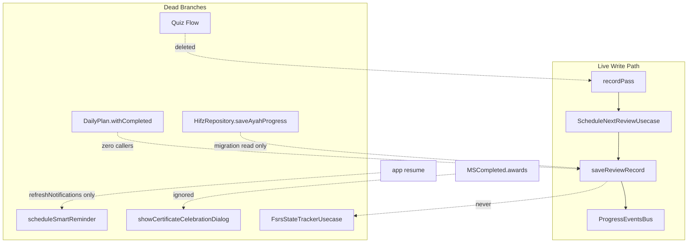

---

## 11.9 Phase 11 Verdict

**~40% of memorization domain surface area is ghost code**: legacy Hifz segments, FSRS shadow, quiz/daily-plan completion, smart settings, streak freezes, and most XP keys. The **production path is narrow**: V2/Kids SRS writes → SM-2 → Isar → bus → `ProgressMetricsService` reads.

Recommended cleanup tiers:

| Tier | Action |
|------|--------|
| **P0** | Wire or remove: daily plan completion, quiz hub copy, FSRS write hook |
| **P1** | Wire or remove: cert celebration, smart reminder, `learningAlertRoute` |
| **P2** | Delete or migrate: Hifz segment helpers, unused XP keys, `SmartMemorizationSettings` fields |
| **P3** | Consolidate: inline insights → DI or dedicated screen; register or delete orphan usecases |

Cross-cutting themes updated:

| ID | Theme | Phases |
|----|-------|--------|
| C12 | FSRS / analytics stack unwired | 6, **11** |
| C13 | Legacy Hifz domain orphaned | 5, **11** |
| C14 | Quiz + daily-plan completion dead APIs | 8, 10, **11** |
| C15 | Hidden toggles & shadow notifications | **11** |

---

Phase 11 complete. Say **start phase 12** for runtime consistency (write → all surfaces), or name another phase.

---

# Phase 12 — Runtime Consistency Audit

Read-only trace of **write → read** propagation across all memorization surfaces. This phase validates whether a single user action produces the same truth everywhere at runtime.

---

## 12.1 Consistency Model

**Intended invariant** (partially enforced by tests):

```text
Write → Isar/SharedPreferences → ProgressEventsBus → Cubits reload
Read  → ProgressMetricsService (adult | kids | certificates audiences)
```

**Surfaces audited:**

| # | Surface | Read path |
|---|---------|-----------|
| S1 | Home `OverallProgress` | `GetProgressUsecase` → `ProgressRepositoryImpl` |
| S2 | Progress tab | Same as S1 |
| S3 | Home Smart Coach / hero | `GetSmartCoachRecommendationUsecase` + inline insights |
| S4 | Home streak / heatmap | `StreakCubit` + `GetActivityHeatmapUsecase` |
| S5 | Home XP | `XpService.getTotalXp()` (bus: XP-only refresh) |
| S6 | Certificates | `AchievementService` (SharedPreferences) |
| S7 | Parent local dashboard | `KidsProgress` + logs (not SRS metrics) |
| S8 | Parent remote child | Cloud rows → `_buildProductionSummary` |
| S9 | Cloud mirror | Best-effort push on write + auth resync |

---

## 12.2 Write Path Propagation Matrix

### A. Adult V2 — per-ayah `recordPass` (during reciting)

| Step | Action | Bus | Surfaces updated (300 ms debounce) |
|------|--------|-----|-----------------------------------|
| 1 | `saveReviewRecord` → Isar | `reviewRecord` | S1, S2, S3 (on next full Home `load`) |
| 2 | Cloud push if `v2Session` | — | S8 (best-effort, async) |
| — | XP / streak / certs | — | **Not yet** |

**Consistency:** S1 ≡ S2 after reload (same repository). S3 coach may still show pre-session recommendation until Home reload completes.

---

### B. Adult V2 — block complete

```text
recordWeakAyahs → gamification (streak, XP, certs) → clear session
```

| Step | Action | Bus | Surfaces |
|------|--------|-----|----------|
| 1 | `recordWeakAyahs` → more `recordPass` | `reviewRecord` × N | S1, S2, S3 |
| 2 | `StreakService.recordActivity(Δ=block size)` | `streak` | S1, S2, S4 |
| 3 | `addXp('v2_block_completed')` | **none** (key missing → 0 XP) | S5 **unchanged** |
| 4 | `checkAndUnlockCertificates` | `certificate` if new | S1, S2, S6 |
| 5 | Cloud cert push | — | S8 |

**Gaps:** S5 never updates from V2 completion. S6 may fire after S1/S2 already reloaded from step 1 — user may need a second navigation to see cert badge on Home achievements row.

---

### C. Kids — `markCompleted`

Order in `KidsModeCubit` (evidence: `kids_mode_cubit.dart:324–383`):

| Order | Write | Bus |
|-------|-------|-----|
| 1 | `awardKidsPoints` → SP + `saveKidsSessionLog` | `kidsProgress` |
| 2 | `recordPass(kidsMode)` | `reviewRecord` |
| 3 | `recordActivity(1)` + `addXp('ayah_memorized')` | `streak`, `xp` |
| 4 | `checkAndUnlockCertificates` | `certificate` if new |
| 5 | Redundant `_saveKidsSessionLog` | no-op (existing log) |

| Surface | Consistent? | Notes |
|---------|-------------|-------|
| S1/S2 kids points/stars | ✅ | Via `kidsProgress` reload |
| S1/S2 adult SRS metrics | ⚠️ | Still `ProgressAudience.adult` — kids ayah **excluded** |
| S1 streak (shared) | ✅ | Kids activity increments device streak |
| S5 XP | ✅ | Kids path only XP writer besides broken V2 key |
| S6 certs | ✅ | `kidsMode` eligible |
| S7 parent local | ❌ stale | No bus subscription; manual refresh |
| S8 cloud | ⚠️ | Review pushed as `kidsMode`; summary uses **adult** audience |

---

### D. Read page confirm

| Step | Bus | Surfaces |
|------|-----|----------|
| `saveReadPage` | `readPage` | S1, S2 |
| `recordActivity(1)` | `streak` | S1, S2, S4 |

**Consistency:** S1 reading stats ≡ S2. Two events coalesce via debounce.

---

### E. Hifz migration (app start)

| Step | Bus | Cloud |
|------|-----|-------|
| `saveReviewRecord(hifz)` per ayah | `reviewRecord` each | **Excluded** from `_isProductionReviewRecord` |

**Consistency:** S1/S2 **include** `hifz` in adult metrics (`isAdultProductionCount`). S8 **excludes** `hifz` — local ≠ remote parent totals.

---

### F. Auth cloud pull (login / resume)

| Data | Pull | Bus notify |
|------|------|------------|
| Streak | `_pullStreakFromCloud` (max merge) | **None** |
| XP | `_pullXpFromCloud` (max merge) | **None** |
| Daily activities | `_pullDailyActivitiesFromCloud` | **None** |
| Review records | **Not pulled** | — |

**Consistency:** S1–S5 can remain stale until next write or manual tab revisit. Push on resume (`resyncProductionDataToCloud`) is best-effort only.

---

## 12.3 Cross-Surface Consistency Findings

### P12-CRIT-01 — Shared Isar key: kids overwrite adult SRS row

| Field | Value |
|-------|-------|
| **Severity** | Critical |
| **Impact** | Same `(surahId, ayahNumber)` → one row; mode tag replaced |
| **Evidence** | `isar_ayah_review_record.dart` — `@Index(unique: true)` on `compositeKey = '${surahId}_${ayahNumber}'`; kids `recordPass` sets `createdByMode: kidsMode` |
| **Call chain** | Adult V2 `recordPass(v2Session)` → later Kids `recordPass(kidsMode)` → **same key, tag flip** |
| **Surfaces affected** | S1/S2 adult metrics **drop** ayah; S6 certs **keep** (`isCertificateEligibleSource` includes kids); S8 cloud shows `kidsMode` |
| **Root cause** | Key does not include audience/mode |
| **Recommended fix** | Composite key includes mode, or reject cross-mode overwrite |
| **Priority** | P0 |

---

### P12-CRIT-02 — Local adult metrics vs remote parent summary (audience + hifz)

| Field | Value |
|-------|-------|
| **Severity** | Critical |
| **Impact** | Device Progress/Home ≠ parent app remote panel for same child |
| **Evidence** | Local: `ProgressAudience.adult` + `hifz` included; Remote: `_buildProductionSummary` uses `ProgressAudience.adult` on cloud rows; cloud excludes `hifz` |
| **Files** | `progress_repository_impl.dart:59–63`, `memorization_plus_repository_impl.dart:1644–1646, 1889–1897` |
| **Priority** | P0 |

---

### P12-CRIT-03 — Daily plan never advances → coach/cloud/completion diverge

| Field | Value |
|-------|-------|
| **Severity** | Critical |
| **Impact** | Smart Coach P5 `completedCount/totalCount` frozen; cloud `completed_count` always 0 |
| **Evidence** | `generateDailyPlan` sets `completedAyahNums: const []`; `withCompleted()` uncalled; V2 session has no plan hook |
| **Surfaces** | S3 coach subtitle, S8 daily plan row, no S1/S2 field (plan not in `OverallProgress`) |
| **Priority** | P0 |

---

### P12-HIGH-01 — Home hero backlog ≠ Progress “due today”

| Field | Value |
|-------|-------|
| **Severity** | High |
| **Impact** | Unified journey P3 `overdueAyahs` can disagree with `progress.reviewAyahs` |
| **Evidence** | `ReviewWorkloadInsightsUsecase.analyze` — **no** `ReviewRecordFilters`; counts all records with `strengthLevel > 0`. Progress uses `ProgressAudience.adult` + `ReviewClassifier` |
| **Call chain** | `HomeCubit:203–221` → `insights.dueAyahs` vs `OverallProgress.reviewAyahs` from metrics |
| **Example** | Kids `kidsMode` rows inflate hero backlog; excluded from Progress due count |
| **Priority** | P1 |

---

### P12-HIGH-02 — Cloud pull silent (post-login stale UI)

| Field | Value |
|-------|-------|
| **Severity** | High |
| **Impact** | After login on second device, streak/heatmap/XP on S1/S4/S5 wrong until unrelated write |
| **Evidence** | `AuthCubit._pullFromCloud()` — no `ProgressEventsBus.notify` |
| **Priority** | P1 |

---

### P12-HIGH-03 — V2 block XP write is a no-op → S5 drift

| Field | Value |
|-------|-------|
| **Severity** | High |
| **Impact** | Engagement XP tile never reflects V2 sessions |
| **Evidence** | `addXp('v2_block_completed')` → key absent in `XpConstants.rewards` → early return, no bus |
| **Surfaces** | S5 only (S1/S2 skip XP by design) |
| **Priority** | P1 |

---

### P12-HIGH-04 — Certificate earn: bus order vs UI wiring

| Field | Value |
|-------|-------|
| **Severity** | High |
| **Impact** | Certs earned but not shown in session UI; Progress cert section may refresh before/after achievement row |
| **Evidence** | `MSCompleted.awards` ignored in `V2CompletionPage`; `showCertificateCelebrationDialog` never called; kids `newAwards` in state — **no UI** in `kids_gamified_listen_page.dart` |
| **Surfaces** | S6 partial (Progress `_CertificatesSection` listens to `certificate` reason only) |
| **Priority** | P1 |

---

### P12-HIGH-05 — Daily plan cloud lag on regeneration

| Field | Value |
|-------|-------|
| **Severity** | High |
| **Impact** | New UTC-day plan local; cloud stale until login/resync |
| **Evidence** | `generateDailyPlan` → `_datasource.saveDailyPlan` only; `_pushDailyPlanBestEffort` only in public `saveDailyPlan()` (uncalled from lib) |
| **Surfaces** | S8 vs S3 cached plan |
| **Priority** | P2 |

---

### P12-MED-01 — Parent local dashboard not bus-connected

| Field | Value |
|-------|-------|
| **Severity** | Medium |
| **Impact** | Child completes ayah on device; parent dashboard open → stale logs/points |
| **Evidence** | `ParentDashboardCubit` — no `ProgressEventsBus` listener |
| **Priority** | P2 |

---

### P12-MED-02 — Mid-session Home/Progress reload

| Field | Value |
|-------|-------|
| **Severity** | Medium (UX) |
| **Impact** | Each passed ayah fires `reviewRecord`; debounced reload while user still in V2 |
| **Evidence** | `memorization_session_cubit.dart:524–531` per-ayah save |
| **Consistency** | Numbers correct but flicker; coach on S3 if user backgrounds to Home mid-session |
| **Priority** | P3 |

---

### P12-MED-03 — Streak shared across personas

| Field | Value |
|-------|-------|
| **Severity** | Medium |
| **Impact** | Kids session increments streak shown on adult Home |
| **Evidence** | Single `StreakIsar` id=1; kids call same `StreakService` |
| **Design?** | Device-wide streak — document or split by profile |
| **Priority** | P3 |

---

### P12-MED-04 — Smart Coach route vs Progress “last memorized”

| Field | Value |
|-------|-------|
| **Severity** | Medium |
| **Impact** | Coach navigates to `startAyah=1` for daily plan continue; metrics `lastMemorizedAyahNumber` may differ |
| **Evidence** | `smart_coach_engine.dart:130` `_v2SessionRoute(plan.surahId, 1)` |
| **Surfaces** | S3 route ≠ implied progress position |
| **Priority** | P2 |

---

### P12-LOW-01 — FSRS columns never written → analytics/report fiction

| Field | Value |
|-------|-------|
| **Severity** | Low (runtime reads empty) |
| **Impact** | `MemorizationInsightsAggregator` FSRS fields always zero/empty |
| **Evidence** | No `FsrsStateTrackerUsecase` on save path |
| **Surfaces** | S3 hero inputs only (partial use of `dueAyahs`) |
| **Priority** | P3 |

---

## 12.4 Scenario Walkthroughs

### Scenario 1: Adult completes 5-ayah V2 block (logged in)

| Time | Event | S1 memorized | S4 streak | S5 XP | S6 cert | S8 cloud |
|------|-------|--------------|-----------|-------|---------|----------|
| T0 | 5× `recordPass` | +0..5 learning | — | — | — | 5× push |
| T1 | Block streak Δ=5 | — | +activity | — | — | lag |
| T2 | XP block | — | — | **0** | — | — |
| T3 | New juz cert | reload | — | — | +1 | push on earn |

**Verdict:** S1/S2 consistent with each other; S5/S8 incomplete.

---

### Scenario 2: Child then adult same ayah (shared device)

| Step | S1 adult mem | S1 kids pts | Row tag |
|------|--------------|-------------|---------|
| Adult V2 pass | +1 started | — | `v2Session` |
| Kids complete | **unchanged mem** if strength≥6 excluded from adult count, or **lost** if overwrote | +points | `kidsMode` |

**Verdict:** **P12-CRIT-01** — data loss / tag corruption.

---

### Scenario 3: User reads page, checks Progress tab

| Surface | readPages | streak | Match? |
|---------|-----------|--------|--------|
| S1 | ✅ bus | ✅ | — |
| S2 | ✅ same entity | ✅ | ✅ |

**Verdict:** Consistent (best-case path).

---

## 12.5 What Tests Actually Guarantee

`test/integration/progress_snapshot_consistency_test.dart` validates:

- Home entity ≡ Progress entity ≡ `ProgressMetricsService` (adult) for a **synthetic** record set
- Parent local snapshot uses same adult metrics
- Certificate unlock aligns with `ProgressAudience.certificates`

**Not covered:**

- Kids audience on Progress tab
- Cloud round-trip
- Cross-mode key overwrite
- Bus refresh after pull
- Daily plan completion
- V2 multi-notify ordering

---

## 12.6 Consistency Scorecard

| Write event | S1=S2 | S3 coach | S4 heatmap | S5 XP | S6 certs | S7 parent | S8 cloud |
|-------------|-------|----------|------------|-------|----------|-----------|----------|
| V2 ayah pass | ✅ | ⚠️ debounce | — | — | — | — | ✅ async |
| V2 block done | ✅ | ⚠️ | ✅ | ❌ | ⚠️ UI | — | ⚠️ streak lag |
| Kids complete | ⚠️ audience | ⚠️ | ✅ | ✅ | ⚠️ UI | ❌ stale | ⚠️ audience |
| Read page | ✅ | — | ✅ | — | — | — | ⚠️ auth only |
| Hifz migrate | ✅ local | ✅ | — | — | ✅ | — | ❌ excluded |
| Auth pull | ❌ stale | ❌ | ❌ | ❌ | — | — | N/A |

Legend: ✅ consistent · ⚠️ partial · ❌ broken · — not applicable

---

## 12.7 Phase 12 Verdict

**Local read surfaces (Home + Progress) stay consistent with each other** when the bus fires and both use `ProgressRepositoryImpl` — this is the strongest guarantee in the app.

**Runtime consistency breaks** at boundaries:

1. **Storage key** — one ayah row, multiple modes (C4 / P12-CRIT-01).
2. **Audience** — adult vs kids vs certificates vs remote parent (C6).
3. **Cloud asymmetry** — push selective, pull incomplete, no bus (C7).
4. **Dead write branches** — daily plan completion, V2 XP (C1, C8).
5. **Split calculators** — hero insights unfiltered vs `ProgressMetricsService` (new C16).

Cross-cutting theme added:

| ID | Theme | Phases |
|----|-------|--------|
| C16 | Hero insights due count ≠ Progress due metrics | **12** |

---

Phase 12 complete. Say **start phase 13** for the state machine audit, or name another phase.

---

# Phase 13 — State Machine Audit

Read-only audit of memorization-related state machines: legal/illegal transitions, terminal states, resume behavior, cubit↔engine alignment, and gaps vs Product Rules §11 (referenced in `session_phase.dart`).

---

## Scope

| Machine | Layer | Formalized? | Test coverage |
|---------|-------|-------------|---------------|
| V2 session phases | Domain (`V2SessionEngine`) | Yes — enum + asserts | Strong (`session_engine_test`, block review, resume) |
| V2 cubit shell | Presentation (`MemorizationSessionCubit`) | Partial — 5 cubit states | Thin (no cubit completion/resume tests found) |
| Kids listen flow | Presentation (`KidsModeCubit`) | Implicit UI flags | Partial |
| Kids journey stages | Domain + UI | Enum only | `needsReview` never produced |
| Guardian pairing | Presentation | Yes | Moderate |
| Parent dashboard PIN | Presentation | Yes | Moderate |
| Custom plan editor | Presentation | Yes | Basic |
| Unified journey priority | Domain | Priority ladder, not enum FSM | Integration via Home |
| Ayah review / FSRS | Data model | `ReviewState` enum | **Writes never transition it** (Phase 11) |
| Route guards | Router | Profile-driven redirects | Async guards |

---

## 1. V2 Session Phase Machine (Product Rules §11)

**Evidence:** `lib/core/memorization/v2/session_phase.dart`, `session_engine.dart`, `session_state.dart`

### States (8)

```
created → learning → memorizing ⇄ reciting → remediation → memorizing
                ↓ (all ayahs passed)
         blockReviewPending → blockReview → completed
                ↓ (blockReviewRequired == false)
              completed
```

### Legal transitions (engine)

| From | Event | To |
|------|-------|-----|
| `created` | `startLearning()` | `learning` |
| `learning` | `startMemorizing()` | `memorizing` |
| `memorizing` / `remediation` | `startReciting()` | `reciting` |
| `reciting` | pass (not last ayah) | `learning` (next ayah) |
| `reciting` | pass (last ayah, block review on) | `blockReviewPending` |
| `reciting` | pass (last ayah, block review off) | `completed` |
| `reciting` | fail | `remediation` |
| `remediation` | `completeRemediation()` | `memorizing` |
| `blockReviewPending` | `startBlockReview()` | `blockReview` |
| `blockReview` | pass | `completed` |
| `blockReview` | fail | `remediation` (targeted ayah) |

**Terminal:** `completed` only (`V2SessionPhaseX.isTerminal`).

**Non-restorable:** `created`, `completed` (cubit resume gate in `startSession`).

**Call chain (adult happy path):**

`V2SessionPage` → `MemorizationSessionCubit.startSession()` → `_engine.startLearning()` → UI pages call `advanceToMemorizing` / `advanceToReciting` / `stopRecording` → `_engine.evaluateRecitation` → `_handlePostEvaluation` → `_onBlockCompleted` → `MSCompleted`.

### Cubit overlay states

```
MSInitial → MSLoading → MSActive* → MSCompleted
                    ↘ MSError
```

`* MSActive` carries orthogonal flags: `isRecording`, `isPlaying`, `isEvaluating`, `speechIssue` — not engine phases.

**Alignment:** Cubit methods map 1:1 to engine transitions for user-driven steps. Evaluation is cubit-owned (STT → engine).

---

## 2. Resume & Dual-Channel State

Two independent resume stores:

| Store | Mechanism | Granularity |
|-------|-----------|-------------|
| **Isar** | `V2SessionProgressAdapter` | Phase, ayah index, passed set, failures, hints |
| **SharedPreferences** | `AppSessionService.last_restorable_location` | Router URL only |

**Call chains:**

- Isar restore: `startSession` → `loadIfExists(surahId)` → `V2SessionProgressAdapter.restore()` → `MSActive`
- URL restore: `UnifiedJourneyEngine` P1 → Home resume banner → `context.push(location)` → new `V2SessionPage` → `startSession` (Isar wins if present)

```246:271:lib/features/memorization_plus/presentation/cubits/memorization_session_cubit.dart
    final savedOpt = await _progressAdapter.loadIfExists(surahId);
    // ...
    if (saved != null) {
      final savedPhase = V2SessionPhase.values[saved.phaseIndex];
      if (savedPhase == V2SessionPhase.completed) {
        await _progressAdapter.clear(surahId);
      } else if (savedPhase != V2SessionPhase.created &&
          saved.blockAyahNumbers.isNotEmpty) {
        _sessionState = V2SessionProgressAdapter.restore(saved, allAyahs);
        emit(MSActive(/* ... */));
        return;
      }
    }
```

---

## Findings

### P13-01 — Critical: Post-completion restorable URL starts a fresh session

**Severity:** Critical  
**Impact:** User who completes a block and backgrounds the app on the completion screen can be offered “Resume session,” which starts a **new** block (Isar cleared) at `startAyah` from the URL — often `1` — not a true resume.

**Evidence:**
- `_onBlockCompleted` clears Isar but does **not** call `AppSessionService.clearLastRestorableLocation()`
- `V2CompletionPage` navigates to hub only on button tap; route stays `/memorization-v2/session` until then
- `app.dart` saves location on `paused`/`inactive`

**Files:** `memorization_session_cubit.dart`, `v2_completion_page.dart`, `app.dart`, `app_session_service.dart`, `unified_journey_engine.dart`

**Call chain:** Complete → `MSCompleted` → user backgrounds → `saveLocation(/memorization-v2/session?...)` → Home P1 resume → `V2SessionPage` → `startSession` (no Isar) → new block at `startAyah`

**Root cause:** Completion is terminal for Isar but not for AppSessionService.

**Recommended fix:** Clear restorable location in `_onBlockCompleted` (and on explicit session abandon). Optionally save location only for in-progress phases.

**Risk:** Duplicate sessions, wrong ayah anchor (ties **C5**), user confusion.  
**Priority:** P0

---

### P13-02 — High: Duplicate terminal UI — `MSActive`+`completed` vs `MSCompleted`

**Severity:** High  
**Impact:** Two code paths render `V2CompletionPage`; awards/certificates only on `MSCompleted`.

**Evidence:**

```92:110:lib/features/memorization_plus/presentation/pages/v2_session_page.dart
          if (state is MSCompleted) {
            return V2CompletionPage(finalState: state.finalState);
          }
          // ...
            V2SessionPhase.completed => V2CompletionPage(
              finalState: state.sessionState,
            ),
```

**Call chain:** `_evaluateCurrentRecitation` emits `MSActive(sessionState.phase == completed)` → `_handlePostEvaluation` → `_onBlockCompleted` → `MSCompleted`

**Root cause:** Engine terminal phase exposed through `MSActive` before cubit terminal state.

**Recommended fix:** Treat `completed` only in `MSCompleted`; keep `MSActive` non-terminal or gate completion UI on `MSCompleted` only.

**Risk:** Flash of completion without awards; harder to reason about side effects.  
**Priority:** P1

---

### P13-03 — High: `KidsJourneyStageStatus.needsReview` is unreachable

**Severity:** High  
**Impact:** UI/assets for “needs review” houses never appear; journey FSM is incomplete vs design.

**Evidence:** Enum in `memorization_entities.dart`; UI in `kids_house_card.dart`. `getKidsJourney` assigns only `locked | current | completed`:

```845:853:lib/features/memorization_plus/data/repositories/memorization_plus_repository_impl.dart
        if (stageCompleted.length == ayahRange.length) {
          status = KidsJourneyStageStatus.completed;
        } else if (!foundCurrent) {
          status = KidsJourneyStageStatus.current;
          foundCurrent = true;
        } else {
          status = KidsJourneyStageStatus.locked;
        }
```

**Root cause:** No transition rule into `needsReview` (e.g. weak ayah / overdue review).

**Recommended fix:** Define transition (SRS weak ayah, coach flag, or time-since-review) and set status in `getKidsJourney`.

**Risk:** Misleading product spec vs runtime; dead UI branch.  
**Priority:** P1

---

### P13-04 — High: Kids mode bypasses V2 phase machine and has no session persistence

**Severity:** High  
**Impact:** Kids path is not Product Rules §11; resume URL does not restore listen-loop progress.

**Evidence:**
- `KidsModeCubit.load()` jumps to `learning` via `startLearning`, `blockReviewRequired: false`, single ayah
- No `V2SessionProgressAdapter` usage
- `_completeV2Session()` fast-forwards with perfect text:

```389:404:lib/features/memorization_plus/presentation/cubits/kids_mode_cubit.dart
  V2SessionState _completeV2Session(V2SessionState session) {
    var current = session;
    if (current.phase == V2SessionPhase.learning) {
      current = _sessionEngine.startMemorizing(current);
    }
    // ... startReciting → evaluateRecitation(current.currentAyah.text)
  }
```

- `AppSessionService` restorable: `/memorization-plus/kids?surahId&ayahNumber` — reload resets `_loopCount`

**Call chain:** Journey → listen page → `load()` → loops/recording → `markCompleted()` → `_completeV2Session` → `recordPass(kidsMode)`

**Root cause:** Kids UX is a parallel implicit FSM (flags: `isPlaying`, `currentLoop`, `isCompleted`) sharing V2 types cosmetically.

**Recommended fix:** Document as separate kids FSM; persist loop progress if URL resume is promised; or clear kids URL on exit.

**Risk:** False resume promise; adult/kids review semantics diverge.  
**Priority:** P1

---

### P13-05 — Medium: Engine transition guards are debug-only `assert`

**Severity:** Medium  
**Impact:** Illegal cubit→engine calls in release builds can corrupt `_sessionState` silently.

**Evidence:** All phase methods in `session_engine.dart` use `assert(state.phase == ...)`. Cubit uses `_assertActive()` similarly.

**Root cause:** No production-safe validation / error state.

**Recommended fix:** Return `Result` or no-op with logged error; emit `MSError` on illegal transition.

**Risk:** Rare UI race → stuck or wrong phase.  
**Priority:** P2

---

### P13-06 — Medium: No explicit abandon/cancel transition

**Severity:** Medium  
**Impact:** Back navigation leaves Isar session indefinitely; no `abandonSession()` or TTL.

**Evidence:** `MemorizationSessionCubit.close()` disposes audio/STT only; no `progressAdapter.clear` on pop.

**Root cause:** Resume-by-default design without explicit discard.

**Recommended fix:** Confirm-on-exit dialog; or clear on abandon; tie to AppSession clear.

**Risk:** Stale sessions resurfacing weeks later.  
**Priority:** P2

---

### P13-07 — Medium: Crash window between `completed` emit and `_onBlockCompleted`

**Severity:** Medium  
**Impact:** Per-ayah `recordPass` already persisted; block-level gamification / weak-ayah signaling / cert awards may be skipped.

**Evidence:** `_evaluateCurrentRecitation` emits `MSActive` with `completed` **before** `await _handlePostEvaluation` → `_onBlockCompleted`.

**Call chain:** Last recitation pass → emit completed → (crash) → restart → no Isar row → new session possible

**Root cause:** Side effects after UI emit; completed phase never written to Isar (by design) but block completion side effects are not idempotent on retry.

**Recommended fix:** Idempotent completion token; or persist “pending completion” flag; run gamification before emit.

**Risk:** Missing XP/certs despite successful recitation.  
**Priority:** P2

---

### P13-08 — Medium: `ReviewState` (FSRS) is a static label, not a live FSM

**Severity:** Medium  
**Impact:** `ReviewState.newCard|learning|review|relearning` never updated on write paths; scheduler uses `strengthLevel` + dates instead.

**Evidence:** `memorization_entities.dart` enum; Phase 11 noted FSRS shadow unwired.

**Root cause:** Dual model — enum for future FSRS, SM-2 fields active.

**Recommended fix:** Wire transitions on save or remove enum from production path until FSRS lands.

**Risk:** Future FSRS migration ambiguous starting state.  
**Priority:** P2 (ties **C2**)

---

### P13-09 — Low: Cubit cannot restart without new `BlocProvider`

**Severity:** Low  
**Impact:** `MSCompleted` and `MSError` are terminal for the cubit instance; retry from error goes to hub, not restart.

**Evidence:** `V2SessionPage` creates cubit once; error retry uses `context.go(memorizationPlus)`.

**Recommended fix:** Acceptable if intentional; add `restartSession()` if in-place retry desired.

**Priority:** P3

---

### P13-10 — Medium: `blockReviewRequired` profile rule vs kids hardcode

**Severity:** Medium  
**Impact:** Adult child profile (`isBlockReviewRequired` false if age &lt; 8) never reaches V2 — redirected to kids home. Adults always block-review unless profile read fails (defaults `true`).

**Evidence:** `MemorizationProfile.isBlockReviewRequired`; kids hardcode `false`; `v2SessionRedirect` adult-only.

**Root cause:** Split routing, not a single profile-driven session FSM.

**Priority:** P2 (documented behavior)

---

## 3. Auxiliary State Machines (summary)

### Guardian linking

```
Initial → Loading → Required | Pending | Expired | Used | Linked | Skipped | Blocked | Error
```

Pairing `PairingSessionStatus` → cubit state via `_emitSession` (`guardian_linking_cubit.dart`). **Well-aligned** with expired-pending split.

### Parent dashboard

```
Initial → Loading → NeedsPin → (setPin) → Locked → (unlock) → Loaded
                  ↘ Error
```

PIN gate is strict; no dashboard data without unlock. **Coherent.**

### Custom plan

```
Initial → Loading → Empty | Loaded → (save) → Saved
                  ↘ Error
```

No “active plan execution” state machine — plan is data-only (ties **C1** daily plan completion).

### Unified journey (priority, not phase FSM)

P1 restorable URL → P2 alerts → P3 backlog → P4 smart plan → P5 wird → P6 explore. **P1 can override coach/plan** even when Isar session absent (post-completion bug **P13-01**).

### Hifz cubit

Browse-only: `Initial | Loading | Loaded | Error` — no session phase FSM (legacy list UI).

---

## 4. Product Rules §11 Alignment Matrix

| Rule intent | Engine | Cubit/UI | Kids | Gap |
|-------------|--------|----------|------|-----|
| 8 phases | ✅ | ✅ adult V2 pages | ❌ bypass | Kids not §11 |
| Per-ayah cycle | ✅ | ✅ | N/A (1 ayah) | — |
| Remediation loop | ✅ | ✅ | ❌ | Kids skip |
| Block review | ✅ optional | ✅ | ❌ forced off | OK by design |
| Hints memorizing-only | ✅ | ✅ | ❌ | Kids no hints |
| STT reciting/block | ✅ | ✅ | Partial | Kids accept manual stop |
| Terminal completion | ✅ | ⚠️ dual UI | ✅ `isCompleted` | P13-02 |
| Resume interrupted | ✅ Isar | ✅ | ❌ | P13-04 |
| No double award | ✅ gate | ✅ clear completed | N/A | P13-01 URL |

---

## 5. State Diagram (Adult V2)

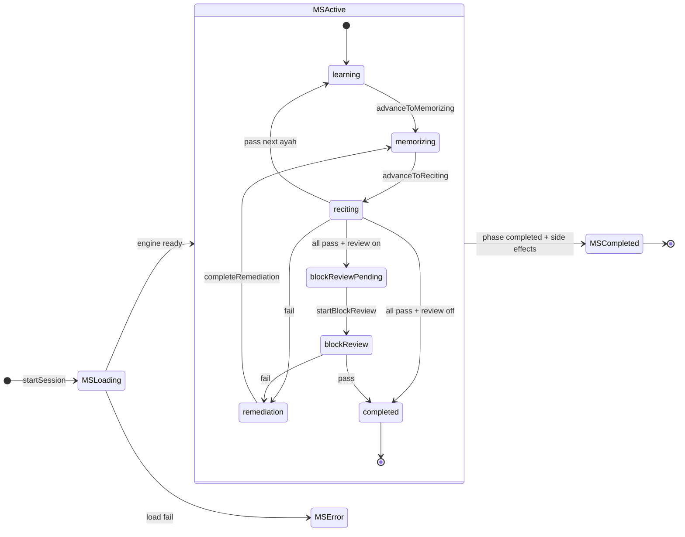

---

## 6. Test & Guard Gaps

| Area | Covered | Missing |
|------|---------|---------|
| Engine transitions | ✅ unit tests | — |
| Isar restore fidelity | ✅ `session_resume_test` | — |
| Cubit `MSCompleted` / gamification | ❌ | Integration |
| AppSession + Isar consistency | ❌ | P13-01 regression |
| Kids journey `needsReview` | ❌ | P13-03 |
| Illegal transition in release | ❌ | P13-05 |

Architecture guard: `presentation_progress_calculation_guard_test.dart` — not session FSM.

---

## Phase 13 Summary

**Strengths:** V2 engine is a clean, tested pure FSM aligned with §11; Isar resume gate prevents double gamification from persisted `completed`; guardian/parent PIN machines are explicit.

**Critical gap:** **Two resume channels desync at completion** (**P13-01**) — the highest-risk state bug in this phase, linked to **C5** (`startAyah=1`).

**Structural gaps:** Kids parallel FSM without persistence; journey `needsReview` dead; cubit exposes engine terminal phase before terminal cubit state; FSRS `ReviewState` inert.

---

Phase 13 complete. Say **“start phase 14”** for the cloud sync audit, or **“start phase 15”** if you want to skip ahead to diagrams + the final 15-question certification report.

---

# Phase 14 — Cloud Sync Audit

Read-only audit of Supabase integration: push/pull paths, merge semantics, production filters, auth/resume triggers, parent monitoring, and consistency with local progress.

---

## Scope & Architecture

Cloud sync is **split across two repositories** with different contracts:

| Channel | Owner | Direction | Data |
|---------|-------|-----------|------|
| **Auth sync** | `AuthRepositoryImpl` | Bidirectional (pull + push) | Streak, XP, daily activities (heatmap) |
| **Production sync** | `MemorizationPlusRepositoryImpl` | **Push-only** | V2/kids review records, cached daily plan, certificates (on earn) |
| **Kids gamification** | `MemorizationPlusRepositoryImpl` | Push-only | `kids_progress_cloud`, `kids_session_logs` |

**Evidence:** `lib/features/auth/data/repositories/auth_repository_impl.dart` (lines 367–528), `lib/features/memorization_plus/data/repositories/memorization_plus_repository_impl.dart` (lines 726–781, 1153–1324, 1642–1820)

### Sync Triggers

```
Login / session restore (AuthCubit)
  ├─ _pullFromCloud()          → streak, XP, daily activities
  └─ _pushProductionDataToCloud()
       ├─ syncProgressToCloud()           → streak, XP, daily activities
       └─ resyncProductionDataToCloud()   → all v2Session/kidsMode review records + daily plan

App resume (app.dart → AuthCubit.resyncOnResume)
  └─ PUSH ONLY (no pull)

Per-write (best-effort, unawaited)
  ├─ saveReviewRecord → _pushSingleReviewRecordBestEffort (production filter)
  ├─ saveDailyPlan → _pushDailyPlanBestEffort
  ├─ AchievementService._saveEarned → pushCertificatesToCloud
  └─ saveKidsSessionLog → syncKidsProgressToCloud (full kids sync)
```

**Call chain (login):** `AuthCubit` constructor / `authStateChanges` → `_pullFromCloud()` **∥** `_pushProductionDataToCloud()` (`auth_cubit.dart` lines 24–27, 52–92)

---

## Cloud Schema (Production Tables)

From `supabase_schema.sql` (Phase 7):

| Table | Merge on upsert | RLS |
|-------|-----------------|-----|
| `ayah_review_records_cloud` | **Last-write-wins** (`EXCLUDED.*`) | Child SELECT; parent SELECT via link; write via RPC only |
| `daily_plans_cloud` | Full row replace (`ON CONFLICT user_id`) | Child R/W; parent SELECT |
| `certificate_awards_cloud` | Append-only (`ignoreDuplicates`) | Child INSERT+SELECT; parent SELECT |
| `kids_progress_cloud` | **GREATEST** per field | Child write RPC; parent SELECT |
| `streaks` / `xp` / `daily_activities` | **GREATEST** (server + client pull) | Owner R/W |

`created_by_mode` CHECK on cloud: **`v2Session` | `kidsMode` only** — hifz explicitly excluded at DB level (schema lines 1046–1047).

---

## Findings

### P14-01 — Critical: Memorization review records have no pull path

**Severity:** Critical  
**Impact:** Multi-device use and reinstall cannot restore SRS/review state locally from cloud. Cloud is a **parent-monitoring mirror**, not a backup/restore source.

**Evidence:**
- `pullProgressFromCloud()` pulls only streak, XP, daily activities (`auth_repository_impl.dart` 388–397)
- `_reviewRecordFromCloud()` exists but is used **only** in `getRemoteChildren()` → `_buildProductionSummary()` — never writes to Isar
- Grep confirms single read of `ayah_review_records_cloud` in app code (parent fetch)

**Call chain:** Login → `_pullFromCloud()` → streak/XP/heatmap only; review records never merged locally

**Root cause:** Production sync designed as child→parent push, not bidirectional reconciliation.

**Recommended fix:** Add `pullProductionDataFromCloud()` with field-level merge (GREATEST on `strength_level`, latest `last_reviewed_at`, etc.) + `ProgressEventsBus` notify; or document explicitly that cloud is not backup.

**Risk:** Data loss on device switch; false expectation of “account sync.”  
**Priority:** P0

---

### P14-02 — Critical: Hifz / migration / legacy records excluded from cloud (C3)

**Severity:** Critical  
**Impact:** Parent remote dashboard under-reports child progress vs what the child device shows locally after Hifz migration or legacy data.

**Evidence:**
```1644:1646:lib/features/memorization_plus/data/repositories/memorization_plus_repository_impl.dart
  bool _isProductionReviewRecord(AyahReviewRecord record) =>
      record.createdByMode == ReviewRecordCreatedByMode.v2Session ||
      record.createdByMode == ReviewRecordCreatedByMode.kidsMode;
```

- `HifzMigrationService` tags records `createdByMode: hifz` — excluded from push
- DB CHECK rejects `hifz`, `migration`, `unknown`, `adultMemPlus`
- Local `ProgressMetricsService` **includes** hifz for adult audience (`progress_metrics.dart` line 5–7)

**Call chain:** Hifz migrate → `saveReviewRecord(hifz)` → local metrics ↑, cloud push skipped → parent `getRemoteChildren()` sees gap

**Root cause:** Intentional schema filter for “production V2/kids only” without reconciling migrated hifz volume.

**Recommended fix:** One-time cloud push for hifz-tagged records with DB CHECK expansion, or parent summary reads merged local+cloud with explicit hifz bucket.

**Risk:** Parent trust erosion; completion % mismatch.  
**Priority:** P0 (ties **C3**)

---

### P14-03 — Critical: Full resync uses last-write-wins — stale device can clobber cloud

**Severity:** Critical  
**Impact:** Device with older local state that logs in and resyncs overwrites newer cloud rows per ayah.

**Evidence:** `upsert_ayah_review_records` SQL (schema 1209–1221):
```sql
ON CONFLICT (user_id, surah_id, ayah_number)
DO UPDATE SET strength_level = EXCLUDED.strength_level, ...
```
No `GREATEST`, no `last_reviewed_at` comparison.

**Call chain:** Login → `resyncProductionDataToCloud()` → pushes **all** local production records in 500-row batches → overwrites cloud

**Root cause:** Push-only + naive upsert vs GREATEST-based merge used for streak/XP/kids progress.

**Recommended fix:** Server-side merge (max strength, latest timestamp wins) or pull-then-merge-before-push ordering.

**Risk:** Cross-device regression of memorization progress on parent view (and any future pull).  
**Priority:** P0

---

### P14-04 — High: Login pull and push run concurrently

**Severity:** High  
**Impact:** Race on login between `_pullFromCloud()` and `_pushProductionDataToCloud()`; mitigated for streak/XP by server GREATEST, **not** for review records (push-only).

**Evidence:** `auth_cubit.dart` lines 24–27 — both `unawaited` with no sequencing.

**Root cause:** Fire-and-forget parallel sync for latency.

**Recommended fix:** `await pull()` then `await push()` for auth-scoped data; separate ordering for production records once pull exists.

**Risk:** Transient inconsistency; review records always vulnerable (no pull).  
**Priority:** P1

---

### P14-05 — High: Cloud pull does not notify UI (C7)

**Severity:** High  
**Impact:** After login pull updates streak/XP/heatmap in Isar, Home/Progress cubits stay stale until manual navigation or a local write fires `ProgressEventsBus`.

**Evidence:**
- `_pullFromCloud()` → `pullProgressFromCloud()` — no bus call anywhere in auth path
- `saveReviewRecord` **does** call `_progressEvents.notify(ProgressChangedReason.reviewRecord)` (line 776)

**Call chain:** Login → silent Isar update → Home shows pre-pull streak until unrelated event

**Root cause:** Pull treated as invisible background hydration.

**Recommended fix:** Emit `ProgressChangedReason.cloudPull` (or `streak`/`xp`) after successful pull.

**Risk:** Stale hero metrics post-login (ties **C7**, Phase 12).  
**Priority:** P1

---

### P14-06 — High: App resume resync is push-only

**Severity:** High  
**Impact:** Activity on device B (streak, XP) is not pulled when device A resumes — only pushes A's local state upward.

**Evidence:**
- `app.dart` line 63: `getIt<AuthCubit>().resyncOnResume()`
- `resyncOnResume()` calls `_pushProductionDataToCloud()` only (`auth_cubit.dart` 98–101)
- Comment in `app.dart` 60–62 mentions certificates on resume — **certificates are not in resync** (see P14-07)

**Root cause:** Resume path optimized for parent monitoring (child pushes), not multi-device pull.

**Recommended fix:** Optional lightweight pull on resume (streak/XP at minimum) + bus notify.

**Priority:** P1

---

### P14-07 — High: Certificates not included in login/resume resync

**Severity:** High  
**Impact:** Certificates earned offline push only at earn time; failed push is never retried on login/resume.

**Evidence:**
- `resyncProductionDataToCloud()` pushes review records + daily plan only (lines 1656–1667)
- `pushCertificatesToCloud` called only from `AchievementService._saveEarned` (line 225)
- Certs stored in SharedPreferences (`earned_certificates_v2`), not bulk-read on resync

**Call chain:** Offline cert unlock → push fails → login resync → parent dashboard cert list missing

**Recommended fix:** Add `getEarnedCertificates()` bulk push to `resyncProductionDataToCloud()`.

**Risk:** Parent never sees milestones; append-only table makes this safe.  
**Priority:** P1

---

### P14-08 — High: Parent remote summary uses `ProgressAudience.adult` for child cloud data (C6)

**Severity:** High  
**Impact:** Parent viewing linked child sees adult-filtered metrics on kids-origin cloud records.

**Evidence:** `_buildProductionSummary` (lines 1889–1897):
```dart
final metrics = _metrics.calculate(
  records: records,
  audience: ProgressAudience.adult,  // hardcoded
  ...
);
```
Child profile in snapshot is synthetic (`MemorizationPath.child`) but audience filter still excludes `kidsMode`-weighted views where applicable.

**Root cause:** `ProgressAudience.kids` never used in production reads (Phase 9 **C8**).

**Recommended fix:** Use `ProgressAudience.kids` when `reviewRows` are child-owned, or dual metrics.

**Priority:** P1

---

### P14-09 — Medium: Custom memorization plan never synced

**Severity:** Medium  
**Impact:** Parent cannot see child's custom plan range; only ephemeral `daily_plans_cloud` row (generated plan cache) is pushed.

**Evidence:** `saveCustomPlan()` — local only, clears daily cache (`memorization_plus_repository_impl.dart` 1575–1590). No cloud table for custom plans.

**Priority:** P2

---

### P14-10 — Medium: FSRS shadow fields omitted from cloud payload

**Severity:** Medium  
**Impact:** Cloud mirror lacks `difficulty`, `stability`, FSRS predictions — any future pull/FSRS activation cannot reconstruct shadow state.

**Evidence:** `_pushReviewRecordsBatch` payload (lines 1781–1794) — 11 fields, no FSRS shadow columns; cloud table has no FSRS columns.

**Priority:** P2 (ties **C2**)

---

### P14-11 — Medium: Daily plan cloud mirrors non-persisted completion (C1)

**Severity:** Medium  
**Impact:** Parent sees stale `completed_count` because local daily plan completion is never advanced (Phase 8 **C1**), but whatever is cached still pushes.

**Evidence:** `_upsertDailyPlanRow` uses `plan.requiredCompletedCount` (line 1816); no completion persistence in session flow.

**Priority:** P2

---

### P14-12 — Medium: Ops docs reference deprecated `ayah_progress` cloud mirror

**Severity:** Medium  
**Impact:** Staging checklist (`docs/backend/supabase_runtime_readiness_checklist.md`) lists legacy `ayah_progress` RPC/table; production code uses `upsert_ayah_review_records` / `ayah_review_records_cloud`.

**Evidence:** Checklist lines 25, 33, 47 vs schema lines 346–347 deprecation note.

**Priority:** P2 (deployment risk)

---

### P14-13 — Low: Sign-out preserves all memorization Isar (by design)

**Severity:** Low  
**Impact:** Local-first policy — sign-out clears only `user_profile` pref; next login pushes local state to new account if user switches accounts on same device.

**Evidence:** `_authScopedPreferenceKeys` = `{ 'user_profile' }` only; delete-account UI copy confirms local progress retained.

**Risk:** Account switch data bleed via resync push.  
**Priority:** P3

---

### P14-14 — Low: Guest / offline — sync degrades gracefully

**Severity:** Low (positive)  
**Impact:** When Supabase uninitialized or user null, all sync methods return `Right(null)` without throwing.

**Evidence:** Tests in `memorization_plus_repository_impl_test.dart` lines 472–502; `_isSupabaseReady` guards throughout.

**Priority:** Informational

---

## What Works Well

| Area | Behavior |
|------|----------|
| **Kids progress merge** | `upsert_kids_progress_cloud` uses GREATEST — safe multi-push |
| **Kids session logs** | Idempotent `ON CONFLICT DO NOTHING` on `local_id` |
| **Streak/XP/heatmap** | Server GREATEST + client pull merge max — reasonable multi-device |
| **RLS parent read** | Linked parent can SELECT child production tables |
| **Local-first writes** | Cloud failure never blocks `saveReviewRecord` / daily plan cache |
| **Certificate immutability** | INSERT-only + `ignoreDuplicates` — safe retries |
| **Production filter alignment** | Client filter matches DB CHECK — hifz won't cause RPC rejection |

---

## Sync Flow Diagram

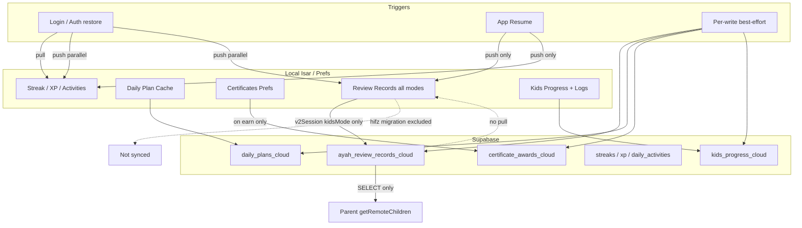

---

## Test Coverage Gaps

| Scenario | Covered? |
|----------|----------|
| Local save when cloud down | ✅ unit test |
| Resync no-op offline | ✅ unit test |
| Pull merge semantics | ❌ mock-only auth tests |
| Review record push filter | ❌ integration |
| Multi-device LWW regression | ❌ |
| Certificate resync on login | ❌ |
| ProgressEventsBus after pull | ❌ |

---

## Phase 14 Summary

Cloud sync is **asymmetric by design**: streak/XP/heatmap are bidirectional with GREATEST merge; memorization SRS is **push-only with last-write-wins**, filtered to `v2Session`/`kidsMode`, primarily serving **remote parent monitoring** — not device backup or true multi-device reconciliation.

**Top risks:** no review-record pull (**P14-01**), hifz excluded from parent view (**P14-02** / **C3**), stale-device cloud clobber (**P14-03**), silent pull leaving UI stale (**P14-05** / **C7**), certificates not retried on resync (**P14-07**).

---

Phase 14 complete. Say **“start phase 15”** for diagrams plus the final 15-question certification report.

---

# Phase 15 — Production Readiness & Final Certification

Synthesis of Phases 1–14 (read-only audit). All conclusions are evidence-backed from the Talia Quran codebase as audited.

---

## Part A — System Diagrams

### 1. Architecture Diagram

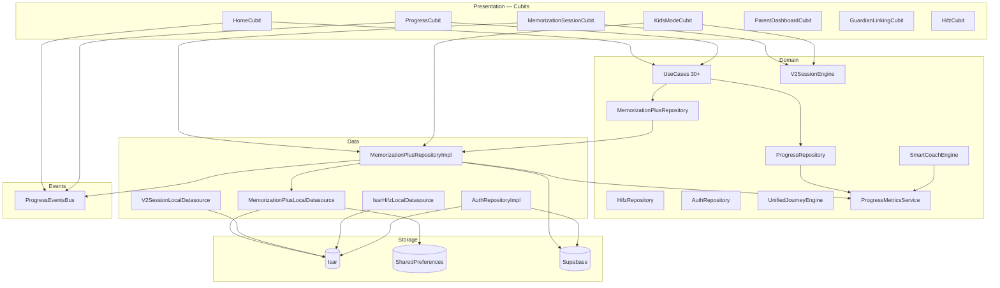

**SSOT:** Review records → `MemorizationPlusRepository.saveReviewRecord` → Isar `IsarAyahReviewRecord`. Metrics → `ProgressMetricsService.calculate()` only.

---

### 2. Runtime Flow Diagram

```mermaid
flowchart LR
  subgraph entry [Entry Points]
    MAIN[main.dart HifzMigration]
    SPLASH[Splash / Onboarding]
    SHELL[Tab /memorization Hub]
    COACH[Smart Coach / Journey Hero]
    NOTIF[Notification payload]
    RESUME[AppSessionService P1]
  end

  subgraph guard [Route Guards]
    MRG[MemorizationRouteGuard]
  end

  subgraph flows [Flows]
    V2[/memorization-v2/session]
    KIDS[/memorization-plus/kids]
    HIFZ[/hifz legacy browse]
    PARENT[/parent-dashboard]
  end

  MAIN --> SPLASH --> SHELL
  SHELL --> MRG
  COACH --> MRG
  NOTIF --> MRG
  RESUME --> V2
  MRG -->|adult| V2
  MRG -->|child| KIDS
  MRG -->|legacy| HIFZ
  MRG -->|linked parent| PARENT
```

**Gap:** Navigation often passes `startAyah=1`, not coach pending ayah (Phases 3, 7, 8, 12 — **C5**).

---

### 3. Memorization Engine Diagram (Adult V2)

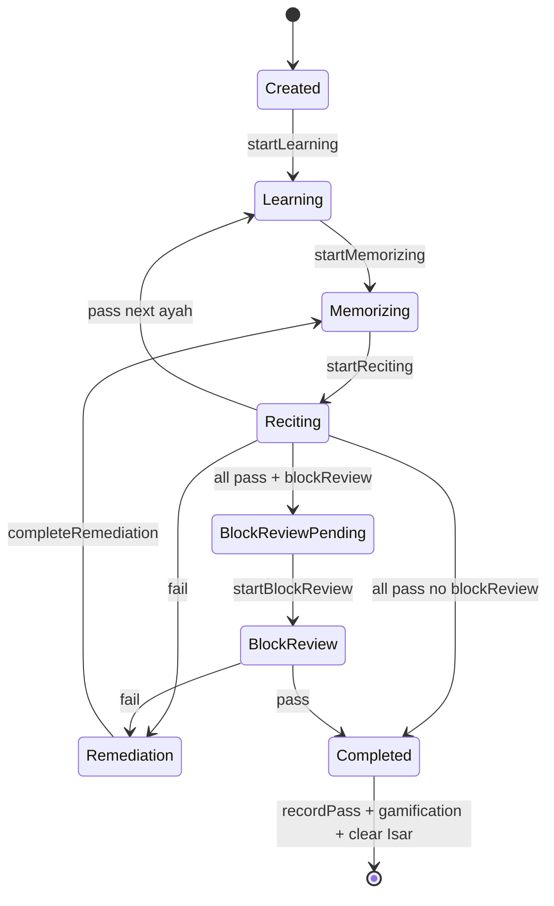

**Cubit:** `MemorizationSessionCubit` → `V2SessionReviewAdapter.recordPass` → `saveReviewRecord` → `ProgressEventsBus`.

**Kids:** Parallel implicit FSM in `KidsModeCubit`; cosmetically uses `V2SessionEngine` but bypasses most phases (Phase 4, 13).

---

### 4. Review Scheduler Diagram

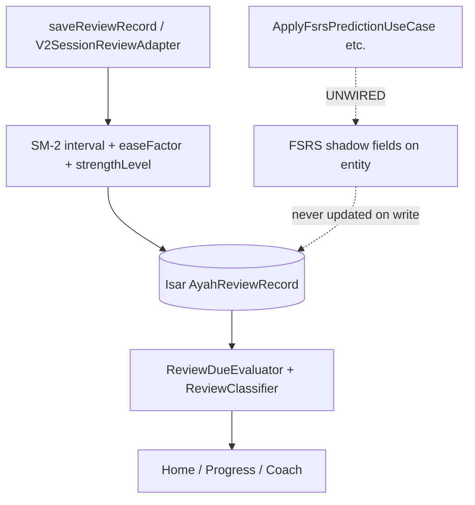

**Active:** SM-2 + `strengthLevel >= 6` = memorized. **Inactive:** FSRS writes, `ReviewState` transitions (Phases 6, 11, 13 — **C2**).

---

### 5. Smart Coach Diagram

```mermaid
flowchart TB
  SNAP[MemorizationSnapshot]
  READ[MemorizationProgressReader]
  AGG[MemorizationInsightsAggregator]
  SCE[SmartCoachEngine.recommend]
  UJE[UnifiedJourneyEngine P1-P6]
  HOME[HomePage hero / cards]

  ISAR[(Review records + daily plan cache)] --> READ
  READ --> SNAP
  SNAP --> AGG
  SNAP --> SCE
  SCE -->|kind + route| HOME
  UJE -->|P1 restorable URL wins| HOME
  AGG -->|overload/leech alerts| UJE
```

**Issues:** Hero may show unified journey over rich coach card; `dueAyahs` unfiltered vs Progress metrics (Phases 7, 10, 12). Kids records excluded from adult coach inputs (correct).

---

### 6. Daily Plan Diagram

```mermaid
flowchart TB
  GEN[getOrGenerateDailyPlan / repository]
  CACHE[(Isar DailyPlanModel cache)]
  COACH[SmartCoachEngine dailyPlan kind]
  COMPLETE[withCompleted / saveDailyPlan]
  CLOUD[daily_plans_cloud push]

  GEN --> CACHE
  CACHE --> COACH
  SESSION[V2 session completes ayah] -.->|NO LINK| COMPLETE
  COMPLETE -.->|DEAD public API| CACHE
  CACHE -->|best-effort| CLOUD
```

**Critical:** Plan items never marked complete after session (Phases 3, 8, 11 — **C1**). No dedicated daily plan UI (Phase 10).

---

### 7. Progress Diagram

```mermaid
flowchart TB
  WRITE[saveReviewRecord / streak / XP / kids log]
  BUS[ProgressEventsBus]
  RELOAD[HomeCubit + ProgressCubit debounced reload]
  PMS[ProgressMetricsService]
  AUD{ProgressAudience}

  WRITE --> BUS
  BUS --> RELOAD
  RELOAD --> PR[ProgressRepositoryImpl]
  PR -->|hardcoded adult| PMS
  PMS --> AUD
  AUD -->|adult| HOME[Home / Progress UI]
  AUD -->|kids| NOWHERE[Never used in production reads]
  AUD -->|certificates| ACH[AchievementService]

  AUTH_PULL[Auth pull streak/XP] -.->|no bus| ISAR[(Isar)]
```

**Strong:** Home ≡ Progress after bus reload (Phase 12 test). **Weak:** Cloud pull silent (**C7**); parent remote uses `ProgressAudience.adult` for child (**C6/C8**).

---

### 8. Parent Mode Diagram

```mermaid
flowchart TB
  subgraph local [Same Device]
    PIN[ParentDashboardCubit PIN gate]
    LOCAL[Local KidsProgress + session logs]
    PIN --> LOCAL
  end

  subgraph remote [Remote Parent]
    LINK[parent_child_links]
    READ[getRemoteChildren]
    KPC[kids_progress_cloud]
    ARRC[ayah_review_records_cloud]
    DPC[daily_plans_cloud]
    CAC[certificate_awards_cloud]
    SUM[_buildProductionSummary]

    LINK --> READ
    READ --> KPC
    READ --> ARRC
    READ --> DPC
    READ --> CAC
    ARRC --> SUM
  end

  CHILD[Child device] -->|push only| KPC
  CHILD -->|v2Session kidsMode only| ARRC
  CHILD -.->|hifz excluded| X[Not in cloud]
```

**Gap:** Parent cloud view ≠ child local view when hifz/migration records exist (**C3**). No review-record pull to child device (Phase 14 **P14-01**).

---

### 9. Legacy Hifz Diagram

```mermaid
flowchart TB
  LEGACY[(IsarAyahProgress legacy)]
  MIG[HifzMigrationService runIfNeeded]
  RR[(IsarAyahReviewRecord createdByMode=hifz)]
  HIFZ_UI[HifzPage browse only]
  METRICS[ProgressMetrics adult audience]
  CERT[ProgressAudience.certificates]
  CLOUD[Cloud push filter]

  LEGACY --> MIG
  MIG -->|one-time| RR
  LEGACY --> HIFZ_UI
  RR --> METRICS
  RR --> CERT
  RR -.->|excluded| CLOUD
```

**Status:** Migration + metrics + certificates yes; cloud + coach adult path partial; segment/unlock domain dead (Phase 5, 11).

---

## Part B — Production Readiness Score

| Dimension | Score | Notes |
|-----------|-------|-------|
| Adult V2 session core loop | **85%** | Engine tested; navigation/resume edge cases |
| Review / SRS scheduling | **70%** | SM-2 works; FSRS shadow dead |
| Smart Coach | **65%** | Logic exists; hero displacement, startAyah |
| Daily Plan | **25%** | Generation yes; completion unwired |
| Progress accuracy (single device) | **80%** | SSOT enforced; bus coverage gaps |
| Kids mode | **60%** | Works; isolation leak, FSM bypass |
| Parent mode (remote) | **55%** | Push works; incomplete mirror |
| Cloud sync | **40%** | Push-only SRS; no restore; hifz gap |
| UI completeness | **65%** | V2/kids solid; plan/FSRS/certs gaps |
| Test coverage | **60%** | Engine strong; integration thin |

### Overall Production Readiness: **58 / 100**

---

## Part C — Go / No-Go Decision

### **NO-GO** for full production certification of the memorization ecosystem

**Rationale:** Multiple 🔴 Critical blockers affect correctness, parent trust, and multi-device/account expectations — not cosmetic polish.

**Conditional GO** for **offline-first adult V2 memorization on a single device without parent cloud monitoring or daily plan completion tracking**, pending acceptance of documented limitations.

---

## Part D — Consolidated Blocker Register

| ID | Blocker | Phases |
|----|---------|--------|
| **B1** | Daily plan completion never persisted | 3, 7, 8, 10, 11, 12 |
| **B2** | FSRS shadow computed but never written | 6, 11, 13 |
| **B3** | Hifz/migration records excluded from cloud; parent view incomplete | 5, 9, 12, 14 |
| **B4** | Shared Isar review key — kids can overwrite adult records | 4, 12 |
| **B5** | Navigation uses `startAyah=1` not pending ayah | 3, 7, 8, 12 |
| **B6** | No review-record pull from cloud — not a true account backup | 14 |
| **B7** | Cloud pull silent — UI stale after login | 9, 12, 14 |
| **B8** | Post-completion restorable URL starts fresh session | 13 |
| **B9** | Stale device resync clobbers cloud review rows (LWW) | 14 |

---

# Final Report — 15 Certification Questions

---

### 1. Does memorization work correctly?

**Answer: Partially YES (adult V2); NO for daily-plan-driven memorization.**

| Verdict | 🟠 High confidence on core loop; 🔴 gaps on plan integration |
|---------|----------------------------------------------------------------|

**Evidence:**
- Adult V2: `V2SessionEngine` + `MemorizationSessionCubit` — learning → memorizing → reciting → remediation → block review → completed (`session_engine.dart`, `memorization_session_cubit.dart`)
- Per-ayah pass persists via `V2SessionReviewAdapter.recordPass` → `saveReviewRecord`
- Block completion triggers gamification + cert check (`_onBlockCompleted`)

**Gaps:**
- Smart Coach / hub navigation often opens session at ayah 1 (**B5**)
- Daily plan does not advance when ayahs complete (**B1**)

**Call chain (happy path):** Hub → `V2SessionPage` → `startSession` → `_engine.evaluateRecitation` → `_reviewAdapter.recordPass` → `saveReviewRecord` → `ProgressEventsBus`

**Recommended fix:** Wire plan completion on `recordPass`; pass coach pending ayah into route params.

---

### 2. Does review work correctly?

**Answer: YES for SM-2 scheduling on-device; NO for FSRS and cross-device review state.**

| Verdict | 🟡 SM-2 operational; FSRS and cloud review sync not production-ready |
|---------|-----------------------------------------------------------------------|

**Evidence:**
- `saveReviewRecord` updates `strengthLevel`, `intervalDays`, `nextReviewDate`, `easeFactor` (repository + scheduler tests)
- `ReviewClassifier` + `ReviewDueEvaluator` drive due/overdue in metrics and coach
- FSRS usecases exist but are not called on write (Phase 6, 11)

**Risk:** Future FSRS cutover has no persisted baseline (**B2**).

---

### 3. Does Smart Coach behave exactly as intended?

**Answer: Partially NO.**

| Verdict | 🟠 Logic correct; presentation and routing diverge from intent |
|---------|----------------------------------------------------------------|

**Evidence:**
- `SmartCoachEngine.recommend()` reads `MemorizationSnapshot`, excludes kids/legacy/unknown (Phase 7)
- `UnifiedJourneyEngine` P1 (restorable URL) can override coach recommendation (Phase 7, 13)
- Home hero metrics may use unfiltered `dueAyahs` vs Progress SSOT (Phase 12)
- Rich Smart Coach card displaced by unified journey hero (Phase 10)

**Root cause:** Two competing “next action” systems without strict priority contract in UI.

---

### 4. Does Daily Plan behave correctly?

**Answer: NO.**

| Verdict | 🔴 Critical — generation works; lifecycle incomplete |
|---------|------------------------------------------------------|

**Evidence:**
- `getOrGenerateDailyPlan` / `getCachedDailyPlan` persist generated plan (Phase 8)
- `withCompleted()` / public `saveDailyPlan()` have no session callers (Phase 11)
- Cloud mirrors stale `completed_count` (Phase 14 **P14-11**)
- No user-facing daily plan page (Phase 10)

**Impact:** Coach “daily plan” kind shows plan that never advances; parent cloud plan misleading.

---

### 5. Is Progress fully accurate?

**Answer: YES on single device after bus reload; NO across boundaries.**

| Verdict | 🟠 Accurate for adult V2+hifz locally; breaks at audience/cloud/resume edges |
|---------|-------------------------------------------------------------------------------|

**Evidence:**
- `ProgressMetricsService` is enforced SSOT; `presentation_progress_calculation_guard_test.dart` guards duplicate calc (Phase 9)
- `test/integration/progress_snapshot_consistency_test.dart` — adult alignment
- `ProgressRepositoryImpl` hardcodes `ProgressAudience.adult` (Phase 9)
- `ProgressAudience.kids` never used in production reads (**C8**)
- Auth cloud pull updates streak/XP without bus (**B7**)

---

### 6. Does Parent Mode reflect reality?

**Answer: Partially NO for remote parents; YES for same-device local dashboard.**

| Verdict | 🟠 Local PIN dashboard OK; remote cloud mirror incomplete |
|---------|---------------------------------------------------------|

**Evidence:**
- Same device: `getParentDashboard` reads local `KidsProgress` + logs (Phase 4)
- Remote: `getRemoteChildren` reads cloud tables; `_buildProductionSummary` uses `ProgressAudience.adult` on child records (Phase 14 **P14-08**)
- Hifz-tagged local progress not pushed (**B3**)
- Certificates not bulk-resynced on login (**P14-07**)

---

### 7. Does Kids Mode correctly integrate?

**Answer: Partially NO — functional for child UX; isolation and engine integration incomplete.**

| Verdict | 🟠 Playable; 🔴 isolation and FSM alignment failures |
|---------|------------------------------------------------------|

**Evidence:**
- Kids uses same Isar review collection as adult — shared `(surahId, ayahNumber)` key (**B4**)
- `KidsModeCubit` bypasses V2 phase machine; `_completeV2Session` auto-passes with perfect text (Phase 4, 13)
- `KidsJourneyStageStatus.needsReview` in UI but never assigned in `getKidsJourney` (Phase 13 **P13-03**)
- Kids records tagged `kidsMode` — correctly excluded from adult coach filters

---

### 8. Is Legacy isolated?

**Answer: Partially — isolated from cloud and coach adult path; NOT isolated from local metrics/certificates.**

| Verdict | 🟡 Runtime UI isolated; data still affects local totals |
|---------|--------------------------------------------------------|

**Evidence:**
- `HifzMigrationService` one-time → `createdByMode: hifz` (Phase 5)
- `_isProductionReviewRecord` excludes hifz from cloud (Phase 14)
- `ProgressMetrics` adult audience **includes** hifz (Phase 5, 9)
- `AchievementService` certificates audience includes hifz (Phase 5)
- `HifzPage` still routable for legacy browse; write paths to legacy repo orphaned (Phase 11)

---

### 9. Is any feature implemented but unreachable?

**Answer: YES.**

| Verdict | 🟠 Multiple fully or partially implemented features unreachable |
|---------|----------------------------------------------------------------|

| Feature | Evidence |
|---------|----------|
| FSRS shadow pipeline | Usecases in DI, zero write callers (Phase 11) |
| Daily plan completion API | `withCompleted()` dead (Phase 11) |
| `KidsJourneyStageStatus.needsReview` | UI only (Phase 13) |
| Certificate celebration dialog | Unwired (Phase 10) |
| `scheduleSmartReminder` | Dead (Phase 11) |
| Quiz flow | Deleted; l10n remnants (Phase 11) |
| `GetRetentionReviewSummaryUseCase` | Unregistered (Phase 11) |
| Custom plan | Saved locally, never cloud-synced (Phase 14) |

---

### 10. Is any UI disconnected from business logic?

**Answer: YES.**

| Verdict | 🟠 Several surfaces show stale or misleading state |
|---------|---------------------------------------------------|

| UI | Issue |
|----|-------|
| Home journey hero | Competes with Smart Coach; may resume wrong session (Phases 10, 13) |
| “Review Quiz” hub card | Routes to V2 session, not quiz (Phase 10) |
| Daily plan (coach-driven) | No page; plan never completes (**B1**) |
| FSRS / retention insights | Computed, zero UI (Phase 10) |
| Certificate celebration | Awards computed; dialog unwired (Phase 10) |
| Parent remote summary | Adult audience on kids cloud data (Phase 14) |
| Hardcoded bilingual strings | Hub/V2 bypass l10n (Phase 10) |

---

### 11. Is any code dead?

**Answer: YES — substantial.**

| Verdict | 🟡 Dead code present but mostly non-crashing |
|---------|---------------------------------------------|

**Categories (Phase 11):** Unregistered FSRS/retention usecases; orphaned Hifz segment/unlock helpers; removed V2 kids pages / feature flag / quiz; `JourneyDiagnostics` unused; most XP event keys never fired; `HifzCubit.selectPath` unused; `showCertificateCelebrationDialog` unwired.

**Risk:** Maintenance confusion; false confidence that FSRS/retention are live.

---

### 12. Is any calculation duplicated?

**Answer: YES — mitigated for Progress tab; duplication remains at boundaries.**

| Verdict | 🟡 SSOT enforced centrally; hero/parent/cloud recompute or filter differently |
|---------|-------------------------------------------------------------------------------|

**Evidence:**
- Guard test prevents presentation-layer progress calc (Phase 9) ✅
- `MemorizationInsightsAggregator` vs `SmartCoachEngine` overlap (Phase 7)
- Home hero `dueAyahs` vs `ProgressMetrics.dueReviews` (Phase 12)
- Parent `_buildProductionSummary` re-runs metrics with wrong audience (Phase 14)
- Legacy Hifz `AyahProgress` + migrated `AyahReviewRecord` dual storage (Phase 5)

---

### 13. Is any business rule inconsistent?

**Answer: YES.**

| Verdict | 🔴 Multiple contradictory rules across layers |
|---------|----------------------------------------------|

| Rule A | Rule B | Location |
|--------|--------|----------|
| Hifz counts in local progress | Hifz excluded from cloud | metrics vs `_isProductionReviewRecord` |
| Kids isolated in coach filters | Same Isar key as adult | filters vs datasource |
| Cloud = account sync (user expectation per auth UX) | Review records push-only, no pull | auth vs mem+ repo |
| Product Rules §11 8-phase FSM | Kids bypasses phases | engine vs kids cubit |
| Resume promises session continue | Kids reload resets loops | AppSessionService vs KidsModeCubit |
| Streak merge GREATEST | Review records last-write-wins | Supabase RPCs |

---

### 14. Is any feature partially implemented?

**Answer: YES — several.**

| Feature | Complete | Missing |
|---------|----------|---------|
| Daily Plan | Generation, cache, cloud push | Completion, UI, coach linkage |
| FSRS | Entity fields, usecases, tests | Write wiring, UI |
| Cloud sync | Push, parent read, RLS | Pull, merge, hifz, cert resync |
| Kids journey | locked/current/completed | `needsReview` transition |
| Certificates | Earn + local store + cloud push on earn | Celebration UI, bulk resync |
| Parent dashboard | Local + remote read | Accurate remote SRS mirror |
| V2 resume | Isar restore | AppSession URL desync on complete |
| ProgressAudience.kids | Enum defined | Never used in reads |

---

### 15. Is any production blocker present?

**Answer: YES — 9 confirmed blockers.**

| Verdict | 🔴 **NO-GO** for certified production release of full ecosystem |
|---------|----------------------------------------------------------------|

**Critical blockers (must fix before certification):**

1. **B1** — Daily plan completion never persisted  
2. **B4** — Kids/adult review record collision on shared Isar key  
3. **B6** — No review-record cloud pull (reinstall / multi-device data loss)  
4. **B3** — Parent cloud view missing hifz/migrated progress  
5. **B8** — Post-completion resume starts unintended new session  

**High blockers (fix before marketing parent/cloud sync):**

6. **B5** — Wrong start ayah in navigation  
7. **B7** — Silent cloud pull → stale UI  
8. **B9** — Stale device overwrites cloud SRS  
9. **P14-07** — Certificates not retried on resync  

---

## Recommended Fix Priority (Production Path)

| Priority | Fix | Effort |
|----------|-----|--------|
| P0 | Wire daily plan completion on `recordPass` | Medium |
| P0 | Namespace or filter kids/adult review records in Isar | Medium |
| P0 | Clear `AppSessionService` on session complete / abandon | Small |
| P0 | Pass coach pending ayah into V2 route | Small |
| P1 | Add review-record pull + GREATEST merge RPC | Large |
| P1 | Expand cloud filter OR map hifz → pushable mode | Medium |
| P1 | `ProgressEventsBus` after auth pull | Small |
| P1 | Bulk certificate resync on login | Small |
| P2 | Remove or wire FSRS; drop dead usecases | Medium |
| P2 | Parent summary `ProgressAudience.kids` | Small |
| P2 | `needsReview` journey transition or remove enum | Small |

---

## Audit Completion Statement

All **15 phases** completed with code evidence:

| Phase | Topic | Status |
|-------|-------|--------|
| 1 | Architecture | ✅ |
| 2 | Entry points | ✅ |
| 3 | Adult flow | ✅ |
| 4 | Kids mode | ✅ |
| 5 | Legacy Hifz | ✅ |
| 6 | Review scheduler | ✅ |
| 7 | Smart Coach | ✅ |
| 8 | Daily Plan | ✅ |
| 9 | Progress | ✅ |
| 10 | UI coverage | ✅ |
| 11 | Hidden / dead code | ✅ |
| 12 | Runtime consistency | ✅ |
| 13 | State machines | ✅ |
| 14 | Cloud sync | ✅ |
| 15 | Diagrams + certification | ✅ |

**Certification outcome:** The memorization ecosystem is **not certified for full production release** as of this audit. The adult V2 offline core is the strongest subsystem; parent cloud monitoring, daily plan, multi-device sync, and kids/adult isolation require remediation before **GO**.

---

*End of 15-phase production audit. No code was modified.*
