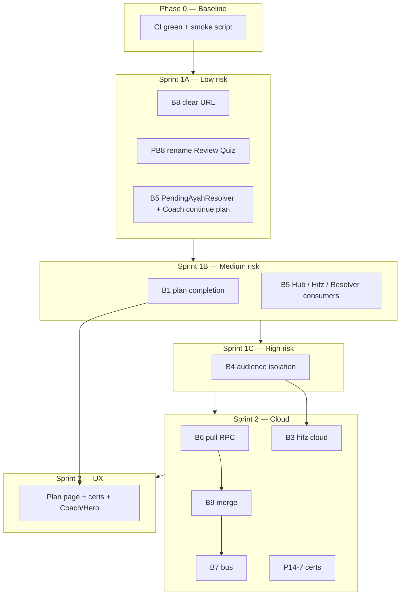

# Memorization Remediation Plan — Talia Quran

> **Last updated:** July 2026 (aligned with product validation + product behavior audits)  
> **Sources:**  
> - [memorization-production-audit.md](./memorization-production-audit.md) — 15-phase technical audit  
> - [memorization-product-validation-audit.md](./memorization-product-validation-audit.md) — product / UX / effectiveness  
> - [memorization-product-behavior-audit.md](./memorization-product-behavior-audit.md) — entry paths, SSOT, edge cases  
> **Purpose:** Safe, incremental fixes to reach production **GO** without regressing the working V2 core.  
> **Constraint:** Minimal diff · test-first · one concern per PR · no big-bang refactors.

---

## Executive Summary

| Item | Value |
|------|-------|
| **Technical audit verdict** | NO-GO (~58/100 engineering readiness) |
| **Product validation verdict** | NO-GO (~52/100) |
| **Product behavior verdict** | NO-GO (~52/100) |
| **What works today (do not break)** | Adult V2 in-session FSM · SM-2 writes · Home ≡ Progress after bus · offline local-first saves |
| **Target** | **GO WITH CONDITIONS** after Sprint 1–3; full **GO** after Sprint 2 cloud + Sprint 3 UX |
| **Duration** | 7–9 weeks (1–2 Flutter devs + backend for Sprint 2 only) |
| **Safety rule** | Every PR must pass `flutter test` + `progress_snapshot_consistency_test` before merge |

### Release tiers (what to ship when)

| Tier | After | Safe to market as |
|------|-------|-------------------|
| **Tier A** | Sprint 1 complete | Adult offline V2 beta (single device, no cloud-backup claim) |
| **Tier B** | Sprint 1 + 3 | Daily plan + Coach trustworthy on one device |
| **Tier C** | Sprint 1 + 2 + 3 | Account sync + parent remote (honest UX copy) |
| **Tier D** | All sprints | Full vision incl. kids isolation + review UX clarity |

---

## Safe Implementation Principles

These rules prevent breaking the live app while fixing blockers.

1. **Do not refactor `V2SessionEngine`** unless adding guards (P13-05) — engine tests are the safety net.
2. **Do not change Isar schema** without a backward-compatible read path and migration test (applies to **B4**).
3. **Do not reorder login sync** until pull RPC exists (**B6** before changing `auth_cubit` push/pull sequence).
4. **One behavioral concern per PR** — see PR split below; never combine B4 + B6 in one merge.
5. **Prefer additive changes** — new resolver / use case / bus reason before deleting code.
6. **Feature-flag optional** — cloud pull (`pullProductionDataFromCloud`) behind a remote config or compile-time flag until staging validated.
7. **Copy-only fixes are safe first** — rename “Review Quiz” hub card (PB8) before routing changes.
8. **Always run before merge:**
   - `flutter test`
   - `test/integration/progress_snapshot_consistency_test.dart`
   - `test/core/architecture/presentation_progress_calculation_guard_test.dart`
   - Manual smoke: start V2 → pass ayah → Home progress updates
9. **Rollback plan:** each PR must be revertible independently; avoid cross-file renames in blocker PRs.
10. **Kids changes last among data fixes** — adult V2 is the stable revenue path; validate B4 on branch with full isolation tests before release.

### Do NOT do (regression risk)

| Action | Risk |
|--------|------|
| Replace `MemorizationPlusRepository` write path | Breaks all SRS |
| Delete `HifzMigrationService` | Data loss for legacy users |
| Force cloud pull on every resume before merge RPC tested | Corrupt local SRS |
| Change `ProgressMetricsService` formulas without updating guard tests | Home/Progress divergence |
| Unify kids into full V2 UI in one PR | Large UX regression |
| Remove `/hifz` without redirect | Broken deep links / bookmarks |

---

## Unified Blocker Register

Technical (**B***) and product (**PB***) IDs mapped.

| ID | Problem | Product impact | Sprint | Risk if rushed |
|----|---------|----------------|--------|----------------|
| **B1 / PB1** | Daily plan completion never persisted | “Today’s plan” never advances | 1 | Low — additive hook on `recordPass` |
| **B5 / PB4** | Entry paths use `startAyah=1` / divergent context | Wrong ayah sessions | 1 | Medium — touch many routes; use resolver |
| **B8 / PB5** | Ghost resume after complete | Duplicate sessions | 1 | **Low** — clear URL only |
| **PB8** | “Review Quiz” label → V2 (not quiz) | Misleading UX | 1 | **Very low** — l10n + copy |
| **B4 / PB3** | Shared Isar key kids/adult | Progress overwrite | 1 | **High** — needs migration + tests |
| **B6 / PB2** | No SRS cloud pull | Reinstall loses hifz | 2 | High — backend + merge logic |
| **B9** | Cloud upsert LWW | Multi-device clobber | 2 | High — must ship with B6 |
| **B7** | Silent cloud pull | Stale Home after login | 2 | Low — bus notify only |
| **B3 / PB6** | Hifz excluded from cloud | Parent sees less than child | 2 | Medium — schema CHECK change |
| **P14-7** | Certs not bulk-resynced | Missing milestones remote | 2 | Low |
| **PB7** | Kids ≠ same engine (product) | Vision mismatch | 4+ | High — product decision |
| **PB9** | Certificate celebration hidden | Low motivation | 3 | Low — wire existing dialog |
| **B2** | FSRS unwired | False “smart” expectation | 5 | Medium — decision D4 |

---

## Dependency Map (revised)

**Hard dependencies (unchanged):**

- **B6 → B9 → B7** (never change push-only login until merge exists).
- **B4 → B3** (parent metrics need correct audience reads).
- **B1 → Daily Plan UI** (Sprint 3.2).
- **Sprint 1A before 1B** — quick wins restore user trust without data migration.

---

## Phase 0 — Preparation (3–5 days)

### 0.1 Baseline (mandatory)

| Task | Command / path |
|------|----------------|
| Full test suite | `flutter test` |
| Progress consistency | `test/integration/progress_snapshot_consistency_test.dart` |
| Architecture guard | `test/core/architecture/presentation_progress_calculation_guard_test.dart` |
| Document baseline | Record pass count + any pre-existing failures |

### 0.2 Manual smoke script (run after every Sprint 1 PR)

1. Adult: Hub → V2 session → pass one ayah → back → Home progress increased.  
2. Adult: Complete full block → no resume banner on Home.  
3. Child: Journey → listen → complete → stars updated.  
4. Guest: complete ayah → still local (no crash).

### 0.3 Architecture decision log

Record in `docs/memorization-remediation-decisions.md` (create on first decision):

| # | Question | Recommended (safe default) | Alternative |
|---|----------|---------------------------|-------------|
| **D1** | Kids/adult Isar isolation | **Read filter by `createdByMode`** + optional composite key migration | Separate collections (higher risk) |
| **D2** | Cloud promise | **Pull + merge** for SRS OR **remove backup copy** from UX until ready | Status quo (misleading) |
| **D3** | Hifz in cloud | Expand CHECK + one-time resync | Map at push only |
| **D4** | FSRS | **Defer (Sprint 5)** — document SM-2 only | Full activation |
| **D5** | Review vs memorize UX | **Phase 1:** honest copy; **Phase 2:** optional review-only route | Full new review mode (large) |

---

## Sprint 1A — Quick wins, zero data migration (Week 1)

*Goal: fix misleading behavior without touching Isar layout or cloud.*

### 1A.1 B8 — Ghost resume (PB5)

| # | Task | File | Safety |
|---|------|------|--------|
| 1 | `clearLastRestorableLocation()` in `_onBlockCompleted` | `memorization_session_cubit.dart` | Additive |
| 2 | Clear URL on kids complete | `kids_gamified_listen_page.dart` / completion flow | Additive |
| 3 | Gate completion UI on `MSCompleted` only | `v2_session_page.dart` | UI-only |
| 4 | Optional: confirm-on-pop for mid-session | `v2_session_page.dart` | UX-only |

**Test:** `session_resume_after_complete_test` (new).

**Acceptance:** No resume banner after successful block complete.

---

### 1A.2 PB8 — Fix misleading “Review Quiz” hub card

| # | Task | File | Safety |
|---|------|------|--------|
| 1 | Rename to “Review Session” / “مراجعة بالتسميع” | `memorization_hub_page.dart`, `app_ar.arb`, `app_en.arb` | Copy-only |
| 2 | Update subtitle to describe V2 recitation review | same | Copy-only |
| 3 | Remove or repurpose dead quiz l10n keys (Sprint 5) | arb files | Defer deletion |

**Acceptance:** Hub card text matches actual navigation (V2 session).

---

### 1A.3 B5 (partial) — Fix Coach “continue daily plan” ayah

| # | Task | File | Safety |
|---|------|------|--------|
| 1 | In `continueDailyPlan`, route to **first pending** plan ayah, not `1` | `smart_coach_engine.dart` ~L130 | Single-line logic fix |
| 2 | Unit test: pending ayah 7 → route contains `startAyah=7` | `test/core/memorization/smart_coach_engine_test.dart` | New test |

**Acceptance:** Coach continue-plan matches memorize-new ayah resolution.

---

## Sprint 1B — Plan completion + navigation SSOT (Week 2)

### 1B.1 B1 — Daily plan completion

| # | Task | File | Safety |
|---|------|------|--------|
| 1 | `MarkDailyPlanItemCompleted` use case (or repository method) | domain usecases | Additive |
| 2 | Call after successful `recordPass` when ayah ∈ today’s plan | `session_adapters.dart` | Hook only |
| 3 | Call from kids `markCompleted` | `kids_mode_cubit.dart` | Same hook |
| 4 | Persist via existing `saveDailyPlan` | `memorization_plus_repository_impl.dart` | Reuse API |
| 5 | `ProgressEventsBus.notify` after plan save | repository | Existing pattern |
| 6 | Cloud push (already best-effort) | unchanged path | No new failure mode |

**Do not:** change plan generation algorithm in same PR.

**Tests:** `daily_plan_completion_test` (new).

---

### 1B.2 B5 — `PendingAyahResolver` (SSOT for entry context)

Centralizes behavior-audit finding: **four competing sources** (Coach, Resolver, URL, Isar).

| # | Task | File | Safety |
|---|------|------|--------|
| 1 | New pure class `PendingAyahResolver` | `lib/core/memorization/pending_ayah_resolver.dart` | Additive |
| 2 | Inputs: profile, plan, review records, optional coach record | pure function | No I/O |
| 3 | Output: `PendingAyahTarget(surahId, startAyah, blockSize, intent)` | entity | — |
| 4 | Wire **MemorizationNavigationResolver** | replace `startAyah: 1` default | Consumer swap |
| 5 | Wire **HifzPage** tile | `hifz_page.dart:245` | One callsite |
| 6 | Wire **Hub** today-plan + review cards | via resolver | — |
| 7 | **Do not** change Isar resume precedence — document: Isar wins on `startSession` | docs only | Preserves mid-session resume |

**Tests:** `navigation_pending_ayah_test` covering Hub, Hifz, Coach kinds.

**Acceptance:** All **new** session starts use resolver; **mid-session resume** still uses Isar (unchanged).

---

## Sprint 1C — Audience isolation (Week 3)

### 1C.1 B4 — Kids / adult review isolation

**Highest regression risk in Sprint 1 — isolated PR, full test coverage.**

| # | Task | File | Safety |
|---|------|------|--------|
| 1 | Add `ProgressAudience` param to read paths (default **adult** for backward compat) | datasource + repository | Default preserves behavior |
| 2 | Filter reads/writes by `createdByMode` | `memorization_plus_local_datasource.dart` | Explicit filter |
| 3 | Kids writes always `kidsMode`; adult V2 `v2Session` | already true — verify | No change if correct |
| 4 | `ProgressRepositoryImpl` audience from profile | `progress_repository_impl.dart` | Adult path unchanged for adult users |
| 5 | Enable `ProgressAudience.kids` for kids surfaces | progress + parent local | Additive |
| 6 | One-time repair: untagged records → prompt or heuristic | migration helper | Run once; log only |

**Tests:**

- `audience_isolation_test` — kids pass does not change adult record.
- Re-run `progress_snapshot_consistency_test.dart`.

**Rollback:** feature flag `useAudienceScopedReads` default false until tests pass in staging.

---

## Sprint 2 — Cloud & Parent (Week 4–5)

*Do not start until Sprint 1 CI green and smoke script passes.*

### 2.1 B9 + B6 — Merge then pull (order matters)

**Backend first (staging):**

1. Update `upsert_ayah_review_records` — GREATEST merge semantics.  
2. Add `pull_ayah_review_records` RPC.  
3. Update `supabase_schema.sql` + readiness checklist.

**Flutter (after backend deployed to staging):**

| # | Task | Safety |
|---|------|--------|
| 1 | `pullProductionDataFromCloud()` — merge local with GREATEST rules | Flag-gated |
| 2 | Login: `await pull()` then `await push()` | Fix parallel race |
| 3 | Integration test on staging accounts only | — |

**Acceptance:** Reinstall + login restores SRS; device B not clobbered by device A.

---

### 2.2 B7 — ProgressEventsBus after pull

| # | Task | File |
|---|------|------|
| 1 | `ProgressChangedReason.cloudPull` | `progress_changed_reason.dart` |
| 2 | Notify after successful pull | `auth_cubit.dart` or repository |
| 3 | Home / Progress / Streak reload | cubits |

**Safe:** read-only UI refresh; no write path change.

---

### 2.3 B3 — Hifz cloud + parent audience

Requires **D3** decision. Ship only with expanded CHECK + resync job.

| # | Task |
|---|------|
| 1 | Expand `_isProductionReviewRecord` for `hifz` |
| 2 | `_buildProductionSummary` → `ProgressAudience.kids` for child rows |
| 3 | One-time `resyncProductionDataToCloud` after migration |

---

### 2.4 P14-7 — Certificate bulk resync

| # | Task | File |
|---|------|------|
| 1 | Push `AchievementService.getEarnedCertificates()` on login resync | `memorization_plus_repository_impl.dart` |

**Safe:** append-only cloud table with `ignoreDuplicates`.

---

### 2.5 Auth resume sync (honest behavior)

| # | Task |
|---|------|
| 1 | `resyncOnResume`: optional lightweight **pull** streak/XP only (after B7) |
| 2 | Fix `app.dart` comment — certs included after P14-7 |

---

## Sprint 3 — UX & Coach coherence (Week 5–6)

Depends on **B1** for plan UI truthfulness.

### 3.1 Coach vs Unified Journey (product behavior Q5)

| # | Task | Priority |
|---|------|----------|
| 1 | Document priority: incomplete Isar session > due review > daily plan > explore | P0 spec |
| 2 | Hero metrics from `ProgressMetricsService` only | P1 |
| 3 | Hero must not override Coach when Coach has due weak ayah | P1 |
| 4 | l10n for V2 hardcoded strings | P2 |

### 3.2 Daily Plan UI (PRD gap)

| # | Task |
|---|------|
| 1 | Hub section or `/memorization/daily-plan` route |
| 2 | Show buckets + completion checkmarks (needs B1) |
| 3 | CTA uses `PendingAyahResolver` |

### 3.3 PB9 — Certificate celebration

| # | Task | File |
|---|------|------|
| 1 | `showCertificateCelebrationDialog` on `MSCompleted.awards` | `v2_session_page.dart` listener |
| 2 | Same for kids `newAwards` | kids completion / listen page |

**Safe:** uses existing dialog; no new business logic.

---

## Sprint 4 — Kids & state machines (Week 6–7)

### 4.1 Kids journey `needsReview` (D5)

- **Option A:** Implement rule in `getKidsJourney` (weak/overdue).  
- **Option B:** Remove enum + UI branch (safe cleanup).

### 4.2 Kids session URL resume

- **Option A:** Persist loop count in prefs.  
- **Option B (safer):** Remove kids listen from `AppSessionService` restorable list until persistence exists.

### 4.3 PB7 — Kids engine alignment (product — long term)

**Not required for Tier B release.** Document as known limitation:

- Kids remains simplified UX over shared `recordPass` adapter.  
- Full V2 phase UI for kids is **Phase 2 product**, not Sprint 1 blocker.

### 4.4 Engine guards (P13-05)

Replace `assert` with validation — low user impact, dev/staging benefit.

---

## Sprint 5 — Scheduler & cleanup (Week 7–8)

### 5.1 B2 / D4 — FSRS

**Recommended:** Option A — defer, document SM-2 only, remove unwired DI registrations in cleanup PR.

### 5.2 Dead code (safe deletion order)

1. Quiz l10n keys (after PB8 copy fix verified).  
2. `GetRetentionReviewSummaryUseCase` if still unused.  
3. Orphan Hifz segment helpers.  
4. Wire or delete `scheduleSmartReminder`.  
5. Unused XP keys (grep each before delete).

### 5.3 Legacy `/hifz`

Redirect to Hub with surah param — **after** PendingAyahResolver wired (avoid new `startAyah=1` regressions).

---

## Sprint 6 — Hardening & re-certification (Week 8–9)

### 6.1 Required tests (must exist before Tier C)

| Test | Blocker |
|------|---------|
| `daily_plan_completion_test` | B1 |
| `navigation_pending_ayah_test` | B5 |
| `session_resume_after_complete_test` | B8 |
| `audience_isolation_test` | B4 |
| `cloud_pull_merge_integration_test` | B6, B9 |
| `auth_pull_bus_test` | B7 |
| `parent_remote_summary_test` | B3 |
| `certificate_resync_test` | P14-7 |
| `smart_coach_continue_plan_test` | B5 partial |
| `stt_normalization_compliance_test` | §14.7 (Product Rules) |

**`stt_normalization_compliance_test`** — Assert `V2RecitationEvaluator` applies the §14.7 normalization pipeline (tashkeel removal, hamza/alif normalization, stop symbols, punctuation) via `ArabicNormalizer` on **both** target and STT input before pass/fail — not merely that the evaluator class exists. Extend or complement `test/core/utils/arabic_normalizer_test.dart` and `test/core/memorization/v2/recitation_evaluator_test.dart`.

### 6.2 UX / legal alignment (D2)

- If B6 not shipped: **remove “sync memorization across devices”** from user-facing copy.  
- Privacy policy ↔ actual pull/push behavior.

### 6.3 Re-certification checklist

Product validation questions to re-run:

- [ ] Q1 Memorization lifecycle (plan link fixed)  
- [ ] Q4 Daily Plan  
- [ ] Q5 Progress boundaries  
- [ ] Q6 Parent remote  
- [ ] Q7 Kids isolation (after B4)  
- [ ] Product behavior Q1 (entry path SSOT)  
- [ ] Q15 / PB blockers cleared  

---

## Priority Matrix (revised)

| ID | Item | Sprint | Effort | Regression risk |
|----|------|--------|--------|-----------------|
| B8 | Ghost resume | 1A | S | Low |
| PB8 | Review Quiz rename | 1A | S | Very low |
| B5 partial | Coach continue plan | 1A | S | Low |
| B1 | Plan completion | 1B | M | Low |
| B5 full | PendingAyahResolver | 1B | M | Medium |
| B4 | Audience isolation | 1C | L | **High** |
| B6+B9 | Cloud pull + merge | 2 | L | High |
| B7 | Cloud pull bus | 2 | S | Low |
| B3 | Hifz cloud | 2 | M | Medium |
| P14-7 | Cert resync | 2 | S | Low |
| Plan UI + certs + hero | UX | 3 | M | Medium |
| B2 / FSRS | Decision | 5 | S–L | Medium |
| Dead code | Cleanup | 5 | M | Low if grep-first |

---

## Suggested PR Split (safe order)

| PR | Scope | Risk | Merge gate |
|----|-------|------|------------|
| **PR-1** | B8 ghost resume + MSCompleted UI gate | Low | Smoke + tests |
| **PR-2** | PB8 hub copy + Coach continue-plan ayah fix | Very low | Visual QA |
| **PR-3** | B1 daily plan completion | Low | New unit tests |
| **PR-4** | B5 PendingAyahResolver + Hub/Hifz | Medium | Navigation tests |
| **PR-5** | B4 audience isolation | **High** | Isolation + consistency tests |
| **PR-6** | Backend merge + pull RPC | High | Staging only |
| **PR-7** | Flutter pull + login order + B7 bus | High | Flag + staging |
| **PR-8** | B3 hifz cloud + parent audience | Medium | Parent test |
| **PR-9** | P14-7 certs + celebration dialog | Low | Manual |
| **PR-10** | Daily plan UI + hero/coach | Medium | UX QA |
| **PR-11** | Dead code + docs + `/hifz` redirect | Low | Full test suite |

**Never merge PR-5 with PR-6/7 in the same release train.**

---

## Definition of Done

### Tier A (Sprint 1A–1B)

- [ ] B8, PB8, B5 partial, B1 closed  
- [ ] Smoke script passes  
- [ ] No regression in progress consistency test  
- [ ] **GO WITH CONDITIONS:** adult single-device offline  

### Tier B (+ Sprint 1C + 3)

- [ ] B4 closed  
- [ ] Plan UI + cert celebration  
- [ ] Shared-family device safe  

### Tier C (+ Sprint 2)

- [ ] B6, B9, B7, B3, P14-7 closed  
- [ ] Staging reinstall restore verified  
- [ ] UX copy matches D2  

### Full GO

- [ ] All PB1–PB9 addressed or explicitly deferred with product sign-off  
- [ ] Re-audit scores ≥ 75 product / behavior  
- [ ] Phase 15 certification **GO**  

---

## What we intentionally defer (no app break)

| Item | Reason |
|------|--------|
| Full kids V2 phase UI (PB7) | Large UX project; document limitation |
| Separate review-only mode (D5 phase 2) | Copy fix sufficient for Tier B |
| FSRS activation (B2) | SM-2 works; shadow unwired |
| Notification deep-link overhaul | Low traffic; generic `/memorization` OK short-term |
| Custom plan cloud sync | Non-blocker |

---

## Reference — Audit documents

| Document | Use when implementing |
|----------|----------------------|
| [memorization-production-audit.md](./memorization-production-audit.md) | File paths, call chains, technical evidence |
| [memorization-product-validation-audit.md](./memorization-product-validation-audit.md) | User journeys, PRD gaps, GO tiers |
| [memorization-product-behavior-audit.md](./memorization-product-behavior-audit.md) | Entry matrix, SSOT, edge cases |
| [memorization_v2_product_rules.md](./memorization_v2_product_rules.md) | In-session phase rules (preserve) |

---

*Update this file when each PR merges. Mark sprint items with date + PR link.*
