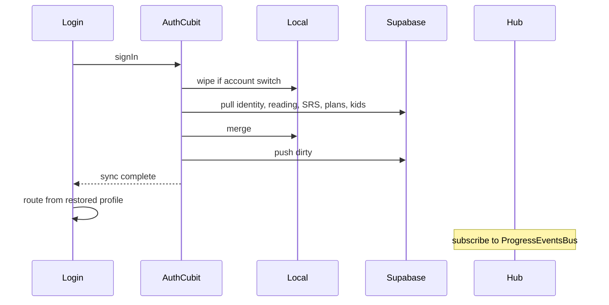

# Fix production restore and sync integration

Scope is the six **must-fix** items from the integration audit. Out of scope: leaked-password Auth setting, unbounded kids-log / heatmap pulls, certificate audience column, dropping unused v1 review RPCs.

Sign-out already wipes `read_pages` and `mem_plus_*` via [account_data_reset.dart](lib/core/identity/account_data_reset.dart). Every login after sign-out starts from empty local state, so restore must finish **before** routing.




---

## 1. Cloud reading progress

Add `reading_progress_cloud` (one row per user) and wire it into the existing auth pull/push used by streak/XP.

**Schema** — new [supabase/migrations/0011_restore_and_revoke.sql](supabase/migrations/0011_restore_and_revoke.sql):

- `user_id` PK → `auth.users`
- `pages int[]` with checks: cardinality ≤ 604, values in 1..604
- RLS owner ALL + parent SELECT (same pattern as [0008_custom_plans_cloud.sql](supabase/migrations/0008_custom_plans_cloud.sql))
- `GRANT SELECT` only to `authenticated`; writes via SECURITY DEFINER `upsert_reading_progress(p_pages int[])` that **unions** arrays (`SELECT DISTINCT unnest(...)`)
- `REVOKE EXECUTE` from `PUBLIC`/`anon`; `GRANT EXECUTE` to `authenticated`

**Client**

- Merge helper `ReadingProgressCloudMerge.union(local, remote)` (monotonic; no last-write clobber)
- Dirty flag `read_pages_cloud_dirty` set in [progress_local_datasource.dart](lib/features/progress/data/datasources/progress_local_datasource.dart) on `saveReadPage`
- Pull/push inside [auth_repository_impl.dart](lib/features/auth/data/repositories/auth_repository_impl.dart) `pullProgressFromCloud` / `syncProgressToCloud` (already called from `_performCloudSync`)
- After pull merge, notify `ProgressChangedReason.readPage` (Home/Progress already listen)
- Add the dirty key to `AccountDataReset.clearedPreferenceKeys`

Do **not** RPC on every page turn; flush on login/resume/sign-out like other dirty flags.

---

## 2. Cloud memorization identity (before routing)

Do not store `guardian_id` / `linked_child_id` as source of truth. Those stay in `parent_child_links`.

**Schema** (same 0011 migration) — columns on `profiles`:

- `selected_path text` CHECK (`adult` | `child` | null)
- `guardian_onboarding_status text`
- `is_parent_guardian boolean NOT NULL DEFAULT false`
- `child_age integer` (already have `age` on profiles — reuse `age` if it matches `childAge`; otherwise add `child_age` and keep `age` as display. Prefer **reuse `profiles.age`** for child age to avoid two age columns.)

RPC `upsert_memorization_identity(...)` with `auth.uid()`, last-write-wins on `updated_at`.

**Client**

- Merge: if local dirty → skip remote; if local has no `selectedPath` → apply remote; else newer `updatedAt` wins ([same shape as](lib/core/memorization/daily_plan_cloud_merge.dart))
- After applying path, hydrate `guardianLinkStatus` / ids from existing [memorization_cloud_gateway.dart](lib/features/memorization_plus/data/repositories/collaborators/memorization_cloud_gateway.dart) link lookups
- Push from [memorization_profile_service.dart](lib/features/memorization_plus/data/repositories/collaborators/memorization_profile_service.dart) after `selectMemorizationPath` / `continueWithoutGuardian` / identity reset (dirty + enqueue, not blocking UI)
- Pull **first** in `_performCloudSync` (before production SRS/plans) so login routing sees the restored path
- Dirty key `mem_plus_identity_cloud_dirty` (already cleared by `mem_plus_` prefix)

---

## 3. Await first pull on login (not on cold start)

Cold start keeps current behavior: local data is still on device; `_runCloudSync()` stays `unawaited`.

Login is the restore path because sign-out wipes account data.

**Changes**

- Expose `AuthCubit.ensureCloudSyncComplete()` → existing `_runCloudSync()` (already coalesces in-flight)
- [login_page.dart](lib/features/auth/presentation/pages/login_page.dart): on `AuthAuthenticated`, **await** `ensureCloudSyncComplete()` **then** `_routeAfterLogin`. Show localized restoring UI (keep the login scaffold; do not `go` yet)
- If pull fails: stay on login with retry (do not enter Home where the user can generate a dirty plan that blocks `DailyPlanCloudMerge`)
- `_resolvePostLoginDestination` already reads the local profile — after await, that profile is the restored one
- l10n keys in [app_ar.arb](lib/core/l10n/app_ar.arb) / `app_en.arb` for restoring + retry

Do not add a new `AuthRestoring` state unless tests force it; awaiting the existing future is smaller and sufficient.

---

## 4. Split kids queue kinds

[cloud_sync_queue.dart](lib/core/sync/cloud_sync_queue.dart):

```dart
static const kidsProgressPull = 'kids_progress_pull';
static const kidsProgressPush = 'kids_progress_push';
static const kidsProgress = 'kids_progress'; // legacy only
```

[auth_cubit.dart](lib/features/auth/presentation/cubits/auth_cubit.dart):

- Pull fail → `enqueue(kidsProgressPull)` only
- Push success → `markSuccess(kidsProgressPush)` only (never the pull kind)
- Push fail → `enqueue(kidsProgressPush)`
- Retry switch: pull kind retries pull; push kind retries push
- Legacy `kids_progress` items: retry as pull-then-push, then `markSuccess` the legacy kind (so old Isar rows drain)

[memorization_kids_local_service.dart](lib/features/memorization_plus/data/repositories/collaborators/memorization_kids_local_service.dart) session write already enqueues `kidsProgress` — change to `kidsProgressPush`.

Update [cloud_sync_queue_test.dart](test/core/sync/cloud_sync_queue_test.dart) and auth cubit tests.

---

## 5. Hub live refresh

[memorization_hub_page.dart](lib/features/memorization_plus/presentation/pages/memorization_hub_page.dart) lives in `StatefulShellRoute.indexedStack`, so `initState` does not re-run on tab switch.

- Subscribe to `ProgressEventsBus` in `initState` (page stays alive)
- Reload `_hubFuture` on `dailyPlan`, `reviewRecord`, `kidsProgress`, `cloudPull` (debounce ~300ms like [home_cubit.dart](lib/features/home/presentation/cubits/home_cubit.dart))
- Cancel subscription in `dispose`
- Extend [memorization_hub_page_test.dart](test/features/memorization_plus/presentation/pages/memorization_hub_page_test.dart)

Daily Plan page already reloads after `push` returns; no change required.

---

## 6. Revoke leftover plaintext parent-link RPCs

Same 0011 migration:

```sql
REVOKE ALL ON FUNCTION public.accept_child_link_token(text) FROM PUBLIC, anon, authenticated;
REVOKE ALL ON FUNCTION public.create_child_link_request() FROM PUBLIC, anon, authenticated;
DROP FUNCTION IF EXISTS public.accept_child_link_token(text);
DROP FUNCTION IF EXISTS public.create_child_link_request();
```

Client already uses `*_with_hash` only. Apply to the live project after local migration is written (Supabase MCP `apply_migration`).

---

## Tests (required by project rules)

- Unit: reading union merge; identity merge (dirty wins / empty local applies remote)
- Unit: kids pull fail is not cleared by push success (auth cubit)
- Widget: login does not `go` until sync completes; failure stays with retry
- Widget: Hub reloads when bus fires `dailyPlan`
- Account reset inventory includes `read_pages_cloud_dirty`
- Queue: new kinds + legacy `kids_progress` drain

---

## Apply order

1. Migration 0011 (schema + revoke) — blocks nothing else once applied
2. Queue split + Hub bus (no schema; can land in parallel with client sync)
3. Reading + identity client pull/push
4. Login await + l10n
5. Apply migration to live `Talia_Quran` and verify advisors + a dry-run SQL of revoked function names

